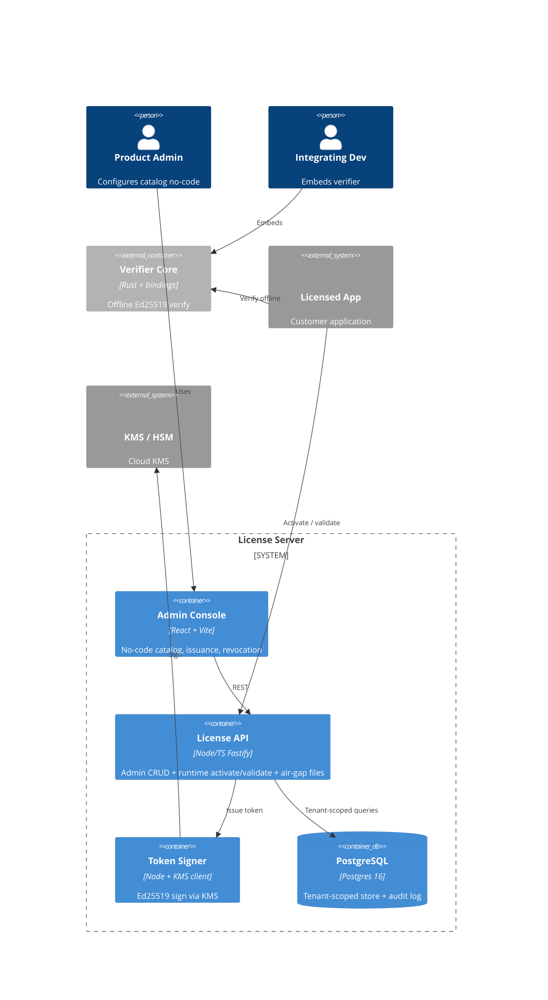

# Implementation Plan: License Server

**Branch**: `00001-license-server` | **Date**: 2026-06-26 | **Spec**: [spec.md](spec.md)

## Summary

**Goal**: A multi-tenant license server that issues Ed25519-signed licenses, verifies them offline across any stack, and is configured no-code.  
**Approach**: Rust verifier core (offline) + Node/TS Fastify API over tenant-scoped Postgres + React admin console; per-product keys in KMS.  
**Key Constraint**: Verification must work fully offline including air-gapped, with verify latency under 5 ms.

## Technical Context

**Language/Version**: TypeScript 5.x / Node 22 (server, admin UI); Rust stable (verifier core)  
**Primary Dependencies**: Fastify, Drizzle ORM, Zod (server); ed25519-dalek, ciborium (Rust); React + Vite (UI); cbindgen, wasm-pack, UniFFI (bindings); AWS/GCP KMS client  
**Storage**: PostgreSQL 16 (tenant-scoped); Redis reserved for P2  
**Testing**: Vitest (TS), cargo test + cargo-fuzz + criterion (Rust), Playwright (console E2E)  
**Target Platform**: Linux server (API); WASM + native + managed runtimes (verifier embedding)  
**Project Type**: web (backend + frontend) plus embeddable library  
**Project Mode**: greenfield  
**Performance Goals**: offline verify < 5 ms; online validate < 50 ms p95  
**Constraints**: offline-capable, air-gapped activation, strict multi-tenant isolation, signing keys never in app memory plaintext  
**Scale/Scope**: multi-tenant SaaS; P1 = 5 user stories, FR-001…FR-031

## Instructions Check

*GATE: Must pass before Phase 0 research. Re-check after Phase 1 design.*

| Gate | Source | Status |
|------|--------|--------|
| Offline-first cryptographic verification | Principle I | PASS — verifier core has a no-network path; keys via KMS (ADR-0001, ADR-0003) |
| Multi-tenant isolation + RBAC | Principle II | PASS — row-scoping + RLS + repository guard (ADR-0004) |
| Single security core + full audit | Principle III | PASS — one Rust core (ADR-0002); append-only audit log (FR-020) |
| Tech stack alignment | Technology Stack | PASS — matches project-instructions |
| Testing & quality policy | Testing Policy | PASS — 80% coverage, lint, security scan, perf benchmark, parser fuzz |
| Source layout `/src` | Source Code Layout | PASS — see Project Structure |

No violations → Complexity Tracking omitted.

## Architecture



## Architecture Decisions

Project-wide decisions are standalone ADRs — see ADR-0001 (token format), ADR-0002 (verifier architecture), ADR-0003 (signing-key custody/scope), ADR-0004 (multi-tenancy isolation). Feature-local tradeoffs below.

| ID | Decision | Options Considered | Chosen | Rationale |
|----|----------|--------------------|--------|-----------|
| AD-001 | Clock-tamper handling | reject-on-rollback / trust-NTP / monotonic-anchor | Monotonic anchor + 48 h skew | Detects offline rollback without false-rejecting normal drift (FR-012) |
| AD-002 | Revocation phasing | long-token+CRL / short-token renewal / online-only | P1 issuance + admin-revoke; short-TTL renewal + CRL in P2 | Keeps offline-first MVP shippable; real propagation needs online layer (ADR-0001) |
| AD-003 | Fingerprint match | exact-all / single-strong / K-of-N | 3-of-5 salted-hash signals | Tolerates RAM/disk drift while limiting sharing (FR-015) |

## Data Model Summary

| Entity | Key Fields | Relationships | Notes |
|--------|------------|---------------|-------|
| tenant | id, name | root of all scoping | every owned row carries tenant_id |
| product | id, tenant_id, name, signing_key_id | has plans, owns key | per-product key (ADR-0003) |
| plan | id, product_id, model, max_activations(=1), expiry_kind, trial_days, max_version | has entitlements | default seat 1 (FR-031) |
| entitlement | id, product_id, key, type(bool|int), default | plan_entitlement, license override | FR-002 |
| license | id, tenant_id, product_id, plan_id, customer_id, status, expires_at, key_hash | has activations | status: active/suspended/revoked |
| activation | id, license_id, fingerprint_hash, status, last_seen_at | belongs to license | race-safe seat count (FR-013) |
| customer | id, tenant_id, external_ref(hashed) | has licenses | minimal PII (FR-022) |
| signing_key | id, product_id, key_id, public_key, kms_ref, status | belongs to product | keyring rotation (FR-011) |
| audit_log | id, tenant_id, actor, action, target, ts | append-only | FR-020 |
| api_key / user / role | hashed secret, scopes, tenant_id | RBAC | FR-018, FR-028 |

**Detail**: [data-model.md](data-model.md)

## API Surface Summary

| Method | Path | Purpose | Auth | Req/Res Types |
|--------|------|---------|------|---------------|
| POST | /v1/activations | Activate license on a machine → signed token | API key + key | ActivateReq/TokenRes |
| POST | /v1/validate | Online validate → entitlements, anchor | token | ValidateReq/ValidateRes |
| DELETE | /v1/activations/{id} | Deactivate / free seat | token | — |
| GET | /v1/entitlements | Resolve entitlements | token | EntitlementsRes |
| GET | /v1/jwks | Publish public keyring | public | Jwks |
| POST | /v1/airgap/request | Submit air-gap request file → response file | API key | AirgapReq/AirgapRes |
| POST | /admin/v1/products|plans|entitlements|licenses | Catalog CRUD + issuance/revocation | session/API key + RBAC | per resource |
| POST | /admin/v1/auth/login | Console interactive login | email+password | SessionRes |

**Detail**: [contracts/openapi.yaml](contracts/openapi.yaml)

## Testing Strategy

| Tier | Tool | Scope | Mock Boundary | Install |
|------|------|-------|---------------|---------|
| Unit | Vitest / cargo test | route handlers, repos, token encode/verify | KMS, DB driver | configured |
| Integration | Vitest + Testcontainers Postgres | tenant-scoped CRUD, activation accounting, air-gap flow | KMS (fake signer) | `npm i -D @testcontainers/postgresql` |
| Security | Semgrep, npm audit, cargo audit, cargo-fuzz | code + deps + token parser | — | `cargo install cargo-fuzz` |
| Coverage | c8 (TS), cargo-llvm-cov (Rust) | ≥ 80% server + core | — | `cargo install cargo-llvm-cov` |
| Perf | criterion | Ed25519 verify < 5 ms | — | configured |

## Error Handling Strategy

| Error Category | Pattern | Response | Retry |
|----------------|---------|----------|-------|
| Validation (Zod) | fail-fast | 400 + structured error | no |
| Auth / RBAC | fail-fast | 401/403, warn log | no |
| Seat limit / revoked | domain rule | 409 + reason code | no |
| KMS signing timeout | retry + circuit breaker | 503 + retry-after | yes, exponential |
| Tenant-scope breach | assert + abort | 500, alert (must never occur) | no |

## Integration Points

| Spec Reference | System/Service | Technical Approach | Contract |
|----------------|----------------|--------------------|----------|
| FR-019, FR-029 | Cloud KMS / HSM | Sign via KMS API; private key never leaves KMS | ADR-0003 |
| FR-024 (P2) | Billing provider (Stripe) | Idempotent signed webhooks → lifecycle | deferred |

## Risk Mitigation

| Risk (from spec) | Likelihood | Impact | Mitigation | Owner |
|-------------------|------------|--------|------------|-------|
| Client-side bypass on attacker-controlled machines | H | M | Gate high-value features behind periodic online validate; document anti-piracy realism | verifier-core |
| Signing-key compromise | L | H | Per-product keys in KMS, keyring rotation, revocation (ADR-0003) | server/signing |
| Multi-tenant isolation defect | M | H | Repository tenant-scoping + Postgres RLS + isolation tests (ADR-0004) | server/db |

## Requirement Coverage Map

| Req ID | Component(s) | File Path(s) | Notes |
|--------|--------------|--------------|-------|
| FR-001 | console, catalog API, db | src/admin-ui/, src/server/routes/catalog.ts, src/server/db/ | no-code CRUD |
| FR-002 | catalog API, db | src/server/routes/catalog.ts, src/server/db/schema.ts | bool|int entitlements |
| FR-003 | catalog API, db | src/server/routes/catalog.ts, src/server/db/schema.ts | plan model params |
| FR-004 | license API, signer | src/server/routes/licenses.ts, src/server/signing/ | issue → token |
| FR-005 | verifier-core, signer | src/verifier-core/src/token.rs, src/server/signing/ | claims + Ed25519 |
| FR-006 | license API, db | src/server/routes/licenses.ts | revoke/suspend/reinstate |
| FR-007 | license API, db | src/server/routes/licenses.ts | transfer + limit |
| FR-008 | verifier-core | src/verifier-core/src/verify.rs | offline verify |
| FR-009 | verifier-core | src/verifier-core/src/verify.rs | reject invalid |
| FR-010 | bindings | src/bindings/{c-abi,wasm,uniffi}/ | multi-language |
| FR-011 | verifier-core, signer | src/verifier-core/src/keyring.rs, src/server/signing/ | key_id keyring |
| FR-012 | verifier-core | src/verifier-core/src/anchor.rs | monotonic anchor (AD-001) |
| FR-013 | activation API, db | src/server/routes/activations.ts, src/server/db/ | race-safe seat cap |
| FR-014 | activation API | src/server/routes/activations.ts | deactivate |
| FR-015 | verifier-core, fingerprint | src/verifier-core/src/fingerprint.rs | 3-of-5 (AD-003) |
| FR-016 | airgap API, verifier-core | src/server/routes/airgap.ts, src/verifier-core/src/airgap.rs | file exchange |
| FR-017 | db repository | src/server/db/repository.ts, migrations RLS | tenant scope (ADR-0004) |
| FR-018 | auth | src/server/auth/apikey.ts | runtime API keys + RBAC |
| FR-019 | signing | src/server/signing/kms.ts | KMS custody |
| FR-020 | audit | src/server/audit/ | append-only log |
| FR-021 | middleware, activation API | src/server/middleware/ratelimit.ts | rate limit + nonce |
| FR-022 | db, customer API | src/server/db/hash.ts, src/server/routes/customers.ts | PII hash + delete |
| FR-023 | validate API (P2) | src/server/routes/validate.ts | online validate/heartbeat |
| FR-024 | webhooks (P2) | src/server/routes/webhooks.ts | billing lifecycle |
| FR-025 | lease (P2) | src/server/lease/ | floating seats |
| FR-026 | usage (P3) | src/server/usage/ | metering |
| FR-027 | policy (P3) | src/server/policy/ | low-code rules |
| FR-028 | auth, console | src/server/auth/session.ts, src/admin-ui/auth/ | console login |
| FR-029 | signing, db | src/server/signing/, src/server/db/schema.ts | per-product keys |
| FR-030 | verifier-core, signer | src/verifier-core/src/encode.rs, src/server/signing/ | LIC1.base64url |
| FR-031 | db, activation API | src/server/db/schema.ts, src/server/routes/activations.ts | default seat 1 + trial dedup |

## Project Structure

### Source Code

```text
src/
  verifier-core/            # Rust crate: token, verify, keyring, anchor, fingerprint, airgap, encode
    src/  fuzz/  benches/
  bindings/
    c-abi/  wasm/  uniffi/
  server/                   # Node/TS Fastify
    routes/  auth/  signing/  db/  audit/  middleware/  __tests__/
  admin-ui/                 # React + Vite SPA
specs/
  00001-license-server/     # spec.md, plan.md, data-model.md, contracts/, tasks.md
  adrs/                     # ADR-0001..0004
```

## Implementation Hints

- **[HINT-001]** Order: Build verifier-core token format + Ed25519 verify first; server signing and all bindings depend on the exact byte layout.
- **[HINT-002]** Gotcha: Fuzz the token parser before exposing FFI/WASM — a panic across the C ABI is undefined behavior.
- **[HINT-003]** Constraint: Every tenant-owned query MUST go through the repository layer; RLS is defense-in-depth, not the primary gate.
- **[HINT-004]** Performance: Benchmark Ed25519 verify with criterion incl. decode; target < 5 ms.
- **[HINT-005]** Compatibility: Fix token_version=1 and include key_id in the v1 payload so rotation and format evolution never break issued keys.
