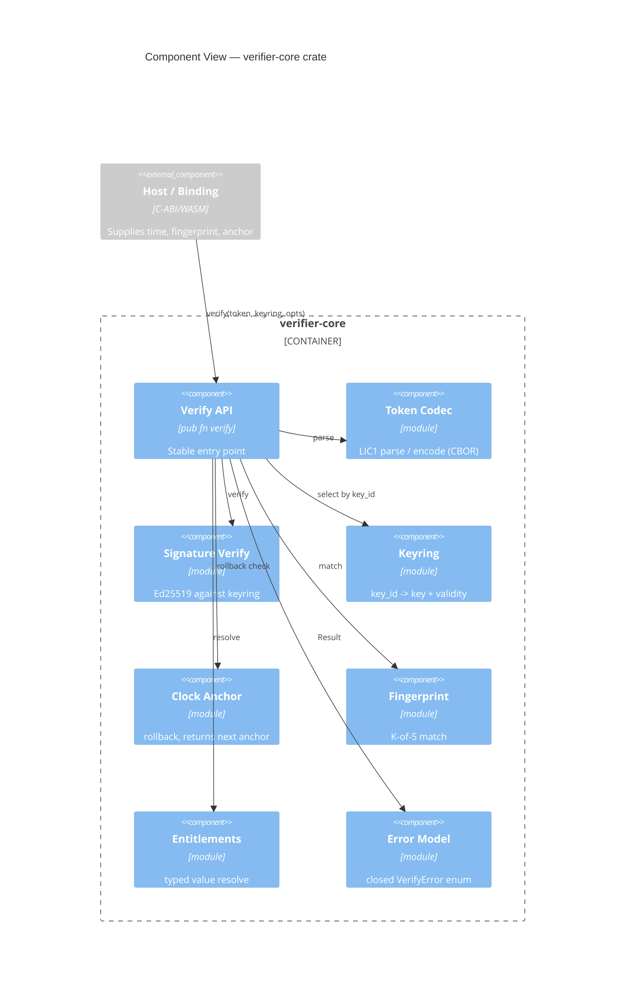

# Implementation Plan: Offline Verifier Core

**Branch**: `00002-offline-verifier-core` | **Date**: 2026-06-26 | **Spec**: [spec.md](spec.md)

## Summary

**Goal**: The single embeddable Rust core that verifies a signed license token fully offline and exposes its entitlements.  
**Approach**: Brownfield conformance of the existing `src/verifier-core/` crate to the clarified contract (`no_std`+`alloc`, typed entitlements, keyring validity, stable error/version contracts).  
**Key Constraint**: Verify path does zero network I/O, stays panic-free (fuzzed), and completes < 5 ms p99 while remaining `no_std`+`alloc`.

## Technical Context

**Language/Version**: Rust stable, edition 2021, `no_std` + `alloc`  
**Primary Dependencies**: `ed25519-dalek` 2 (no_std+alloc), `ciborium` 0.2 (CBOR), `base64` 0.22 (no_std); error type via `core::error::Error` (drop std-only `thiserror` path)  
**Storage**: N/A — in-memory verification library; persists nothing  
**Testing**: `cargo test`, `criterion` (bench), `cargo-fuzz` (parser), `cargo-llvm-cov` (coverage)  
**Target Platform**: `wasm32-unknown-unknown` + `x86_64`/`aarch64` desktop & server  
**Project Type**: library (single crate)  
**Project Mode**: brownfield  
**Performance Goals**: offline verify < 5 ms p99 (current ≈ 37 µs on std build)  
**Constraints**: zero network, `no_std`+`alloc`, panic-free parser, versioned `LIC1.` format, SemVer-stable public API  
**Scale/Scope**: one crate wrapped by the bindings epic (E003); consumed by signing (E004) and issuance (E008)

## Instructions Check

*GATE: Must pass before Phase 0 research. Re-check after Phase 1 design.*

| Gate | Source | Status |
|------|--------|--------|
| Offline-first cryptographic verification | Principle I | PASS — no-network verify; Ed25519 + pinned keyring (TR-002, TR-009) |
| Single security core (crypto once) | Principle III | PASS — one Rust crate reused by all bindings (TR-012, IP-001) |
| Testing & quality policy | Testing Policy | PASS — ≥80% coverage, fuzz, criterion benchmark, cargo audit + clippy + Semgrep |
| Security (keys never exposed, clock-tamper, PII) | Security Reqs | PASS — verify-only (no private keys), monotonic anchor, salted-hash fingerprints (TR-005, TR-014) |
| Source layout `/src` | Source Code Layout | PASS — `src/verifier-core/` |

No violations → Complexity Tracking omitted.

## Architecture



## Architecture Decisions

Refines project ADR-0001 (token format) and ADR-0002 (verifier architecture); feature-local choices below.

| ID | Decision | Options Considered | Chosen | Rationale |
|----|----------|--------------------|--------|-----------|
| AD-001 | Build target | std-only / no_std+alloc / no_std no-alloc | `no_std` + `alloc` | Enables WASM + native bindings (ADR-0002); alloc avoids fixed-buffer complexity |
| AD-002 | Entitlement value model | bool\|int only / typed extensible / int-encoded | Tagged typed value (Bool, Int, reserved variant) | Forward-compatible additive string/enum/date without an `LIC2.` break (TR-018) |
| AD-003 | Keyring shape | id→key only / id→key+validity | Per-key `valid_from`/`valid_until` + revoked flag | Bounds blast radius of a leaked retired key, offline (TR-017) |
| AD-004 | Result model | bool+detail / open enum / closed append-only enum | Closed append-only `VerifyError` | Stable cross-binding reason-code contract (TR-015) |
| AD-005 | Fingerprint contract | host-arbitrary / fixed K / fixed slots+claim K | 5 canonical slots, default K=3, token may raise K | Cross-product consistency + plan-tunable binding (TR-006) |
| AD-006 | Versioning policy | informal / SemVer+token_version | SemVer API; additive `token_version` in `LIC1.`; `LIC2.` for breaking | Downstream epics bind to a frozen, declared contract (TR-016) |

## Data Model Summary

N/A — no persistent data. The verifier is an in-memory library; its types (token, claims, keyring, entitlement, fingerprint, anchor) are defined in the spec's Key Entities and the Architecture above, not a database schema.

## API Surface Summary

N/A — no network API surface. The "API" is a Rust library function surface (`verify(token, keyring, opts) -> Result<VerifiedLicense, VerifyError>`) wrapped by the bindings epic (E003); no HTTP/RPC endpoints.

## Testing Strategy

| Tier | Tool | Scope | Mock Boundary | Install |
|------|------|-------|---------------|---------|
| Unit | cargo test | codec, keyring, anchor, fingerprint, entitlement, error mapping | none (deterministic test keys) | configured |
| Integration | cargo test (tests/) | end-to-end verify across valid/invalid/rotation/rollback/fingerprint | none | configured |
| Security | cargo-fuzz + cargo audit + Semgrep | parser panic-safety; dependency CVEs; SAST | — | `cargo install cargo-fuzz` |
| Coverage | cargo-llvm-cov | ≥ 80% line coverage | — | `cargo install cargo-llvm-cov` |
| Performance | criterion | verify < 5 ms p99 (post no_std) | — | configured |

## Error Handling Strategy

| Error Category | Pattern | Response | Retry |
|----------------|---------|----------|-------|
| Malformed / unsupported version | fail-fast | `VerifyError::{Malformed, UnsupportedVersion}` | no |
| Untrusted signer | fail-closed | `VerifyError::{UnknownKey, BadSignature}` | no |
| Expired / clock rollback | fail-closed | `VerifyError::{Expired, ClockRollback}` | no |
| Machine binding | fail-closed | `VerifyError::{FingerprintMismatch, FingerprintMissing}` | no |

Reason codes are a closed, append-only, ordered enum (AD-004); never reordered or removed.

## Integration Points

| Spec Reference | System/Service | Technical Approach | Contract |
|----------------|----------------|--------------------|----------|
| IP-001 | Bindings (E003) | Wrap the `verify` API via C-ABI/WASM/UniFFI | stable API (AD-006), error codes (AD-004) |
| IP-002 | Signing (E004) + Issuance (E008) | Sign/produce tokens in the `LIC1.` format | frozen byte layout (AD-006) |
| IP-003 | Client apps via E004 | Embed the published keyring (with validity) | keyring shape (AD-003) |

## Risk Mitigation

| Risk (from spec) | Likelihood | Impact | Mitigation | Owner |
|-------------------|------------|--------|------------|-------|
| Client-side bypass on attacker machines | H | M | Document as deterrence; gate high-value features behind periodic online checks (later epics) | verifier-core |
| Token-format evolution breaks old clients | L | H | Versioned `LIC1.`/`token_version`, forward-compatible parse, fuzzing, `LIC2.` for breaking (AD-006) | verifier-core |
| Fingerprint over-tolerance enables sharing | M | M | Fixed 5 slots, default K=3, token may raise K (AD-005); document tradeoff | verifier-core |

## Requirement Coverage Map

| Req ID | Component(s) | File Path(s) | Notes |
|--------|--------------|--------------|-------|
| TR-001 | Token Codec | src/verifier-core/src/token.rs | versioned parse, reject malformed |
| TR-002 | Signature Verify | src/verifier-core/src/verify.rs | Ed25519 vs keyring |
| TR-003 | Verify API, Error | src/verifier-core/src/verify.rs | unknown-key vs bad-sig distinct |
| TR-004 | Verify API | src/verifier-core/src/verify.rs | expiry / perpetual |
| TR-005 | Clock Anchor | src/verifier-core/src/anchor.rs, verify.rs | pure fn, returns next anchor, configurable skew |
| TR-006 | Fingerprint | src/verifier-core/src/fingerprint.rs | 5 slots, K configurable via claim |
| TR-007 | Entitlements | src/verifier-core/src/entitlement.rs | bool/int resolve |
| TR-008 | Keyring | src/verifier-core/src/keyring.rs | multi-key by key_id |
| TR-009 | Verify API | src/verifier-core/src/verify.rs | no network (no I/O deps) |
| TR-010 | Token Codec, fuzz | src/verifier-core/fuzz/ | panic-free parser |
| TR-011 | bench | src/verifier-core/benches/verify_bench.rs | < 5 ms p99 |
| TR-012 | Verify API | src/verifier-core/src/lib.rs | stable embeddable surface |
| TR-013 | Fingerprint, Verify | src/verifier-core/src/verify.rs | refuse when bound + no local fp |
| TR-014 | Fingerprint | src/verifier-core/src/fingerprint.rs | salted hashes, no raw PII |
| TR-015 | Error Model | src/verifier-core/src/verify.rs | closed append-only enum |
| TR-016 | Token Codec, lib | src/verifier-core/src/token.rs, lib.rs | SemVer + token_version, LIC2 reserved |
| TR-017 | Keyring | src/verifier-core/src/keyring.rs | validity window + revoked flag |
| TR-018 | Entitlements | src/verifier-core/src/entitlement.rs | reserved typed value variant |
| TR-019 | bench | src/verifier-core/benches/verify_bench.rs | p99 regression gate |
| TR-020 | Token Codec, Verify | src/verifier-core/src/token.rs, verify.rs | size/keyring/entitlement bounds; fail-fast |

## Project Structure

### Source Code

```text
~ src/verifier-core/Cargo.toml          # no_std features; drop std-only deps; target features
~ src/verifier-core/src/lib.rs          # #![no_std] + extern crate alloc; re-exports; SemVer surface
~ src/verifier-core/src/token.rs        # LIC1 codec; token_version policy; typed entitlement encode
~ src/verifier-core/src/keyring.rs      # add valid_from/valid_until + revoked flag
~ src/verifier-core/src/verify.rs       # closed VerifyError; configurable K/skew; anchor-to-persist
~ src/verifier-core/src/anchor.rs       # return next-anchor value to host
~ src/verifier-core/src/fingerprint.rs  # 5 canonical signal slots; K param
+ src/verifier-core/src/entitlement.rs  # typed, forward-compatible value model
~ src/verifier-core/tests/verify.rs     # contract tests for AD-001..006
~ src/verifier-core/benches/verify_bench.rs  # re-bench after no_std
  src/verifier-core/fuzz/               # existing fuzz target (unchanged)
```

**Patterns to reuse**: existing token envelope (`LIC1.` + CBOR + Ed25519), keyring-by-`key_id`, monotonic anchor, K-of-N fingerprint, the closed error enum, and the existing test/bench/fuzz harness.
**Tests to extend**: `tests/verify.rs` — add typed-entitlement, keyring-validity, configurable-K, and anchor-return cases.
**Naming conventions**: snake_case modules, `#[cfg(test)]` unit tests + `tests/` integration, `VerifyError` variants PascalCase and append-only.

## Implementation Hints

- **[HINT-001]** Order: Freeze the `LIC1.` byte layout (typed entitlement value; which params are token claims vs caller options) before E003/E004/E008 consume it — changes after the freeze are breaking.
- **[HINT-002]** Gotcha: `no_std` conversion — replace std-only `thiserror` with `core::error::Error`, swap `std::collections` for `alloc::collections::BTreeMap`, and enable `no_std`+`alloc` features on `ed25519-dalek`/`ciborium`/`base64`.
- **[HINT-003]** Constraint: `VerifyError` is append-only and ordered; bindings map variants by stable discriminant — never reorder or remove.
- **[HINT-004]** Compatibility: Keyring per-key validity is enforced client-side and is NOT part of the signed token; it travels with the keyring artifact published by E004.
- **[HINT-005]** Performance: Keep the typed entitlement value lightweight; re-run the criterion benchmark after the `no_std` conversion to confirm the < 5 ms p99 budget holds.
