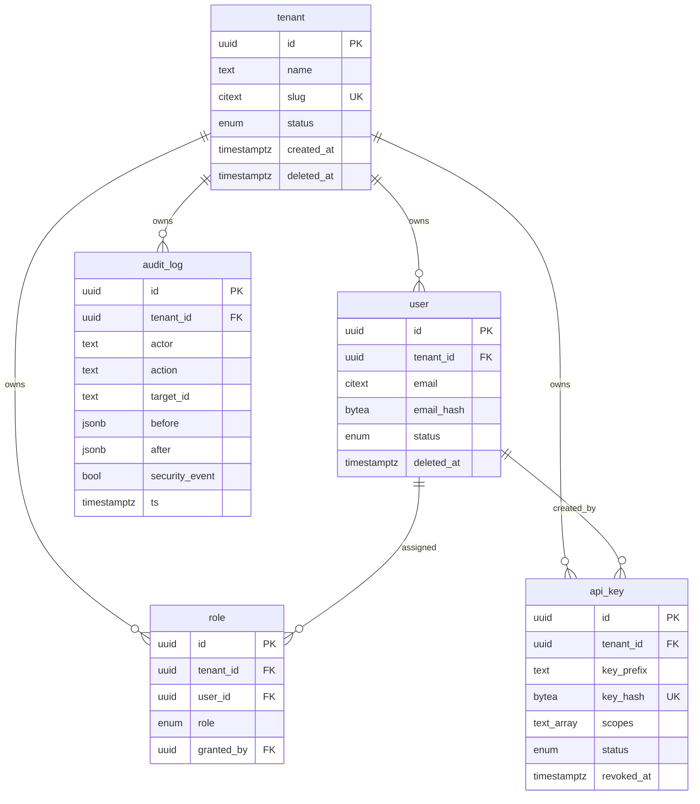
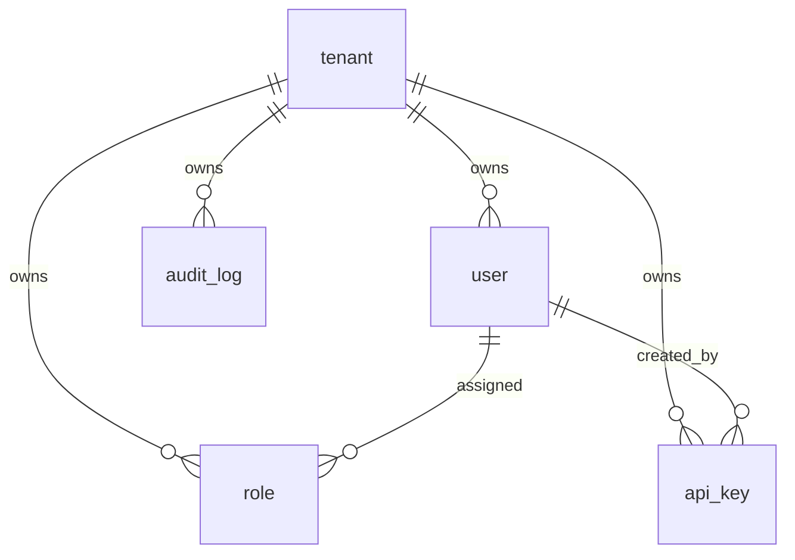

# Data Model: Tenancy & Data Foundation

> Feature `00003-tenancy-and-data-foundation` | Epic E002 | 2026-06-27
> Stack: PostgreSQL 16, Drizzle ORM, Node 22 / TypeScript. Source under `/src/server` (ENFORCE_SRC_ROOT).
> Scope: the foundational tenancy/data substrate ONLY — `tenant`, `user`, `role`, `api_key`, `audit_log`. Product/plan/license/activation/signing_key tables are owned by later epics and follow the same tenant-scoped pattern (see [§9 Future tenant-scoped tables](#9-future-tenant-scoped-tables-out-of-scope)).
> Source signals: spec TR-001…TR-013, Key Entities; ADR-0004 (shared-schema + row scoping + RLS); project data model `specs/00001-license-server/data-model.md`.

## Conventions

- **PKs** are `uuid` (UUID v7 application-generated, time-ordered for index locality). Column `id uuid PRIMARY KEY`.
- **Tenancy**: every tenant-owned row carries `tenant_id uuid NOT NULL` (FK → `tenant.id`). `tenant` itself is the isolation root and has no `tenant_id`. (TR-001, ADR-0004)
- **Timestamps** are `timestamptz` stored UTC. `created_at` defaults `now()`.
- **Secrets** are never stored in cleartext. API-key material is stored as `key_hash` (HMAC-SHA-256 for constant-time lookup) plus a non-secret `key_prefix` for display/selection. (TR-012)
- **Enums** are native Postgres enum types (Drizzle `pgEnum`).
- **Hard deletes** are reserved for GDPR erase (TR-012); all other lifecycle is `status`/`*_at` soft-state.

## 1. Entities

### tenant — isolation root (NOT tenant-owned; no `tenant_id`)

| Field | Type | Key / Constraint | Nullable | Notes |
|-------|------|------------------|----------|-------|
| id | uuid | PK | no | UUID v7. The value bound to `app.current_tenant`. |
| name | text | NOT NULL | no | Display name. |
| slug | citext | UNIQUE | no | Stable external/url identifier. |
| status | tenant_status enum | NOT NULL, default `active` | no | `active`, `suspended`, `deleted` (GDPR tombstone). |
| created_at | timestamptz | NOT NULL default now() | no | |
| updated_at | timestamptz | NOT NULL default now() | no | |
| deleted_at | timestamptz | | yes | Set on GDPR/offboarding erase; row retained as tombstone until purge. |

### user — human principal within a tenant (credentials owned by admin epic E005)

| Field | Type | Key / Constraint | Nullable | Notes |
|-------|------|------------------|----------|-------|
| id | uuid | PK | no | |
| tenant_id | uuid | FK → tenant.id, NOT NULL | no | Tenancy scope (TR-001). |
| email | citext | NOT NULL, UNIQUE (tenant_id, email) | no | Login identity; minimal PII (TR-012). |
| email_hash | bytea | | yes | Salted SHA-256 for pseudonymous cross-reference/lookup without exposing raw email (TR-012). |
| display_name | text | | yes | Minimized PII. |
| status | user_status enum | NOT NULL, default `active` | no | `active`, `disabled`, `deleted`. |
| created_at | timestamptz | NOT NULL default now() | no | |
| updated_at | timestamptz | NOT NULL default now() | no | |
| deleted_at | timestamptz | | yes | GDPR erase marker. |

> Note: `password_hash`/credentials and interactive sessions/SSO are owned by the admin epic (E005), per spec Excluded. This epic models only the principal record the repository scopes and RBAC references.

### role — RBAC assignment scoping a user's permissions within a tenant (TR-013)

| Field | Type | Key / Constraint | Nullable | Notes |
|-------|------|------------------|----------|-------|
| id | uuid | PK | no | |
| tenant_id | uuid | FK → tenant.id, NOT NULL | no | Tenancy scope (TR-001). |
| user_id | uuid | FK → user.id, NOT NULL | no | The principal granted the role. |
| role | rbac_role enum | NOT NULL | no | `owner`, `admin`, `viewer` (escalating). Determines permitted operations within the tenant (TR-013). |
| granted_by | uuid | FK → user.id | yes | Audit/provenance of the grant. |
| created_at | timestamptz | NOT NULL default now() | no | |

> Constraints: `UNIQUE (tenant_id, user_id, role)` (no duplicate grants). A composite FK `(tenant_id, user_id) → user(tenant_id, id)` keeps the assignment inside one tenant (cross-tenant grant is structurally impossible). `granted_by` is intra-tenant by the same composite-FK technique.

### api_key — tenant-scoped machine/runtime credential (TR-009)

| Field | Type | Key / Constraint | Nullable | Notes |
|-------|------|------------------|----------|-------|
| id | uuid | PK | no | |
| tenant_id | uuid | FK → tenant.id, NOT NULL | no | The tenant this key resolves to (TR-009). |
| key_prefix | text | NOT NULL | no | Non-secret leading token segment for display + lookup narrowing. |
| key_hash | bytea | NOT NULL, UNIQUE | no | HMAC-SHA-256 of the secret; raw key never stored (TR-012). |
| name | text | | yes | Operator-facing label. |
| scopes | text[] | NOT NULL, default `{}` | no | e.g. `activate`, `validate`, `admin` — coarse capability gate alongside RBAC. |
| status | api_key_status enum | NOT NULL, default `active` | no | `active`, `revoked` (see [§9 state](#api_keystatus)). |
| last_used_at | timestamptz | | yes | Best-effort usage telemetry. |
| created_at | timestamptz | NOT NULL default now() | no | |
| created_by | uuid | FK → user.id | yes | Provenance; constrained intra-tenant via composite FK `(tenant_id, created_by) → user(tenant_id, id)` so it cannot reference a user in another tenant. |
| revoked_at | timestamptz | | yes | Set when `status → revoked`. |

### audit_log — append-only mutation record (TR-008)

| Field | Type | Key / Constraint | Nullable | Notes |
|-------|------|------------------|----------|-------|
| id | uuid | PK | no | UUID v7 — id ordering ≈ time ordering. |
| tenant_id | uuid | FK → tenant.id, NOT NULL | no | Tenant whose data was mutated. Platform-admin cross-tenant actions are recorded under the affected tenant (TR-011). |
| actor | text | NOT NULL | no | Principal: `user:<id>`, `api_key:<id>`, or `system`. |
| actor_type | actor_type enum | NOT NULL | no | `user`, `api_key`, `system`. |
| action | text | NOT NULL | no | Dotted verb, e.g. `api_key.revoked`, `tenant.created`, `user.deleted`. |
| target_type | text | NOT NULL | no | Entity kind, e.g. `api_key`, `user`. |
| target_id | text | | yes | Affected entity id (text — targets may be cross-type). |
| before | jsonb | | yes | Pre-image snapshot (optional). PII-minimized. |
| after | jsonb | | yes | Post-image snapshot (optional). PII-minimized. |
| security_event | boolean | NOT NULL, default false | no | Marks blocked cross-tenant attempts / denied operations for alerting (TR-011). |
| ts | timestamptz | NOT NULL default now() | no | Commit time of the mutation. |

> **Append-only enforcement**: the app role receives `INSERT` (and `SELECT`) only — no `UPDATE`/`DELETE` grant (TR-008, see [§5](#5-audit-log-append-only-tr-008)). Optional tamper-evidence via a `prev_hash` hash-chain is reserved (deferred; project data model notes it).

## 2. Relationships & ER Diagram

- `tenant` 1 — N `user`, `role`, `api_key`, `audit_log` (every tenant-owned table; `ON DELETE` is restricted — tenant erase is an explicit GDPR job, [§8](#8-piigdpr-tr-012)).
- `user` 1 — N `role` (a user holds one or more role grants within its tenant).
- `user` 1 — N `api_key` via `created_by` (provenance, optional).
- All `*_id` FKs that reference a tenant-owned table use a **composite FK including `tenant_id`** so referential integrity cannot cross tenants.



<details><summary>ER Diagram (visual reference)</summary>



</details>

## 3. Row-Level Security design (TR-002)

**Defense in depth** (ADR-0004): the repository layer injects `tenant_id` on every query; RLS is the database-enforced safety net beneath it. Neither alone is sufficient.

### Roles

- **Owner/migration role** (`licensesrv_owner`): owns the schema and runs migrations. NOT used for application traffic.
- **Application role** (`licensesrv_app`): a **NON-OWNER, NON-SUPERUSER, `NOBYPASSRLS`** role the app connects as. Because it is not the table owner and lacks `BYPASSRLS`, RLS applies to it; `FORCE ROW LEVEL SECURITY` additionally subjects the owner to RLS so no `SECURITY DEFINER` / owner-owned view can silently bypass it. (spec Edge Cases; Risk: RLS bypass.)

### Tables with RLS

`ENABLE ROW LEVEL SECURITY` + `FORCE ROW LEVEL SECURITY` on every tenant-owned table:

| Table | RLS | FORCE | Policy predicate |
|-------|-----|-------|------------------|
| `user` | yes | yes | `tenant_id = current_setting('app.current_tenant')::uuid` |
| `role` | yes | yes | same |
| `api_key` | yes | yes | same |
| `audit_log` | yes | yes | same (USING for SELECT; WITH CHECK for INSERT) |
| `tenant` | yes | yes | `id = current_setting('app.current_tenant')::uuid` (root: scopes by `id`, not `tenant_id`) |

### Policy form

A single permissive policy per table covering all commands, gated on the per-transaction GUC:

```sql
ALTER TABLE app.api_key ENABLE ROW LEVEL SECURITY;
ALTER TABLE app.api_key FORCE ROW LEVEL SECURITY;

CREATE POLICY tenant_isolation ON app.api_key
  USING      (tenant_id = current_setting('app.current_tenant', true)::uuid)
  WITH CHECK (tenant_id = current_setting('app.current_tenant', true)::uuid);
```

- `current_setting('app.current_tenant', true)` returns NULL when the GUC is unset; the comparison then yields no rows → an **unscoped tenant-owned query is refused (returns/affects zero rows), never run unscoped** (TR-001, spec Edge Cases, SC-002). The repository additionally hard-fails before issuing SQL when no tenant is resolved.
- `WITH CHECK` blocks INSERT/UPDATE of a row carrying any other tenant's `tenant_id`.
- The **platform-admin cross-tenant path** is the only sanctioned cross-tenant route: it runs under a dedicated audited code path (e.g. setting `app.current_tenant` per target tenant, or an explicit admin role with a scoped policy), and every such access is written to `audit_log` with `security_event` semantics (TR-011, ADR-0004).

## 4. Indexing (TR-004)

Every tenant-owned table gets a **`tenant_id`-leading composite index** (matches the RLS predicate and the repository's tenant-first access pattern):

| Table | Index | Purpose |
|-------|-------|---------|
| `user` | `(tenant_id, id)` PK-aligned; `UNIQUE (tenant_id, email)` | Tenant scan + per-tenant email uniqueness/lookup. |
| `role` | `(tenant_id, user_id)`; `UNIQUE (tenant_id, user_id, role)` | Resolve a principal's roles within the tenant (TR-013). |
| `api_key` | `(tenant_id, status)`; `UNIQUE (key_hash)` | Tenant-scoped key listing; global hash lookup for auth (hash is unique across tenants, then `tenant_id` resolved from the row). |
| `audit_log` | `(tenant_id, ts DESC)`; partial `(tenant_id, ts DESC) WHERE security_event` | Per-tenant forensic timeline; fast security-event queries (TR-011). |
| `tenant` | `(id)` PK; `UNIQUE (slug)` | Root lookup. |

> Composite FKs `(tenant_id, <ref_id>)` are backed by these `tenant_id`-leading indexes, so FK validation stays tenant-local and index-only.

## 5. Audit log: append-only (TR-008)

- **Grants**: `GRANT INSERT, SELECT ON app.audit_log TO licensesrv_app;` — **no `UPDATE`, no `DELETE`** to the app role (SC-005). `REVOKE UPDATE, DELETE` explicitly to be defensive.
- **Write path**: every tenant/administrative mutation, within the same transaction that performs it, appends one `audit_log` row (actor, action, target, ts; optional before/after JSONB). Because it shares the transaction, an audit write failure rolls back the mutation (no silent gaps).
- **RLS**: `audit_log` is RLS-forced like other tenant tables; INSERT `WITH CHECK` ties the row to the current tenant.
- **Cross-tenant security events**: blocked cross-tenant attempts and denied RBAC operations are inserted with `security_event = true` for alerting (TR-011, SC-007).
- **Tamper-evidence (reserved)**: optional `prev_hash` hash-chain per tenant for tamper-evident forensics (deferred; not required for MVP).
- **Immutability hardening (optional)**: a `BEFORE UPDATE OR DELETE` trigger raising an exception provides belt-and-suspenders even against role-grant drift.

## 6. Connection-pool isolation (TR-003)

The tenant context is **per-transaction, never per-connection**, so a pooled connection never carries a prior request's scope (SC-002, Risk: connection-pool context bleed):

1. Acquire a pooled connection and `BEGIN`.
2. `SET LOCAL app.current_tenant = $1;` — `SET LOCAL` is transaction-scoped and auto-reset at `COMMIT`/`ROLLBACK`.
3. Run all tenant-scoped statements; RLS evaluates the GUC.
4. `COMMIT`/`ROLLBACK` clears `app.current_tenant` automatically.
5. **Reset-on-return**: the pool runs `DISCARD ALL` (or at minimum `RESET app.current_tenant`) on connection release as a backstop, guaranteeing no residual session state.
6. A read/write issued with no resolved tenant is refused by the repository before SQL, and would otherwise match zero rows under RLS (defense in depth).

> `SET LOCAL` is used (not session `SET`) precisely because the connection is pooled. The repository wraps every tenant-owned operation in this transaction envelope.

## 7. Migration approach (TR-006 / TR-007)

- **Tooling**: Drizzle Kit generates SQL migrations; a single discrete **migration runner** applies them (not on every app boot). RLS policies, roles, grants, and `FORCE ROW LEVEL SECURITY` ship as part of these migrations.
- **Expand/contract (backward-compatible)**: additive expand steps first (new columns nullable/defaulted, new tables, new indexes `CREATE INDEX CONCURRENTLY` where possible); destructive contract steps (drop column/table, tighten constraints) deferred **≥ 2 releases** so a prior app version still runs against the new schema (TR-006, SC-004).
- **Advisory-locked single runner**: the runner takes a session-level advisory lock before applying and releases it after, so two concurrent runners cannot both apply (TR-007, SC-003):

  ```sql
  SELECT pg_advisory_lock(hashtext('licensesrv:migrations'));  -- single 64-bit key
  -- ... apply pending migrations as a discrete step ...
  SELECT pg_advisory_unlock(hashtext('licensesrv:migrations'));
  ```

  **Advisory lock key**: a stable 64-bit key derived from the constant string `licensesrv:migrations` (e.g. `hashtext('licensesrv:migrations')`, or an agreed literal such as `0x4C53_4D49_4752_0001`). The second runner blocks on the lock and then no-ops on an up-to-date schema.
- **Ownership**: migrations run as `licensesrv_owner`; the app connects only as `licensesrv_app`. (TR-002)
- **Atomicity & crash safety** (TR-015): each migration applies inside a transaction, so a failure rolls back with no half-applied schema; the session-level advisory lock auto-releases on session end / runner crash, so a crashed runner never deadlocks the next runner (SC-012).

## 8. PII / GDPR (TR-012)

- **Minimized / hashed fields**: `user.email_hash` (salted SHA-256) is the pseudonymous lookup key; `api_key.key_hash` (HMAC) stores credential material as a hash only; raw secrets are never persisted. `user.email`/`display_name` are the only directly-identifying fields and are minimized and erasable.
- **Export per tenant**: every tenant-owned row is reachable by `tenant_id`, so a tenant data export is a tenant-scoped read across `user`, `role`, `api_key`, `audit_log` (+ future tenant tables) producing a portable bundle (SC-008).
- **Delete / erase per tenant**: a GDPR/offboarding job either hard-deletes a tenant's rows or pseudonymizes residual references; `audit_log` entries referencing erased subjects have their `before`/`after`/`target_id` redacted while the immutable event record (actor/action/ts) is preserved for forensic integrity. Tenant tombstone via `tenant.deleted_at` precedes physical purge (SC-008).
- **Audit snapshots** (`before`/`after`) must be PII-minimized at write time — never snapshot raw secrets or full PII payloads.

## 9. State transitions

### api_key.status

`active → revoked` (terminal). Revocation sets `revoked_at = now()` and writes an `audit_log` row (`api_key.revoked`). A revoked key authenticates no request. No `revoked → active` transition (issue a new key).

### tenant.status

`active → suspended` (admin/billing) → `active` (reinstate); `active|suspended → deleted` (GDPR/offboarding tombstone, sets `deleted_at`, precedes purge — terminal).

### user.status

`active → disabled` (admin) → `active`; `active|disabled → deleted` (GDPR erase, terminal).

### audit_log

No state — append-only, immutable (TR-008).

## 9b. Future tenant-scoped tables (out of scope)

The following are owned by later epics and are **not modeled here**; they will be added additively via the same migration harness and MUST follow this exact pattern — `tenant_id uuid NOT NULL` (composite FKs), `ENABLE`+`FORCE ROW LEVEL SECURITY` with the `app.current_tenant` policy, a `tenant_id`-leading composite index, and audit-on-mutation:

`product`, `signing_key` (E004), `plan`, `entitlement`/`plan_entitlement` (E007), `customer`, `license` (E008), `activation` (E009), plus deferred `lease`/`revocation`/`usage_event`/`webhook`/`policy_rule`. See `specs/00001-license-server/data-model.md`.

## 10. Validation rules

- Every tenant-owned write asserts `tenant_id` equals the caller's resolved tenant (repository guard) and is re-checked by RLS `WITH CHECK` (TR-001, TR-002).
- No tenant-owned query executes without a resolved tenant scope — refused at the repository and matched-zero by RLS (TR-001, SC-002).
- `api_key.key_hash` is globally `UNIQUE`; auth resolves the row by hash, then trusts the row's `tenant_id`.
- `role.role ∈ {owner, admin, viewer}`; an operation is permitted only if the principal's tenant-scoped role allows it (TR-013, SC-007).
- The app role holds only `INSERT`/`SELECT` on `audit_log`; `UPDATE`/`DELETE` are revoked (TR-008, SC-005).
- The app connects as a non-owner, non-superuser, `NOBYPASSRLS` role; tables are `FORCE ROW LEVEL SECURITY` (TR-002).
