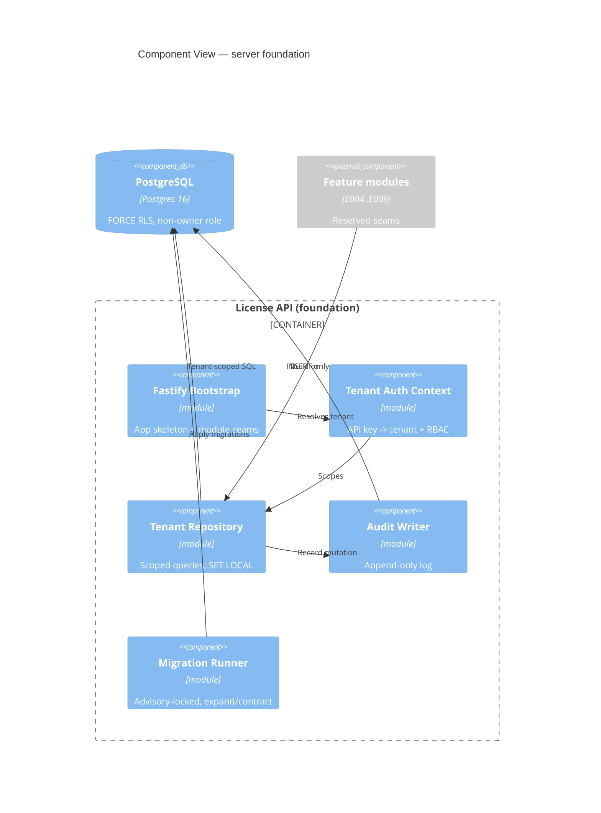

# Implementation Plan: Tenancy and Data Foundation

**Branch**: `00003-tenancy-and-data-foundation` | **Date**: 2026-06-27 | **Spec**: [spec.md](spec.md)

## Summary

**Goal**: The multi-tenant data substrate every server epic builds on — tenant-scoped repository, forced RLS, gated migrations, and an append-only audit log.  
**Approach**: Node/TS + Fastify modular-monolith skeleton over PostgreSQL via Drizzle; every tenant-owned query runs inside a transaction with `SET LOCAL app.current_tenant`, backed by `FORCE ROW LEVEL SECURITY` under a non-owner role.  
**Key Constraint**: No operation may cross a tenant boundary; isolation is enforced at the repository layer and again by RLS (defense in depth).

## Technical Context

**Language/Version**: TypeScript 5.x / Node 22  
**Primary Dependencies**: Fastify (HTTP), **`pg` (node-postgres)** driver/pool with parameterized SQL + a custom advisory-locked runner applying **raw SQL migrations** (see AD-006 — Drizzle ORM was dropped at the foundation layer), Zod (validation), HMAC-SHA-256 (`api_key`) + salted SHA-256 (`user.email_hash`) — argon2 password hashing deferred to E005; Vitest + `@testcontainers/postgresql` (integration)  
**Storage**: PostgreSQL 16.4+ — tenant-scoped, RLS-enforced  
**Testing**: Vitest (unit) + Vitest with Testcontainers Postgres (integration); c8 (coverage)  
**Target Platform**: Linux container (server)  
**Project Type**: web (backend foundation)  
**Project Mode**: mixed (existing Rust `src/verifier-core/`; new `src/server/` Node subtree)  
**Performance Goals**: tenant-scoped queries index-backed (`tenant_id`-leading); RLS overhead negligible at indexed scale  
**Constraints**: strict tenant isolation; non-owner DB role; expand/contract migrations; append-only audit; no connection-pool context bleed  
**Scale/Scope**: foundation consumed by E004, E005, E007, E008, E009; foundational entities only

## Instructions Check

*GATE: Must pass before Phase 0 research. Re-check after Phase 1 design.*

| Gate | Source | Status |
|------|--------|--------|
| Multi-tenant isolation + RBAC | Principle II | PASS — repository tenant-scoping + RLS + RBAC (TR-001/002/013, ADR-0004) |
| Single security core, fully audited | Principle III | PASS — append-only audit of every mutation (TR-008) |
| Testing & quality policy | Testing Policy | PASS — ≥80% coverage, npm audit + Semgrep, Testcontainers Postgres integration |
| Tech stack alignment | Technology Stack | PASS — Node/TS, Fastify, Drizzle, Postgres 16 |
| Source layout `/src` | Source Code Layout | PASS — `src/server/` |
| Modular monolith | ADR-0005 | PASS — enforced module seams (TR-010) |

No violations → Complexity Tracking omitted.

## Architecture



## Architecture Decisions

Refines project ADR-0004 (multi-tenancy isolation) and ADR-0005 (modular monolith); feature-local choices below.

| ID | Decision | Options Considered | Chosen | Rationale |
|----|----------|--------------------|--------|-----------|
| AD-001 | Tenant scoping mechanism | app-only filter / RLS-only / repository + RLS | Repository wraps every query in a tx with `SET LOCAL app.current_tenant`, RLS as net | Defense in depth (ADR-0004); unset GUC → 0 rows |
| AD-002 | DB role model | single owner role / non-owner app role | Non-owner, non-superuser, `NOBYPASSRLS` app role; separate owner for DDL | Owners/superusers bypass RLS by default |
| AD-003 | Migration execution | migrate-on-boot / gated advisory-locked job | drizzle-kit, expand/contract, discrete job guarded by `pg_advisory_lock` | Prevents replica races; safe rollback (DDR-004) |
| AD-004 | API-key auth | plaintext / hashed lookup | HMAC `key_hash` lookup; raw key never stored | Secret never at rest in clear |
| AD-005 | Pool context isolation | session var / per-tx SET LOCAL | `SET LOCAL ROLE` + GUC per transaction (auto-reset on commit) | Prevents cross-request tenant bleed |
| AD-006 | Data-access layer | Drizzle ORM / node-postgres direct | **node-postgres (`pg`) with parameterized SQL + raw SQL migrations** | Foundation work is RLS/`SET LOCAL`/advisory-lock/grant DDL an ORM models poorly; parameterized `pg` is injection-safe and explicit (also avoids the drizzle-orm identifier-escaping advisory). Drizzle may be adopted for typed CRUD in later feature epics. |

## Data Model Summary

| Entity | Key Fields | Relationships | Notes |
|--------|------------|---------------|-------|
| tenant | id, slug | root of scoping | RLS scopes on `id` |
| user | id, tenant_id, email_hash | belongs to tenant | minimal/hashed PII |
| role | id, tenant_id, user_id, role | RBAC grant | owner/admin/viewer |
| api_key | id, tenant_id, key_hash, status | belongs to tenant | HMAC hash; active→revoked |
| audit_log | id, tenant_id, actor, action, target, ts, security_event | append-only | INSERT/SELECT only; no UPDATE/DELETE |

**Detail**: [data-model.md](data-model.md) (RLS policies, indexes, advisory-lock key, GDPR export/erase).

## API Surface Summary

N/A — no public network API in this foundation epic. It provides an internal tenant-auth context (API-key → tenant) and module seams; business REST endpoints are owned by the feature epics (E004–E009).

## Testing Strategy

| Tier | Tool | Scope | Mock Boundary | Install |
|------|------|-------|---------------|---------|
| Unit | Vitest | repository scoping, RBAC, hashing, audit writer | DB | configured |
| Integration | Vitest + Testcontainers Postgres | tenant isolation (A cannot see B) across every tenant-owned table; RLS forced; unscoped-query refusal; pool no-bleed; advisory-locked migration + atomicity/lock-release; append-only audit; GDPR export/erase. Tests connect as the **non-owner app role** (`licensesrv_app`), never owner/superuser, and assert the app role is denied DDL. | none (real Postgres, fresh container per run — deterministic) | `npm i -D @testcontainers/postgresql` |
| Security | npm audit + Semgrep | deps + SAST (SQL injection, authz) — **gate fails on any high/critical advisory or high-severity SAST finding** | — | configured |
| Coverage | c8 | ≥ 80% **lines AND branches** over `src/server/` | — | configured |

## Error Handling Strategy

| Error Category | Pattern | Response | Retry |
|----------------|---------|----------|-------|
| Validation (Zod) | fail-fast | 400 + structured error | no |
| Auth / RBAC | fail-closed | 401/403, warn log | no |
| Missing tenant scope | assert + abort | refuse query (never run unscoped) | no |
| Cross-tenant breach | assert + audit | 500, `security_event` audited, page | no |
| Migration lock contention | wait on advisory lock | block until single runner finishes | yes (lock wait) |

## Integration Points

| Spec Reference | System/Service | Technical Approach | Contract |
|----------------|----------------|--------------------|----------|
| IP-001 | Feature epics E004–E009 | Build on the tenant repository, RLS policies, audit writer | this plan + data-model.md |
| IP-002 | Runtime/packaging (E006) | Runs the advisory-locked migration job (AD-003) | migration runner CLI |
| IP-003 | Project data model | Extends `specs/00001-license-server/data-model.md` foundational entities | data-model.md |

## Risk Mitigation

| Risk (from spec) | Likelihood | Impact | Mitigation | Owner |
|-------------------|------------|--------|------------|-------|
| RLS bypass (privileged role / SECURITY DEFINER / CVE) | M | H | Non-owner `NOBYPASSRLS` role, FORCE RLS, current Postgres patch level, isolation tests | server/db |
| Connection-pool context bleed | M | H | `SET LOCAL` per tx + `DISCARD ALL` on return; pool-reuse tests | server/db |
| Migration race | L | H | `pg_advisory_lock` single-runner gate; concurrent-runner test | server/db |

## Requirement Coverage Map

| Req ID | Component(s) | File Path(s) | Notes |
|--------|--------------|--------------|-------|
| TR-001 | repository | src/server/db/repository.ts | inject tenant scope every query |
| TR-002 | migrations, db | migrations/, src/server/db/rls.ts | FORCE RLS, non-owner role |
| TR-003 | db client, repository | src/server/db/client.ts, repository.ts | SET LOCAL + reset |
| TR-004 | schema/migrations | src/server/db/schema.ts, migrations/ | tenant_id-leading indexes |
| TR-005 | schema | src/server/db/schema.ts, migrations/ | tenant/user/role/api_key/audit_log |
| TR-006 | migrations | migrations/, drizzle.config.ts | expand/contract |
| TR-007 | migration runner | src/server/db/migrate.ts | advisory-locked job |
| TR-008 | audit, migrations | src/server/audit/, migrations/ | append-only, no UPDATE/DELETE grant |
| TR-009 | auth | src/server/auth/apikey.ts | API key → tenant context |
| TR-010 | app skeleton | src/server/app.ts, src/server/modules/ | module seams |
| TR-011 | repository, audit | src/server/db/repository.ts, src/server/audit/ | block + security_event |
| TR-012 | db, gdpr | src/server/db/hash.ts, src/server/db/gdpr.ts | hashed IDs; export/erase |
| TR-013 | auth | src/server/auth/rbac.ts | role-gated operations |
| TR-014 | db client, ops | src/server/db/client.ts, deploy config | Postgres 16.4+ + patch policy |
| TR-015 | migration runner | src/server/db/migrate.ts | per-migration tx + lock auto-release |
| TR-016 | auth | src/server/auth/{apikey.ts,rbac.ts} | scope AND role, fail-closed |

**SC → TR → test tier**: SC-001/002 → TR-001/002/003 → Integration(isolation/pool); SC-003/012 → TR-007/015 → Integration(migration); SC-004 → TR-006 → Integration(expand/contract); SC-005 → TR-008 → Integration(audit)+Unit; SC-006 → TR-009 → Integration/Unit; SC-007 → TR-011/013/016 → Integration(security-event/RBAC); SC-008 → TR-012 → Integration(GDPR); SC-009/010 → TR-004/005 → Integration(schema/index); SC-011 → TR-010 → Unit(module-boundary).

## Project Structure

### Source Code

```text
+ src/server/                      # Node/TS modular monolith (new subtree)
+   app.ts                         # Fastify bootstrap + module seams (TR-010)
+   auth/{apikey.ts,rbac.ts}       # tenant context + RBAC (TR-009,TR-013)
+   db/{client.ts,schema.ts,repository.ts,rls.ts,migrate.ts,hash.ts,gdpr.ts}
+   audit/index.ts                 # append-only audit writer (TR-008)
+   modules/                       # reserved feature-module seams (E004..E009)
+   __tests__/                     # Vitest unit + integration (Testcontainers)
+ migrations/                      # drizzle expand/contract migrations
+ drizzle.config.ts, package.json, tsconfig.json, vitest.config.ts
  src/verifier-core/               # existing Rust crate (unchanged by this epic)
```

**Patterns to reuse**: none in the Node subtree yet (first server code); follow the SAD's RLS hardening guidance and data-model.md.
**Naming conventions**: snake_case DB columns, camelCase TS, repository methods always require a tenant context.

## Implementation Hints

- **[HINT-001]** Order: Stand up the DB client + `SET LOCAL` repository wrapper and RLS migration first; every other module depends on tenant-scoped access existing.
- **[HINT-002]** Gotcha: The app role MUST be non-owner, non-superuser, `NOBYPASSRLS` — owners/superusers silently bypass RLS, defeating the safety net.
- **[HINT-003]** Constraint: Never query Drizzle tables outside the repository wrapper; the wrapper is the only place that sets the tenant GUC (RLS is the net, not the gate).
- **[HINT-004]** Gotcha: Reset pooled connections (`DISCARD ALL`) so `SET LOCAL` from a prior transaction can never leak; cover with a pool-reuse test.
- **[HINT-005]** Order: Run migrations only via the advisory-locked runner; never migrate-on-boot (replica race). Keep changes expand/contract so rollback stays safe.
