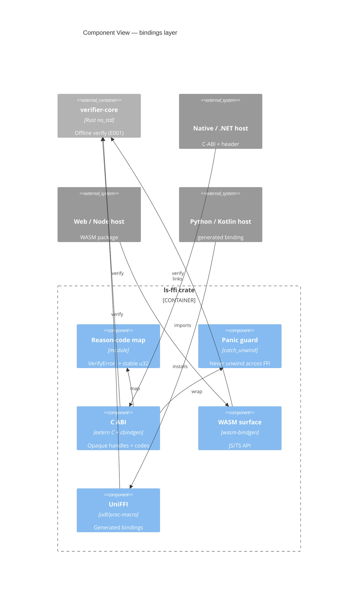

# Implementation Plan: Embeddable Verifier Bindings

**Branch**: `00004-embeddable-verifier-bindings` | **Date**: 2026-06-27 | **Spec**: [spec.md](spec.md)

## Summary

**Goal**: Ready-made, distributable bindings (C-ABI, WASM, generated) that let any stack verify a license offline by wrapping the one Rust verifier core.  
**Approach**: A thin `ls-ffi` Rust crate wraps `verifier-core` (E001), exposing a panic-safe C ABI (cbindgen header + cdylib), a WASM package (wasm-bindgen/wasm-pack), and UniFFI-generated bindings — all sharing one reason-code map.  
**Key Constraint**: No panic/UB may cross the FFI boundary, memory ownership is explicit and leak-free, and failure reason codes are identical across every binding.

## Technical Context

**Language/Version**: Rust stable (the `ls-ffi` crate); consumed from C/C++/.NET, JS/TS (WASM), and Python/Kotlin/Swift (UniFFI)  
**Primary Dependencies**: `verifier-core` (E001, path dep, `no_std`+`alloc`); `cbindgen` (C header); `wasm-bindgen` + `wasm-pack` (WASM); `uniffi` (generated bindings)  
**Storage**: N/A — verification is in-process, persists nothing  
**Testing**: `cargo test` (FFI crate); a C compile+link+run integration test; a Node/WASM test (loads the wasm package); a Python (UniFFI) smoke test; a cross-binding reason-code parity test; `cargo-fuzz` (reuses the core parser); `cargo audit`  
**Target Platform**: native cdylib + header (`x86_64`/`aarch64`), `wasm32-unknown-unknown` (browser/Node/Electron), plus UniFFI targets  
**Project Type**: library (bindings)  
**Project Mode**: mixed (new `src/bindings/` subtree; existing `src/verifier-core/` unchanged)  
**Performance Goals**: verify stays microseconds (core ≈ 40 µs); FFI overhead negligible  
**Constraints**: no panic across FFI; explicit leak-free ownership; identical reason codes; no crypto reimplementation; offline only  
**Scale/Scope**: P1 = C-ABI + WASM (+ samples + quickstart); P2 = UniFFI-generated bindings

## Instructions Check

*GATE: Must pass before Phase 0 research. Re-check after Phase 1 design.*

| Gate | Source | Status |
|------|--------|--------|
| Offline-first verification | Principle I | PASS — bindings call the core's no-network verify (FR-001/002/007) |
| Single security core, crypto once | Principle III | PASS — all bindings wrap `verifier-core`; no per-language crypto (FR-004, ADR-0002) |
| Testing & quality policy | Testing Policy | PASS — ≥80% glue coverage, fuzz-before-FFI, security scan, cross-binding parity (FR-013/014) |
| Source layout `/src` | Source Code Layout | PASS — `src/bindings/` |

No violations → Complexity Tracking omitted.

## Architecture



## Architecture Decisions

Feature-local refinements of ADR-0002 (one Rust core via C-ABI/WASM/UniFFI); no new standalone ADR required.

| ID | Decision | Options Considered | Chosen | Rationale |
|----|----------|--------------------|--------|-----------|
| AD-001 | C-ABI shape | flat structs / opaque handles | Opaque handles (`LsKeyring*`, `LsResult*`) + integer reason codes; header via cbindgen | ABI-stable, language-neutral, simple to bind from C/.NET |
| AD-002 | Panic safety | propagate / abort / catch | `catch_unwind` at every `extern "C"` entry → defined code; never unwind across FFI | Unwinding across the C ABI is UB (FR-005) |
| AD-003 | Reason-code stability | per-binding / one shared map | Single `reason_code(&VerifyError) -> u32` reused by all bindings | Identical codes everywhere (FR-006, SC-003) |
| AD-004 | Memory ownership | caller-alloc / callee-alloc + free | Callee allocates opaque handles freed via explicit `ls_*_free`; inputs borrowed | Explicit, leak-free contract (FR-008) |
| AD-005 | WASM + generated | wasm-bindgen / hand-FFI; UniFFI / hand | `wasm-bindgen`+`wasm-pack` (WASM); `uniffi` for generated (P2) | Matches ADR-0002; avoids hand-maintained bindings |
| AD-006 | Version guard | implicit / explicit | Expose `ls_abi_version()` + embed core SemVer + token-format version | Detect binding/core mismatch (FR-012) |

## Data Model Summary

N/A — no persistent data. The wrapped types (token, keyring, entitlement, reason code) are the core's in-memory types surfaced across the boundary.

## API Surface Summary

N/A — no network API. The "surface" is the FFI/library contract: the C-ABI functions (`ls_keyring_new/add/free`, `ls_verify`, `ls_result_has/limit/free`, `ls_abi_version`) generated into `licensesrv.h`, the WASM JS/TS API, and the UniFFI interface. Documented in the binding headers/packages, not as REST contracts.

## Testing Strategy

| Tier | Tool | Scope | Mock Boundary | Install |
|------|------|-------|---------------|---------|
| Unit | cargo test | reason-code map, panic guard, handle lifecycle | none | configured |
| Integration (C) | cc + cargo test harness | compile+link+run a C program against the cdylib/header; verify valid (reads entitlement) + tampered/expired (rejected); exercise the allocate/verify/free lifecycle and assert leak-freedom via balanced alloc/free accounting or a leak sanitizer (ASan/LeakSanitizer/valgrind) so a leak fails the test (SC-001/FR-008/FR-020) | none | `cc` (toolchain) |
| Integration (WASM) | Vitest + wasm-pack output | Node loads the WASM package, verifies a valid token offline, and rejects a tampered token and an expired token as two separate cases, each asserting its own distinct defined reason code (SC-002, not conflated) | none | `wasm-pack` |
| Integration (UniFFI) | Python | generated binding verifies a valid token (P2) | none | `uniffi-bindgen` |
| Cross-binding parity | cargo/script | same token → same outcome + same reason code in C-ABI and WASM (SC-003) | none | configured |
| Security | cargo-fuzz + cargo audit | parser/verify fuzz (reuse the core's fuzzed parser) before FFI exposure — the gate is the core's panic-free parser; the thin binding glue adds no new parsing, so it is covered by reuse plus the unit/parity tests rather than a separate fuzz target. **Measurable gate (FR-013):** a committed seed corpus (valid, tampered-sig, truncated, oversized > `MAX_TOKEN_BYTES`, empty, non-base64); per-PR CI runs the core's `cargo-fuzz` target ≥ 300 s against that corpus with zero crashes/panics/OOMs/timeouts; any finding is minimized + committed as a regression seed and fixed before release. No nightly soak job. Dependency vulns (gate: no CRITICAL) scanned across **all** binding outputs — the Rust crate deps (`cargo audit`), the WASM/npm package deps, and the generated-binding (UniFFI) package deps — not the Rust crate alone | — | `cargo install cargo-fuzz` |
| Coverage | cargo-llvm-cov | ≥ 80% of the binding glue | — | configured |
| Secret-leakage | cargo test (assertion) | assert the returned result/reason code and any host-readable output (including every error path) contain no key, raw-token, keyring, or fingerprint bytes; assert nothing is logged across the boundary (SC-007/FR-014) | none | configured |
| Determinism | cargo test | call verify repeatedly with a fixed set of FR-007 inputs (token, keyring, current time, monotonic anchor, fingerprint) and assert an identical verdict + reason code every time, including the expired-token case against supplied time (SC-008/FR-019) | none | configured |
| Quickstart time-to-verify | timed manual/CI walkthrough | a documented walkthrough following the quickstart from the FR-011 baseline prerequisites to a first successful offline verify, timing-boxed and recorded to confirm the < 30-minute target (SC-004) | none | quickstart README |

## Error Handling Strategy

| Error Category | Pattern | Response | Retry |
|----------------|---------|----------|-------|
| Verify failure | map to stable code | `ls_verify` returns reason code (0=ok, 1=malformed, … 9=fingerprint-missing) | no |
| Panic inside core | `catch_unwind` | return reserved `Internal` code (the fixed value `255`, documented and frozen as part of the external reason-code contract — not an illustrative example); never unwind across FFI | no |
| Null / invalid handle | guard | return `BadArgument` code; no deref of null (FR-016) | no |
| Double-free / use-after-free | guard | freeing or using a handle twice yields a defined no-op / `BadArgument`, never UB (FR-015) | no |
| Version mismatch | explicit check | `ls_abi_version()` mismatch detectable by host | no |
| Unsupported platform/arch | build/load-time failure | missing target artifact or load error before any verify call (FR-017) | no |

Reason codes are the closed `VerifyError` set in fixed order (AD-003), identical across all bindings. The reserved `Internal` code is fixed at `255` and frozen alongside the rest of the reason-code integers (HINT-001). Diagnostic and version strings (`ls_abi_version()` output, any human-readable diagnostic) expose only the binding/core SemVer and token-format version; they MUST NOT embed key material, raw token bytes, build secrets, or other sensitive detail (FR-006, FR-014, AD-006).

## Integration Points

| Spec Reference | System/Service | Technical Approach | Contract |
|----------------|----------------|--------------------|----------|
| EXTERNAL-SERVICE | verifier-core (E001) | `ls-ffi` path-depends on the `verifier-core` crate's verify API | frozen `LIC1` format, closed `VerifyError` |
| NEW-UI | Reference apps | C sample + Node/WASM sample demonstrating offline verify | examples/ |

## Risk Mitigation

| Risk (from spec) | Likelihood | Impact | Mitigation | Owner |
|-------------------|------------|--------|------------|-------|
| Panic/UB across FFI | M | H | `catch_unwind` at every entry → defined code (AD-002); fuzz parser before exposing (FR-013) | ls-ffi |
| Per-binding maintenance burden | M | M | One core + generated bindings (UniFFI), not hand-written (AD-005) | ls-ffi |
| Platform/arch coverage gaps | M | M | Publish a supported target matrix; CI builds each target | ls-ffi |

## Requirement Coverage Map

| Req ID | Component(s) | File Path(s) | Notes |
|--------|--------------|--------------|-------|
| FR-001 | C ABI | src/bindings/ls-ffi/src/lib.rs, src/bindings/c-abi/include/licensesrv.h | cbindgen header |
| FR-002 | WASM | src/bindings/ls-ffi/src/wasm.rs, src/bindings/wasm/ | wasm-pack package |
| FR-003 | UniFFI | src/bindings/ls-ffi/src/uniffi.rs, src/bindings/uniffi/ | generated (P2) |
| FR-004 | ls-ffi | src/bindings/ls-ffi/ | wraps verifier-core; no crypto reimpl |
| FR-005 | Panic guard | src/bindings/ls-ffi/src/guard.rs | catch_unwind |
| FR-006 | Reason map | src/bindings/ls-ffi/src/reason.rs | stable u32 codes |
| FR-007 | C ABI / WASM | src/bindings/ls-ffi/src/lib.rs | token+keyring+now+anchor+fp+entitlements |
| FR-008 | handles | src/bindings/ls-ffi/src/lib.rs | ls_*_free ownership |
| FR-009 | samples | src/bindings/c-abi/examples/, src/bindings/wasm/examples/ | offline verify demo |
| FR-010 | packaging | src/bindings/{c-abi,wasm}/ | cdylib+header; wasm package |
| FR-011 | quickstart | src/bindings/README.md | first verify < 30 min |
| FR-012 | version | src/bindings/ls-ffi/src/lib.rs | ls_abi_version() |
| FR-013 | fuzz | src/verifier-core/fuzz/ (reused) | parser fuzzed before FFI |
| FR-014 | quality | CI + src/bindings/ls-ffi/ | coverage + audit; no secret leaks |
| FR-019 | determinism | src/bindings/ls-ffi/src/lib.rs (tests) | fixed FR-007 inputs → identical verdict + reason code (SC-008) |
| FR-020 | leak verification | src/bindings/c-abi/examples/, ls-ffi tests | allocate/verify/free lifecycle asserted leak-free (SC-001/FR-008) |

## Project Structure

### Source Code

```text
+ src/bindings/
+   ls-ffi/                       # Rust crate wrapping verifier-core (E001)
+     src/{lib.rs,reason.rs,guard.rs,wasm.rs,uniffi.rs}
+     cbindgen.toml
+   c-abi/
+     include/licensesrv.h        # generated by cbindgen
+     examples/verify.c           # reference integration (offline)
+   wasm/
+     examples/node-verify.mjs    # reference integration (Node/browser)
+   uniffi/
+     examples/verify.py          # generated-binding sample (P2)
+   README.md                     # quickstart (FR-011)
  src/verifier-core/              # existing (E001) — depended upon, unchanged
```

**Patterns to reuse**: the core's closed `VerifyError`, `Keyring`, `Claims`, and the `LIC1` token format (frozen). The fuzz target in `src/verifier-core/fuzz/`.
**Naming conventions**: C-ABI symbols prefixed `ls_`; opaque types `Ls*`; reason codes match `VerifyError` order.

## Implementation Hints

- **[HINT-001]** Order: Build the reason-code map + panic guard + C ABI first; WASM and UniFFI surfaces reuse them. Freeze the reason-code integers before any binding ships (they're an external contract).
- **[HINT-002]** Gotcha: Wrap EVERY `extern "C"` body in `std::panic::catch_unwind` (or `core::panic` strategy) and return a code — an unwind across the C ABI is undefined behavior.
- **[HINT-003]** Constraint: Inputs (token string, pubkey bytes, fingerprint) are borrowed (caller-owned); only opaque handles are callee-allocated and MUST be freed via `ls_*_free`. Document and test the ownership contract.
- **[HINT-004]** Gotcha: `verifier-core` is `no_std`+`alloc`; the C-ABI cdylib needs `std` for `catch_unwind` (use a `std` feature on `ls-ffi`), while the wasm32 build stays slim.
- **[HINT-005]** Compatibility: The cross-binding parity test is the contract guard — assert the same token yields the same reason code via both the C-ABI and the WASM build; never let the codes drift.
