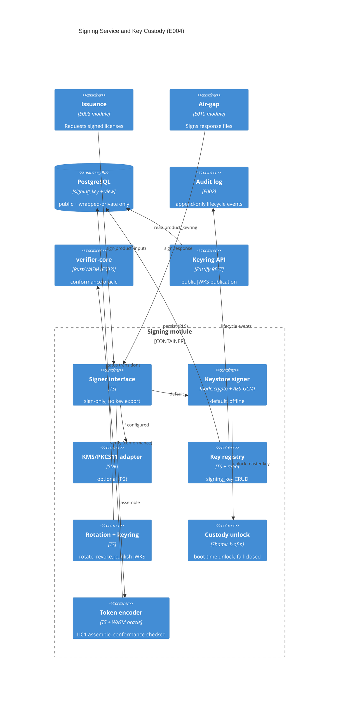

# Implementation Plan: Signing Service and Key Custody

**Branch**: `00005-signing-service-and-key-custody` | **Date**: 2026-07-02 | **Spec**: [spec.md](spec.md)

## Summary

**Goal**: A signing service that mints signed `LIC1` licenses with per-product Ed25519 keys, never exposes private key material, and rotates keys without invalidating already-issued licenses.
**Approach**: A `signing` module in the existing Node/TS modular monolith — a pluggable `Signer` interface (default encrypted-keystore/soft-HSM, optional cloud-KMS/PKCS#11 adapter), a tenant-scoped `signing_key` registry (Postgres + forced RLS), overlapping keyring rotation with a public JWKS keyring, and Shamir k-of-n custody with fail-closed operation.
**Key Constraint**: private keys never leave the custody boundary, are never logged or returned; signing is tier-0 (issuance p95 < 300 ms including the signer span).

## Technical Context

**Language/Version**: TypeScript 5.x / Node.js 22 (ESM)
**Primary Dependencies**: Fastify, node-postgres (`pg`), `node:crypto` (Ed25519 sign/verify + AES-256-GCM envelope), a Shamir secret-sharing library (e.g. `shamir-secret-sharing`), a CBOR codec for the `LIC1` payload; **E003 WASM binding** (`verifier-core`) used as the issue-time conformance oracle; optional cloud-KMS SDK / `pkcs11js` for the P2 adapter.
**Storage**: PostgreSQL — extends the E002 schema with one table (`signing_key`) and one derived view (`product_keyring`); no plaintext private keys are ever stored.
**Testing**: Vitest + `@testcontainers/postgresql` (real Postgres for RLS/rotation/revocation), plus a **cross-language conformance test** that verifies every signer-minted token with the real Rust `verifier-core` (via the E003 WASM `verify`).
**Target Platform**: Linux server (single container image, E006).
**Project Type**: web (server)
**Project Mode**: brownfield — extends `src/server` (E002 modular monolith)
**Performance Goals**: issuance p95 < 300 ms including the signer span (DOD); the Ed25519 signature itself is sub-millisecond; custody unlock happens once at startup.
**Constraints**: private keys never in app memory plaintext beyond the custody boundary, never logged/returned; default signer works fully offline (no cloud dependency); fail-closed on custody/backend fault; per-product blast-radius isolation; all key persistence tenant-scoped under forced RLS; all key lifecycle events audited.
**Scale/Scope**: per-product keys (low key count, ≤ a handful of trusted keys per product during rotation overlap); tier-0 availability for signing.

## Instructions Check

*GATE: Must pass before Phase 0 research. Re-check after Phase 1 design.*

- **Principle I — Offline-First Cryptographic Verification**: PASS — the default signer is a self-hosted encrypted keystore / soft-HSM that needs no network; the cloud-KMS/PKCS#11 adapter is opt-in and P2 (AD-006). Air-gap (E010) remains first-class.
- **Principle II — Multi-Tenant Isolation**: PASS — `signing_key` is `tenant_id`-scoped under `FORCE ROW LEVEL SECURITY` and accessed only through the E002 tenant repository / `licensesrv_app` non-owner role (AD-003).
- **Principle III — Single Security Core, Fully Audited**: PASS — the Ed25519 primitive is `node:crypto` (a standard implementation, not re-derived), and the `LIC1` byte format stays single-sourced by the Rust `verifier-core`, which is the authoritative conformance oracle for every minted token (AD-001). No token format or verification crypto is redefined. Every key lifecycle event is written to the E002 append-only audit log.
- **Security Requirements**: PASS — private keys are confined to the custody boundary and never logged/returned (AD-002, AD-007); the signer fails closed on any custody/backend fault (AD-005); the keystore unlock is gated by Shamir k-of-n custodian shares (AD-005).

## Architecture



## Architecture Decisions

Feature-local refinements of **ADR-0003** (per-product keys, KMS/keystore custody, `key_id` keyring rotation, keys never exposed) and **DDR-003** (pluggable signer, soft-HSM default, Shamir k-of-n). No new standalone ADR is required.

| ID | Decision | Options Considered | Chosen | Rationale |
|----|----------|--------------------|--------|-----------|
| AD-001 | How does the Node signer produce a `LIC1` token without duplicating crypto? | (a) Node↔Rust runtime binding builds+assembles the token; (b) `node:crypto` Ed25519 + a thin TS `LIC1` encoder, conformance-gated against the real Rust core; (c) hand-rolled, untested | (b) node:crypto Ed25519 + conformance gate | Keeps the crypto primitive standard (not re-derived) and E004 self-contained in Node (per the "Node now" roadmap), while the Rust `verifier-core` stays the single source of truth for the format — every minted token MUST verify via the E003 WASM `verify` in tests, so drift is impossible. Collapses into the one core when the server later moves to Rust. |
| AD-002 | Where do private keys live for the default signer? | (a) plaintext in memory/DB; (b) envelope-encrypted wrapped blob in the DB under a runtime-only master key; (c) external keystore file only | (b) envelope encryption | The private key is AES-256-GCM-wrapped under a keystore master key that is reconstructed at runtime from Shamir shares and never persisted — a DB dump alone is useless. Backup = DB backup (wrapped) + separately-held shares. The KMS adapter swaps the wrapped blob for an opaque backend handle. |
| AD-003 | `signing_key` registry shape + isolation | E002-repo tenant-scoped table vs. a separate store | Tenant-scoped table under forced RLS via E002 repo | One-active-key-per-product invariant (partial unique index), `key_id` unique per product, tenant isolation and audit reuse the E002 substrate (see data-model.md). |
| AD-004 | How is rotation + trust published to verifiers? | (a) publish a per-key `revoked` flag; (b) publish only currently-trusted keys (JWKS), omit revoked | (b) omit revoked; publish active+rotating+retired with validity windows | The public keyring lists only trusted keys with `valid_from/valid_until`, mapping cleanly to E001's `Keyring`/`KeyEntry` (validity window); a revoked key is simply absent (client → `UnknownKey`). Reconciles the spec's IP-001 note. |
| AD-005 | Keystore unlock + fault behavior | single passphrase / Shamir k-of-n / KMS-only | Shamir k-of-n unlock + fail-closed | k-of-n removes single-point catastrophic loss (DDR-003); the master key lives only in memory post-unlock; below k shares or on backend fault the signer signs nothing and returns a defined error. |
| AD-006 | Pluggable custody backends | keystore-only / KMS-only / pluggable | Pluggable `Signer` behind one interface; keystore default, KMS/PKCS#11 opt-in (P2) | Preserves the offline/self-host default while allowing hardware/cloud custody without any caller change (TR-017). |
| AD-007 | Preventing private-key exposure in code | ad-hoc / a typed non-serializable key-material boundary | A `KeyMaterial` boundary confined to the signer; never serialized/logged; API + audit + errors carry only `key_id`/metadata | Structural enforcement of TR-001/010; a dedicated secret-leakage test asserts it. |

## Data Model Summary

| Entity | Key Fields | Relationships | Notes |
|--------|------------|---------------|-------|
| `signing_key` (table) | `(tenant_id, id)` PK; `product_id`, `key_id`, `algorithm='ed25519'`, `public_key` bytea, `status` {active,rotating,retired,revoked}, `valid_from/valid_until`, `private_key_ref` bytea, `custody_scheme`, `created_at/created_by` | `tenant_id → tenant(id)`; `(tenant_id, product_id) → product` (E007, deferred FK); `created_by → app_user` | Forced RLS (tenant policy); partial unique `WHERE status='active'` (one active key/product); `UNIQUE (tenant_id, product_id, key_id)`; **no plaintext private key ever** — `private_key_ref` is a wrapped blob (keystore) or opaque handle (KMS) |
| `product_keyring` (view) | derived: `kid, public_key, valid_from, valid_until` for `status ∈ {active,rotating,retired}` | over `signing_key` | `security_invoker` view; excludes `private_key_ref`/`custody_scheme`; revoked keys omitted |
| custodian share | Shamir k-of-n unlock material | — | **NOT a DB entity** — held out-of-band via the E006 secrets contract |

**Detail**: [data-model.md](data-model.md). Migration destination: `migrations/0004_signing_keys.sql` (expand-only, sequential).

## API Surface Summary

| Method | Path | Purpose | Auth | Req/Res Types |
|--------|------|---------|------|---------------|
| POST | `/v1/products/{productId}/signing-keys` | Provision a per-product Ed25519 key (public metadata only) | apiKey — admin | `ProvisionSigningKeyRequest` → `201 SigningKeyMetadata` |
| POST | `/v1/products/{productId}/signing-keys/rotate` | Rotate: activate a new `key_id`, keep prior keys trusted | apiKey — admin | `RotateSigningKeyRequest` → `200 SigningKeyMetadata` |
| POST | `/v1/products/{productId}/signing-keys/{keyId}/revoke` | Revoke a key (removed from keyring, never signs again) | apiKey — admin | `RevokeSigningKeyRequest` → `200 SigningKeyMetadata` |
| GET | `/v1/products/{productId}/signing-keys` | List a product's keys (metadata only) | apiKey — viewer+ | → `200 SigningKeyList` |
| GET | `/v1/products/{productId}/keyring` | Public JWKS keyring for out-of-band verifier pinning | apiKey — viewer+ (public-distribution deployable) | → `200 Keyring` (`application/jwk-set+json`) |

**Detail**: [contracts/](contracts/) (`signing-keys.openapi.yaml`, OpenAPI 3.1). No `/sign` endpoint — signing is the in-process `Signer` interface. No response/example ever contains private material (JWKS entries have no `d` member).

## Testing Strategy

| Tier | Tool | Scope | Mock Boundary | Install |
|------|------|-------|---------------|---------|
| Unit | Vitest | reason/status transitions, one-active-key invariant, envelope wrap/unwrap, Shamir split/recombine, keyring JWKS projection, fail-closed paths | node:crypto real; DB mocked | configured |
| Integration | Vitest + Testcontainers (postgres:16) | RLS tenant isolation on `signing_key`, provision/rotate/revoke lifecycle, `product_keyring` view contents, audit entries, cross-product isolation | none (real Postgres) | configured |
| Conformance | Vitest + E003 WASM `verify` | every signer-minted `LIC1` token verifies via the real Rust `verifier-core`; rotated-key tokens verify under the published keyring | none | configured |
| Security | `npm audit` + secret-leakage test (+ semgrep in CI) | no private-key bytes in any response/log/error; dependency vulns (gate: no critical) | — | configured (semgrep CI-only) |
| Coverage | c8 / Vitest coverage | ≥ 80% lines + branches of the `signing` module | — | configured |

## Error Handling Strategy

| Error Category | Pattern | Response | Retry |
|----------------|---------|----------|-------|
| Key-management validation | fail-fast | `400` structured `Error {code,message,details}` | no |
| Auth / RBAC | fail-closed | `401` / `403` `Error` | no |
| Unknown product/key | — | `404` `Error` | no |
| Rotation conflict (in-flight / duplicate revoke) | optimistic guard | `409` `Error` | no |
| Signer custody unavailable (unlock/backend fault) | **fail-closed** | internal: defined `SignerUnavailable` error to caller; **no token emitted**, no key material logged | caller decides (tier-0: cache/pre-issue) |
| Startup with < k custodian shares | fail-closed | signer does not unlock; readiness probe fails (not liveness) | operator supplies shares |

## Integration Points

| Spec Reference | System/Service | Technical Approach | Contract |
|----------------|----------------|--------------------|----------|
| IP-001 | E001 `verifier-core` (LIC1 format) | Signer mints `node:crypto` Ed25519 tokens; the Rust core (via E003 WASM) is the conformance oracle every token is verified against; published keyring maps to the core's `Keyring` by `key_id` + validity window | AD-001, AD-004 |
| IP-002 | E002 tenant data layer | `signing_key` persisted via the tenant repository under forced RLS; lifecycle events → append-only `audit_log` | data-model.md |
| IP-003 | E008 issuance (downstream) | Consumes the in-process `Signer` interface (owned here; not forked) | `Signer` interface (AD-001) |
| IP-004 | E010 air-gap (downstream) | Consumes the `Signer` to sign response files | `Signer` interface |
| IP-005 | E003 bindings / E001 clients | Consume the public JWKS keyring to pin trusted keys out of band | `GET …/keyring` (contracts/) |
| IP-006 | E006 runtime config/secrets | Signer selection, keystore config, and Shamir custodian shares injected via env/secret files at runtime — never baked into an image | NEW-CONFIG |
| IP-007 | E007 catalog (product identity) | `signing_key.product_id` references the E007-owned `product`; the composite FK is deferred (integrity via repository + RLS until E007 lands) | data-model.md (deferred FK) |

## Risk Mitigation

| Risk (from spec) | Likelihood | Impact | Mitigation | Owner |
|-------------------|------------|--------|------------|-------|
| Signing backend unavailability blocks issuance (tier-0) | M | H | Fail-closed with a defined error; readiness (not liveness) reflects custody state; issuance may cache/pre-issue to decouple from momentary latency; document availability handling | signing module |
| Custodian share loss below k | L | H | `n > k` redundancy; keystore backup stored separately from shares; key-recovery runbook (verified in Tasks per TR-013) | operator / runbook |
| Signer interface divergence (E008/E010 fork) | M | M | Interface owned here; single exported `Signer` type consumed by downstream; changes treated as coordinated/breaking | signing module |

## Requirement Coverage Map

| Req ID | Component(s) | File Path(s) | Notes |
|--------|--------------|--------------|-------|
| TR-001 | Signer interface | `src/server/modules/signing/signer.ts` | sign-only; no export operation |
| TR-002 | Keystore signer | `src/server/modules/signing/keystore-signer.ts` | node:crypto Ed25519, AES-256-GCM envelope |
| TR-003 | Key generation | `src/server/modules/signing/registry.ts` | per-product Ed25519 keypair + unique `key_id` |
| TR-004 | Registry + RLS | `migrations/0004_signing_keys.sql`, `registry.ts` | tenant/product-scoped, forced RLS via E002 repo |
| TR-005 | Registry schema | `migrations/0004_signing_keys.sql` | key_id/alg/public_key/status/validity columns |
| TR-006 | Active-key selection | `registry.ts` | selects `status='active'`, stamps `key_id` |
| TR-007 | Rotation | `src/server/modules/signing/rotation.ts` | new active + overlap-trusted prior keys |
| TR-008 | Keyring publication | `src/server/modules/signing/keyring.ts`, `routes.ts`, `contracts/` | JWKS over `product_keyring` view |
| TR-009 | Revocation | `rotation.ts`, `registry.ts` | omit from keyring + never select; audit retained |
| TR-010 | Secret non-exposure | `signer.ts`, `token.ts`, `keyring.ts` | KeyMaterial boundary; no private in any projection/log |
| TR-011 | Fail-closed | `signer.ts`, `custody.ts` | defined error, no token on fault |
| TR-012 | Shamir unlock | `src/server/modules/signing/custody.ts` | k-of-n gate at startup |
| TR-013 | Backup separation | `deploy/` docs + recovery runbook | inspection/runbook check (per spec advisory) |
| TR-014 | Lifecycle audit | `registry.ts`, `rotation.ts` → `src/server/audit` | append-only create/rotate/retire/revoke |
| TR-015 | Per-product isolation | `registry.ts`, conformance test | product A token fails under product B key |
| TR-016 | KMS/PKCS#11 adapter (P2) | `src/server/modules/signing/kms-signer.ts` | same interface, no key export |
| TR-017 | Config-driven selection | `src/server/modules/signing/index.ts` | keystore vs KMS by config, no caller change |
| TR-018 | Fail-closed output definition | `signer.ts`, `token.ts` | returns only a conformance-verified complete token or a defined error; never partial/unsigned bytes; verify runs on the signing path — keep within p95<300ms or move pre-issue |
| TR-019 | Retired-key state + bounded overlap | `rotation.ts`, `keyring.ts`, `index.ts` (config) | `retired` never signs but stays publishable until removed; state machine active→rotating→retired→removed, any→revoked; overlap window operator-configurable + bounded |

## Project Structure

### Source Code

```text
migrations/
+ 0004_signing_keys.sql            # signing_key table + indexes + RLS/policy/grants + product_keyring view

src/server/modules/
+ signing/
+   index.ts                       # module wiring + config-driven signer selection (TR-017)
+   signer.ts                      # Signer interface + KeyMaterial boundary (TR-001/010)
+   keystore-signer.ts             # default: node:crypto Ed25519 + AES-256-GCM envelope (TR-002)
+   kms-signer.ts                  # optional cloud-KMS/PKCS#11 adapter (P2, TR-016)
+   registry.ts                    # signing_key CRUD, key generation, active-key selection (TR-003/004/005/006)
+   rotation.ts                    # rotate / revoke / retire + overlap window (TR-007/009)
+   keyring.ts                     # JWKS keyring projection from product_keyring (TR-008)
+   custody.ts                     # Shamir k-of-n unlock + fail-closed (TR-011/012)
+   token.ts                       # LIC1 assemble via node:crypto; conformance oracle hook (AD-001)
+   routes.ts                      # Fastify routes for the key-management + keyring REST surface
~ src/server/modules/index.ts      # register the signing module

src/server/modules/signing/__tests__/
+   registry.integration.test.ts   # RLS isolation, lifecycle, audit (Testcontainers)
+   rotation.integration.test.ts   # rotate/revoke/keyring, cross-product isolation
+   conformance.test.ts            # minted tokens verify via E003 WASM verifier-core
+   custody.unit.test.ts           # Shamir split/recombine, fail-closed, envelope wrap/unwrap
+   secret-leakage.test.ts         # no private material in any response/log/error

deploy/
+ signing-key-recovery.md          # custodian/backup separation + recovery runbook (TR-013)
```

**Brownfield Notes**:
- **Patterns to reuse**: E002 `withTenant()` + tenant repository for all `signing_key` access; `writeAudit()`/`recordSecurityEvent()` for lifecycle events; the migration harness (`migrate.ts`, advisory-locked) and RLS policy form; Fastify `preHandler` tenant-auth + `rbac.ts` `authorize()` for routes; the `Error {code,message,details}` shape.
- **Tests to extend**: follow the E002 `foundation.integration.test.ts` Testcontainers pattern; reuse the E003 `wasm/pkg` package for the conformance oracle.
- **Naming conventions**: `snake_case` SQL columns, `camelCase` TS, module-boundary import rule (`no-restricted-imports` on `modules/*/internal`).

## Implementation Hints

- **[HINT-001]** Custody: reconstruct the keystore master key from Shamir shares **once at startup**, hold it only in memory, and zeroize on shutdown; below k shares → readiness fails (not liveness) and the signer stays locked (fail-closed).
- **[HINT-002]** Conformance-first: build `token.ts` against the E003 WASM `verify` before wiring issuance — a minted token that does not verify via the real core is a hard failure, not a warning (AD-001). Reuse the deterministic keypair/fixture approach from E003 for golden vectors.
- **[HINT-003]** One-active-key invariant is enforced by a **partial unique index** (`WHERE status='active'`); rotation must flip the old active → rotating/retired in the **same transaction** as inserting the new active to avoid violating it.
- **[HINT-004]** Never let private material touch a log/serializer: keep it inside the `KeyMaterial` boundary in `signer.ts`; API/audit/error projections carry only `key_id` + public metadata (TR-010); the secret-leakage test guards this.
- **[HINT-005]** Revocation is omission (AD-004): a revoked row is retained for audit but excluded from `product_keyring`; the published JWKS carries `valid_from/valid_until` so E001 `KeyEntry` validity maps 1:1.
