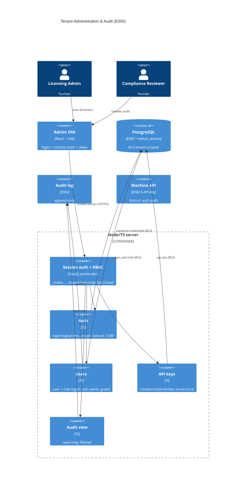

# Implementation Plan: Tenant Administration and Audit

**Branch**: `00006-tenant-administration-and-audit` | **Date**: 2026-07-02 | **Spec**: [spec.md](spec.md)

## Summary

**Goal**: A tenant-scoped admin console — human sign-in, RBAC-gated user & API-key management, and audit viewing — on the E002 data layer.
**Approach**: A React + Vite SPA (`/src/admin-ui`) over a new tenant-scoped `/admin` REST surface in `/src/server`, authenticated by **server-side cookie sessions** (ADR-0008) distinct from the machine `X-API-Key` path; RBAC enforced server-side and fail-closed; every action reuses the E002 tenant repository, forced RLS, and append-only audit log.
**Key Constraint**: every admin action is tenant-scoped and audited; human credentials and session tokens are never returned or logged; the audit surface is strictly read-only.

## Technical Context

**Language/Version**: TypeScript 5.x / Node.js 22 (server) + TypeScript / React 18 (SPA).
**Primary Dependencies**: Fastify + `@fastify/cookie` (session cookie), node-postgres (`pg`), Zod (validation), `node:crypto` (scrypt password hashing + random session/CSRF tokens); React + Vite (SPA). Testing: Vitest + `@testcontainers/postgresql`; React Testing Library (SPA components); Playwright optional for the login e2e.
**Storage**: PostgreSQL — extends E002 (`ALTER app_user` for credential/lockout columns; new `admin_session` table); reuses `role`, `api_key`, `audit_log`.
**Testing**: Vitest unit + Testcontainers integration (real Postgres) for the admin API; React Testing Library for SPA views; a secret-leakage test asserting no credential/token leaves the boundary.
**Target Platform**: Linux server (container, E006) + modern browser (SPA).
**Project Type**: web (frontend + backend).
**Project Mode**: mixed — extends `/src/server` (E002) and adds the new `/src/admin-ui` React SPA.
**Performance Goals**: admin interactions responsive (<300 ms server p95 for CRUD); the login KDF (scrypt) cost is tuned to be deliberately slow (~50–100 ms) to resist guessing.
**Constraints**: tenant-bound sessions; server-side fail-closed RBAC on every action; credentials stored scrypt-hashed and never returned (FR-017); session token httpOnly+Secure+SameSite + CSRF defense; brute-force lockout (FR-018); append-only audit (FR-013); API-key secret shown once (FR-009).
**Scale/Scope**: modest — a handful of admin users and API keys per tenant; audit reads are paginated.

## Instructions Check

*GATE: Must pass before Phase 0 research. Re-check after Phase 1 design.*

- **Principle II — Multi-Tenant Isolation + RBAC**: PASS — every session is bound to exactly one tenant (ADR-0008); every `/admin` route runs under `withTenant` scoped to the session's tenant; RBAC middleware enforces `minRole` server-side, fail-closed, and records denials as security events (AD-004). No cross-tenant path exists in the console.
- **Principle III — Single Security Core, Fully Audited**: PASS — every administrative mutation and every denial writes to the E002 **append-only** `audit_log` (actor/action/target/timestamp); the audit surface is read-only (no create/update/delete). No verification crypto is introduced.
- **Security Requirements**: PASS — passwords stored only as scrypt hashes, never plaintext/logged/returned (AD-002, FR-017); session tokens stored hashed, delivered only via an httpOnly+Secure+SameSite cookie, with CSRF protection on state-changing requests (AD-003/AD-006); brute-force lockout (AD-005, FR-018); API-key secret shown once (FR-009).
- **Principle I (Offline-First Verification)**: N/A — the admin console has no verification path.
- **Technology Stack**: PASS — React + Vite SPA (`/src/admin-ui`) + Node/TS admin API (`/src/server`) + `node:crypto` scrypt, per the mandated stack. Data access uses **node-postgres (`pg`) + raw SQL migrations**, the established, QC-passed E002 choice (see AD-009), rather than the Drizzle ORM named in project-instructions v1.1.0 — an inherited, documented deviation, not one E005 introduces.
- **Source Layout (ENFORCE_SRC_ROOT)**: PASS — new code under `/src/server/modules/admin/` and `/src/admin-ui/`; migration `migrations/0005_admin_sessions.sql` sequential after `0004`.

## Architecture



## Architecture Decisions

Feature-local decisions; the project-wide human-auth pattern is **ADR-0008** (server-side cookie sessions). See also ADR-0004 (multi-tenancy isolation), ADR-0007 (REST/JSON).

| ID | Decision | Options Considered | Chosen | Rationale |
|----|----------|--------------------|--------|-----------|
| AD-001 | How does login select the tenant (email is unique only per tenant)? | (a) tenant slug in the login body; (b) subdomain host; (c) globally-unique email | (a) tenant slug in body (+ subdomain-friendly) | `app_user.email_hash` is unique per `(tenant, email)`, so the same email may exist in multiple tenants; login takes `{tenantSlug, email, password}`, resolves the tenant by slug, then verifies within it. Works for self-host (single tenant) and SaaS. |
| AD-002 | Password hashing | scrypt (node:crypto) / argon2id (dep) / bcrypt (dep) | **scrypt** (`node:crypto`) | Built-in, no new dependency (consistent with E002/E004 node:crypto ethos), tunable cost, per-user salt, timing-safe verify. |
| AD-003 | Session mechanism (refines ADR-0008) | opaque cookie session / JWT | opaque 32-byte token in an httpOnly+Secure+SameSite=Strict cookie; stored as a SHA-256 `token_hash` in `admin_session` | Server-side revocation + minimal token-theft surface; auth resolves by `token_hash` via the privileged pre-tenant lookup (like `resolveApiKey`), then sets `withTenant` scope. |
| AD-004 | RBAC enforcement | client-only / server middleware | server-side `preHandler` guard: resolve the principal's role from the `role` table, enforce `minRole` via E002 `rbac.authorize`, deny-by-default; denial → `recordSecurityEvent` | Fail-closed least-privilege on every action (Principle II); the SPA also hides unauthorized actions, but the server is authoritative. |
| AD-005 | Brute-force protection | none / IP rate-limit / per-user lockout | per-user `failed_login_count` + `locked_until` on `app_user`; N failures → timed lockout (429 `rate_limited` + `Retry-After`) | Directly counters credential guessing at the account level (FR-018), auditable, no external store. |
| AD-006 | CSRF (cookie auth is CSRF-susceptible) | SameSite only / SameSite + double-submit token | `SameSite=Strict` **plus** a double-submit `X-CSRF-Token` on state-changing `/admin` requests | Defense-in-depth for cookie-authenticated mutations; SameSite alone is not sufficient across all browsers/flows. |
| AD-007 | Admin SPA + field convention | — | React + Vite at `/src/admin-ui` (per project-instructions); same-origin with the API; admin API uses **camelCase** JSON (SPA-facing), a documented divergence from the snake_case machine contracts | React/Vite is the mandated SPA stack; camelCase suits the TS SPA. The machine `/v1` contracts remain snake_case; the boundary is explicit (admin vs machine API). |
| AD-008 | Last-owner safeguard + API-key rotate | DB constraint / app-layer guard | app-layer guarded check (`SELECT … FOR UPDATE` on owner rows in the same tx) → 409 `last_owner`; API-key rotate = create replacement + revoke old | Last-owner is cross-row logic a single constraint can't express; the FOR-UPDATE guard is race-safe. Rotate reuses the existing `api_key` lifecycle (no schema change). |
| AD-009 | Postgres data access (inherited deviation) | Drizzle ORM (per project-instructions) / node-postgres (`pg`) + raw SQL | **`pg` + raw SQL migrations** | Established and QC-passed across E002/E004 (E002 AD-006 dropped Drizzle for `pg`); E005 stays consistent rather than reintroducing an ORM. Durable fix is a project-instructions amendment to reflect `pg` (a governance task, not E005's to make). |

## Data Model Summary

| Entity | Kind | Key Fields | Notes |
|--------|------|------------|-------|
| `app_user` | EXTENDED (ALTER, expand-only) | +`password_hash` (scrypt, nullable, never plaintext), +`status` CHECK(active/deactivated), +`failed_login_count`, +`locked_until` | login: hash entered email → match `email_hash` within the resolved tenant, then verify password; inherits E002 RLS/grants |
| `admin_session` | NEW table | `(tenant_id,id)` PK; `user_id` (composite FK→app_user); `token_hash` UNIQUE (hash of the cookie token — raw never stored); `expires_at`; `revoked_at`; `last_seen_at` | forced RLS + policy + grants; auth-time lookup by `token_hash` is a privileged pre-tenant lookup |
| `role` | REUSED (E002) | user→role rows (owner/admin/viewer) | grant=insert / change=swap; **last-owner safeguard = app-layer invariant** (AD-008) |
| `api_key` | REUSED (E002) | scopes, status(active/revoked) | rotate = revoke old + create new; secret shown once |
| `audit_log` | REUSED (E002) | append-only (INSERT/SELECT grant only) | read-only admin view with filters |

**Detail**: [data-model.md](data-model.md). Migration: `migrations/0005_admin_sessions.sql` (expand-only, sequential).

## API Surface Summary

Auth = `admin_session` httpOnly+Secure+SameSite=Strict cookie unless noted. RBAC `minRole` (owner > admin > viewer). All routes implicitly tenant-scoped from the session.

| Method | Path | Purpose | minRole |
|--------|------|---------|---------|
| POST | `/admin/auth/login` | Sign in (`{tenantSlug,email,password}`), set session cookie | none (`security: []`) |
| POST | `/admin/auth/logout` | Revoke session + clear cookie | viewer |
| GET | `/admin/auth/me` | Current principal | viewer |
| GET | `/admin/users` | List users (metadata, no hash) | viewer |
| POST | `/admin/users` | Create/invite user + initial role | admin |
| PATCH | `/admin/users/{userId}` | Change role/status (last-owner → 409) | admin |
| GET | `/admin/api-keys` | List keys (metadata, no secret) | admin |
| POST | `/admin/api-keys` | Create scoped key (secret once) | admin |
| POST | `/admin/api-keys/{keyId}/rotate` | Replace + revoke old (new secret once) | admin |
| POST | `/admin/api-keys/{keyId}/revoke` | Revoke | admin |
| GET | `/admin/audit` | Read-only, filterable (`from/to/securityEvent/actor`) | viewer |

**Detail**: [contracts/](contracts/) (`admin-api.openapi.yaml`, OpenAPI 3.1). No response ever carries a password/hash/session token; the API-key secret only appears on create/rotate; audit is GET-only (`x-append-only`).

## Testing Strategy

| Tier | Tool | Scope | Mock Boundary | Install |
|------|------|-------|---------------|---------|
| Unit | Vitest | scrypt hash/verify, session-token gen+hash, RBAC `authorize`, last-owner guard, lockout math, CSRF token | node:crypto real; DB mocked | configured |
| Integration | Vitest + Testcontainers (postgres:16) | login→session→me→logout, `admin_session` RLS isolation, user create/role-change/deactivate + last-owner 409, api-key create(secret-once)/rotate/revoke, audit filter + read-only, lockout after N fails, session expiry/revocation | none (real Postgres) | configured |
| Frontend | Vitest + React Testing Library | login form, console shell nav, users/api-keys/audit views, RBAC-hidden actions | API mocked | `npm i` in `/src/admin-ui` |
| Security | `npm audit` + secret-leakage test (+ semgrep in CI) | no password/hash/session-token in any response/log/error; dependency vulns (no high/critical) | — | configured (semgrep CI-only) |
| Coverage | Vitest v8 | ≥ 80% lines + branches of the admin server module | — | configured |

## Error Handling Strategy

| Error Category | Pattern | Response |
|----------------|---------|----------|
| Validation | fail-fast (Zod) | `400 validation_error` |
| Unauthenticated (no/expired/revoked session) | fail-closed | `401 unauthenticated` |
| RBAC denial | fail-closed + `recordSecurityEvent` | `403 forbidden` |
| Unknown user/key | — | `404 not_found` |
| Conflict (last owner / already revoked / email exists) | guarded | `409 last_owner` / `already_revoked` / `email_exists` |
| Brute-force lockout | per-user counter | `429 rate_limited` + `Retry-After` |

## Integration Points

| Spec Reference | System/Service | Technical Approach | Contract |
|----------------|----------------|--------------------|----------|
| — (E002 dep) | E002 tenant data layer | `withTenant`/`privileged` repo, forced RLS, `writeAudit`/`recordSecurityEvent`, reused `app_user`/`role`/`api_key`/`audit_log` | data-model.md |
| ADR-0008 | Human session auth | server-side cookie sessions (`admin_session`), distinct from the E002 `X-API-Key` machine path | ADR-0008 |
| FR-015 | E007/E008/E009 admin surfaces | plug into the console shell + the session/RBAC middleware without weakening tenant scope | NEW-UI shell |
| NEW-CONFIG | E006 runtime config/secrets | session cookie flags, session/CSRF secrets, scrypt cost, lockout thresholds injected via env/secret files | NEW-CONFIG |

## Risk Mitigation

| Risk (from spec) | Likelihood | Impact | Mitigation | Owner |
|-------------------|------------|--------|------------|-------|
| Session/auth handling weakness | M | H | Opaque hashed token, httpOnly+Secure+SameSite cookie + CSRF (AD-003/006); bounded expiry + revocation; server-side RBAC on every action; scrypt password KDF | admin module |
| Privilege-escalation / lock-out via role edits | M | H | Fail-closed RBAC (AD-004) + race-safe last-owner guard (AD-008) | admin module |
| Audit tampering perception | L | H | Append-only enforcement at the E002 privilege layer (INSERT/SELECT grant only); read-only admin view | E002 + admin module |

## Requirement Coverage Map

| Req ID | Component(s) | File Path(s) | Notes |
|--------|--------------|--------------|-------|
| FR-001 | Login → session | `src/server/modules/admin/auth.ts`, `session.ts` | `{tenantSlug,email,password}` → cookie session (AD-001/003) |
| FR-002 | Tenant-scoped access | `src/server/modules/admin/rbac-middleware.ts` | session → `withTenant`; no cross-tenant path |
| FR-003 | Session lifecycle | `session.ts` | bounded expiry, revoke on logout, reject expired/revoked |
| FR-004 | RBAC fail-closed | `rbac-middleware.ts` | `minRole` via E002 `rbac.authorize` |
| FR-005 | Audited denial | `rbac-middleware.ts` → `src/server/audit` | `recordSecurityEvent` on deny |
| FR-006 | User + role mgmt | `src/server/modules/admin/users.ts` | create/assign/change/deactivate |
| FR-007 | Deactivated loses access | `users.ts`, `session.ts` | status checked at auth; sessions rejected |
| FR-008 | Last-owner safeguard | `users.ts` | FOR-UPDATE guard → 409 (AD-008) |
| FR-009 | API-key secret once | `src/server/modules/admin/apikeys.ts` | secret only on create/rotate |
| FR-010 | Key rotate/revoke | `apikeys.ts` | rotate = create+revoke; revoked stops auth |
| FR-011 | Audit view | `src/server/modules/admin/audit.ts` | actor/action/target/timestamp, tenant-scoped |
| FR-012 | Audit filters | `audit.ts` | from/to/securityEvent/actor |
| FR-013 | Append-only audit | `audit.ts` (GET only) + E002 grants | no create/update/delete |
| FR-014 | Every mutation audited | all admin modules → `writeAudit` | actor attributed |
| FR-015 | Console shell | `src/admin-ui/` + `rbac-middleware.ts` | plugged-in surfaces inherit scope + RBAC |
| FR-016 | SSO (P2) | — | deferred; ADR-0008 leaves the seam |
| FR-017 | Credential secrecy | `password.ts` (scrypt), `users.ts` projections | never plaintext/logged/returned |
| FR-018 | Brute-force lockout | `auth.ts`, migration `0005` | failed_login_count + locked_until |
| FR-019 | CSRF protection | `src/server/modules/admin/csrf.ts`, `rbac-middleware.ts` | SameSite=Strict + double-submit `X-CSRF-Token` on state-changing /admin (AD-006) |

## Project Structure

### Source Code

```text
migrations/
+ 0005_admin_sessions.sql          # ALTER app_user (+credential/lockout) + CREATE admin_session + RLS

src/server/modules/
+ admin/
+   index.ts                       # module wiring + config (cookie/CSRF/scrypt/lockout)
+   session.ts                     # create/resolve/revoke sessions; token gen + hash (AD-003)
+   password.ts                    # scrypt hash + timing-safe verify (AD-002)
+   auth.ts                        # login/logout/me; lockout (AD-005)
+   rbac-middleware.ts             # session→tenant/role preHandler; fail-closed; audited denial (AD-004)
+   csrf.ts                        # double-submit CSRF token (AD-006)
+   users.ts                       # user + role mgmt; last-owner guard (AD-008)
+   apikeys.ts                     # api-key create/rotate/revoke (secret once)
+   audit.ts                       # read-only filtered audit view
+   routes.ts                      # Fastify /admin routes
+   __tests__/                     # unit + Testcontainers integration + secret-leakage
~ src/server/modules/index.ts      # register the admin module

+ src/admin-ui/                    # React + Vite SPA (per project-instructions)
+   package.json, vite.config.ts, index.html, tsconfig.json
+   src/main.tsx, src/App.tsx, src/api.ts
+   src/pages/{Login,Users,ApiKeys,Audit}.tsx
+   src/components/{Shell,RequireRole}.tsx
+   src/__tests__/                 # React Testing Library component tests
```

**Brownfield Notes**:
- **Patterns to reuse**: E002 `withTenant`/`privileged`, `writeAudit`/`recordSecurityEvent`, the `resolveApiKey` privileged-lookup pattern (mirror it for `token_hash`), `rbac.ts:authorize`, the migration harness + RLS form, the `Error {code,message,details}` shape, `hash.ts` (`hmacKey`/`hashEquals`).
- **Tests to extend**: follow the E002/E004 Testcontainers integration pattern; add the SPA as a new test target.
- **Naming**: `snake_case` SQL, `camelCase` TS; the admin API is camelCase JSON (AD-007); module-boundary import rule applies.

## Implementation Hints

- **[HINT-001]** Session cookie MUST be `HttpOnly; Secure; SameSite=Strict`, with a bounded `Max-Age`; store only the token's hash; resolve via the privileged `token_hash` lookup, then immediately drop to `withTenant` scope — never query admin data outside a tenant scope.
- **[HINT-002]** Login needs a tenant selector (AD-001): `{tenantSlug,email,password}`. Resolve the tenant by slug (privileged), then verify email+password within it. Return a generic error for bad tenant/email/password alike (no user enumeration).
- **[HINT-003]** Last-owner guard (AD-008) MUST run in the same transaction as the role/status change with `SELECT … FOR UPDATE` on the tenant's owner rows, or it races; refuse the change if it would drop the owner count to zero.
- **[HINT-004]** Never let a credential/token touch a response or log: `password` is write-only; `password_hash`/`token_hash` are excluded from every projection; a secret-leakage test guards this. The API-key secret is returned only by create/rotate.
- **[HINT-005]** CSRF (AD-006): issue a double-submit token (readable cookie + `X-CSRF-Token` header) validated on every state-changing `/admin` request; the SPA echoes it. SameSite=Strict is necessary but not sufficient.
