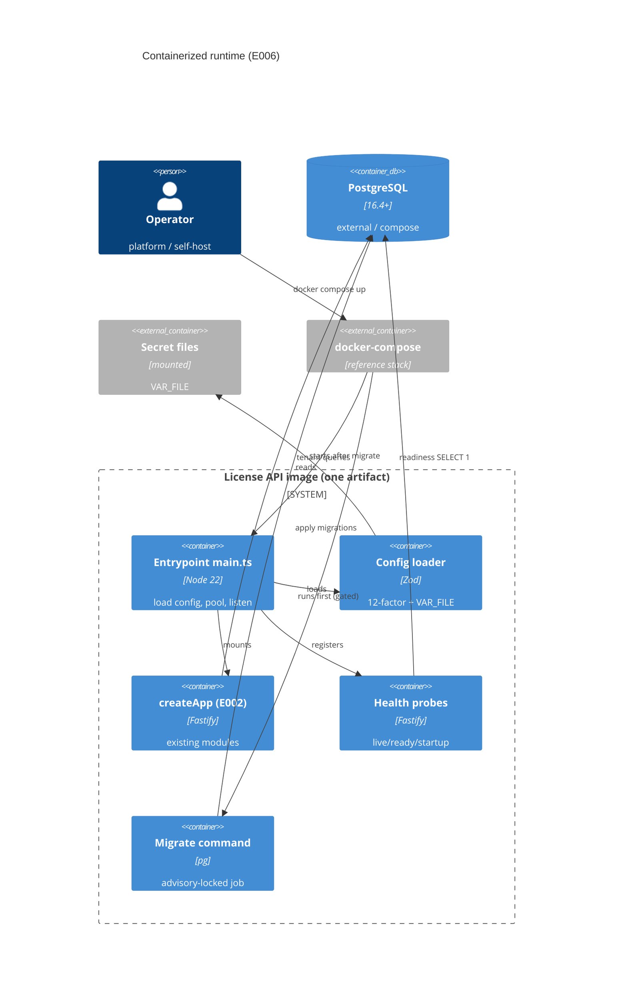

# Implementation Plan: Containerized Runtime and Config

**Branch**: `00007-containerized-runtime-and-config` | **Date**: 2026-07-05 | **Spec**: [spec.md](spec.md)

## Summary

**Goal**: Package the License API as one config-driven, non-root container image with a real server entrypoint, file-mounted secrets, a gated migration job, health probes, and a reference docker-compose stack.
**Approach**: Add a boot entrypoint (`main.ts`) that loads a validated 12-factor config (with `<VAR>_FILE` secret resolution), opens the pool, mounts the existing `createApp()`, registers liveness/readiness/startup probes, and listens; a multi-stage Dockerfile ships `dist/` + prod deps; the existing advisory-locked `runMigrations` runs as a separate image command.
**Key Constraint**: One image for all deployments; secrets never baked in; migrations gated (never migrate-on-boot); readiness — not liveness — fails on dependency degradation (ADR-0006, DDR-004, DDR-005).

## Technical Context

**Language/Version**: TypeScript 5.6 / Node 22 (ESM)
**Primary Dependencies**: Fastify 5, node-postgres (`pg`) 8, Zod 3 (already deps); Docker + docker-compose (runtime/packaging)
**Storage**: PostgreSQL 16.4+ (no new schema — reuses E002 `schema_migrations` + existing migrations)
**Testing**: Vitest 2 + @testcontainers/postgresql (integration); Docker image build/run smoke (local + CI)
**Target Platform**: Linux container (OCI); runnable via docker-compose
**Project Type**: web (single deployable API service + separate admin SPA)
**Project Mode**: brownfield
**Performance Goals**: fail-fast startup on bad config (< 1s to exit); readiness reflects DB reachability within a few seconds; graceful shutdown within a bounded window (default 10s)
**Constraints**: single image; non-root; secrets file-mounted only; no cloud secret-manager dependency; expand/contract migrations only
**Scale/Scope**: one API image serving all deployment shapes; the compose stack is the reference self-host topology

## Instructions Check

*GATE: Must pass before Phase 0 research. Re-check after Phase 1 design.*

- **ADR-0006 (single image, SaaS + self-host)**: one multi-stage image, serve/migrate modes, no per-env variants. ✓ (design below)
- **DDR-004 (gated advisory-locked migrations, never on-boot; expand/contract)**: migrate is a separate image command reusing the existing advisory-locked harness; app boot performs no schema change. ✓
- **DDR-005 (cloud-agnostic file-mounted secrets)**: `<VAR>_FILE` resolution; secrets absent from image layers/`docker inspect`. ✓
- **Readiness-not-liveness**: readiness aggregates DB (+ signer) health; liveness independent. ✓
- **Tech stack (Node 22 + Fastify; `pg` + raw SQL migrations, no Drizzle; PG 16.4+)**: reuses existing `createApp`/`runMigrations`; no ORM. ✓
- **Source layout (`/src`)**: entrypoint, config, and health modules under `src/server/`; Dockerfile/compose/`.dockerignore` are root manifests. ✓
- **Single audited security core / offline verifier separate**: verifier core not in this image. ✓

Re-checked post-design (Step 5.1): PASS — Policy Auditor, no violations (recorded in analysis-report.md).

## Architecture



## Architecture Decisions

Feature-local tradeoffs only. Project-wide decisions live in ADRs (ADR-0006 deployment, DDR-004 migrations, DDR-005 secrets) — referenced, not copied.

| ID | Decision | Options Considered | Chosen | Rationale |
|----|----------|--------------------|--------|-----------|
| AD-001 | Config source + validation | ad-hoc `process.env` reads / central validated loader / config file | Central validated loader (Zod) at boot | One source of truth; fail-fast on missing/invalid; consolidates existing `DATABASE_URL`/`SIGNING_*`/`ADMIN_*`/API-key reads (OR-005/006) |
| AD-002 | Secret injection | env-only / `<VAR>_FILE` file mount / cloud secret SDK | `<VAR>_FILE` with env fallback for non-secrets | DDR-005 cloud-agnostic; keeps secrets out of image + `docker inspect` (OR-008/009) |
| AD-003 | Migration execution | migrate-on-boot / separate image command / sidecar | Separate image command (`node dist/server/db/migrate.js`) reusing existing advisory-locked harness | DDR-004 safe rollback; harness already idempotent+locked+version-gated (OR-010/011) |
| AD-004 | Base image | `node:22` / `node:22-slim` / distroless | `node:22-slim` multi-stage, non-root `USER` | Small, no build toolchain in final stage, glibc for `pg`; distroless deferred (harder to debug self-host) (OR-002/003) |
| AD-005 | Probe topology | single `/health` / separate live-ready-startup | Separate `/internal/health/{live,ready,startup}`; readiness aggregates DB + existing signer readiness | Orchestrator-correct semantics; readiness gates traffic, liveness gates process (OR-012/013) |
| AD-006 | Shutdown | hard exit / graceful drain on SIGTERM | Graceful: stop accepting, `app.close()`, `pool.end()` within bounded window | Clean rolling restarts (OR-016, P2) |
| AD-007 | Startup vs DB availability | crash if DB down at boot / start + readiness not-ready | Start process, report not-ready until DB reachable | Avoids crash-loop; lets orchestrator hold traffic (edge case, OR-013) |

## Data Model Summary

N/A — no persistent data. E006 adds no tables or columns; it reuses E002's `schema_migrations` and the existing migration files. Migration *state* is an operational concern, not a new entity.

## API Surface Summary

| Method | Path | Purpose | Auth | Req/Res Types |
|--------|------|---------|------|---------------|
| GET | /internal/health/live | Liveness — process is alive | none (internal) | → `{status}` |
| GET | /internal/health/ready | Readiness — DB (+ signer) reachable; gates traffic | none (internal) | → `{status, checks[]}` |
| GET | /internal/health/startup | Startup — boot complete | none (internal) | → `{status}` |

Existing `/internal/ready/signing` (E004) is composed into readiness. All under the auth-exempt `/internal/` path (app.ts).
**Detail**: [contracts/health-api.openapi.yaml](contracts/health-api.openapi.yaml)

## Testing Strategy

| Tier | Tool | Scope | Mock Boundary | Install |
|------|------|-------|---------------|---------|
| Unit | Vitest 2 | config loader validation, `<VAR>_FILE` resolution, fail-fast on missing required/secret, secret-free config summary | filesystem via temp files; no DB | configured |
| Integration | Vitest 2 + @testcontainers/postgresql | entrypoint boot → readiness ready/not-ready as DB stops/starts; app-boot-does-not-migrate; migrate job idempotent + advisory-locked | real Postgres container; no Docker image | configured |
| Integration (image) | Docker CLI (build + run) | image builds; runs non-root; serve+migrate modes; secret value absent from image history + `docker inspect`; `docker compose up` reaches healthy | real Docker; local + CI | `configured` (Docker on host/CI) |
| Security | npm audit (`--omit=dev --audit-level=high`) + secret-not-in-image assertion + semgrep (CI-only) | prod deps + image secret hygiene + SAST | — | configured |
| Coverage | Vitest v8 | ≥80% line+branch of new config/health/entrypoint code | — | configured |

## Error Handling Strategy

| Error Category | Pattern | Response | Retry |
|----------------|---------|----------|-------|
| Missing/invalid config or secret file | fail-fast at boot | log the offending setting (no secret value), non-zero exit, do not serve | no |
| DB unreachable at runtime | readiness gate | `/internal/health/ready` → 503 `{status:"not-ready"}`; liveness stays 200; container kept alive | orchestrator withholds traffic |
| Migration failure | abort job | non-zero exit; transaction rolled back; advisory lock auto-released | operator re-runs (idempotent) |
| Concurrent migration | advisory lock | second runner blocks then no-ops | n/a |
| SIGTERM | graceful drain | stop accepting, finish in-flight, close pool, exit 0 within window | n/a |

## Integration Points

| Spec Reference | System/Service | Technical Approach | Contract |
|----------------|----------------|--------------------|----------|
| IP-001 | E002 app + migration harness | `main.ts` imports `createApp`; migrate command runs existing `runMigrations` | in-process |
| IP-002 | Module config (`DATABASE_URL`, API-key secret, `SIGNING_*`, `ADMIN_*`) | consolidated into `loadConfig()`; modules receive typed config/deps | `src/server/config` |
| IP-003 | `/internal/` probe convention (E004 signer readiness) | `registerHealth` adds live/ready/startup; readiness composes signer readiness | contracts/health-api.openapi.yaml |
| IP-004 | External PostgreSQL 16.4+ | pool via `makePool`; compose provides a container; version-gated by migrate | connection string / `_FILE` |
| IP-005 | Secret mechanisms (Docker secrets default; SOPS/age, Sealed Secrets, Vault) | image reads mounted files via `<VAR>_FILE`; mechanism-agnostic | `<VAR>_FILE` convention |
| IP-006 | E011 (build/sign/publish), E012 (instrument) | image + compose are E011's build input; structured logs/health feed E012 | image + `/internal/` |

## Risk Mitigation

| Risk (from spec) | Likelihood | Impact | Mitigation | Owner |
|-------------------|------------|--------|------------|-------|
| Secret leakage via env/logs/inspect | M | H | file-only secret loading; startup log summarizes config without secret values (SC-011); image test asserts secret absent from history + `docker inspect` (SC-004) | config loader + image test |
| Migrate-on-boot creep | L | H | `main.ts` never calls `runMigrations`; integration test asserts app boot changes no schema (SC-002); migrate is a distinct command | entrypoint + test |
| Probe misconfiguration kills healthy container | M | M | liveness independent of DB; only readiness checks dependencies; test DB-down → live 200 / ready 503 (SC-006) | health module + test |

## Requirement Coverage Map

| Req ID | Component(s) | File Path(s) | Notes |
|--------|--------------|--------------|-------|
| OR-001 | entrypoint | `src/server/main.ts` | load config → pool → createApp → registerHealth → listen |
| OR-002 | Dockerfile | `Dockerfile`, `.dockerignore` | multi-stage; final stage = `dist/` + prod node_modules + migrations |
| OR-003 | Dockerfile | `Dockerfile` | non-root `USER`; minimal writable surface |
| OR-004 | image commands | `Dockerfile`, `docker-compose.yml` | serve = `node dist/server/main.js`; migrate = `node dist/server/db/migrate.js` |
| OR-005 | config loader | `src/server/config/index.ts` | all settings from env; nothing env-specific baked |
| OR-006 | config loader | `src/server/config/index.ts` | Zod schema; fail-fast + non-zero exit naming the setting |
| OR-007 | config reference | `docs/config-reference.md` | every var: name/purpose/required/default/secret |
| OR-008 | secret resolver | `src/server/config/secrets.ts` | `<VAR>_FILE`; image test asserts absence from layers/inspect |
| OR-009 | secret resolver | `src/server/config/secrets.ts` | missing/empty required secret file → fail-fast |
| OR-010 | migrate command | `src/server/db/migrate.ts` (reuse) | discrete, advisory-locked, idempotent; not on boot |
| OR-011 | migrate command | `Dockerfile`, `src/server/config` | same image + config contract |
| OR-012 | health module | `src/server/health/index.ts` | live/ready/startup on `/internal/health/*` |
| OR-013 | health module | `src/server/health/index.ts` | readiness = DB `SELECT 1` + signer readiness; liveness independent |
| OR-014 | compose stack | `docker-compose.yml`, `.env.example` | API + Postgres + migrate one-shot; healthchecks |
| OR-015 | compose ordering | `docker-compose.yml` | `depends_on` migrate `service_completed_successfully`; DB healthcheck |
| OR-016 | shutdown handler | `src/server/main.ts` | SIGTERM → drain + `app.close()` + `pool.end()` (P2) |
| OR-017 | startup logging | `src/server/main.ts`, `src/server/config/index.ts` | structured summary, no secret values |
| RR-001 | runbook | `docs/runbooks/stuck-migration.md` | clear held advisory lock; resume after failure |
| RR-002 | runbook | `docs/runbooks/readiness-and-config-failures.md` | DB-unreachable readiness; missing config/secret fail-fast |

## Project Structure

### Source Code

```text
+ src/server/main.ts                              # boot entrypoint (serve mode): config → pool → app → health → listen
+ src/server/config/index.ts                      # loadConfig(): validated 12-factor AppConfig (Zod)
+ src/server/config/secrets.ts                    # readSecret(): <VAR>_FILE resolution
+ src/server/config/__tests__/config.unit.test.ts # validation, VAR_FILE, fail-fast, secret-free summary
+ src/server/health/index.ts                      # registerHealth(app, pool, deps): live/ready/startup
+ src/server/health/__tests__/health.integration.test.ts   # DB up/down → ready/not-ready; live independent (Testcontainers)
+ src/server/__tests__/entrypoint.integration.test.ts      # app-boot-does-not-migrate; migrate idempotent + locked
~ src/server/db/migrate.ts                         # reused as the "migrate" image command (CLI entry already present)
~ src/server/app.ts                                # (no change expected) /internal/ already auth-exempt
+ Dockerfile                                       # multi-stage, non-root, slim
+ .dockerignore
+ docker-compose.yml                               # API + Postgres + gated migrate one-shot
+ .env.example                                     # documented env + secret-file layout (no real secrets)
+ src/server/__tests__/image.smoke.integration.test.ts   # build/run image; secret-not-in-image; compose healthy (Docker-gated, skipIf !DOCKER_SMOKE)
+ src/server/__tests__/shutdown.integration.test.ts       # OBJ7 (P2/DEFERRED): SIGTERM drains in-flight + clean exit within window
+ docs/config-reference.md                         # OR-007 configuration reference
+ docs/runbooks/stuck-migration.md                 # RR-001
+ docs/runbooks/readiness-and-config-failures.md   # RR-002
+ README.md                                         # container run + docker compose quickstart (serve/migrate, secret mounts)
```

**Patterns to reuse**: `makePool` (`src/server/db/client.ts`), advisory-locked `runMigrations` (`src/server/db/migrate.ts`), the `/internal/` auth-exempt convention + `registerSigning` readiness probe (E004), the module `loadSigningConfig`/`loadAdminConfig` env readers (fold into `loadConfig`), Zod (already used in routes).
**Tests to extend**: none directly; new suites under `config/`, `health/`, and `__tests__/`. Full server `test:cov` gate unchanged.
**Naming conventions**: ESM `.js` import specifiers; `loadX`/`registerX` factory naming; tests `*.unit.test.ts` / `*.integration.test.ts`; config via typed `AppConfig` passed as deps (no ambient `process.env` reads outside `config/`).

## Implementation Hints

- **[HINT-001]** Build layout: `tsc` emits `src/**` → `dist/**` (rootDir `src`), so runtime entry is `dist/server/main.js` and migrate is `dist/server/db/migrate.js` — Dockerfile CMD/commands must use `dist/` paths, and ESM needs the compiled `.js`.
- **[HINT-002]** Secret precedence: resolve `<VAR>_FILE` before `<VAR>`; trim trailing newline from file contents (mounted secrets often end with `\n`); treat empty file as missing for required secrets (OR-009).
- **[HINT-003]** Don't couple liveness to the DB — only readiness runs `SELECT 1`; a DB blip must not restart the container (SC-006). Startup probe returns ready once `listen` succeeds.
- **[HINT-004]** Compose ordering: use `depends_on: { migrate: { condition: service_completed_successfully }, db: { condition: service_healthy } }` so the app starts only after the one-shot migrate exits 0 and Postgres passes its healthcheck (OR-015).
- **[HINT-005]** Image tests need Docker and are slower — co-locate under `src/server/__tests__/` (per the repo `/src` test convention) but gate with `describe.skipIf(!process.env.DOCKER_SMOKE)` so the default `test:cov` (Testcontainers only) stays fast; set `DOCKER_SMOKE=1` in the CI workflow to run image + compose tests (aligns with E011 handoff).
```
