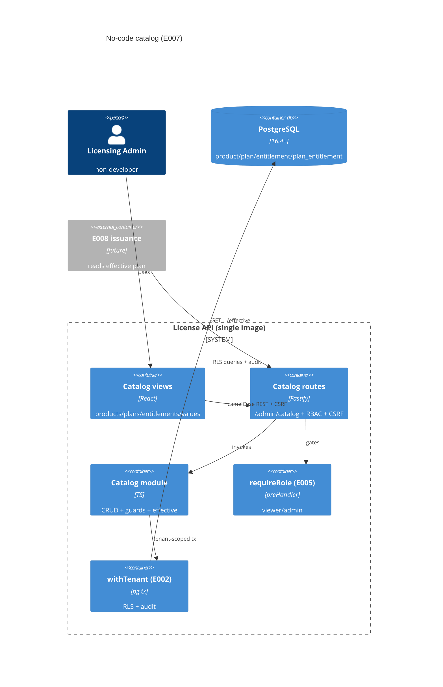

# Implementation Plan: No-Code Licensing Catalog

**Branch**: `00008-no-code-licensing-catalog` | **Date**: 2026-07-07 | **Spec**: [spec.md](spec.md)

## Summary

**Goal**: A tenant-scoped, no-code catalog — products, plans, feature entitlements (boolean / integer-limit), and per-plan values — managed through forms in the E005 console, plus an effective-plan read model for E008 issuance.
**Approach**: A new `catalog` feature module (following the E004/E005 module pattern) over four new RLS-forced tables (migration `0006`), a `/admin/catalog` REST surface reusing the E005 `requireRole` + CSRF gates and `writeAudit`, and catalog views added to the existing React admin shell.
**Key Constraint**: Every entity strictly tenant-scoped (forced RLS); all mutations audited; entitlement keys/types immutable once referenced; archive-not-delete (issued licenses stay interpretable); no ORM (raw SQL via `pg`).

## Technical Context

**Language/Version**: TypeScript 5.6 / Node 22 (ESM); React 18 (admin SPA)
**Primary Dependencies**: Fastify 5, node-postgres (`pg`) 8, Zod 3; React + Vite + React Testing Library (SPA)
**Storage**: PostgreSQL 16.4+ — four new tenant-owned tables (`product`, `plan`, `entitlement`, `plan_entitlement`) via migration `0006_catalog.sql`
**Testing**: Vitest 2 + @testcontainers/postgresql (server); Vitest + RTL/jsdom (SPA)
**Target Platform**: Linux container (single image, E006); admin SPA served same-origin
**Project Type**: web (API + React admin console)
**Project Mode**: brownfield
**Performance Goals**: catalog CRUD is low-volume admin traffic; effective-plan read is a single tenant-scoped query
**Constraints**: forced RLS tenant isolation; append-only audit; fail-closed RBAC; no-code (forms only); no Drizzle/ORM
**Scale/Scope**: modest per-tenant catalog (tens–hundreds of products/plans/entitlements)

## Instructions Check

*GATE: Must pass before Phase 0 research. Re-check after Phase 1 design.*

- **Multi-tenant isolation (ADR-0004)**: every table `PK (tenant_id, id)` + composite intra-tenant FKs + forced RLS `tenant_isolation` policy; all queries via `withTenant`. ✓
- **Fully-audited + fail-closed RBAC (E002/E005)**: every mutation `writeAudit`; `requireRole` (viewer read / admin write) + CSRF; denials → `recordSecurityEvent`. ✓
- **Tech stack (Node 22 + Fastify; `pg` + raw SQL migrations, no Drizzle; PG 16.4+; React SPA)**: `0006_catalog.sql` raw SQL; catalog module + `/admin/catalog` REST; SPA views in the E005 shell. ✓
- **Modular monolith (ADR-0005)**: new `src/server/modules/catalog/` registered at the module seam; no cross-module internal imports. ✓
- **Offline-first / single security core (Principle I/III)**: catalog does no crypto; entitlement keys only feed E001 tokens downstream. ✓
- **Source layout (`/src`)**: server module under `src/server/modules/catalog/`; SPA under `src/admin-ui/`. ✓

Re-checked post-design (Step 5.1): PASS — Policy Auditor, no violations (recorded in this plan's Compliance note).

## Architecture



## Architecture Decisions

Feature-local tradeoffs. Project-wide decisions live in ADRs (ADR-0004 tenancy, ADR-0005 modular monolith, ADR-0007 REST, ADR-0008 admin sessions) — referenced, not copied.

| ID | Decision | Options Considered | Chosen | Rationale |
|----|----------|--------------------|--------|-----------|
| AD-001 | Table naming | prefixed (`catalog_*`) / bare canonical | Bare `product`, `plan`, `entitlement`, `plan_entitlement` | Match the project-plan Shared Data Entities; not reserved words; consumed by E008/E017 |
| AD-002 | Entity IDs | uuid / opaque prefixed strings | **uuid** (`PK (tenant_id, id)`) | E002/E005 convention; the OpenAPI contract's `prd_`/`pln_` examples are illustrative only |
| AD-003 | Retirement | hard delete / soft archive | Soft `status` (active/archived); hard-delete of referenced rows refused (app guard + FK `NO ACTION`) | Already-issued licenses must stay interpretable (FR-013) |
| AD-004 | Entitlement key/type immutability | mutable / immutable once referenced | Immutable once a `plan_entitlement` references it (app-enforced, 409) | Keys embed in E001 tokens; type change would break field gating (FR-006, risk) |
| AD-005 | Per-plan value storage | JSON blob / typed columns | `bool_value` + `int_value` with DB `CHECK (num_nonnulls = 1)` + non-negative int; value↔type agreement app-enforced (a CHECK can't join `entitlement.type`) | Typed, queryable, DB-backstopped; app owns the cross-row rule |
| AD-006 | Effective-plan read model | derive in E008 / expose here | `GET /admin/catalog/plans/{id}/effective` → `{ planKey, productKey, maxActivations, entitlements:[{key,type,value}] }` | Single tenant-scoped read model E008 snapshots at issue time (FR-014) |
| AD-007 | Auth/authorization | new gate / reuse E005 | Reuse `requireRole` + CSRF double-submit + `writeAudit` | One console security model; viewer read / admin write, fail-closed (FR-011/015) |
| AD-008 | Module placement | fold into admin / new module | New `src/server/modules/catalog/` at the module seam; SPA catalog views in the E005 shell | ADR-0005 boundaries; independent testability |
| AD-009 | List response bounding | offset/cursor pagination / bounded unbounded list | **Bounded, not paginated**: `listProducts`/`listPlans`/`listEntitlements` return the full tenant-scoped set ordered by `createdAt`, up to a hard cap of 1000 items | Catalog is small (tens–hundreds); pagination is unwarranted complexity for the MVP and can be added later without breaking the shape |
| AD-010 | Archived-entity write & effective read | allow writes to archived / freeze archived | Archived plan/entitlement is read-only for new attachments (per-plan value upsert → `409 archived`); the effective-plan read model includes ONLY active entitlement attachments; an archived plan still returns its effective definition (a read) so issued licenses stay interpretable | FR-013 "excluded from active selection"; issuance must snapshot only active grants (FR-016) |

## Data Model Summary

| Entity | Key Fields | Relationships | Notes |
|--------|------------|---------------|-------|
| product | id, tenant_id, key (UNIQUE/tenant), name, status | has many plan | catalog root; archive cascades to plans |
| plan | id, tenant_id, product_id, key (UNIQUE/product), max_activations (≥1, default 1), status | → product; has many plan_entitlement | issued-against; carries seat limit |
| entitlement | id, tenant_id, key (UNIQUE/tenant), name, type (boolean/integer_limit), status | referenced by plan_entitlement | key feeds E001 tokens; key/type immutable once referenced |
| plan_entitlement | id, tenant_id, plan_id, entitlement_id, bool_value, int_value | → plan, → entitlement; UNIQUE(tenant_id,plan_id,entitlement_id) | `CHECK num_nonnulls(bool,int)=1`; value↔type app-enforced |

All tables: forced RLS `tenant_isolation` policy + `GRANT ... TO licensesrv_app`, `PK (tenant_id, id)`, composite intra-tenant FKs.
**Detail**: [data-model.md](data-model.md) · Migration: `migrations/0006_catalog.sql` (expand-only, after 0005)

## API Surface Summary

19 operations under `/admin/catalog` (session-cookie auth; GET = viewer, mutations = admin + CSRF). camelCase; errors `{code,message,details?}` (400/401/403/404/409).

| Method | Path | Purpose | Auth |
|--------|------|---------|------|
| GET/POST | /admin/catalog/products | list / create | viewer / admin |
| GET/PATCH/POST | /admin/catalog/products/{id}[/archive] | get / edit / archive | viewer / admin |
| GET/POST | /admin/catalog/products/{id}/plans | list / create plan | viewer / admin |
| GET/PATCH/POST | /admin/catalog/plans/{id}[/archive] | get / edit / archive | viewer / admin |
| GET/POST | /admin/catalog/entitlements | list / create | viewer / admin |
| GET/PATCH/POST | /admin/catalog/entitlements/{id}[/archive] | get / edit / archive | viewer / admin |
| GET | /admin/catalog/plans/{id}/entitlements | list per-plan values | viewer |
| PUT/DELETE | /admin/catalog/plans/{id}/entitlements/{eid} | set / remove value | admin |
| GET | /admin/catalog/plans/{id}/effective | effective plan definition (E008 read model) | viewer |

**Status-code conventions** (each operation lists only the codes it can return — omissions are deliberate):
- `400` appears only where there is a body or query to validate; it is intentionally ABSENT from GET-by-id and the `archive` POSTs (no request payload).
- `409` appears only on mutations that can conflict — `createProduct`/`createPlan`/`createEntitlement` (`duplicate_key`), `updateEntitlement` (`entitlement_type_locked`), and per-plan value upsert (`archived`). `updateProduct`/`updatePlan` cannot conflict (their request schemas exclude the immutable `key`, and neither has a lockable type), and reads never return `409`.
- The `setPlanEntitlementValue` upsert returns `200` for BOTH first-time attach and update (idempotent, never `201`); `removePlanEntitlement` returns `204` when the plan+entitlement exist (attachment present or already absent) and `404` only for an unknown plan/entitlement.
- A missing/invalid CSRF token on any mutation → `403 {code:"forbidden"}` (shared Forbidden response).

**Detail**: [contracts/catalog-api.openapi.yaml](contracts/catalog-api.openapi.yaml)

## Testing Strategy

| Tier | Tool | Scope | Mock Boundary | Install |
|------|------|-------|---------------|---------|
| Unit | Vitest 2 | value↔type validation (bool/int, non-negative), key-slug validation, effective-plan shaping, immutability guard logic | none (pure) | configured |
| Integration | Vitest 2 + @testcontainers/postgresql | RLS tenant isolation (A≠B), RBAC (viewer 403 + security_event / admin ok), duplicate-key 409, archive-not-delete + cascade, type-locked 409, per-plan value set/edit persists, effective-plan read, audit on every mutation | real Postgres; Fastify inject | configured |
| Component | Vitest + RTL/jsdom | catalog views render, create/edit forms, RequireRole hides admin actions from viewer, invalid-value inline error | mocked catalog API | configured |
| Security | npm audit (`--omit=dev --audit-level=high`) + semgrep (CI) | prod deps + SAST | — | configured |
| Coverage | Vitest v8 | ≥80% line+branch of the catalog module + SPA views | — | configured |

## Error Handling Strategy

| Error Category | Pattern | Response | Retry |
|----------------|---------|----------|-------|
| Validation (bad value/type/slug) | Zod at the edge | 400 `{code:"validation_error"}` field detail | no |
| Duplicate key | unique violation (23505) | 409 `{code:"duplicate_key"}` | no |
| Type change on referenced entitlement | app guard | 409 `{code:"entitlement_type_locked"}` | no |
| Attach/value on an archived plan or entitlement | app guard | 409 `{code:"archived"}` (archived entities excluded from active selection, FR-013) | no |
| Hard-delete of referenced entity (guard/backstop — no E007 route) | app guard (+ FK NO ACTION) | 409 `{code:"in_use"}` — RESERVED: archive is the only retirement path and `DELETE` plan-entitlement detaches an attachment (never a definition), so no current operation returns it; kept enumerated in the contract only so plan + contract stay consistent | no |
| Unauthenticated / forbidden / CSRF failure | requireRole + CSRF gate | 401 / 403 (+ `recordSecurityEvent` on authz or CSRF denial); a missing/invalid `X-CSRF-Token` → 403 `{code:"forbidden"}` (matches E005) | no |
| Not found / cross-tenant | RLS → 0 rows | 404 `{code:"not_found"}` (never 403 — an out-of-tenant id is indistinguishable from a missing one, no existence disclosure) | no |

## Integration Points

| Spec Reference | System/Service | Technical Approach | Contract |
|----------------|----------------|--------------------|----------|
| Assumptions (E002) | tenant repository + RLS + audit + migration harness | `withTenant`/`privileged`, `writeAudit`/`recordSecurityEvent`, `0006_catalog.sql` | in-process |
| Assumptions (E005) | console shell + session auth + RBAC + CSRF | `requireRole`, CSRF double-submit, admin SPA shell nav | `/admin` session |
| FR-014 (E008) | license issuance | `GET /admin/catalog/plans/{id}/effective` read model; E008 snapshots at issue | catalog-api.openapi.yaml |
| Assumptions (E001) | signed token feature keys | `entitlement.key` is the canonical feature key embedded in tokens | data-model.md |
| Deferred (E004) | `signing_key.product_id → product` FK | now satisfiable; documented in data-model, NOT applied in `0006` (out of scope) | data-model.md |

## Risk Mitigation

| Risk (from spec) | Likelihood | Impact | Mitigation | Owner |
|-------------------|------------|--------|------------|-------|
| Key churn after issuance | M | H | `entitlement.key` (and `product`/`plan` key) immutable once referenced; PATCH omits `key`; archive-not-delete; integration test asserts 409 on type change of a referenced entitlement | catalog module + test |
| Scope creep into dynamic rules | M | M | E007 stores static values only; effective-plan returns literal values; guarded rules deferred to E017 (excluded in scope) | spec boundary |
| Referential breakage | L | H | hard-delete of referenced rows refused (app guard + composite FK NO ACTION); archive is the retirement path; test covers archive cascade + in-use refusal | data model + test |

## Requirement Coverage Map

| Req ID | Component(s) | File Path(s) | Notes |
|--------|--------------|--------------|-------|
| FR-001 | products CRUD | src/server/modules/catalog/products.ts, routes.ts | create/list/view/edit/archive, tenant-scoped |
| FR-002 | products | products.ts, migrations/0006_catalog.sql | name + key UNIQUE per tenant |
| FR-003 | plans CRUD | src/server/modules/catalog/plans.ts, routes.ts | under a product; key UNIQUE per product |
| FR-004 | plans | plans.ts, 0006_catalog.sql | max_activations default 1, CHECK > 0 |
| FR-005 | entitlements | src/server/modules/catalog/entitlements.ts | type boolean/integer_limit; key UNIQUE per tenant |
| FR-006 | entitlements guard | entitlements.ts | type immutable once referenced → 409 |
| FR-007 | plan values | src/server/modules/catalog/values.ts | attach + set bool/int value |
| FR-008 | value validation | values.ts (Zod + type check) | type mismatch / negative → 400 |
| FR-009 | plan values | values.ts, routes.ts | edit persists immediately, no code change |
| FR-010 | all | 0006_catalog.sql (RLS), withTenant | forced RLS tenant isolation |
| FR-011 | routes RBAC | routes.ts (requireRole) | admin write / viewer read; denial → security_event |
| FR-012 | all mutations | products/plans/entitlements/values.ts (writeAudit) | actor/action/target |
| FR-013 | archive | products/plans/entitlements.ts | soft status; refuse hard delete of referenced |
| FR-014 | effective | src/server/modules/catalog/effective.ts, routes.ts | effective plan read model for E008 |
| FR-015 | SPA | src/admin-ui/src/pages/catalog/* | forms in the console shell behind RBAC |
| FR-016 | (boundary) | effective.ts / data-model | edits affect future issuance; E008 snapshots |
| FR-017 | export (P2) | src/server/modules/catalog/export.ts | declarative YAML/JSON export [DEFERRED] |

## Project Structure

### Source Code

```text
+ migrations/0006_catalog.sql                          # product/plan/entitlement/plan_entitlement + forced RLS + grants
+ src/server/modules/catalog/index.ts                  # registerCatalog (module seam) + config
+ src/server/modules/catalog/products.ts               # product CRUD + archive + audit
+ src/server/modules/catalog/plans.ts                  # plan CRUD + seat limit + archive + audit
+ src/server/modules/catalog/entitlements.ts           # entitlement CRUD + type-immutability guard + audit
+ src/server/modules/catalog/values.ts                 # plan_entitlement set/remove + value↔type validation + audit
+ src/server/modules/catalog/effective.ts              # effective plan definition (E008 read model)
+ src/server/modules/catalog/routes.ts                 # /admin/catalog REST + requireRole + CSRF
+ src/server/modules/catalog/__tests__/*.test.ts       # unit (validation/immutability/effective) + integration (RLS/RBAC/archive/dup/audit)
~ src/server/modules/index.ts                          # register registerCatalog alongside registerSigning/registerAdmin
+ src/admin-ui/src/pages/catalog/{Products,Plans,Entitlements,PlanValues}.tsx  # catalog views
+ src/admin-ui/src/pages/catalog/__tests__/*.test.tsx  # RTL component tests
~ src/admin-ui/src/api.ts                               # add catalogApi (products/plans/entitlements/values/effective)
~ src/admin-ui/src/components/Shell.tsx                 # add a "Catalog" nav tab
```

**Patterns to reuse**: `withTenant`/`privileged` (`db/client.ts`), `writeAudit`/`recordSecurityEvent` (`audit/index.ts`), `requireRole` + CSRF (`modules/admin/rbac-middleware.ts`, `csrf.ts`), the module registration seam (`modules/index.ts`), the forced-RLS migration form (`0005_admin_sessions.sql`), Zod route validation + `{code,message}` errors (`modules/admin/routes.ts`), the SPA `adminApi` client + `RequireRole` + Shell nav (`admin-ui/src`).
**Tests to extend**: none directly; new suites under `catalog/__tests__/` and `admin-ui/src/pages/catalog/__tests__/`. Root `test:cov` + SPA coverage gates unchanged.
**Naming conventions**: ESM `.js` import specifiers; `loadX`/`registerX`; tenant-scoped queries only via `withTenant`; camelCase API bodies; tests `*.unit.test.ts` / `*.integration.test.ts` / `*.test.tsx`.

## Implementation Hints

- **[HINT-001]** IDs are `uuid` (AD-002) — the OpenAPI contract's `prd_`/`pln_`/`ent_` example IDs are illustrative; implement with uuid `PK (tenant_id, id)` to match E002/E005. Update the contract examples if convenient, but uuid is authoritative.
- **[HINT-002]** The value↔type rule spans two rows (`plan_entitlement.bool_value/int_value` vs `entitlement.type`) — a SQL CHECK can't join, so `values.ts` MUST load the entitlement's type and validate agreement in-tx; the DB `CHECK (num_nonnulls(bool_value,int_value)=1)` is only a backstop.
- **[HINT-003]** Immutability + archive guards are app-enforced: PATCH bodies omit `key` (and `type`); before a type change or hard delete, check `plan_entitlement` references (`SELECT ... FOR UPDATE` where race-relevant) → 409. Composite FKs (`NO ACTION`) are the DB backstop.
- **[HINT-004]** Archive is a `status` update, not a delete; product archive should cascade to its plans in one tx. `?status=active|archived|all` filters lists; default active.
- **[HINT-005]** The effective-plan read model is the E008 seam — keep it a pure tenant-scoped read returning literal values (`{planKey,productKey,maxActivations,entitlements:[{key,type,value}]}`); no computed/dynamic logic (that's E017). Include ONLY active entitlement attachments (filter out archived entitlements / detached bindings) so issuance snapshots only active grants (AD-010); an archived plan still resolves (it's a read, for interpreting already-issued licenses).
- **[HINT-006]** Per-plan value upsert (`PUT`) is idempotent, keyed by `(plan_id, entitlement_id)` — return 200 for both insert and update. Before writing, verify BOTH the plan and the entitlement are `active`; refuse an attach/value against an archived plan or entitlement with `409 {code:"archived"}` (AD-010). List reads are bounded (AD-009): `ORDER BY created_at` with a `LIMIT 1000`, no pagination.
