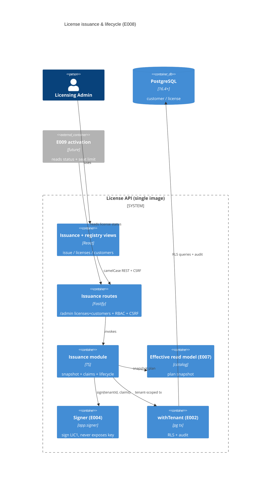

# Implementation Plan: License Issuance and Lifecycle

**Branch**: `00009-license-issuance-and-lifecycle` | **Date**: 2026-07-08 | **Spec**: [spec.md](spec.md)

## Summary

**Goal**: Issue signed, offline-verifiable licenses under a plan for a customer, and manage their lifecycle (revoke / suspend / reinstate / transfer), tenant-scoped and audited.
**Approach**: A new `issuance` feature module over two RLS-forced tables (migration `0007`). Issuance snapshots E007's effective-plan read model into a license, builds the E001 `Claims`, and signs via E004's published `Signer` (consumed through an `app.signer` DI decorator) to produce a `LIC1` token — the signer conformance-verifies before return and the private key is never exposed. Lifecycle is an app-enforced state machine; the `/admin` REST reuses the shared console RBAC + CSRF + audit.
**Key Constraint**: Snapshot at issue (catalog edits never mutate an issued license); signing key never exposed; issuance p95 < 1s incl. signing; strict tenant isolation + append-only audit; no ORM.

## Technical Context

**Language/Version**: TypeScript 5.6 / Node 22 (ESM); React 18 (admin SPA)
**Primary Dependencies**: Fastify 5, node-postgres (`pg`) 8, Zod 3; the E004 in-process `Signer` + E001 `Claims`/token encoder (via the E003 WASM conformance oracle); React + Vite + RTL (SPA)
**Storage**: PostgreSQL 16.4+ — two new tenant-owned tables (`customer`, `license`) via migration `0007_licensing.sql`
**Testing**: Vitest 2 + @testcontainers/postgresql (server; issuance path provisions an E004 signing key + unlocks custody); Vitest + RTL/jsdom (SPA)
**Target Platform**: Linux container (single image, E006); admin SPA same-origin
**Project Type**: web (API + React admin console)
**Project Mode**: brownfield
**Performance Goals**: issuance p95 < 1s including Ed25519 sign + WASM conformance verify (FR-017)
**Constraints**: point-in-time snapshot; signing key never exposed; forced-RLS tenant isolation; append-only audit; fail-closed RBAC; no Drizzle/ORM
**Scale/Scope**: modest admin-issued volume; issuance is a tier-0 latency path

## Instructions Check

*GATE: Must pass before Phase 0 research. Re-check after Phase 1 design.*

- **Offline-first crypto (Principle I)**: the license is an Ed25519-signed `LIC1` token in the E001 format, conformance-verified by the signer before return; no crypto reimplemented (issuance consumes the E004 `Signer`; verification is the E001 core). Signing key never exposed (FR-003/SC-010). ✓
- **Multi-tenant isolation (ADR-0004)**: `customer`/`license` `PK (tenant_id, id)` + composite intra-tenant FKs + forced RLS; all queries via `withTenant`. ✓
- **Fully-audited + fail-closed RBAC (E002/E005)**: every issuance/lifecycle action `writeAudit`; shared console `requireRole` (viewer read / admin write) + CSRF. ✓
- **Tech stack (Node 22 + Fastify; `pg` + raw SQL migration 0007, no Drizzle; PG 16.4+; React SPA)**: ✓
- **Modular monolith (ADR-0005)**: new `src/server/modules/issuance/` at the module seam; consumes E004's published `Signer` (project-plan Shared Artifact Surface) + E007's effective read model + the shared `src/server/console/` RBAC — no import of another module's `internal/`. ✓
- **PII/GDPR**: customers pseudonymous, minimal PII; erasure anonymizes when licensed, else hard-deletes (FR-019). ✓
- **Source layout (`/src`)**: server module under `src/server/modules/issuance/`; SPA under `src/admin-ui/`. ✓

Re-checked post-design (Step 5.1): PASS — Policy Auditor, no violations (recorded in analysis-report at analyze time).

## Architecture



## Architecture Decisions

Feature-local tradeoffs. Project-wide decisions live in ADRs (ADR-0001 token format, ADR-0003 key custody, ADR-0004 tenancy, ADR-0005 modular monolith, ADR-0007 REST) — referenced, not copied.

| ID | Decision | Options Considered | Chosen | Rationale |
|----|----------|--------------------|--------|-----------|
| AD-001 | Module placement | fold into catalog / new module | New `src/server/modules/issuance/` at the seam | Owns license+customer+lifecycle; ADR-0005 boundaries |
| AD-002 | Signer consumption | import+construct signer / DI via app / promote to shared | E004 exposes its `Signer` via an `app.signer` decorator (set in `registerSigning`, like `signerReady`); E008 builds `Claims` and calls `signer.sign(tenantId, claims)` | Single-sourced signing + conformance in E004; created once (one custody unlock); no key exposure; `Signer`/`Claims` are E004's published contract (project-plan), consumed by type-import (non-internal, lint-legal) |
| AD-003 | Plan snapshot source | E008 reads catalog tables / consume E007 read model | Consume E007 `getEffectivePlanDefinition` (the designated E008 seam), **extended to also return `productId` + `planId`** (needed for the token claims + signer key lookup) | E007 owns the catalog; extension is small + backward-compatible; keeps E008 off the catalog tables |
| AD-004 | Snapshot storage | reference-only / copy | Copy `entitlements` (jsonb map) + `max_activations` into the license at issue; product/plan FKs are provenance-only | FR-002/006: catalog edits never mutate an issued license |
| AD-005 | Lifecycle | DB triggers / app state machine | App-enforced state machine in one tenant tx (load `FOR UPDATE` → validate transition → update + audit) | active↔suspended, active/suspended→revoked terminal; invalid → 409 `invalid_transition`; revoke idempotent (FR-007/008/010) |
| AD-006 | Transfer limit | hard-coded / configurable | `transfer_count` column + `IssuanceConfig.transferLimit` (env, default 3); exceed → 409 `transfer_limit_exceeded` | FR-009 configurable default |
| AD-007 | Customer erasure (GDPR) | hard-delete / anonymize | DELETE anonymizes (null name/email, status `anonymized`) when the customer holds licenses; hard-deletes otherwise (FK NO ACTION backstop) | FR-019 deletability without orphaning issued licenses |
| AD-008 | Auth/authorization | new gate / reuse shared console | Reuse `src/server/console/requireRole` + CSRF + `writeAudit` (viewer read / admin write, fail-closed) | One console security model (FR-014/016) |
| AD-009 | Claims construction | inline in routes / dedicated builder | A `claims.ts` builder maps the license snapshot → E001 `Claims` (tokenVersion const, ids, issuedAt=now, expiresAt from term, maxActivations, entitlements map, random nonce; `keyId` stamped by the signer) | Testable pure mapping; token contract in one place |
| AD-010 | Issuance latency | async job / synchronous | Synchronous sign on the request path (in-process Ed25519 + WASM conformance verify) | p95 < 1s achievable in-process (FR-017); no queue complexity |

## Data Model Summary

| Entity | Key Fields | Relationships | Notes |
|--------|------------|---------------|-------|
| customer | id, tenant_id, ref (UNIQUE/tenant), name?, email?, status(active/anonymized) | has many license | pseudonymous, minimal PII; erasure anonymizes-if-licensed (FR-019) |
| license | id, tenant_id, product_id, plan_id, customer_id, status(active/suspended/revoked), issued_at, expires_at?, max_activations (snapshot), entitlements jsonb (snapshot), key_id, token_version, nonce, transfer_count, license_token | → product, plan, customer (composite FKs) | point-in-time snapshot; signed LIC1 token; lifecycle state machine |

All tables: forced RLS `tenant_isolation` + `GRANT ... TO licensesrv_app`, `PK (tenant_id, id)`, composite intra-tenant FKs.
**Detail**: [data-model.md](data-model.md) · Migration: `migrations/0007_licensing.sql` (expand-only, after 0006)

## API Surface Summary

13 operations under `/admin` (session-cookie auth; GET = viewer, mutations = admin + CSRF). camelCase; errors `{code,message,details?}`. The signed license key (public token) is returned by issue/reissue/`/key`; the signing key is never returned.

| Method | Path | Purpose | Auth |
|--------|------|---------|------|
| GET/POST | /admin/customers | list / create (409 duplicate_ref) | viewer / admin |
| GET/DELETE | /admin/customers/{id} | get / erase (GDPR anonymize-or-delete) | viewer / admin |
| POST | /admin/licenses | issue 201 (400/404/409 plan_not_issuable/503 signer_unavailable) | admin |
| GET | /admin/licenses[?status,customerId,planId] | registry list | viewer |
| GET | /admin/licenses/{id}[/key] | metadata / retrieve signed key | viewer |
| POST | /admin/licenses/{id}/{revoke,suspend,reinstate,transfer,reissue} | lifecycle (409 invalid_transition / transfer_limit_exceeded) | admin |

**Detail**: [contracts/licensing-api.openapi.yaml](contracts/licensing-api.openapi.yaml)

## Testing Strategy

| Tier | Tool | Scope | Mock Boundary | Install |
|------|------|-------|---------------|---------|
| Unit | Vitest 2 | claims builder (snapshot → E001 Claims), state-machine transition validation, transfer-limit logic, entitlements map shaping | none (pure) | configured |
| Integration | Vitest 2 + @testcontainers/postgresql | issue → signed LIC1 returned + verifies offline via the core; snapshot immutable after catalog edit; revoke/suspend/reinstate/transfer + invalid-transition 409; transfer-limit 409; archived-plan 409; signer-unavailable 503; RLS isolation (A≠B); RBAC (viewer 403 + security_event); customer erasure; audit on every action | real Postgres; the issuance test provisions an E004 product signing key + unlocks custody | configured |
| Component | Vitest + RTL/jsdom | issuance form, registry list + key retrieval, customer create; RequireRole hides admin actions; signer-unavailable + invalid-transition inline errors | mocked licensingApi | configured |
| Performance | Vitest (timed integration) | issuance latency assertion — a single issue (snapshot + sign + WASM conformance verify + insert) completes well under the 1s budget; coarse p95 proxy (FR-017) | real Postgres + unlocked signer | configured |
| Lint / boundaries | ESLint (`eslint src/server`, incl. the module-boundary rule) | issuance + console sources; confirms no cross-module `internal/` import | — | configured |
| Security | npm audit (`--omit=dev --audit-level=high`) + semgrep (CI) | prod deps + SAST; assert no signing-key material in any response/log | — | configured |
| Coverage | Vitest v8 | ≥80% line+branch of the issuance module + SPA views | — | configured |

## Error Handling Strategy

| Error Category | Pattern | Response | Retry |
|----------------|---------|----------|-------|
| Validation (bad body/uuid) | Zod at the edge | 400 `{code:"validation_error"}` | no |
| Unknown plan/customer/license | RLS → 0 rows | 404 `{code:"not_found"}` | no |
| Duplicate customer ref | unique violation (23505) | 409 `{code:"duplicate_ref"}` | no |
| Archived plan/entitlement at issue | app guard | 409 `{code:"plan_not_issuable"}` | no |
| Invalid lifecycle transition | state-machine guard | 409 `{code:"invalid_transition"}` | no |
| Transfer over limit | app guard | 409 `{code:"transfer_limit_exceeded"}` | no |
| Signer unavailable (no active key / locked) | `SignerError` (no-active-key / unavailable) | 503 `{code:"signer_unavailable"}`; no license created | operator provisions/unlocks key |
| Unauthenticated / forbidden | requireRole | 401 / 403 (+ `recordSecurityEvent` on authz denial) | no |

## Integration Points

| Spec Reference | System/Service | Technical Approach | Contract |
|----------------|----------------|--------------------|----------|
| Assumptions (E004) | signing service | consume the published `Signer` via `app.signer` (decorator set in `registerSigning`); `signer.sign(tenantId, claims)` → `LIC1`; key never exposed | `modules/signing/signer.ts` |
| Assumptions (E007) | catalog effective read model | import `getEffectivePlanDefinition` (extended to return `productId`+`planId`); snapshot entitlements + seat limit | `modules/catalog/effective.ts` |
| Assumptions (E001) | token format | build `Claims` (`modules/signing/token.ts` type); the signer emits the byte-exact `LIC1` conformance-verified against the E003 WASM core | `modules/signing/token.ts` |
| Assumptions (E002/E005) | tenancy + console auth | `withTenant`, `writeAudit`/`recordSecurityEvent`, shared `console/requireRole` + CSRF | in-process / `/admin` session |
| FR-013 (E009) | activation | E009 reads `license.status` + `max_activations` before activating | data-model |
| Downstream (E013/E014) | enforcement / billing | consume license lifecycle + status | data-model |

## Risk Mitigation

| Risk (from spec) | Likelihood | Impact | Mitigation | Owner |
|-------------------|------------|--------|------------|-------|
| Signing-key unavailability | M | H | fail-closed 503 `signer_unavailable` with no partial license; surface the prerequisite (active key + unlocked signer) in the flow; the signer already fails closed (`SignerError`) | issuance module + test |
| Offline revocation gap | H | M | disclosed MVP limitation; revoke sets server status (E009 refuses activation); mitigated later by short-TTL + online renewal (E013); documented, not hidden | spec/docs |
| Snapshot-semantics confusion | M | L | license stores an immutable snapshot; integration test proves a post-issue catalog edit does not change the license; reissue (P2) for key rotation | data model + test |

## Requirement Coverage Map

| Req ID | Component(s) | File Path(s) | Notes |
|--------|--------------|--------------|-------|
| FR-001 | issue | src/server/modules/issuance/licenses.ts, routes.ts | issue under active product+plan for a customer, term |
| FR-002 | snapshot | licenses.ts, claims.ts, migrations/0007 | entitlements+seat+ids+expiry snapshot into license |
| FR-003 | sign | claims.ts + app.signer; routes.ts | LIC1 via E004 signer; key never returned |
| FR-004 | issue guard | licenses.ts | require active key + unlocked signer → 503 else |
| FR-005 | issue guard | licenses.ts (effective read model active-only) | no archived plan/entitlement |
| FR-006 | snapshot | licenses.ts, effective.ts | edits after issue don't change the license |
| FR-007 | lifecycle | src/server/modules/issuance/lifecycle.ts | revoke terminal + idempotent |
| FR-008 | lifecycle | lifecycle.ts | suspend/reinstate |
| FR-009 | lifecycle | lifecycle.ts | transfer + transfer limit |
| FR-010 | lifecycle | lifecycle.ts | state machine; invalid → 409 |
| FR-011 | customers | src/server/modules/issuance/customers.ts, routes.ts | register/list customers |
| FR-012 | registry | licenses.ts, routes.ts | list + retrieve key |
| FR-013 | status | licenses.ts | expose status for E009/E013 |
| FR-014 | audit | customers/licenses/lifecycle.ts (writeAudit) | every action audited |
| FR-015 | RLS | migrations/0007, withTenant | tenant isolation |
| FR-016 | RBAC | routes.ts (console requireRole) | admin write / viewer read; denial → security_event |
| FR-017 | perf | licenses.ts, claims.ts | synchronous in-process sign; p95<1s |
| FR-018 | reissue (P2) | lifecycle.ts (reissue) | re-sign same terms [DEFERRED] |
| FR-019 | erasure | customers.ts | anonymize-if-licensed else hard-delete |

## Project Structure

### Source Code

```text
+ migrations/0007_licensing.sql                          # customer + license tables + forced RLS + grants + indexes
+ src/server/modules/issuance/index.ts                   # registerIssuance (module seam) + IssuanceConfig (transferLimit)
+ src/server/modules/issuance/claims.ts                  # snapshot → E001 Claims builder (pure)
+ src/server/modules/issuance/customers.ts               # customer register/list/get/erase (GDPR) + audit
+ src/server/modules/issuance/licenses.ts                # issue (snapshot+sign+store), list, get, get-key + audit
+ src/server/modules/issuance/lifecycle.ts               # revoke/suspend/reinstate/transfer/reissue state machine + audit
+ src/server/modules/issuance/routes.ts                  # /admin customers+licenses REST + requireRole + CSRF
+ src/server/modules/issuance/__tests__/*.test.ts        # unit (claims/state-machine) + integration (issue-sign/lifecycle/RLS/RBAC/audit)
~ src/server/modules/index.ts                            # register registerIssuance alongside signing/admin/catalog
~ src/server/modules/signing/index.ts                    # add app.decorate("signer", module.signer) — the E008/E010 seam
~ src/server/modules/catalog/effective.ts                # extend getEffectivePlanDefinition to also return productId + planId
+ src/admin-ui/src/pages/licensing/{Issue,Licenses,Customers}.tsx  # issuance + registry + customer views
+ src/admin-ui/src/pages/licensing/__tests__/*.test.tsx  # RTL component tests
~ src/admin-ui/src/api.ts                                # add licensingApi (customers + licenses + lifecycle)
~ src/admin-ui/src/components/Shell.tsx                  # add a "Licensing" nav tab
```

**Patterns to reuse**: `withTenant`/`privileged` (`db/client.ts`), `writeAudit`/`recordSecurityEvent` (`audit/index.ts`), the shared console `requireRole` + CSRF (`src/server/console/`), the module seam (`modules/index.ts`), the forced-RLS migration form (`0006_catalog.sql`), Zod route validation + `{code,message}` errors + the `guard()` CatalogError→HTTP pattern (`modules/catalog/routes.ts`), the E004 `Signer`/`Claims` contract (`modules/signing/{signer,token}.ts`), the SPA `catalogApi`/`RequireRole`/Shell nav (`admin-ui/src`).
**Tests to extend**: none directly; new suites under `issuance/__tests__/` and `admin-ui/src/pages/licensing/__tests__/`. The `getEffectivePlanDefinition` id-extension is covered by an added case in the catalog effective test.
**Naming conventions**: ESM `.js` specifiers; `loadX`/`registerX`; tenant-scoped queries only via `withTenant`; camelCase API bodies; tests `*.unit.test.ts` / `*.integration.test.ts` / `*.test.tsx`.

## Implementation Hints

- **[HINT-001]** Signer seam: `registerSigning` runs before `registerIssuance` in the `MODULES` array, so `registerIssuance` can read `app.signer` (decorated by `registerSigning`). Pass it to the issuance service; never construct a second signer (that would double-unlock custody).
- **[HINT-002]** The signer stamps `claims.keyId` (it selects the product's active key). Pass a mutable `Claims` object to `sign()` and record `claims.keyId` into `license.key_id` after signing; store the returned token in `license.license_token`. The signer conformance-verifies before return, so a returned token is already valid.
- **[HINT-003]** Snapshot mapping: `getEffectivePlanDefinition` returns `entitlements:[{key,type,value}]`; fold to a `{key: value}` map for BOTH the `license.entitlements` jsonb column and the token `ent` map. Extend the read model to return `productId`+`planId` (claims + signer key lookup need the ids, not just keys).
- **[HINT-004]** Lifecycle in one tenant tx: `SELECT ... FOR UPDATE` the license, validate the transition against the state machine, `UPDATE` + `writeAudit`. Revoke is idempotent (revoking a revoked license is a no-op 200). Transfer checks `transfer_count < transferLimit`, increments, and reassigns `customer_id`.
- **[HINT-005]** Signer-unavailable maps to 503: catch `SignerError` (`no-active-key`/`unavailable`) → `503 signer_unavailable`, having created NO license (do the sign inside the issue tx, or sign-then-insert so a signer fault rolls back / never inserts).
```
