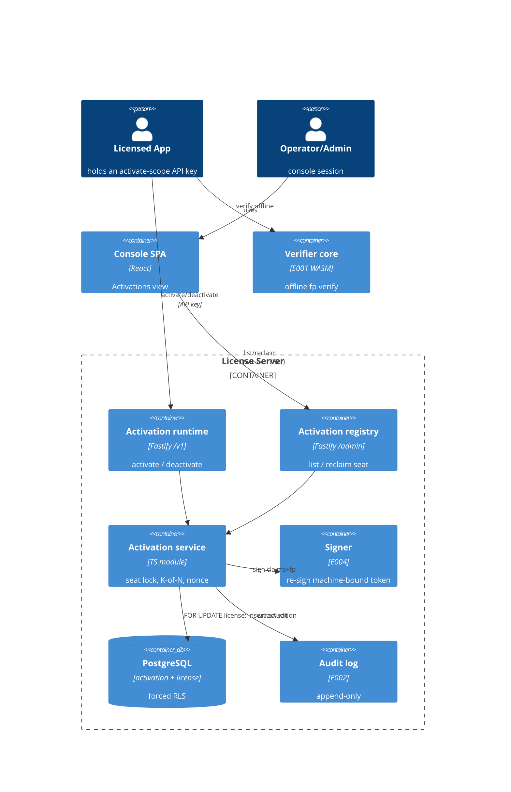

# Implementation Plan: Machine Activation & Seat Enforcement

**Branch**: `00010-machine-activation-and-seats` | **Date**: 2026-07-13 | **Spec**: [spec.md](spec.md)

## Summary

**Goal**: Bind an issued license to a machine via a drift-tolerant fingerprint, enforce the plan's seat limit race-safely, and let seats be freed by deactivation — the bound credential still verifies fully offline.
**Approach**: A new `activation` server module exposes a runtime `/v1/activations` surface (API-key `activate` scope) that snapshots the E008 license, matches a K-of-N fingerprint, consumes a seat under a per-license row lock, and re-signs a machine-bound LIC1 token via the E004 signer; an admin registry surfaces seat usage under the console session.
**Key Constraint**: Race-safe seat counting (exactly S concurrent successes for S free seats) and PII minimization (store only salted signal hashes).

## Technical Context

**Language/Version**: TypeScript 5.6 / Node 22 (ESM)
**Primary Dependencies**: Fastify 5, pg 8, Zod 3, node:crypto; E001 verifier-core (WASM); @fastify/rate-limit (new); React 18 + Vite (SPA)
**Storage**: PostgreSQL 16 (raw-SQL migrations, no ORM)
**Testing**: Vitest 2 + @testcontainers/postgresql; React Testing Library (SPA)
**Target Platform**: Linux server (container) + same-origin SPA
**Project Type**: web (server + admin SPA)
**Project Mode**: brownfield
**Performance Goals**: single activation well under 1s; seat count/insert O(seat-limit) under a bounded lock
**Constraints**: offline-verifiable machine-bound credential; forced RLS tenant isolation; no raw hardware identifiers stored/logged; append-only audit
**Scale/Scope**: bounded registry lists (cap 1000); seat limits are per-license `max_activations`

## Instructions Check

*GATE: Must pass before Phase 0 research. Re-check after Phase 1 design.*

- **Offline-first, key never exposed (I)**: PASS — machine-bound credential verifies offline via the E001 core; only the public LIC1 token is returned; signing stays in the E004 `app.signer`.
- **Multi-tenant isolation + RBAC (II)**: PASS — `activation` gets forced RLS + `tenant_isolation` (migration 0008); runtime plane gated on the `activate` API-key scope, admin plane on console RBAC + CSRF.
- **Single security core + append-only audit (III)**: PASS — reuses the E001 core (no new crypto); every activation/deactivation/denied attempt `writeAudit` (append-only).
- **PII minimization / anti-replay / rate-limit**: PASS — only salted signal hashes stored (FR-006); single-use nonce (FR-009); `@fastify/rate-limit` on the runtime surface (FR-013).
- **Raw-SQL migration, no ORM, `/src` layout**: PASS — additive migration `0008_activation.sql`; new module under `src/server/modules/activation/`.

No violations → no Complexity Tracking section.

## Architecture



## Architecture Decisions

| ID | Decision | Options Considered | Chosen | Rationale |
|----|----------|--------------------|--------|-----------|
| AD-001 | Fingerprint match model | exact full-set hash / K-of-N set overlap / server-side hashing | Store N per-signal salted hashes + a canonical `machine_id`; match a returning machine by signal-hash overlap ≥ K (default 3-of-5) among the license's active activations | Tolerates minor drift (FR-005); `machine_id` gives the active-uniqueness index + exact fast path |
| AD-002 | Race-safe seat counting | advisory xact lock / `SELECT … FOR UPDATE` on license / serializable retry | `SELECT … FOR UPDATE` on the `license` row, then count active activations and insert if `< max_activations`, all in one tx | Reuses the proven E008 lifecycle lock; serializes per-license so exactly S succeed (FR-003/SC-002) |
| AD-003 | Machine-bound credential | re-sign a LIC1 token with fp/fpk/sk / separate activation certificate | Re-sign the E008 license snapshot as a LIC1 token via `app.signer`, populating `fingerprint`=signal hashes, `fpMin`=K, `maxSkewSecs`=config, fresh nonce | E001 core already verifies fp/fpk/sk offline — zero new crypto (FR-007) |
| AD-004 | Fingerprint hashing location | client-side salted hash / server-side hash of raw signals | Client computes per-signal salted hashes with a shared, offline-available activation salt (a per-tenant/per-product server-provisioned secret, distributed to the SDK, rotatable — rotation invalidates prior fingerprints → re-activation, FR-019); server stores/compares hashes only | Server never receives raw hardware IDs (FR-006/SC-011); client recomputes the same hashes to verify offline |
| AD-005 | Nonce anti-replay + idempotency | separate nonce store / row-local unique nonce | `UNIQUE (tenant_id, nonce)` on `activation`; first use inserts, same-nonce retry returns the recorded activation, nonce reused for a different machine → rejected | Store-and-replay in one row; satisfies the nonce non-negotiable + idempotent retry (FR-009/SC-010) |
| AD-006 | Deactivation model | hard delete / soft status flip | Soft flip `active→deactivated` + `deactivated_at`; row retained; partial-unique `(license_id, machine_id) WHERE active` allows reactivation | Preserves registry history + audit; frees the seat (FR-010/FR-011) |
| AD-007 | Runtime auth | new api-key middleware / reuse existing `req.tenant` plane | Mount under `/v1`, reuse the app.ts API-key context (`req.tenant`), gate on `scopes.includes("activate")` (mirrors signing's `requireAdmin`); admin registry reuses console `requireRole` + CSRF | The runtime plane already exists (see ADR-0007); no new auth infra |
| AD-008 | Rate limiting | hand-rolled / `@fastify/rate-limit` | `@fastify/rate-limit` (in-memory) scoped to BOTH runtime activation routes (activate + deactivate), keyed per API key + per license; over-limit → `429 rate_limited` + `Retry-After`, audited (FR-020); default 60 req/min per API-key+license | Idiomatic, single-install; distributed store (Redis) deferred to scale-out |
| AD-009 | Registry list bound | keyset pagination / bounded cap | Bounded cap 1000, not paginated | Reuses E008 registry convention (AD-009); seat counts are small |

## Data Model Summary

| Entity | Key Fields | Relationships | Notes |
|--------|------------|---------------|-------|
| activation | `(tenant_id, id)` PK; `license_id`, `machine_id` (salted hash), `signal_hashes[]`, `fp_min`, `status` active\|deactivated, `nonce`, `machine_bound_token`, `label?`, `activated_at`/`deactivated_at` | composite FK `(tenant_id, license_id) → license` | partial UNIQUE `(tenant_id, license_id, machine_id) WHERE active`; UNIQUE `(tenant_id, nonce)`; forced RLS; seat usage = count(active) |
| license (E008, consumed) | `status`, `max_activations`, `expires_at`, `entitlements`, ids | referenced by activation | seat cap + claim snapshot; must be `active` to activate |

**Detail**: [data-model.md](data-model.md) · migration `migrations/0008_activation.sql`

## API Surface Summary

| Method | Path | Purpose | Auth | Req/Res Types |
|--------|------|---------|------|---------------|
| POST | `/v1/activations` | Activate: K-of-N bind, race-safe seat consume, return machine-bound credential; idempotent on drift/nonce | Runtime API key + `activate` scope; rate-limited | `ActivateRequest` → 201/200 `ActivationResult`; 409 `seat_limit_reached`/`nonce_replayed`/`license_not_active`, 404 `license_not_found`, 400 `insufficient_signals`, 429 `rate_limited` (+Retry-After), 503 `signer_unavailable` |
| DELETE | `/v1/activations/{activationId}` | App deactivates its own machine (frees seat); idempotent | Runtime API key + `activate` scope; rate-limited | → 204; 404 `not_found`, 429 `rate_limited` (+Retry-After) |
| GET | `/admin/licenses/{licenseId}/activations` | Registry: machines, status, timestamps, seats-used/limit (no credential/signals) | Console session, RBAC viewer+ | → 200 `ActivationRegistry` |
| POST | `/admin/licenses/{licenseId}/activations/{activationId}/deactivate` | Operator/admin reclaim a seat; idempotent | Console session, RBAC admin+, CSRF | → 200 `DeactivationResult`; 403 `forbidden` |

**Detail**: [contracts/activation-api.openapi.yaml](contracts/activation-api.openapi.yaml)

## Testing Strategy

| Tier | Tool | Scope | Mock Boundary | Install |
|------|------|-------|---------------|---------|
| Unit | Vitest 2 | K-of-N match, claims+fp builder, seat/nonce logic | none (pure) | configured |
| Integration | Vitest 2 + @testcontainers/postgresql | activate/seat-race/deactivate/registry/RLS + offline verify via E001 WASM; concurrency test | real Postgres; real core | configured |
| Security | npm audit (`--omit=dev --audit-level=high`) + semgrep (CI) | deps + issuance/activation/console/SPA | — | configured (semgrep in CI) |
| Coverage | v8 (Vitest) | ≥80% line+branch, activation module + SPA view | — | configured |

## Error Handling Strategy

| Error Category | Pattern | Response | Retry |
|----------------|---------|----------|-------|
| Validation (Zod / too-few signals) | fail-fast | 400 `validation_error` / `insufficient_signals` | no |
| Auth (missing/insufficient scope, RBAC, CSRF) | fail-closed + audit security event | 401 `unauthorized` / 403 `forbidden` | no |
| Seat/lifecycle conflict | fail-fast, no partial write | 409 `seat_limit_reached` (details seatsUsed/limit) / `nonce_replayed` / `license_not_active` | no |
| Not found / cross-tenant | RLS-scoped lookup | 404 `license_not_found` / `not_found` | no |
| Rate limit exceeded (per API-key+license) | fail-fast + audit limit-exceeded event | 429 `rate_limited` (with `Retry-After`) | yes (after window) |
| Signer unavailable | fail-closed, no seat consumed | 503 `signer_unavailable` | yes (client retry) |

## Integration Points

| Spec Reference | System/Service | Technical Approach | Contract |
|----------------|----------------|--------------------|----------|
| License must be active; seat cap | E008 licensing | import `getLicense` (non-internal) for the snapshot + `status`/`max_activations`; read-only | src/server/modules/issuance/licenses.ts |
| Offline machine-bound verify | E001 verifier-core | re-signed LIC1 carries fp/fpk/sk; core verifies offline (tests use the WASM core) | src/server/modules/signing/token.ts |
| Sign the machine-bound token | E004 signer | consume `app.signer` (decorated for E008); `sign(tenantId, claims)` | src/server/modules/signing/signer.ts |
| Runtime auth + admin RBAC | E005 api-key/console | `req.tenant` (`activate` scope) for `/v1`; `requireRole` + CSRF for `/admin` | src/server/auth/apikey.ts, src/server/console/ |
| Tenant isolation + audit + migration | E002 tenancy | `withTenant`, forced RLS, `writeAudit`, advisory-locked migration runner | src/server/db/, migrations/ |

## Risk Mitigation

| Risk (from spec) | Likelihood | Impact | Mitigation | Owner |
|-------------------|------------|--------|------------|-------|
| Fingerprint instability exhausts seats via false new-machine activations | M | H | K-of-N tolerance (default 3-of-5), configurable K/N, operator-visible reclaim | activation module |
| Seat-count race over-allocates under concurrency | M | H | `SELECT … FOR UPDATE` on license row + partial-unique active index backstop; dedicated concurrency integration test | activation module |
| Offline revocation lag — revoked license's activated machines verify until token expiry | H | M | Accepted offline-first tradeoff; credential carries license expiry; online propagation is E013 | documented |

## Requirement Coverage Map

| Req ID | Component(s) | File Path(s) | Notes |
|--------|--------------|--------------|-------|
| FR-001 | activate service + route | src/server/modules/activation/activate.ts, routes.ts | submit signals → bind activation |
| FR-002 | runtime auth guard | src/server/modules/activation/routes.ts | `req.tenant` + `activate` scope, fail-closed |
| FR-003 | seat lock | src/server/modules/activation/activate.ts | FOR UPDATE license + count < max_activations |
| FR-004 | seat refusal | src/server/modules/activation/activate.ts | 409 seat_limit_reached, no write |
| FR-005 | K-of-N match | src/server/modules/activation/fingerprint.ts | overlap ≥ K, default 3-of-5 |
| FR-006 | hashes only | fingerprint.ts, migrations/0008_activation.sql | signal_hashes[]; no raw IDs |
| FR-007 | machine-bound credential | src/server/modules/activation/claims.ts + app.signer | re-sign fp/fpk/sk; offline verify (E001) |
| FR-008 | license-state guard | src/server/modules/activation/activate.ts | refuse suspended/revoked/expired |
| FR-009 | nonce anti-replay | activate.ts + UNIQUE(tenant_id,nonce) | store-and-replay |
| FR-010 | deactivate (app+admin) | src/server/modules/activation/deactivate.ts, routes.ts | runtime DELETE + admin reclaim |
| FR-011 | idempotent deactivate | src/server/modules/activation/deactivate.ts | already-deactivated/unknown → no-op |
| FR-012 | registry | src/server/modules/activation/registry.ts + SPA | list + seats-used/limit, RBAC |
| FR-013 | rate limit | src/server/modules/activation/routes.ts | @fastify/rate-limit on /v1 |
| FR-014 | audit | activate.ts, deactivate.ts | append-only writeAudit, no PII |
| FR-015 | tenant isolation | migrations/0008_activation.sql | forced RLS + withTenant |
| FR-016 | min-signals guard | src/server/modules/activation/fingerprint.ts | refuse < min signals |
| FR-017 | CSRF guard | src/server/console/, src/server/modules/activation/routes.ts | double-submit token on admin mutate; fail-closed 403 + security-event audit |
| FR-018 | signing-key non-exposure | src/server/modules/activation/claims.ts, signing/signer.ts | only public LIC1 + key id returned; key never logged/returned/audited |
| FR-019 | activation salt provisioning/rotation | src/server/modules/activation/index.ts (config), fingerprint.ts | per-tenant/product salt, SDK-distributed, rotatable → re-activation |
| FR-020 | rate limit (per key+license) | src/server/modules/activation/routes.ts | @fastify/rate-limit on /v1 activate+deactivate; 429 rate_limited + Retry-After; audited |
| FR-021 | nonce entropy + TTL | activate.ts + UNIQUE(tenant_id,nonce) | ≥128-bit single-use nonce; bounded 24h replay-rejection window |
| FR-022 | credential TTL reconciliation | src/server/modules/activation/claims.ts | effective exp = min(license exp, credential TTL) |
| FR-023 | license-lifecycle coupling | src/server/modules/activation/activate.ts | live status gates NEW activations only; existing rows never auto-deactivated (offline-first tradeoff) |
| FR-024 | referential integrity | migrations/0008_activation.sql | composite FK `ON DELETE NO ACTION`/RESTRICT — no hard-delete of a license with activations |

## Project Structure

### Source Code

```text
+ migrations/0008_activation.sql
+ src/server/modules/activation/index.ts          # registerActivation, config (K/N, skew, nonce TTL, rate)
+ src/server/modules/activation/activate.ts        # seat lock + K-of-N + sign + nonce (fail-closed)
+ src/server/modules/activation/deactivate.ts      # soft flip, idempotent
+ src/server/modules/activation/fingerprint.ts     # K-of-N match, salted-hash helpers
+ src/server/modules/activation/claims.ts          # license snapshot → machine-bound claims (fp/fpk/sk)
+ src/server/modules/activation/registry.ts        # list + seat tally
+ src/server/modules/activation/routes.ts          # /v1 runtime + /admin registry
+ src/server/modules/activation/__tests__/         # unit + integration (Testcontainers + WASM core)
~ src/server/modules/index.ts                      # register activation (after issuance)
+ src/admin-ui/src/pages/licensing/Activations.tsx # per-license registry + reclaim
~ src/admin-ui/src/pages/licensing/Licenses.tsx    # link to a license's activations
~ src/admin-ui/src/api.ts                          # activationApi (runtime is app-side; admin registry here)
+ src/admin-ui/src/pages/licensing/__tests__/activations.test.tsx
+ .github/workflows/activation.yml
```

**Patterns to reuse**: E008 issuance (fail-closed sign-before-write, `withTenant` + FOR UPDATE lock, `IssuanceError`→HTTP guard, bounded lists, audit); signing `requireAdmin`/`req.tenant` scope check; E008 SPA licensing views + RTL.
**Tests to extend**: none — new `activation/__tests__/` suites; reuse the E008 integration setup (provision signing key + custody unlock + WASM `verifyOffline`).
**Naming conventions**: snake_case DB columns, camelCase API bodies, module seam `registerActivation(app, deps)`, `{code,message,details?}` errors.

## Implementation Hints

- **[HINT-001]** Order: `registerActivation` must run after `registerSigning` (needs `app.signer`) — place after `registerIssuance` in `src/server/modules/index.ts`; it reads the E008 `license` table (import `getLicense`, non-internal).
- **[HINT-002]** Gotcha: build the machine-bound claims from the E008 license snapshot (via `getLicense`) and populate `fingerprint`=signal_hashes, `fpMin`=K, `maxSkewSecs`=config, fresh `nonce`; the E001 core already checks fp/fpk/sk offline — no core/signer change.
- **[HINT-003]** Constraint: seat count + insert MUST be one tx holding `SELECT … FOR UPDATE` on the license row; the partial-unique `(license_id, machine_id) WHERE active` index is the backstop, not the primary guard. Prove it with a concurrency test (N racers, S seats → exactly S).
- **[HINT-004]** Gotcha: sign the token only after the seat is secured, mirroring E008 fail-closed (a signer fault → 503, no activation row). On nonce `UNIQUE` violation (23505), look up by nonce: same (license, machine) → return the original (200 idempotent), else 409 `nonce_replayed`.
- **[HINT-005]** Compatibility: `/v1` routes read `req.tenant` (app.ts API-key context) and gate on `scopes.includes("activate")` (mirror signing's `requireAdmin`); the admin registry reuses console `requireRole` + CSRF. 401 uses `unauthorized` across both planes.
