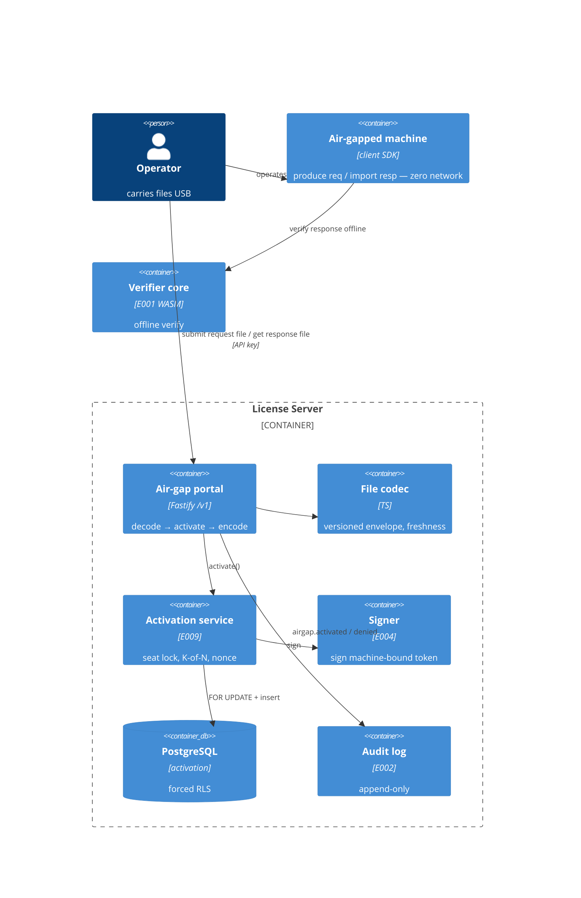

# Implementation Plan: Air-Gapped Activation

**Branch**: `00011-air-gapped-activation` | **Date**: 2026-07-15 | **Spec**: [spec.md](spec.md)

## Summary

**Goal**: Let a fully offline machine activate via signed file exchange — produce a request file, exchange it through an online portal that consumes a seat and signs a machine-bound credential, import the response file — and verify fully offline.
**Approach**: Add an air-gap file codec + one runtime endpoint to the existing E009 activation module; the endpoint decodes the request file, calls the E009 `activate()` service verbatim (seat cap, K-of-N binding, nonce store-and-replay), and packages the returned signed LIC1 credential into a versioned response file.
**Key Constraint**: No second activation/seat model — air-gap is a file transport over E009's activation; tamper-evidence rides on the embedded LIC1's Ed25519 signature (zero new crypto).

## Technical Context

**Language/Version**: TypeScript 5.6 / Node 22 (ESM)
**Primary Dependencies**: Fastify 5, pg 8, Zod 3, node:crypto; @fastify/rate-limit; E001 verifier-core (WASM); E004 signer; E009 activation service
**Storage**: PostgreSQL 16 — **no new schema** (reuses the E009 `activation` table; no migration)
**Testing**: Vitest 2 + @testcontainers/postgresql (offline round-trip verified via the E001 WASM core)
**Target Platform**: Linux server (container); the air-gapped client is out of scope (E003/E018 SDK)
**Project Type**: web (server; no SPA in the P1 MVP — the console variant is P2/deferred)
**Project Mode**: brownfield
**Performance Goals**: single air-gap process (decode + activate + sign + encode) well under 1s
**Constraints**: offline-verifiable response credential; only salted hashes in files/logs; append-only audit; forced-RLS tenant isolation (inherited from E009)
**Scale/Scope**: portable, copy-pasteable files; one endpoint

## Instructions Check

*GATE: Must pass before Phase 0 research. Re-check after Phase 1 design.*

- **Offline-first, key never exposed (I)**: PASS — the response file carries only the public signed LIC1 credential + keyId; signing stays in the E004 `app.signer`; the credential verifies offline via the E001 core.
- **Multi-tenant isolation + RBAC (II)**: PASS — the portal route is gated on the `activate` API-key scope; processing runs through E009's `withTenant`/forced-RLS path; cross-tenant → not found.
- **Single security core + append-only audit (III)**: PASS — reuses E001 verify / E004 sign / E009 accounting (no second crypto or seat model); every air-gap process + refusal is audited.
- **PII minimization / anti-replay / rate-limit**: PASS — only salted hashes in files/logs (FR-010); single-use nonce store-and-replay (FR-005, inherited); `@fastify/rate-limit` on the /v1 route (FR-013).
- **Raw-SQL, no ORM, `/src` layout**: PASS — no migration; new code under `src/server/modules/activation/`.

No violations → no Complexity Tracking section.

## Architecture



## Architecture Decisions

| ID | Decision | Options Considered | Chosen | Rationale |
|----|----------|--------------------|--------|-----------|
| AD-001 | Where air-gap lives | new `airgap` module / extend the E009 activation module | Add an air-gap codec + one route to `src/server/modules/activation/` | It IS activation via a file transport; reuses `activate()` in-module (no cross-module import), keeps the domain cohesive |
| AD-002 | File format | binary/protobuf / versioned base64url(JSON) envelope | Versioned `base64url(JSON)` envelope for both files | Portable, copy-pasteable (USB/email/QR); the crypto lives in the embedded LIC1, not the envelope |
| AD-003 | Response tamper-evidence | sign the whole envelope / rely on the embedded LIC1 signature | The embedded LIC1's Ed25519 signature (offline-verified by the E001 core against the pinned key); no separate envelope signature | Zero new crypto; the credential is the trust anchor and carries the machine binding (`fp`); envelope metadata is informational (FR-006) |
| AD-004 | Seat/binding path | reimplement for air-gap / reuse E009 `activate()` | Parse the request file → call `activate()` verbatim → package its `machineBoundKey` | One seat model — air-gap is indistinguishable from online in the seat count + registry (FR-003); seat cap, K-of-N, nonce store-and-replay all inherited |
| AD-005 | Request freshness | none / bounded window | Reject a **not-yet-seen** request whose `producedAt` is older than a configured window (default 7 days) → 400 `stale_request`. Freshness gates ONLY first-sight processing; an already-processed request (its nonce on the activation record) always replays regardless of age — the nonce store owns replay past the window (FR-021), so AD-005 and AD-007 do not contradict | Bounds replay/hoarding without breaking slow USB workflows (FR-008) |
| AD-006 | Format versioning | implicit / explicit `formatVersion` on both files | Explicit version field; reject an unknown/future request version → 400 `unknown_format_version` | SDK ↔ server evolve compatibly (FR-001/007/014) |
| AD-007 | New-vs-replay result | 201/200 like online / always 200 + `created` flag | Always `200` with `created: boolean` — `true` = new seat; `false` for BOTH no-new-seat cases: an idempotent same-nonce replay (byte-identical response, FR-005) and a K-of-N drift re-match (new nonce, refreshed response, same seat, FR-025). The activation nonce is one per-tenant store shared with online activation (FR-024) | A file-exchange transaction, not a caller-addressable REST resource (no `Location`); a replay is a success (FR-005) |
| AD-008 | Schema | add an air-gap flag/row / no change | Write the SAME E009 `activation` row; no air-gap column | FR-003 requires air-gap to be indistinguishable; no migration needed |

## Data Model Summary

N/A — no persistent data. Air-gap reuses the E009 `activation` table unchanged (AD-008); the request/response files are transient value objects. No migration.

## API Surface Summary

| Method | Path | Purpose | Auth | Req/Res Types |
|--------|------|---------|------|---------------|
| POST | `/v1/air-gap/activations` | Decode a request file → activate via the shared E009 accounting (seat cap, K-of-N, nonce store-and-replay) → return a signed response file; idempotent on the same request file (no second seat) | Runtime API key + `activate` scope; rate-limited (no CSRF) | `AirGapActivateRequest { requestFile }` → 200 `AirGapActivateResult { responseFile, created }`; 409 `seat_limit_reached`/`nonce_replayed`/`license_not_active`, 404 `license_not_found`, 400 `validation_error`/`unknown_format_version`/`stale_request`/`insufficient_signals`, 401 `unauthorized`, 403 `forbidden`, 429 `rate_limited`, 503 `signer_unavailable` |

**Detail**: [contracts/airgap-api.openapi.yaml](contracts/airgap-api.openapi.yaml)

## Testing Strategy

| Tier | Tool | Scope | Mock Boundary | Install |
|------|------|-------|---------------|---------|
| Unit | Vitest 2 | file codec (encode/decode round-trip), version + freshness validation, PII-free envelope | none (pure) | configured |
| Integration | Vitest 2 + @testcontainers/postgresql | full round-trip: request file → POST → response file → decode → **offline verify via the E001 WASM core**; seat consume + cap refusal (no response file); idempotent replay (no 2nd seat); non-active/too-few/stale/unknown-version refusals; audit; RLS isolation | real Postgres; real core + signer | configured |
| Security | npm audit (`--omit=dev --audit-level=high`) + semgrep (CI) | deps + activation/airgap/console | — | configured (semgrep in CI) |
| Coverage | v8 (Vitest) | ≥80% line+branch, air-gap codec + route | — | configured |

## Error Handling Strategy

| Error Category | Pattern | Response | Retry |
|----------------|---------|----------|-------|
| File decode / structure (**oversize** (pre-decode guard), malformed, non-base64url, unknown version, stale) | fail-fast, decode before activate; **audit the refusal** (`airgap.denied`) — do NOT copy E009's direct-return 400 that skips the audit hook | 400 `validation_error` (incl. `details.reason=oversize`, FR-019) / `unknown_format_version` / `stale_request` (audited) | no |
| Auth (missing/insufficient scope) | fail-closed + audit security event | 401 `unauthorized` / 403 `forbidden` | no |
| Seat/lifecycle conflict (inherited from `activate()`) | fail-fast, no response file, no partial seat | 409 `seat_limit_reached` (details) / `nonce_replayed` / `license_not_active`, 400 `insufficient_signals` | no |
| Not found / cross-tenant | RLS-scoped | 404 `license_not_found` | no |
| Signer unavailable | fail-closed, no seat consumed | 503 `signer_unavailable` | yes (operator re-submits the same file — idempotent) |
| Rate limited | fixed-window per API key | 429 `rate_limited` + Retry-After (audited) | yes |

## Integration Points

| Spec Reference | System/Service | Technical Approach | Contract |
|----------------|----------------|--------------------|----------|
| Activate via shared accounting (FR-003) | E009 activation | call `activate(pool, signer, config, tenantId, {licenseId/licenseKey, signals, nonce, label})` in-module; reuse its ActivationResult | src/server/modules/activation/activate.ts |
| Signed machine-bound credential (FR-006) | E004 signer | inherited via `activate()` → `app.signer`; the response wraps the returned LIC1 | src/server/modules/signing/signer.ts |
| Offline verify of the response (FR-006/SC-001) | E001 verifier-core | the embedded LIC1 verifies offline with the machine fingerprint (tests use the WASM core) | src/server/modules/signing/token.ts |
| Portal auth + rate limit (FR-002/013) | E005 api-key / E009 /v1 plane | `req.tenant` + `activate` scope; same @fastify/rate-limit context as activate/deactivate | src/server/modules/activation/routes.ts |
| Tenant isolation + audit (FR-011/012) | E002 tenancy | inherited via `activate()`'s `withTenant`/forced-RLS; air-gap route adds `airgap.activated`/`airgap.denied` audit | src/server/db/, src/server/audit/ |

## Risk Mitigation

| Risk (from spec) | Likelihood | Impact | Mitigation | Owner |
|-------------------|------------|--------|------------|-------|
| File-format drift between SDK and server breaks exchange | M | H | Explicit `formatVersion` on both files; reject unknown/cross versions (FR-001/007/014); versioned config | activation module |
| Request-file hoarding/replay | M | M | Single-use nonce store-and-replay (inherited from `activate()`) → idempotent, no extra seat; freshness window (FR-005/008) | activation module |
| Air-gap seat exhaustion | L | M | Shared seat cap (FR-003/004) + rate limiting (FR-013); dead-seat reclaim is operator/console-driven (E009) | activation module |

## Requirement Coverage Map

| Req ID | Component(s) | File Path(s) | Notes |
|--------|--------------|--------------|-------|
| FR-001 | request-file codec | src/server/modules/activation/airgap.ts | versioned envelope; reject unknown version |
| FR-002 | portal route | src/server/modules/activation/routes.ts | POST /v1/air-gap/activations, activate scope |
| FR-003 | air-gap process → activate() | src/server/modules/activation/airgap.ts | reuse `activate()`, same accounting |
| FR-004 | seat-cap refusal | src/server/modules/activation/{airgap.ts,activate.ts} | 409 seat_limit_reached, no response file |
| FR-005 | idempotent nonce | src/server/modules/activation/activate.ts | store-and-replay → created:false |
| FR-006 | response-file codec | src/server/modules/activation/airgap.ts | wrap the signed LIC1; offline-verifiable |
| FR-007 | decode validation | src/server/modules/activation/airgap.ts | malformed/unknown-version → 400 |
| FR-008 | freshness check | src/server/modules/activation/airgap.ts | producedAt window → 400 stale_request |
| FR-009 | license/signals gate | src/server/modules/activation/activate.ts | 409 license_not_active / 400 insufficient_signals |
| FR-010 | hashes only | src/server/modules/activation/airgap.ts | no raw ids in files/logs |
| FR-011 | tenant isolation | src/server/modules/activation/activate.ts | inherited withTenant/RLS; cross-tenant 404 |
| FR-012 | audit | src/server/modules/activation/routes.ts | airgap.activated / airgap.denied + activation.created |
| FR-013 | rate limit | src/server/modules/activation/routes.ts | @fastify/rate-limit on /v1 |
| FR-014 | version negotiation | src/server/modules/activation/airgap.ts | request+response version fields; reject mismatch |
| FR-015 | console upload/download | — | **[DEFERRED]** P2 (out of MVP) |
| FR-016 | keyring trust anchor / rotation | src/server/modules/activation/airgap.ts (verify) | pinned keyring (E004); rotated-key credential still verifies offline (test T003) |
| FR-017 | signing-key non-exposure | src/server/modules/activation/airgap.ts | only the public credential + keyId in the envelope; no private material anywhere (test T016) |
| FR-018 | honest-client / server-side enforcement | src/server/modules/activation/activate.ts | all invariants enforced server-side; no request field trusted verbatim (inherited) |
| FR-019 | oversize / decompression guard | src/server/modules/activation/airgap.ts | pre-decode max-size check → validation_error (reason=oversize), no seat |
| FR-020 | quantified config defaults | src/server/modules/activation/index.ts | freshness (7d), ≥128-bit nonce, min-signals = fpMin default 3 |
| FR-021 | nonce retention vs freshness | src/server/modules/activation/activate.ts | nonce retained via the activation row; replay holds past the freshness window |
| FR-022 | credential expiry | src/server/modules/activation/airgap.ts | response carries exp = min(license exp, credential TTL); offline-enforced |
| FR-023 | signer-unavailable fail-closed | src/server/modules/activation/activate.ts | signer fault → 503, tx rollback, no seat/row |
| FR-024 | cross-transport shared nonce | src/server/modules/activation/activate.ts | one per-tenant nonce store for online + air-gap |
| FR-025 | drift re-match → same seat | src/server/modules/activation/activate.ts | K-of-N re-match reuses the seat, created:false, refreshed response |
| FR-026 | provenance in audit only | src/server/modules/activation/routes.ts | airgap.activated is the sole origin signal; no origin column on the row |
| FR-027 | GDPR retention parity | src/server/modules/activation/airgap.ts (note) | air-gap rows inherit the E009 retention/erasure path |
| FR-028 | fail-closed no-partial-state | src/server/modules/activation/airgap.ts | file-layer validation before the seat-consuming transaction; atomic rollback |

## Project Structure

### Source Code

```text
+ src/server/modules/activation/airgap.ts                        # request/response file codec + version/freshness + process
~ src/server/modules/activation/routes.ts                        # + POST /v1/air-gap/activations (activate scope, rate-limited, audited)
~ src/server/modules/activation/index.ts                         # + air-gap config (freshness, format versions) in ActivationConfig
+ src/server/modules/activation/__tests__/airgap.unit.test.ts    # codec + version + freshness (pure)
+ src/server/modules/activation/__tests__/airgap.integration.test.ts # round-trip + offline verify + seat/idempotency/refusals + audit + RLS
+ .github/workflows/airgap.yml
```

**Patterns to reuse**: E009 activation (`activate()` service, `ActivationError`→HTTP `guard()`, the /v1 `@fastify/rate-limit` encapsulated context + `requireActivateScope`, denial audit); E008 fail-closed sign; the E008/E009 integration test harness (provision signing key + custody unlock + WASM `verifyOffline`).
**Tests to extend**: none — new `airgap.unit.test.ts` + `airgap.integration.test.ts`; reuse the activation test setup.
**Naming conventions**: camelCase envelope fields, `base64url` on the wire, `{code,message,details?}` errors, `ActivationConfig` extended with air-gap keys.

## Implementation Hints

- **[HINT-001]** Order: air-gap adds no new module and no migration — extend `ActivationConfig`/`loadActivationConfig` (freshness secs, request/response format versions) and add the codec + route to the existing activation module.
- **[HINT-002]** Gotcha: the response file wraps the SIGNED LIC1 (`machineBoundKey`) returned by `activate()`; the tamper-evidence is that Ed25519 signature — do NOT add a second envelope signature and never put private-key material in the envelope. The client verifies the LIC1 offline (with the machine fingerprint) against the pinned public key.
- **[HINT-003]** Order: validate the FILE layer BEFORE calling `activate()` — base64url-decode, check `formatVersion` (400 `unknown_format_version`), freshness (400 `stale_request`), and structure (400 `validation_error`); THEN `activate()` enforces license/seat/nonce/signals. This keeps file errors distinct from activation errors.
- **[HINT-004]** Gotcha: idempotency/seat/K-of-N are all inherited — map the request file's fields into `activate()`'s input and return `created` from the ActivationResult (`created:true` new seat / `false` replay). Re-submitting the same request file replays the original credential with no second seat.
- **[HINT-005]** Compatibility: mount `POST /v1/air-gap/activations` inside the SAME `@fastify/rate-limit` encapsulated `/v1` context as activate/deactivate (per-API-key), gate on the `activate` scope, and audit `airgap.activated` (success) / `airgap.denied` (refusal, security event) so FR-012 is covered distinctly from `activate()`'s own `activation.created`.
- **[HINT-006]** Gotcha (audit completeness, FR-012/SC-011): audit EVERY refusal, including the file-layer 400s (`validation_error`/`unknown_format_version`/`stale_request`) that are rejected BEFORE `activate()` runs — emit `airgap.denied` for those too. E009's route returns Zod/validation 400s via a direct `validation(reply,...)` that bypasses the denial-audit hook; the air-gap handler must route those file-layer refusals through the audit path so "every air-gap refusal is audited" actually holds.
