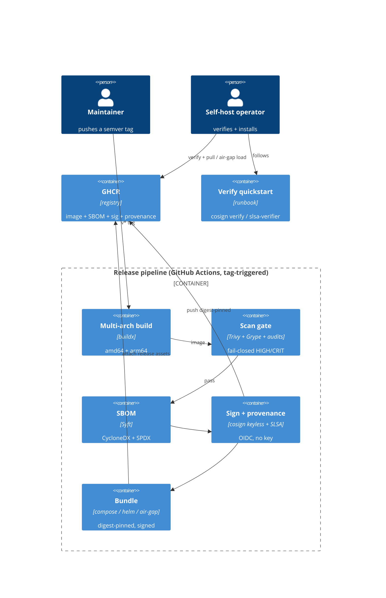

# Implementation Plan: Supply Chain and Distribution

**Branch**: `00012-supply-chain-and-distribution` | **Date**: 2026-07-16 | **Spec**: [spec.md](spec.md)

## Summary

**Goal**: Turn a semver tag into a trustworthy, distributable release — a signed multi-arch image with an SBOM and provenance, plus signed self-host bundles (compose, optional Helm, offline air-gap) an operator can verify before deploying.
**Approach**: A dedicated tag-triggered GitHub Actions release workflow — buildx multi-arch → scan (fail-closed) → Syft SBOM → cosign keyless sign + SLSA provenance → publish to GHCR (digest-pinned) → package signed compose + air-gap bundles → ship verification runbooks.
**Key Constraint**: Keyless (OIDC) signing only — no long-lived key; the air-gap path must verify and install fully offline.

## Technical Context

**Language/Version**: n/a (no application code) — CI/CD in GitHub Actions YAML; the built artifact is the E006 Node/TS + Rust-binding image
**Primary Dependencies**: docker buildx, Trivy (image+fs scan), Syft (SBOM), cosign (keyless), slsa-github-generator (provenance), Helm (P2); the E006 Dockerfile + docker-compose stack
**Storage**: N/A (artifacts, not persisted data) · **Testing**: pipeline self-verification (cosign verify / slsa-verifier) + air-gap load smoke + the E006 DOCKER_SMOKE
**Target Platform**: `linux/amd64` + `linux/arm64` multi-arch image; GHCR registry
**Project Type**: single (ops pipeline) · **Project Mode**: brownfield
**Performance Goals**: batch heavy steps at release (not per commit); native cross-compile to bound multi-arch build time
**Constraints**: self-host-first / cloud-agnostic (no mandatory cloud runtime dep); fail-closed scan + sign; digest-pinned deps + actions; offline-verifiable air-gap bundle
**Scale/Scope**: one signed release per semver tag

## Instructions Check

*GATE: Must pass before Phase 0 research. Re-check after Phase 1 design.*

- **Offline-first, keys never exposed (I)**: PASS — E011 signs and distributes the SOFTWARE image via keyless OIDC; it does NOT handle or distribute license signing keys (those stay in the E004 signer). The air-gap bundle verifies + installs with no network.
- **Self-host-first / cloud-agnostic (DOD DDR-001)**: PASS — signed compose/Helm/air-gap; no mandatory cloud runtime dependency; CI OIDC + GHCR are build-time only.
- **Supply-chain integrity (DDR-002)**: PASS — multi-arch, SBOM, keyless cosign, SLSA provenance, fail-closed HIGH/CRITICAL scan gate, digest-pinned deps + actions.
- **No second crypto / no app change**: PASS — pipeline + artifacts + runbooks only; no `NEW-ENTITY`/`NEW-API`/`MIGRATION`; the E006 image content is unchanged (just built/signed/distributed).

No violations → no Complexity Tracking section.

## Architecture



## Architecture Decisions

Feature-local pipeline HOW; the architectural decisions are DOD **DDR-001** (self-host distribution) + **DDR-002** (CI / signed image) — referenced, not duplicated.

| ID | Decision | Options Considered | Chosen | Rationale |
|----|----------|--------------------|--------|-----------|
| AD-001 | Release trigger | per-commit / semver tag | A dedicated `release.yml` triggered by a `v*` semver tag (separate from per-commit CI) | Batch the heavy scan/SBOM/sign at release, not per commit (DOD cost lever) |
| AD-002 | Multi-arch build | per-arch images / buildx single manifest | `docker buildx` → one multi-arch manifest (`linux/amd64` + `linux/arm64`), native cross-compile where possible | One image, one digest; avoids full-QEMU cost |
| AD-003 | Scan gate | single scanner / dual scanners | **Trivy + Grype** (dual image + filesystem scanners, DOD-mandated) **plus** the existing `npm audit --omit=dev` and `cargo audit` (Rust bindings); fail on HIGH/CRITICAL | Dual scanners is a named DOD supply-chain control (different CVE coverage); covers image + both language ecosystems; fail-closed → publish nothing (OR-002) |
| AD-004 | SBOM | single format / dual | Syft → CycloneDX (security) + SPDX (license/NTIA); attach to the release + a cosign SBOM attestation | DOD §Supply Chain; ties the SBOM to the published digest (OR-003) |
| AD-005 | Signing | long-lived key / keyless | cosign **keyless** (GitHub OIDC → Fulcio cert + Rekor log); no key in CI; verify via `cosign verify --certificate-identity … --certificate-oidc-issuer …` | No long-lived key (OR-004/012, DDR-002) |
| AD-006 | Provenance | none / SLSA | SLSA build provenance via `slsa-github-generator`, target **Build L3** (hosted isolated builder) | DOD targets L3; verifiable with `slsa-verifier` (OR-004) |
| AD-007 | Registry | Docker Hub / GHCR | **GHCR** (`ghcr.io`) — OIDC-native with GitHub Actions, no stored registry key | Aligns with keyless OIDC; no long-lived credential (OR-005) |
| AD-008 | Self-host bundle | `build: .` compose / digest-pinned | A signed compose bundle that pins `image: ghcr.io/<org>/licensesrv@sha256:<digest>` (replacing `build: .`); optional signed Helm chart pinned the same way | Reproducible, no local build, verifiable (OR-007/011) |
| AD-009 | Air-gap bundle | image-only tar / full offline kit | A tarball: image OCI layout (`docker save`) + SBOM + cosign signatures **with the Rekor inclusion proof + Fulcio chain** + the compose bundle → `cosign verify --offline` + `docker load`, no network | Offline install AND offline verify (OR-010, DDR-001) |
| AD-010 | Pinning | floating tags / pinned | Pin every third-party CI action by commit SHA; pin the base image (`node:22-slim`) by digest for the release build; a pin check flags floating refs | Reproducible, tamper-resistant (OR-006) |

## Data Model Summary

N/A — no persistent data. E011 produces release artifacts (image, SBOM, signatures, bundles), not schema. No migration.

## API Surface Summary

N/A — no API surface. E011 delivers a CI pipeline + signed artifacts + runbooks; no application endpoints.

## Testing Strategy

| Tier | Tool | Scope | Mock Boundary | Install |
|------|------|-------|---------------|---------|
| Pipeline self-verify | cosign + slsa-verifier | after signing, the release job verifies its OWN image signature + provenance against the published identity (fail the release if verify fails) | none (real signing) | `configured` (in release.yml) |
| Scan gate | Trivy + Grype + npm/cargo audit | deps + image (dual scanners); the release fails on HIGH/CRITICAL | — | `configured` |
| Air-gap smoke | docker load + docker compose | load the air-gap image tar on a network-restricted job, `compose up`, hit the health probe — no registry pull; `cosign verify --offline` the bundled signature | none | `configured` |
| Image run smoke | existing E006 `DOCKER_SMOKE` | the built image boots + serves probes | none | `configured` |

## Error Handling Strategy

| Gate | Pattern | Behavior | Retry |
|------|---------|----------|-------|
| Scan finds HIGH/CRITICAL | fail-closed | release fails; nothing published | no (remediate → re-tag, RR-003) |
| Signing/provenance backend unavailable | fail-closed | no unsigned artifact published; job fails | yes (re-run job, RR-003) |
| Multi-arch partial (one arch fails) | fail-closed | no partial/single-arch release published | no |
| Self-verify fails (bad sig/identity) | fail-closed | release fails before publishing bundles | no |

## Integration Points

| Spec Reference | System/Service | Technical Approach | Contract |
|----------------|----------------|--------------------|----------|
| IP-001 builds the E006 image | E006 runtime | `release.yml` buildx-builds the existing `Dockerfile`; the compose bundle pins the published digest (replacing `build: .`) | Dockerfile, docker-compose.yml |
| IP-002 CI OIDC + registry | GitHub Actions OIDC + GHCR | `permissions: id-token: write, packages: write`; keyless cosign (Fulcio/Rekor); push to `ghcr.io` | .github/workflows/release.yml |
| IP-003 distinct from E010 | E010 offline activation | independent — E011 distributes the SOFTWARE image; no shared code path | — |
| IP-004 (deferred) keyring/CRL channel | E004 signing | MAY later reuse the signed-artifact channel; out of scope | — |

## Risk Mitigation

| Risk (from spec) | Likelihood | Impact | Mitigation | Owner |
|-------------------|------------|--------|------------|-------|
| Keyless-signing backend (OIDC/Fulcio/Rekor) outage blocks signing | L | H | Fail-closed (no unsigned publish); a re-run runbook (RR-003); the release is idempotent per digest | release pipeline |
| Multi-arch build cost/time | M | M | Native cross-compile over full-QEMU; batch scan/SBOM/sign at the release tag only | release pipeline |
| Air-gap bundle size / staleness | M | M | Bounded supported-version matrix; digest-pinned versioning; document bundle contents | release pipeline |

## Requirement Coverage Map

| Req ID | Component(s) | File Path(s) | Notes |
|--------|--------------|--------------|-------|
| OR-001 | multi-arch build | .github/workflows/release.yml | buildx amd64+arm64 |
| OR-002 | scan gate | .github/workflows/release.yml | Trivy + Grype + npm/cargo audit, fail HIGH/CRIT |
| OR-003 | SBOM | .github/workflows/release.yml | Syft CycloneDX + SPDX + attestation |
| OR-004 | sign + provenance | .github/workflows/release.yml | cosign keyless + slsa-github-generator |
| OR-005 | publish | .github/workflows/release.yml | GHCR push, digest-pinned + attach |
| OR-006 | pin deps/actions | .github/workflows/*.yml, Dockerfile | SHA-pin actions; digest-pin base image |
| OR-007 | compose bundle | dist-bundles/docker-compose.release.yml | digest-pinned + signed |
| OR-008 | verify instructions | docs/release/verify.md | cosign verify / slsa-verifier quickstart |
| OR-009 | fail-closed verify | docs/release/verify.md + release.yml self-verify | clear failure on tamper/wrong-identity |
| OR-010 | air-gap bundle | .github/workflows/release.yml, dist-bundles/ | OCI tar + SBOM + sigs + Rekor/Fulcio, offline |
| OR-011 | Helm chart | charts/licensesrv/ | signed, digest-pinned (P2) |
| OR-012 | no key/secret in artifacts | .github/workflows/release.yml | keyless (no secret); leak-check |
| RR-001 | verify runbook | docs/release/verify.md | |
| RR-002 | air-gap install runbook | docs/release/air-gap-install.md | |
| RR-003 | failed-release runbook | docs/release/failed-release.md | |
| RR-004 | signing-identity rotation runbook | docs/release/signing-identity-rotation.md | |

## Project Structure

### Source Code

```text
+ .github/workflows/release.yml                    # semver-tag release: build→scan→SBOM→sign→publish→bundle→self-verify
+ dist-bundles/docker-compose.release.yml          # digest-pinned compose bundle (image: ghcr…@sha256, no build:)
+ charts/licensesrv/                               # signed Helm chart (P2)
+ docs/release/verify.md                           # RR-001 cosign verify / slsa-verifier quickstart + expected identity
+ docs/release/air-gap-install.md                  # RR-002 offline load + verify + compose up
+ docs/release/failed-release.md                   # RR-003 scan/sign failure → remediate → re-tag
+ docs/release/signing-identity-rotation.md        # RR-004 rotate the keyless/OIDC trust root, notify operators
~ .github/workflows/*.yml                          # OR-006: pin third-party actions by commit SHA
~ Dockerfile                                       # OR-006: pin the base image (node:22-slim) by digest for the release
~ README.md                                        # link the verify quickstart
```

**Patterns to reuse**: the existing E006 `Dockerfile` (multi-stage, non-root) + `docker-compose.yml` + the `DOCKER_SMOKE` image smoke; the established per-workflow `npm audit --omit=dev --audit-level=high` gate; the runtime.yml workflow shape.
**Tests to extend**: the E006 image/compose smoke — add an air-gap load-and-verify job; add a post-sign self-verify job in release.yml.
**Naming conventions**: `.github/workflows/*.yml`; docs under `docs/release/`; bundles under `dist-bundles/`.

## Implementation Hints

- **[HINT-001]** Order/Cost: keep the heavy scan/SBOM/sign in the tag-triggered `release.yml`; the per-commit CI keeps its existing lighter gates. Do NOT run signing per commit.
- **[HINT-002]** Constraint: keyless signing needs `permissions: { id-token: write, packages: write, contents: write }` on the release job; GHCR + OIDC means NO stored registry or signing key — cosign uses the ambient OIDC token.
- **[HINT-003]** Gotcha: the compose (and Helm) bundle MUST pin the published image by digest (`image: ghcr.io/<org>/licensesrv@sha256:<digest>`), replacing `build: .`, so the operator runs the exact signed artifact with no local build.
- **[HINT-004]** Compatibility: for OFFLINE `cosign verify`, the air-gap bundle must carry the signature's Rekor inclusion proof + the Fulcio cert chain and be verified with `cosign verify --offline` (or a bundled `--bundle`), since there is no network to reach Rekor.
- **[HINT-005]** Constraint: pin ALL third-party GitHub Actions by full commit SHA (OR-006) and the Dockerfile base image by digest for the release build; a pin check (e.g. `ratchet`/`pin-github-action` or a grep gate) flags floating refs.
