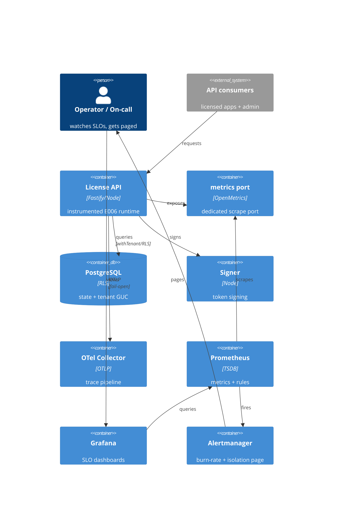

# Implementation Plan: Observability and SLOs

**Branch**: `00013-observability-and-slos` | **Date**: 2026-07-17 | **Spec**: [spec.md](spec.md)

## Summary

**Goal**: Observability + SLO baseline over the E006 runtime — per-tenant structured logging, RED metrics + SLO dashboards, tenant-isolation paged invariant, tracing, burn-rate alerting.
**Approach**: Instrument the existing Fastify app at its global hooks / bootstrap / config / `withTenant()` choke point using pino + prom-client + OpenTelemetry (per {SAD:ADR-0009}); ship a self-hostable Prometheus/Grafana/Alertmanager/OTel-Collector overlay + versioned dashboards/rules.
**Key Constraint**: Fail-open telemetry, bounded metric cardinality (no `tenant_id`/`request_id`/`license_key` labels), zero-budget tenant-isolation pages immediately.

## Technical Context

**Language/Version**: TypeScript 5.6 / Node 22 (ESM)
**Primary Dependencies**: Fastify 5, pino (Fastify-bundled), prom-client, @opentelemetry/sdk-node + auto-instrumentations-node + exporter-trace-otlp, pg 8, Zod 3
**Storage**: N/A — signals go to Prometheus/Collector/log store, not Postgres; isolation assertion reads the existing per-tx tenant GUC
**Testing**: Vitest 2 + @testcontainers/postgresql
**Target Platform**: Linux container (self-host + managed)
**Project Type**: single (modular monolith server)
**Project Mode**: brownfield
**Performance Goals**: added latency ≤ ~2 ms p95, ≤ ~5% CPU; traces sampled
**Constraints**: cloud-agnostic self-hostable stack; fail-open telemetry; no secrets/PII in signals; high-cardinality IDs never metric labels; isolation pages immediately (0 budget)
**Scale/Scope**: instruments activation + issuance online paths (validate pending E013) + infra; multi-tenant

## Instructions Check

*GATE: Must pass before Phase 0 research. Re-check after Phase 1 design.*

| Principle | Status | Evidence |
|-----------|--------|----------|
| I. Signing keys never exposed / offline-first | PASS | Signer instrumented availability/latency/outcome only (OR-007, OBJ4 span); all signing-key material excluded from every telemetry signal (OR-020, normative); exporter secrets via `<VAR>_FILE` (OR-018); no secrets/PII in signals (OR-004/005) |
| II. Multi-tenant isolation | PASS (strengthened) | Assertion at single `withTenant()` choke point → immediate page (OR-011/012); `tenant_id` never a label (OR-008) |
| III. Single security core, audited | PASS | No crypto; logging additive to (not bypassing) the append-only audit log |
| IV. Agent output style | PASS | Table/kv plan |
| Cloud-agnostic / self-host-first | PASS | Prometheus/Grafana/Alertmanager/Collector only; no proprietary-SaaS hard dep (OR-017) |

**Gate: PASS** — no violations; Complexity Tracking omitted.

## Architecture



## Architecture Decisions

Feature-local only. Project-wide instrumentation stack + label-cardinality policy → **{SAD:ADR-0009}** (not duplicated here).

| ID | Decision | Chosen | Rationale |
|----|----------|--------|-----------|
| AD-001 | Metrics exposure | dedicated internal metrics port (separate prom-client listener, configurable) per {SAD:ADR-0009} §2 | Keeps metrics off the public API listener; standard Prometheus deploy; OR-005 "non-public port". `/internal/metrics`-on-main rejected (shares public listener) |
| AD-002 | `request_id` source | server-generated via Fastify `genReqId`; inbound header a non-authoritative tag | Trust boundary — never trust client IDs (OR-002) |
| AD-003 | Isolation-assertion placement | `withTenant()` choke point + auth seam | Single per-tx RLS chokepoint can't be bypassed; assertion signals, RLS blocks (OR-011). Forensic record = the dedicated security event + `tenant_isolation_violation_total` counter, NOT the tenant-scoped append-only audit_log (which records tenant mutations; the blocked cross-tenant read performs no mutation) |
| AD-004 | Isolation alert semantics | immediate dedicated page on any occurrence | Hard invariant, 0 budget — never smoothed (OR-012) |
| AD-005 | SLO alerting | multi-window burn-rate (page 14.4x@1h/5m + 6x@6h/30m; ticket 1x@3d/6h) | SRE-workbook standard; suppresses false pages (OR-015) |
| AD-006 | Dashboards + rules | versioned Grafana JSON + Prometheus/Alertmanager YAML in-repo | Reproducible, reviewable, ships with release (OR-009/010/016) |
| AD-007 | Trace sampling/export | parent-based ratio (configurable) via BatchSpanProcessor → Collector, fail-open | Bounds overhead; decouples backend (OR-013/014) |
| AD-008 | Self-host delivery | `docker-compose.observability.yml` overlay with the E011 bundle | Turnkey self-host instrumentation (OR-017, IP-005) |

## Data Model Summary

N/A — no persistent data. Signals go to Prometheus/Collector/log store, not Postgres; the isolation assertion reads the existing per-tx tenant GUC. No new tables, no migration.

## API Surface Summary

| Method | Path | Purpose | Auth | Req/Res Types |
|--------|------|---------|------|---------------|
| GET | /metrics (dedicated internal port) | Prometheus/OpenMetrics exposition (RED + infra) | none — bound off public port, network-restricted (AD-001 / {SAD:ADR-0009}) | — / `text/plain` OpenMetrics |

Standard OpenMetrics scrape on a dedicated port — no bespoke schema, so no OpenAPI contract. The isolation canary is an internal worker, not a public endpoint.

## Testing Strategy

| Tier | Tool | Scope | Mock Boundary | Install |
|------|------|-------|---------------|---------|
| Unit | Vitest | log-field contract + redaction, `request_id` gen, metric label allowlist, isolation logic, burn-rate expressions | pool, exporter, clock | configured |
| Integration | Vitest + @testcontainers/postgresql | request → log + metric + trace + isolation-page with real Postgres/RLS; metrics scrape; fail-open when Collector/port down | none (real DB) | configured |
| Security | semgrep + npm audit | no secrets/PII in signals; metrics port not public; isolation assertion present (cargo audit N/A — no Rust in this feature; Trivy+Grype image/supply-chain scanning owned by E011) | — | configured |
| Performance | autocannon | instrumentation overhead vs baseline within budget (≤ ~2 ms p95, ≤ ~5% CPU); sampling backpressure holds | none (real app) | `npm i -D autocannon` |
| Coverage | Vitest v8 | ≥80% gate on new `src/server/observability/*` source (per project-instructions Coverage Target 80% / DOD CI); operator config artifacts under `observability/` fall outside line-coverage scope | — | configured |
| Config artifacts | promtool + amtool + JSON lint | Prometheus recording/alert rules (`promtool check rules` + `promtool test rules` asserting burn-rate AND isolation-page alert expressions fire on synthetic series without a live pager); Alertmanager routing (`amtool check-config` — SEV1/SEV2 reach on-call receivers); Grafana dashboard JSON lint | none | CI tools |

## Error Handling Strategy

| Error Category | Pattern | Response | Retry |
|----------------|---------|----------|-------|
| Telemetry export (Collector/Prometheus down) | fail-open (best-effort, drop) | no request impact; internal warn; never surfaced | no (batched, dropped on overflow) |
| Metrics scrape / port-bind failure | fail-safe isolate | error to scraper only; API path + bind failure non-fatal | no |
| Cross-tenant access (isolation) | fail-closed + immediate page | already blocked by RLS; security event → page | no |
| Tracing overhead breach | sampling backpressure | lower sample rate; never block a request | no |

## Integration Points

| Spec Ref | System/Service | Technical Approach | Contract |
|----------|----------------|--------------------|----------|
| IP-001 | E006 runtime seams | Hooks at `app.ts` (logger, hooks, genReqId), `main.ts` (tracing, metrics port), `config/`, `db/client.ts` (`withTenant`) | in-process |
| IP-002 | Prometheus/Grafana/Alertmanager/Collector | metrics scrape + OTLP export; compose overlay | OpenMetrics + OTLP |
| IP-003 | E013 validate/heartbeat | harness ready; validate SLI panel "pending" until handler ships | deferred |
| IP-004 | DOD SLI/SLO + alerting policy | source targets + SEV severities into rules | {DOD} |
| IP-005 | E011 signed bundle | ship overlay + config with the image | compose overlay |

## Risk Mitigation

| Risk (from spec) | L | I | Mitigation | Owner |
|-------------------|---|---|------------|-------|
| Metric cardinality blow-up | M | H | Static prom-client label allowlist; unit test asserts no `tenant_id`/`request_id`/`license_key` label; exemplars for drill-down | metrics.ts |
| Overhead degrades latency SLOs | L | M | BatchSpanProcessor + ratio sampling + async/fail-open export; measured overhead budget | tracing.ts |
| Isolation false pos/neg | M | H | Single assertion at `withTenant()`; synthetic canary validates the alert path end-to-end | isolation-assertion.ts + canary.ts |

## Requirement Coverage Map

| Req ID | Component(s) | File Path(s) |
|--------|--------------|--------------|
| OR-001 | request logger + response hook | src/server/observability/logger.ts, src/server/app.ts |
| OR-002 | request context | src/server/observability/request-context.ts, src/server/app.ts |
| OR-003 | logger (tenant field) | src/server/observability/logger.ts |
| OR-004 | logger redaction + level | src/server/observability/logger.ts, src/server/config/index.ts |
| OR-005 | metrics endpoint (dedicated port) | src/server/observability/metrics.ts, src/server/main.ts |
| OR-006 | RED instruments (recorded in hooks) | src/server/observability/metrics.ts, src/server/app.ts |
| OR-007 | infra metrics | src/server/observability/metrics.ts |
| OR-008 | label allowlist + exemplars | src/server/observability/metrics.ts |
| OR-009 | SLO dashboards | observability/grafana/dashboards/ |
| OR-010 | recording rules | observability/prometheus/recording-rules.yml |
| OR-011 | isolation assertion | src/server/observability/isolation-assertion.ts, src/server/db/client.ts |
| OR-012 | isolation page + canary | observability/prometheus/alert-rules.yml, src/server/observability/canary.ts |
| OR-013 | tracing | src/server/observability/tracing.ts, src/server/main.ts |
| OR-014 | sampling + fail-open | src/server/observability/tracing.ts |
| OR-015 | burn-rate rules | observability/prometheus/alert-rules.yml |
| OR-016 | Alertmanager routing | observability/alertmanager/config.yml |
| OR-017 | self-host overlay | dist-bundles/docker-compose.observability.yml |
| OR-018 | config keys | src/server/config/index.ts, src/server/config/secrets.ts |
| OR-019 | SLI/SLO definitions (window, good/total, budgets) | observability/prometheus/recording-rules.yml, observability/grafana/dashboards/ |
| OR-020 | signing-key exclusion from signer telemetry (span/metric/log) | src/server/observability/tracing.ts, src/server/observability/metrics.ts, src/server/observability/logger.ts |
| RR-001 | runbook — isolation page | docs/runbooks/observability/tenant-isolation-page.md |
| RR-002 | runbook — SLO burn | docs/runbooks/observability/slo-burn-response.md |
| RR-003 | runbook — stack failure | docs/runbooks/observability/telemetry-stack-failure.md |
| RR-004 | runbook — log/trace diagnosis | docs/runbooks/observability/latency-error-diagnosis.md |

## Project Structure

### Source Code

```text
src/server/
  observability/                + new cross-cutting module (instruments all modules)
    logger.ts                   + pino config, redaction, serializers
    request-context.ts          + request_id gen + per-request context
    metrics.ts                  + prom-client registry, RED instruments, label allowlist
    tracing.ts                  + OTel SDK bootstrap (preload), signer span, sampling, OTLP
    isolation-assertion.ts      + cross-tenant assertion + security event
    canary.ts                   + synthetic cross-tenant canary probe (worker)
  app.ts                        ~ enable pino, genReqId, onRequest/onResponse hooks (log + record RED)
  main.ts                       ~ preload tracing SDK, start dedicated metrics-port listener, wire canary
  config/index.ts               ~ new observability config keys (schema + AppConfig + summary)
  db/client.ts                  ~ hook isolation assertion into withTenant()
observability/                  + operator artifacts (versioned config)
  grafana/dashboards/*.json     + SLO dashboards
  prometheus/recording-rules.yml + SLI recording rules
  prometheus/alert-rules.yml    + burn-rate + isolation-page rules
  alertmanager/config.yml       + routing + escalation
dist-bundles/docker-compose.observability.yml + self-host stack overlay
docs/runbooks/observability/    + RR-001..004 runbooks
```

**Patterns to reuse**: `register<X>` seam + `registerModules` ordering (`modules/index.ts`); Zod config + `<VAR>_FILE` secrets (`config/`); global preHandler hook (`app.ts`); `withTenant()` RLS choke point (`db/client.ts`); `health/` module shape for `registerMetrics`.
**Tests to extend**: existing Vitest testcontainers integration suites; the per-module unit pattern.
**Naming conventions**: `src/server/<area>/*.ts`, camelCase, ESM; env `SCREAMING_SNAKE` → `camelCase` in `AppConfig`. Observability is cross-cutting (like `health/`, `auth/`, `config/`) → lives at `src/server/observability/`, NOT under `modules/`.

## Implementation Hints

- **[HINT-001]** Order: init the OTel SDK BEFORE app/pg/fastify import (auto-instrumentation patches at require time) — load `tracing` via a `--require ./dist/server/observability/tracing.js` preload/entrypoint, not inline.
- **[HINT-002]** Constraint: never add `tenant_id`/`request_id`/`license_key` as prom-client labels — static allowlist + unit test; use `exemplars(trace_id)` for drill-down ({SAD:ADR-0009}).
- **[HINT-003]** Gotcha: the isolation assertion in `withTenant()` compares the authenticated principal's tenant to the GUC being set WITHOUT a cross-tenant query — emit the event, let RLS block.
- **[HINT-004]** Gotcha: Fastify logger is currently `false`; enabling pino changes startup output — migrate `main.ts`'s startup `log()` JSON to pino (avoid double logging); level from `LOG_LEVEL`.
- **[HINT-005]** Constraint: telemetry is fail-open — wrap tracing init, exporter, and the metrics listener so a down Collector/Prometheus or a metrics-port bind failure never crashes/blocks the API (`main.ts` must not throw on telemetry failure).
