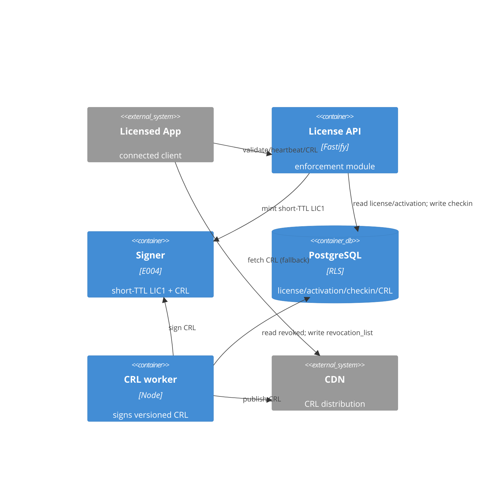

# Implementation Plan: Online Enforcement and Revocation

**Branch**: `00014-online-enforcement-and-revocation` | **Date**: 2026-07-18 | **Spec**: [spec.md](spec.md)

## Summary

**Goal**: Add an online-enforcement path — validate/heartbeat that renew a short-TTL token + a signed CRL fallback — so revocation reaches connected clients within a bounded window, without breaking offline-first.
**Approach**: A new `enforcement` module over the E006 runtime: reads E008 `license.status` + E009 `activation` + E007 entitlements, re-signs a short-TTL LIC1 via the E004 signer (per {SAD:ADR-0010}), records TTL-pruned check-ins for anti-replay, and a worker signs a versioned CRL served cacheable + as an air-gap file.
**Key Constraint**: Additive/offline-first preserved (never-connected clients untouched, not revoked-by-default); online validate/heartbeat p95<120ms; tenant-scoped + rate-limited.

## Technical Context

**Language/Version**: TypeScript 5.6 / Node 22 (ESM)
**Primary Dependencies**: Fastify 5, pg 8, Zod 3, @fastify/rate-limit, node:crypto; reuses the E004 signer + E001 verifier
**Storage**: PostgreSQL 16 (additive migration `0009_online_enforcement.sql`; forced RLS)
**Testing**: Vitest 2 + @testcontainers/postgresql
**Target Platform**: Linux container (self-host + managed)
**Project Type**: single (modular monolith server)
**Project Mode**: brownfield
**Performance Goals**: online validate/heartbeat p95 < 120 ms
**Constraints**: additive (offline verifier + E009 long-lived credential unchanged); tenant-scoped; rate-limited; no new key custody; CRL fail-open
**Scale/Scope**: per-connected-client renewal cadence << short-token TTL; per-(tenant,product) CRL

## Instructions Check

*GATE: Must pass before Phase 0 research. Re-check after Phase 1 design.*

| Principle | Status | Evidence |
|-----------|--------|----------|
| I. Offline-first / keys never exposed | PASS | Additive — E001 verifier + E009 offline credential unchanged; never-connected unaffected (FR-012); renewal + CRL signed by the EXISTING E004 keyring, no new custody ({SAD:ADR-0010}) |
| II. Multi-tenant isolation | PASS | validate/heartbeat/CRL tenant-scoped (FR-018); new `checkin`/`revocation_list` tables forced RLS under `licensesrv_app` |
| III. Single security core, audited | PASS | Reuses E001 verifier + E004 signer (no new crypto); outcomes + CRL publication audited append-only (FR-019) |
| Security reqs (rate-limit, anti-replay) | PASS | FR-021 rate-limits validate/heartbeat/CRL; FR-008 single-use nonce + idempotent replay |
| Cloud-agnostic / self-host / air-gap | PASS | CRL via CDN (fail-open) + downloadable signed file for air-gap (FR-010/011) |

**Gate: PASS** — no violations; Complexity Tracking omitted.

## Architecture



## Architecture Decisions

Feature-local only. The token + revocation MODEL is project-wide → **{SAD:ADR-0010}** (short-TTL LIC1 renewal primary + signed CRL fallback; not duplicated here).

| ID | Decision | Chosen | Rationale |
|----|----------|--------|-----------|
| AD-001 | Refusal signaling | `200` + `verdict` (valid/revoked/suspended/expired/deactivated); genuine faults use standard errors | validate/heartbeat are enforcement QUERIES, not mutations; a 4xx would conflate "revoked" with "bad request" |
| AD-002 | Anti-replay store | bounded, TTL-pruned `checkin` table (nonce UNIQUE per tenant, retained ≤ renewal window) | supports FR-008 idempotent replay (return the original token); E009's permanent nonce would grow unbounded on frequent beats |
| AD-003 | CRL content | projected on-demand from `license.status='revoked'`; only the signed versioned artifact stored in `revocation_list` | avoids status drift; signature is over byte-stable bytes; version advances monotonically |
| AD-004 | CRL scope + generation | per-(tenant,product), signed by that product's E004 key; a scheduled worker signs versioned artifacts (`next_update`) served cacheable | per-product keys; byte-stable + CDN-cacheable; bounds signer load vs sign-per-request |
| AD-005 | Renewal token | re-signed short-TTL LIC1 (near-term `exp` + signed server time), NOT persisted; `machine_bound_token` untouched | client's E001 verifier verifies it unchanged (offline-first); {SAD:ADR-0010} |
| AD-006 | Monotonic anchor | `activation.last_anchor_at timestamptz`, repo-enforced non-decreasing via guarded UPDATE | no trigger/counter; simplest anti-rollback anchor (FR-014) |
| AD-007 | Per-plan windows | app config keyed by plan (renewal window, heartbeat grace, CRL next_update, offline tolerance); additive `plan` columns deferred | matches NEW-CONFIG signal; no premature schema |

## Data Model Summary

| Entity | Key Fields | Relationships | Notes |
|--------|-----------|---------------|-------|
| `activation` (extended) | +`last_checkin_at`, +`last_anchor_at` | has_many `checkin` | additive ALTER; anchor monotonic; NULL = never-connected |
| `checkin` (new) | `(tenant_id,id)`, `activation_id`, `nonce` UNIQUE, `outcome`, `reason`, `renewed_token`, `created_at` | belongs_to `activation` | TTL-pruned anti-replay + idempotent replay; forced RLS; BRIN on `created_at` |
| `revocation_list` (new) | `(tenant_id,id)`, `product_id`, `version`, `generated_at`, `next_update`, `key_id`, `signature`, `revoked_ids` | per (tenant,product) | signed versioned CRL artifact; forced RLS |

**Detail**: [data-model.md](data-model.md). Migration: `migrations/0009_online_enforcement.sql` (expand-only after 0008). `license`/`activation`/`audit_log` reused, not re-modeled.

## API Surface Summary

| Method | Path | Purpose | Auth | Req/Res Types |
|--------|------|---------|------|---------------|
| POST | /v1/validate | Online validate → verdict + first short-TTL token | X-API-Key `validate`, tenant | `EnforcementRequest` → `EnforcementResult` |
| POST | /v1/heartbeat | Silent renewal; re-checks status/expiry/entitlements | X-API-Key `validate`, tenant | `EnforcementRequest` → `EnforcementResult` |
| GET | /v1/revocation-list | Signed versioned CRL (json or `?format=file`); cacheable to `next_update` | X-API-Key `validate`, tenant | query `productId` → `RevocationList` / 304 |

Refusals = `200` + verdict (AD-001). Errors: 400/401/403/404/409 `nonce_replayed`/429 `rate_limited`/503 `signer_unavailable`. **Detail**: [contracts/online-enforcement-api.openapi.yaml](contracts/online-enforcement-api.openapi.yaml).

## Testing Strategy

| Tier | Tool | Scope | Mock Boundary | Install |
|------|------|-------|---------------|---------|
| Unit | Vitest | verdict logic, short-TTL exp + signed-time, nonce idempotent replay, anchor monotonic, CRL projection | signer, clock | configured |
| Integration | Vitest + @testcontainers/postgresql | validate→token→heartbeat renew→revoke→refuse; RLS tenant isolation; CRL sign+verify + air-gap file; never-connected non-regression | none (real DB + signer) | configured |
| Security | semgrep + npm audit | no key material in tokens/CRL; rate-limit present; tenant-scope; anti-replay | — | configured |
| Performance | autocannon | validate/heartbeat p95 < 120 ms under nominal load (FR-020/SC-008); revocation-propagation ≤ renewal window (SC-004) measured | none (real app) | `npm i -D autocannon` (present) |
| Coverage | Vitest v8 | ≥80% gate on new `src/server/modules/enforcement/*` | — | configured |

## Error Handling Strategy

| Error Category | Pattern | Response | Retry |
|----------------|---------|----------|-------|
| Enforcement refusal (revoked/suspended/expired/deactivated) | evaluate + return verdict | `200` verdict + no token (bounded staleness) | no |
| Validation / auth / scope | fail-fast | 400 / 401 / 403 (standard Error shape) | no |
| Nonce replay | idempotent | 409 or return original result on exact retry | no |
| Signer fault (valid but can't sign) | fail-safe | 503 `signer_unavailable` (retry in grace window) | yes (client, bounded) |
| Rate limit | shed load | 429 + Retry-After | yes (backoff) |
| CRL/CDN fetch failure (client) | fail-open | fall back to token-TTL enforcement | — |

## Integration Points

| Reference | System/Service | Technical Approach | Contract |
|-----------|----------------|--------------------|----------|
| E008 license | issuance module + `migrations/0007` | read `status`/`expires_at`/entitlements as the online gate | in-process |
| E009 activation | activation module + `migrations/0008` | read `status` + `machine_bound_token`; write `last_checkin_at`/anchor | in-process |
| E004 signer/keyring | signing module | mint short-TTL LIC1 + sign the CRL | {SAD:ADR-0010} |
| E007 effective entitlements | `catalog/effective.ts` | current entitlements at renewal (FR-017) | in-process |
| E001 verifier core | verifier-core (client) | verifies the short-TTL LIC1 offline, unchanged | offline-first |
| CDN (external) | — | CRL distribution (fail-open) + downloadable air-gap file | FR-010/011 |
| @fastify/rate-limit | existing dep | rate-limit validate/heartbeat/CRL (FR-021) | plugin |

## Risk Mitigation

| Risk (from spec) | L | I | Mitigation | Owner |
|-------------------|---|---|------------|-------|
| Renewal-window vs load / false lockout | M | M | per-plan TTL config + heartbeat grace window (tolerate N missed beats) before lapse | enforcement config |
| CRL growth as revocations accumulate | M | M | versioned artifact + on-demand projection; delta/next_update; document delta-CRL follow-up | crl-worker |
| Pure-offline clock rollback not fully detectable | L | M | monotonic `last_anchor_at` + per-plan offline-tolerance window; disclose bounded exposure (accepted) | enforcement + docs |

## Requirement Coverage Map

| Req ID | Component(s) | File Path(s) |
|--------|--------------|--------------|
| FR-001 | validate handler | src/server/modules/enforcement/validate.ts, routes.ts |
| FR-002 | short-TTL LIC1 minting (reuse signer) | src/server/modules/enforcement/token.ts, modules/signing |
| FR-003 | heartbeat handler + last-seen | src/server/modules/enforcement/heartbeat.ts, db (checkin/activation) |
| FR-004 | status/expiry/entitlement re-check | src/server/modules/enforcement/enforce.ts (license+activation+effective read) |
| FR-005 | revoke/suspend non-renewal | src/server/modules/enforcement/enforce.ts |
| FR-006 | reinstate resumes renewal | src/server/modules/enforcement/enforce.ts |
| FR-007 | heartbeat grace window | src/server/modules/enforcement/config.ts, enforce.ts |
| FR-008 | nonce anti-replay + idempotent replay | src/server/modules/enforcement/checkin-repo.ts, migrations/0009 |
| FR-009 | signed versioned CRL | src/server/modules/enforcement/crl.ts, crl-worker.ts |
| FR-010 | CRL CDN + file distribution | src/server/modules/enforcement/revocation-list.ts (route), crl.ts |
| FR-011 | client fail-open semantics (documented) | contracts + docs |
| FR-012 | additive / never-connected unaffected | (non-regression — no offline path change) enforcement module boundary |
| FR-013 | staleness-window disclosure | revocation-list.ts (stalenessWindow), docs |
| FR-014 | signed server time + monotonic anchor | src/server/modules/enforcement/token.ts, activation anchor UPDATE |
| FR-015 | per-plan offline-tolerance | src/server/modules/enforcement/config.ts |
| FR-016 | configurable windows + defaults | src/server/config/index.ts, enforcement/config.ts |
| FR-017 | renewed token reflects entitlements | src/server/modules/enforcement/enforce.ts (effective read) |
| FR-018 | tenant scoping | src/server/modules/enforcement/* (withTenant/RLS) |
| FR-019 | audit outcomes + CRL publish | src/server/modules/enforcement/* (audit_log write) |
| FR-020 | p95<120ms | enforcement handlers (indexed reads; no OCSP) |
| FR-021 | rate-limiting | src/server/modules/enforcement/routes.ts (@fastify/rate-limit) |
| FR-022 | CRL monotonic version (server) + anti-downgrade (client, documented) | src/server/modules/enforcement/crl.ts, crl-worker.ts, contracts + docs |
| FR-023 | untrusted-CRL (signature-invalid) fallback (client, documented) | contracts + docs (distinct from FR-011 fetch fail-open) |

## Project Structure

### Source Code

```text
migrations/
  0009_online_enforcement.sql   + ALTER activation +2 cols; checkin + revocation_list tables; RLS/policy/grants/indexes
src/server/modules/enforcement/  + new module
  index.ts                      + registerEnforcement seam (deps: pool, signer, effective)
  routes.ts                     + POST /v1/validate, /v1/heartbeat, GET /v1/revocation-list (validate scope, rate-limited)
  validate.ts / heartbeat.ts    + handlers
  enforce.ts                    + shared status/expiry/entitlement re-check + verdict
  token.ts                      + re-sign short-TTL LIC1 (reuse E004 signer) + signed server time
  checkin-repo.ts               + TTL-pruned nonce store + idempotent replay + anchor update
  crl.ts / crl-worker.ts        + project revoked ids, sign versioned CRL, serve/publish
  config.ts                     + renewal window / heartbeat grace / CRL next_update / offline tolerance
  __tests__/                    + unit + testcontainers integration
src/server/modules/index.ts     ~ register enforcement (after signing/issuance/activation)
src/server/config/index.ts      ~ enforcement config keys
.github/workflows/enforcement.yml + CI (module + real-Postgres suite), mirroring activation.yml
```

**Patterns to reuse**: the `register<Module>` seam + `registerModules` ordering; `withTenant()` RLS choke point; the E009 `machine_bound_token` minting path (signer + LIC1 Claims); the E009 `nonce` anti-replay pattern (adapted to TTL-pruned); the expand/contract advisory-locked migration harness; `@fastify/rate-limit` as used by activation.
**Tests to extend**: the activation/issuance testcontainers integration pattern (RLS roles + migrations).
**Naming conventions**: `src/server/modules/<name>/`, camelCase, ESM; wire fields camelCase; env SCREAMING_SNAKE → camel config.

## Implementation Hints

- **[HINT-001]** Order: the short-TTL renewal token reuses the E004 signer + the exact LIC1 `Claims` shape (`src/server/modules/signing/token.ts`) with a near-term `exp` + a signed-server-time claim — reuse the E009 `machine_bound_token` minting path, do NOT invent a new token type ({SAD:ADR-0010}).
- **[HINT-002]** Constraint: refusals (revoked/suspended/expired/deactivated) are `200` + `verdict`, NOT 4xx (AD-001); only genuine protocol faults are errors. Map verdict→`checkin.outcome`/`reason`.
- **[HINT-003]** Gotcha: the `checkin` nonce store is TTL-pruned (retain ≤ renewal window) and idempotent — a duplicate nonce returns the ORIGINAL `renewed_token`, not a new one (FR-008). Not the E009 permanent nonce.
- **[HINT-004]** Constraint: the CRL is projected on-demand from `license.status='revoked'` but SIGNED as a byte-stable versioned artifact in `revocation_list`; the worker regenerates+signs on revocation / `next_update`; served cacheable (ETag + Cache-Control to `next_update`), same bytes for json + `?format=file`.
- **[HINT-005]** Gotcha: clock-tamper enforcement is CLIENT-side (persist anchor, reject rollback); the server only supplies signed server time + short `exp` + refuses renewal. A never-connected client's rollback is BOUNDED (offline-tolerance window), not prevented — disclosed (FR-013).
