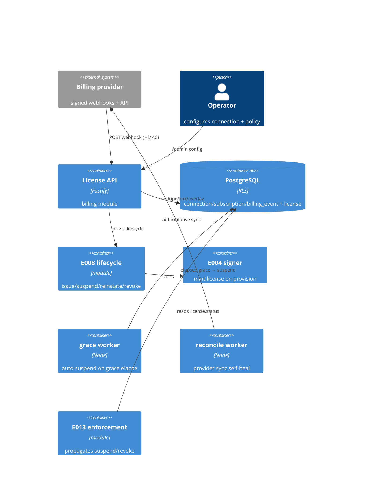

# Implementation Plan: Billing-driven Entitlement Automation

**Branch**: `00015-billing-driven-entitlement-automation` | **Date**: 2026-07-19 | **Spec**: [spec.md](spec.md)

## Summary

**Goal**: React to an external billing provider's signed webhooks to automatically provision/extend/grace/suspend/revoke licenses — verified, idempotent, grace-first — without charging or storing card data.
**Approach**: A new `billing` module: a signature-verified webhook endpoint (verify→dedupe→apply, per {SAD:ADR-0011}), per-provider adapters → one canonical event model, a subscription↔license link + grace overlay driving the E008 lifecycle, two fail-open workers (grace-expiry, reconciliation), and an operator config surface.
**Key Constraint**: Payment processing / card-PAN data PERMANENTLY out of scope (PCI-out-of-scope); at-least-once/out-of-order/lossy delivery (idempotency + stale-event guard + reconciliation); tenant-scoped; the E008 status enum unchanged (grace is additive).

## Technical Context

**Language/Version**: TypeScript 5.6 / Node 22 (ESM)
**Primary Dependencies**: Fastify 5, pg 8, Zod 3, @fastify/rate-limit, node:crypto (HMAC); reuses E008 lifecycle, E004 signer + keystore custody, E007 effective plan
**Storage**: PostgreSQL 16 (additive migration `0010_billing.sql`; forced RLS)
**Testing**: Vitest 2 + @testcontainers/postgresql
**Target Platform**: Linux container (self-host + managed)
**Project Type**: single (modular monolith server)
**Project Mode**: brownfield
**Performance Goals**: webhook ack fast (< ~200 ms); processing decoupled/reliable
**Constraints**: no charging / no card data; verify-before-process; idempotent (exactly-once); grace-first; tenant-scoped; provider optional (not a hard core dependency)
**Scale/Scope**: per-tenant provider connection(s); one subscription ↔ one license

## Instructions Check

*GATE: Must pass before Phase 0 research. Re-check after Phase 1 design.*

| Principle | Status | Evidence |
|-----------|--------|----------|
| I. Offline-first / keys never exposed | PASS | Provisioning issuance reuses the E004 signer (no new key custody); the webhook HMAC secret is a DISTINCT secret class, envelope-encrypted at rest (E004 custody), never returned (FR-015, `ConnectionPublic` has no secret field) |
| II. Multi-tenant isolation | PASS | `billing_connection`/`subscription`/`billing_event` forced-RLS; webhook resolves tenant from `{connectionId}`; events only affect that tenant (FR-014) |
| III. Single security core, audited | PASS | Reuses E008 lifecycle (no new crypto; HMAC is provider-auth, not license Ed25519); every billing mutation audited with the event id (FR-013) |
| Payment/card boundary | PASS | No charging, no card/PAN data — only billing metadata (FR-018); `payload_summary` minimized |
| Security reqs (verify/idempotency/rate-limit/secret) | PASS | FR-002 verify-before-process + timestamp recency; FR-003 idempotency; FR-019 rate-limit; FR-015 secret never returned + rotatable |
| Cloud-agnostic / self-host | PASS | Provider-agnostic adapters (FR-004); optional P2 add-on, not a hard dependency |

**Gate: PASS** — no violations; Complexity Tracking omitted.

## Architecture



## Architecture Decisions

Feature-local only. The billing-integration + external-event → lifecycle MODEL is project-wide → **{SAD:ADR-0011}** (not duplicated here).

| ID | Decision | Chosen | Rationale |
|----|----------|--------|-----------|
| AD-001 | Webhook auth | provider HMAC signature over the RAW body + timestamp recency (a distinct `providerSignature` scheme, NOT X-API-Key/session); tenant+connection resolved from `{connectionId}` | external caller; verify-before-process; needs a raw-body content-type parser scoped to the route |
| AD-002 | Idempotency | `UNIQUE(tenant_id, provider, provider_event_id)` + `ON CONFLICT DO NOTHING` in-tx with the side effect | exactly-once under at-least-once delivery (FR-003); a duplicate is a response value, never a 2nd row |
| AD-003 | Grace modeling | `subscription.billing_state` overlay (active/past_due/grace/canceled/refunded) drives the E008 `active↔suspended`; NOT a new license status | keeps `license.status` = enforcement truth + offline-token semantics unchanged ({SAD:ADR-0011}) |
| AD-004 | Webhook-secret storage | envelope-encrypt-at-rest reusing E004 keystore custody (lower tier — must be readable to recompute HMAC); rotate via `signing_secret_ref` + `signing_secret_prev` + transition window; never returned | provider inbound-HMAC secret ≠ Ed25519 signing key; FR-015 |
| AD-005 | Provider abstraction | thin per-provider adapters normalize to ONE canonical event model (type, subscription id, tenant, occurred-at, event id) | provider quirks isolated from core lifecycle logic (FR-004) |
| AD-006 | Grace-expiry + reconciliation | two scheduled FAIL-OPEN workers in `main.ts` (E012 pattern); grace expiry is TIME-driven, not solely webhook-driven | a down app / missed webhook still suspends on next run (FR-008/017) |
| AD-007 | Stale-event guard | compare event `occurred_at` vs `subscription.last_applied_event_at`; ignore older; UPSERT | out-of-order delivery can't regress state (FR-016) |
| AD-008 | Ack shape | `200/202 {received, outcome: applied\|duplicate\|deadletter}`; refusals internal; unmapped → deadletter (not an error); signature/schema failure → reject inline | provider needs a fast ack; FR-019/020 |

## Data Model Summary

| Entity | Key Fields | Relationships | Notes |
|--------|-----------|---------------|-------|
| `billing_connection` (new) | `(tenant_id,id)`, `provider` CHECK, `signing_secret_ref`/`_prev` + `secret_rotated_at`, `plan_map` jsonb, grace policy, `status` | per tenant | secret envelope-encrypted, never returned; RLS; a `billing_connection_public` view excludes the secret |
| `subscription` (new) | `(tenant_id,id)`, `provider`+`external_subscription_id` UNIQUE, `license_id` FK, `billing_state` CHECK, `grace_expires_at`, `last_applied_event_at` | 1:1 `license` (UNIQUE), belongs_to connection | subscription↔license link + grace overlay; RLS |
| `billing_event` (new) | `(tenant_id,id)`, `provider`+`provider_event_id` UNIQUE (idempotency), `type`, `subscription_id?`, `occurred_at`, `outcome` CHECK, `reason`, `payload_summary` | belongs_to subscription (nullable) | append-only ledger (SELECT/INSERT only); dead-letter = `outcome='deadletter'`; no card/PAN; retention-bounded |

**Detail**: [data-model.md](data-model.md). Migration `migrations/0010_billing.sql` (expand-only after 0009). `license`/`customer`/`audit_log` reused, not re-modeled; the E008 status enum is UNCHANGED.

## API Surface Summary

| Method | Path | Purpose | Auth | Req/Res |
|--------|------|---------|------|---------|
| POST | /v1/billing/webhooks/{connectionId} | Ingest a signed event (verify→dedupe→apply) | `providerSignature` (HMAC raw body), rate-limited | `WebhookEnvelope` → `WebhookAck` |
| GET/POST/PATCH | /admin/billing/connections[/{id}] | Connect/list/update a provider (secret write-only) | session + RBAC `admin` + CSRF | `Connection*` → `ConnectionPublic` |
| POST | /admin/billing/connections/{id}/rotate-secret | Rotate signing secret (old+new window) | session + `admin` + CSRF | `RotateSecretRequest` → `ConnectionPublic` |
| GET | /admin/billing/subscriptions | List subscriptions + state/grace/license | session + `viewer` | → `SubscriptionList` |
| GET | /admin/billing/events | Ledger incl. dead-letter | session + `viewer` | → `BillingEventList` |
| POST | /admin/billing/reconcile | On-demand reconciliation (async) | session + `admin` + CSRF | → `202 {jobId}` |

**Detail**: [contracts/billing-api.openapi.yaml](contracts/billing-api.openapi.yaml). Signature/timestamp failures → 401/400 (no state change); duplicate → 200 `duplicate`; unmapped → 200 `deadletter`.

## Testing Strategy

| Tier | Tool | Scope | Mock Boundary | Install |
|------|------|-------|---------------|---------|
| Unit | Vitest | HMAC verify (test vectors) + timestamp tolerance, idempotency dedup, event→lifecycle mapper (each type), grace-expiry compute, stale-event guard, adapter normalization | pool, provider, clock | configured |
| Integration | Vitest + @testcontainers/postgresql | webhook → verify → dedupe → E008 lifecycle change (real license); duplicate idempotent; bad-sig reject; cancel→grace→(worker)→suspend; refund→revoke; RLS isolation; secret never returned; reconciliation | none (real DB + E008 signer) | configured |
| Security | semgrep + npm audit | no card data anywhere; secret never in a response; constant-time HMAC compare; tenant scope; rate-limit | — | configured |
| Coverage | Vitest v8 | ≥80% line+branch on new `src/server/modules/billing/*` | — | configured |

## Error Handling Strategy

| Error Category | Pattern | Response | Retry |
|----------------|---------|----------|-------|
| Invalid/missing signature | reject inline (fail-closed) | `401 invalid_signature`, no state change, never enqueued | no |
| Stale timestamp | reject inline | `400 stale_timestamp` | no |
| Unknown connection | fail-safe | `404 connection_not_found` (unguessable uuid) | no |
| Duplicate event | idempotent | `200 {outcome:"duplicate"}` (applied once) | no |
| Unmapped / failed-after-ack | dead-letter | `200 {outcome:"deadletter"}` recorded for operator | replayable |
| Stale/out-of-order event | recency guard | ignored (no regression) | no |
| Rate limit (per-connection + per-source-IP) | shed load | `429` + Retry-After | yes (provider) |
| Admin validation/auth/CSRF | fail-fast | 400/401/403 (standard Error) | no |

## Integration Points

| Reference | System/Service | Technical Approach | Contract |
|-----------|----------------|--------------------|----------|
| E008 lifecycle/issuance | issuance module | drive issue/suspend/reinstate/revoke; provision via issuance | in-process |
| E004 signer + keystore custody | signing module | mint license on provision; envelope-encrypt the webhook secret | in-process |
| E007 effective plan | catalog/effective.ts | resolve `plan_map` → catalog product/plan on provision | in-process |
| E013 enforcement | enforcement module | propagates the suspend/revoke E014 sets (reads `license.status`) | automatic |
| Billing provider (external) | Stripe/Paddle/… | signed webhooks in; reconciliation calls the provider API out | provider adapter |
| Console session + RBAC + CSRF | console module | operator config surface (admin/viewer) | in-process |
| @fastify/rate-limit | existing dep | rate-limit the webhook per-connection AND per-source-IP (the per-IP limit bounds unknown/invalid `{connectionId}` floods before signature verify) (FR-019) | plugin |

## Risk Mitigation

| Risk (from spec) | L | I | Mitigation | Owner |
|-------------------|---|---|------------|-------|
| At-least-once / out-of-order / dropped delivery | H | M | idempotency (event-id UNIQUE) + stale-event recency guard + reconciliation worker | ledger-repo, events, reconcile-worker |
| Missed webhook leaves wrong billing state | M | M | periodic reconciliation (authoritative provider sync) + on-demand `/admin/billing/reconcile` | reconcile-worker |
| Provider signature/schema differences | M | L | thin per-provider adapter normalizing to one canonical model | adapters/ |

## Requirement Coverage Map

| Req ID | Component(s) | File Path(s) |
|--------|--------------|--------------|
| FR-001 | webhook endpoint | src/server/modules/billing/routes.ts, webhook.ts |
| FR-002 | signature + timestamp verify | src/server/modules/billing/signature.ts |
| FR-003 | idempotency dedup | src/server/modules/billing/ledger-repo.ts, migrations/0010 |
| FR-004 | adapter + canonical model | src/server/modules/billing/adapters/, events.ts |
| FR-005 | provision (issue via E008) | src/server/modules/billing/lifecycle.ts, modules/issuance |
| FR-006 | extend on renewal | src/server/modules/billing/lifecycle.ts |
| FR-007 | grace on cancel/fail | src/server/modules/billing/lifecycle.ts, subscription-repo.ts |
| FR-008 | auto-suspend on grace elapse | src/server/modules/billing/grace-worker.ts |
| FR-009 | recovery on payment | src/server/modules/billing/lifecycle.ts |
| FR-010 | refund/chargeback → revoke | src/server/modules/billing/lifecycle.ts |
| FR-011 | grace config | src/server/modules/billing/config.ts, connection (grace policy) |
| FR-012 | subscription↔license link | src/server/modules/billing/subscription-repo.ts, migrations/0010 |
| FR-013 | audit with event id (+ synthetic system actor for the time-driven workers) | src/server/modules/billing/lifecycle.ts (writeAudit), grace-worker.ts, reconcile-worker.ts |
| FR-014 | tenant scoping | src/server/modules/billing/* (withTenant/RLS) |
| FR-015 | operator config + secret rotation | src/server/modules/billing/connection-repo.ts, routes.ts (admin), signing custody |
| FR-016 | stale-event guard | src/server/modules/billing/events.ts |
| FR-017 | reconciliation | src/server/modules/billing/reconcile-worker.ts, routes.ts (admin) |
| FR-018 | no card data / PCI boundary | src/server/modules/billing/adapters/ (payload_summary minimized), data-model |
| FR-019 | rate-limit (per-connection + per-source-IP, pre-resolution) + fast ack | src/server/modules/billing/routes.ts |
| FR-020 | dead-letter | src/server/modules/billing/ledger-repo.ts |
| FR-021 | GDPR retention of billing metadata | migrations/0010 (retention-bounded ledger), data-model |
| FR-022 | webhook signing-secret custody + rotation window | src/server/modules/billing/connection-repo.ts, signing custody (E004 keystore), data-model §4 |

## Project Structure

### Source Code

```text
migrations/0010_billing.sql                + billing_connection + subscription + billing_event (RLS/grants/indexes; UNIQUE idempotency + 1:1 link)
src/server/modules/billing/                + new module (see Requirement Coverage Map for per-file FR mapping)
  index.ts routes.ts webhook.ts signature.ts events.ts lifecycle.ts
  adapters/{stripe,generic}.ts  connection-repo.ts subscription-repo.ts ledger-repo.ts
  grace-worker.ts reconcile-worker.ts config.ts  __tests__/
src/server/app.ts                          ~ raw-body content-type parser scoped to the webhook route (HMAC needs raw bytes)
src/server/modules/index.ts                ~ register billing (after issuance/activation/enforcement)
src/server/main.ts                         ~ start grace + reconcile workers fail-open (tied to app.close())
src/server/config/index.ts                 ~ billing config keys
src/admin-ui/ (console)                     ~ minimal operator billing surface (connection + mapping + grace) — US5
.github/workflows/billing.yml              + CI (module + real-Postgres suite), mirroring activation.yml
```

**Patterns to reuse**: the `register<Module>` seam + ordering; `withTenant()` RLS choke point; the E008 issuance/lifecycle services; the E004 keystore custody (secret envelope encryption); `@fastify/rate-limit` + the console session/RBAC/CSRF from E008 admin routes; the E012 fail-open worker-startup in `main.ts`; the expand/contract advisory-locked migration harness; Zod validation + `{code,message,details?}` errors.
**Tests to extend**: the issuance/activation testcontainers integration pattern (RLS + migrations + real signer).
**Naming conventions**: `src/server/modules/<name>/`, camelCase, ESM; wire fields camelCase; env SCREAMING_SNAKE → camel config.

## Implementation Hints

- **[HINT-001]** Gotcha: HMAC verification needs the RAW request body — register a raw-body content-type parser SCOPED to the webhook route (or capture the buffer) WITHOUT breaking JSON parsing on the other routes; verify BEFORE any parse (AD-001, FR-002).
- **[HINT-002]** Constraint: idempotency = the `UNIQUE(tenant_id, provider, provider_event_id)` insert `ON CONFLICT DO NOTHING` IN THE SAME TX as the lifecycle side effect (AD-002) — a duplicate returns `outcome:"duplicate"`, never a second row or a re-applied change (FR-003).
- **[HINT-003]** Gotcha: grace is an OVERLAY on `subscription.billing_state`, NOT a `license.status` value — the E008 enum is untouched; drive `active↔suspended` through the E008 lifecycle services; grace-elapse → suspend runs in the TIME-driven worker, not only on webhook arrival (AD-003/006).
- **[HINT-004]** Constraint: the webhook signing secret is envelope-encrypted via E004 custody, never returned by any API (the `ConnectionPublic` response has no secret field), rotatable (current+prev accepted during the window) — a DISTINCT secret class from the Ed25519 signing key (AD-004, FR-015).
- **[HINT-005]** Constraint: store NO card/PAN data — persist only a minimized allow-listed `payload_summary`; the workers are fail-open (a provider/reconcile fault never crashes the app); stale events (older `occurred_at`) are ignored (FR-016/018, AD-006/007).
