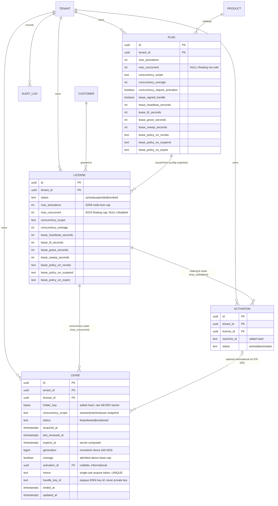

# Data Model — Floating & Concurrent Seats (E015)

**Branch**: `00016-floating-and-concurrent-seats` | **Migration**: `migrations/0011_leases.sql` (sequential after `0010_billing.sql`) | **Spec**: [spec.md](spec.md) | **Plan**: [plan.md](plan.md)

Raw SQL only (node-postgres migrations; no ORM). Matches the house conventions proven by `0007_licensing.sql` / `0008_activation.sql` / `0009_online_enforcement.sql` / `0010_billing.sql`: `PRIMARY KEY (tenant_id, id)`, intra-tenant composite FKs `(tenant_id, x)` with `ON DELETE NO ACTION`, `ENABLE`+`FORCE ROW LEVEL SECURITY`, a `tenant_isolation` policy keyed on the `app.current_tenant` GUC, tenant-leading indexes, and least-privileged grants to the non-owner `licensesrv_app` role (no `DELETE` where rows end by a soft status flip).

> **GUC name**: the existing migrations key RLS on `current_setting('app.current_tenant', true)` (not `app.tenant_id`). This model uses the real GUC name to stay byte-compatible with `withTenant`.

## 1. Entities

### Lease *(new — `lease` table)*
A transient record that **one holder occupies one concurrency seat** of a license for a bounded, renewable period. One `live` lease consumes exactly one seat; `released`/`reclaimed` leases consume none.

- **Identity**: `(tenant_id, id)`. The holder is identified only by `holder_key` — a salted **hash** of a CLIENT-SUPPLIED opaque holder reference, scoped per the plan's `concurrency_scope` (session / machine / user, FR-023). The raw reference is NEVER stored or logged (FR-001/FR-020/SC-015).
- **Lifecycle** (`status`): `live` → `released` (graceful exit / admin force-release) or `live` → `reclaimed` (sweeper on TTL+grace lapse, or revoke-reclaim). Terminal states never return to `live`; the holder must acquire a new lease.
- **Server-authoritative timing**: `expires_at` is always server-computed (`last_renewed_at + lease_ttl_seconds`); a client wall clock never determines whether a seat is held (FR-009).
- **Stale-renew fence**: `generation` (monotonic bigint, AD-003) is bumped on each renew; a renew must match the current generation under `status='live' AND expires_at > now()`, so a late renew racing a reclaim touches 0 rows and is rejected (FR-011).
- **Anti-replay**: `nonce` is the single-use client-supplied acquire idempotency token (`UNIQUE (tenant_id, nonce)`, FR-014); a replayed acquire returns the original lease, consuming no second seat.
- **Optional node-lock link**: `activation_id` is a nullable, purely **informational** reference to an E009 activation for dual-cap products (FR-025); concurrency and node-lock remain independent dimensions by default.
- **Handle**: `handle_key_id` stores only the OPAQUE E004 signing-key id of the returned lease handle — never a signing private key or lease secret (FR-022/SC-015); NULL under a plain-authorization deployment.
- **Retention**: rows are pseudonymous (salted-hash holder_key) and GDPR-erasable; terminal leases are purged by the platform retention path (the app role has no `DELETE`), mirroring E009 activation / E013 checkin / E014 billing_event.

### Plan *(expanded — E007 `plan`)*
Gains expand-only concurrency configuration authored on the plan (E007 owns the authoring UI; this epic only adds the attributes + enforcement). `max_concurrent` NULL ⇒ this plan does not sell floating seats. `concurrency_require_activation` and `lease_signed_handle` are plan-level behavior toggles read live at acquire.

### License *(expanded — E008 `license`)*
Gains a **snapshot at issuance** of the plan's concurrency config (`max_concurrent`, scope, overage, lifecycle timings, per-reason live-lease policy) — exactly like `max_activations` (AD-006). The snapshot immunizes a live lease's seat behavior from later plan edits. `max_concurrent` NULL ⇒ no floating entitlement ⇒ acquire refused fail-closed with a distinct reason (FR-005/SC-019). License `status` (`active`/`suspended`/`revoked`, E008, unchanged) gates new acquires and, per the snapshot's per-reason policy, drives revoke-reclaim vs lapse-on-timer of live leases (FR-024).

### Activation *(referenced — E009 `activation`, unchanged)*
The node-lock binding (`max_activations` dimension). A lease MAY reference an activation via the optional composite FK when a product enforces both a device cap and a concurrency cap; the caps are counted independently (FR-005/FR-025).

### Audit Log *(referenced — E002 `audit_log`, unchanged, append-only)*
Every acquire / renew / release / reclaim / force-release / denial / rate-limit event is recorded here (FR-018); each over-base (soft-cap overage) acquisition is metered here with the concurrency level reached for later true-up (FR-013). No card data, raw hardware identifiers, or secrets (FR-013/FR-018/SC-015). The `lease` table does not FK to `audit_log`; the relationship is logical (both tenant-scoped, append-only INSERT+SELECT).

## 2. Migration DDL — `migrations/0011_leases.sql`

```sql
-- E015 floating & concurrent seat leases (FR-001..FR-026). Extends the E002 tenancy substrate, the E007
-- plan catalog, the E008 license table, and the E009 activation table (expand-only, sequential after
-- 0010_billing.sql). NO changes to any EXISTING column. Adds concurrency config columns on `plan` (E007),
-- snapshots them onto `license` (E008) alongside max_activations, and adds ONE new tenant-owned table:
-- `lease` (a transient concurrency-seat occupancy). Same tenant-scoped forced-RLS + composite-FK +
-- append-only-audit pattern as 0007/0008/0009/0010.
--
-- A lease binds ONE license seat to ONE pseudonymous holder for a bounded, renewable period. The holder is
-- identified ONLY by a salted-hash holder_key derived from a CLIENT-SUPPLIED opaque reference scoped per the
-- plan's concurrency_scope (session|machine|user) -- the raw reference is NEVER stored/logged
-- (FR-001/FR-020/SC-015). Concurrency (max_concurrent) is a NEW dimension INDEPENDENT of the E009 node-lock
-- max_activations (FR-005): absent max_concurrent => floating disabled, acquire fail-closed (SC-019).
--
-- Seat usage = COUNT(*) of LIVE leases for a license; the effective cap is max_concurrent + concurrency_overage
-- (default 0 = hard cap, FR-012). The cap is enforced race-safely IN THE SERVICE LAYER by a per-license
-- pg_advisory_xact_lock(license_id) wrapping count+insert (AD-001) -- a naive `WHERE live_count < cap` check
-- races and OVER-ALLOCATES; NO DB trigger is used. Reclaim<->renew are mutually exclusive via a monotonic
-- `generation` fence + status/expiry predicate on the renew UPDATE (AD-003, FR-011): a late renew after a
-- reclaim matches 0 rows and is rejected. Dead-machine leases are reclaimed by a fail-open time-driven
-- sweeper once expires_at + grace < now (AD-002, FR-010); the same sweep path serves revoke-reclaim (FR-024).
--
-- Retention: lease rows are pseudonymous (holder_key is a salted hash) and GDPR-erasable; released/reclaimed
-- leases are purged by the platform retention path (least-privileged app role has NO DELETE), mirroring the
-- E009 activation / E013 checkin / E014 billing_event retention model.

-- 1. plan (E007) -- expand-only concurrency config. All new columns are additive; existing rows take the
--    defaults (max_concurrent NULL => this plan does NOT sell floating seats -> acquire fail-closed, FR-005).
ALTER TABLE plan
  ADD COLUMN max_concurrent                 int,                             -- concurrency cap (live-lease limit); NULL = floating NOT entitled (FR-005), independent of max_activations
  ADD COLUMN concurrency_scope              text    NOT NULL DEFAULT 'session',  -- seat-counting unit (FR-023): one live lease per (license, holder-key)
  ADD COLUMN concurrency_overage            int     NOT NULL DEFAULT 0,      -- absolute soft-cap allowance above base; 0 = hard cap. effective cap = max_concurrent + overage (FR-012)
  ADD COLUMN concurrency_require_activation boolean NOT NULL DEFAULT false,  -- optional "activated-devices-only" floating gating (FR-025); OFF by default
  ADD COLUMN lease_signed_handle            boolean NOT NULL DEFAULT true,   -- return an E004-signed short-TTL lease handle on acquire/renew (FR-022); per-deployment opt-out
  ADD COLUMN lease_heartbeat_seconds        int     NOT NULL DEFAULT 600,    -- heartbeat/renew cadence, default 10 min (FR-009)
  ADD COLUMN lease_ttl_seconds              int     NOT NULL DEFAULT 1800,   -- lease TTL, default 30 min; expires_at = server_now + this (FR-009)
  ADD COLUMN lease_grace_seconds            int     NOT NULL DEFAULT 300,    -- grace window before reclamation, default 5 min (FR-010)
  ADD COLUMN lease_sweep_seconds            int     NOT NULL DEFAULT 60,     -- reclaim-sweeper interval, default 1 min (FR-010)
  ADD COLUMN lease_policy_on_revoke         text    NOT NULL DEFAULT 'reclaim',  -- live-lease effect on license REVOKE (FR-024): reclaim => proactive; timer => lapse on TTL+grace
  ADD COLUMN lease_policy_on_suspend        text    NOT NULL DEFAULT 'timer',    -- live-lease effect on license SUSPEND (FR-024)
  ADD COLUMN lease_policy_on_expire         text    NOT NULL DEFAULT 'timer';    -- live-lease effect on license EXPIRE  (FR-024)

ALTER TABLE plan
  ADD CONSTRAINT plan_max_concurrent_valid     CHECK (max_concurrent IS NULL OR max_concurrent > 0),
  ADD CONSTRAINT plan_concurrency_scope_valid  CHECK (concurrency_scope IN ('session','machine','user')),
  ADD CONSTRAINT plan_concurrency_overage_nn   CHECK (concurrency_overage >= 0),
  ADD CONSTRAINT plan_lease_timings_positive   CHECK (lease_heartbeat_seconds > 0 AND lease_ttl_seconds > 0
                                                      AND lease_grace_seconds >= 0 AND lease_sweep_seconds > 0),
  -- FR-009 invariant: TTL >= 3x heartbeat so a single missed heartbeat NEVER reclaims a live seat.
  ADD CONSTRAINT plan_lease_ttl_ge_3x_hb       CHECK (lease_ttl_seconds >= 3 * lease_heartbeat_seconds),
  ADD CONSTRAINT plan_lease_policy_valid       CHECK (lease_policy_on_revoke  IN ('reclaim','timer')
                                                      AND lease_policy_on_suspend IN ('reclaim','timer')
                                                      AND lease_policy_on_expire  IN ('reclaim','timer'));

-- 2. license (E008) -- SNAPSHOT of the plan's concurrency config at ISSUANCE (like max_activations, AD-006),
--    so a later plan edit never mutates an already-issued license's seat behavior. max_concurrent NULL = the
--    license carries no floating entitlement => acquire refused fail-closed (SC-019). (The gating + handle
--    toggles stay plan-level, read live at acquire; only the enforcement-governing values are snapshotted.)
ALTER TABLE license
  ADD COLUMN max_concurrent          int,
  ADD COLUMN concurrency_scope       text NOT NULL DEFAULT 'session',
  ADD COLUMN concurrency_overage     int  NOT NULL DEFAULT 0,
  ADD COLUMN lease_heartbeat_seconds int  NOT NULL DEFAULT 600,
  ADD COLUMN lease_ttl_seconds       int  NOT NULL DEFAULT 1800,
  ADD COLUMN lease_grace_seconds     int  NOT NULL DEFAULT 300,
  ADD COLUMN lease_sweep_seconds     int  NOT NULL DEFAULT 60,
  ADD COLUMN lease_policy_on_revoke  text NOT NULL DEFAULT 'reclaim',
  ADD COLUMN lease_policy_on_suspend text NOT NULL DEFAULT 'timer',
  ADD COLUMN lease_policy_on_expire  text NOT NULL DEFAULT 'timer';

ALTER TABLE license
  ADD CONSTRAINT license_max_concurrent_valid    CHECK (max_concurrent IS NULL OR max_concurrent > 0),
  ADD CONSTRAINT license_concurrency_scope_valid CHECK (concurrency_scope IN ('session','machine','user')),
  ADD CONSTRAINT license_concurrency_overage_nn  CHECK (concurrency_overage >= 0),
  ADD CONSTRAINT license_lease_timings_positive  CHECK (lease_heartbeat_seconds > 0 AND lease_ttl_seconds > 0
                                                        AND lease_grace_seconds >= 0 AND lease_sweep_seconds > 0),
  ADD CONSTRAINT license_lease_ttl_ge_3x_hb      CHECK (lease_ttl_seconds >= 3 * lease_heartbeat_seconds),
  ADD CONSTRAINT license_lease_policy_valid      CHECK (lease_policy_on_revoke  IN ('reclaim','timer')
                                                        AND lease_policy_on_suspend IN ('reclaim','timer')
                                                        AND lease_policy_on_expire  IN ('reclaim','timer'));

-- 3. lease -- tenant-scoped, transient concurrency-seat occupancy. ONE live lease = ONE consumed seat.
CREATE TABLE lease (
  id                uuid        NOT NULL,
  tenant_id         uuid        NOT NULL REFERENCES tenant(id),
  license_id        uuid        NOT NULL,
  holder_key        bytea       NOT NULL,                      -- salted HASH of a client-supplied opaque holder reference, scoped per concurrency_scope (FR-001/023); raw ref NEVER stored (SC-015)
  concurrency_scope text        NOT NULL,                      -- scope snapshot in force when acquired (session|machine|user); self-describing for audit/registry
  status            text        NOT NULL DEFAULT 'live'
                      CHECK (status IN ('live','released','reclaimed')),  -- seat lifecycle: live (holds a seat) -> released (graceful/force) | reclaimed (sweeper/revoke)
  acquired_at       timestamptz NOT NULL DEFAULT now(),        -- first bind time; unchanged by renew
  last_renewed_at   timestamptz NOT NULL DEFAULT now(),        -- server time of the last successful renew/heartbeat (FR-007)
  expires_at        timestamptz NOT NULL,                      -- SERVER-computed seat expiry = last_renewed_at + ttl (FR-009); client wall clock is NEVER trusted
  generation        bigint      NOT NULL DEFAULT 0,            -- monotonic fence; bumped on each renew; renew guarded by generation match => a stale renew after reclaim hits 0 rows (AD-003/FR-011)
  overage           boolean     NOT NULL DEFAULT false,        -- true if admitted ABOVE the base cap under a soft cap; the AUTHORITATIVE meter is the append-only audit entry (FR-013)
  activation_id     uuid,                                      -- OPTIONAL informational node-lock activation reference (FR-025); NULL by default (concurrency independent of node-lock)
  nonce             text        NOT NULL,                      -- single-use client-supplied acquire idempotency/anti-replay token (FR-014); a replay returns the ORIGINAL lease
  handle_key_id     text,                                      -- OPAQUE E004 signing-key id of the lease handle (public; NEVER the private key/secret, SC-015); NULL under plain-authorization (FR-022)
  ended_at          timestamptz,                               -- set when status leaves 'live' (release or reclaim); drives the retention prune
  updated_at        timestamptz NOT NULL DEFAULT now(),        -- bumped on every edit (renew, release, reclaim)
  PRIMARY KEY (tenant_id, id),
  -- intra-tenant composite FK: a lease can never bind to another tenant's license. ON DELETE NO ACTION
  -- (FR-021): a license with any lease can NOT be hard-deleted; leases end by soft transition, never cascade.
  CONSTRAINT lease_license_fk
    FOREIGN KEY (tenant_id, license_id) REFERENCES license (tenant_id, id) ON DELETE NO ACTION,
  -- OPTIONAL intra-tenant composite FK to the INFORMATIONAL node-lock activation (FR-025). MATCH SIMPLE: a
  -- NULL activation_id is unconstrained. ON DELETE NO ACTION for codebase uniformity (activations are
  -- soft-deactivated, never hard-deleted; retention prunes in dependency order). SET NULL would be an
  -- acceptable alternative since the reference is purely informational.
  CONSTRAINT lease_activation_fk
    FOREIGN KEY (tenant_id, activation_id) REFERENCES activation (tenant_id, id) ON DELETE NO ACTION,
  -- anti-replay/idempotency store-and-replay (FR-014, SC-011): a reused acquire token is DB-rejected so no
  -- replay forges a second seat; a same-request retry surfaces the violation and replays the ORIGINAL lease.
  CONSTRAINT lease_nonce_uniq UNIQUE (tenant_id, nonce),
  CONSTRAINT lease_generation_nonneg CHECK (generation >= 0),
  CONSTRAINT lease_scope_valid       CHECK (concurrency_scope IN ('session','machine','user')),
  -- shape: a live lease has no end time; a terminal (released/reclaimed) lease records one.
  CONSTRAINT lease_ended_shape CHECK (
    (status = 'live' AND ended_at IS NULL) OR (status <> 'live' AND ended_at IS NOT NULL))
);

-- At most ONE live lease per (license, holder-key): the seat-uniqueness invariant (FR-023, Key Entities).
-- Partial (WHERE status='live') so an idempotent re-acquire by the SAME holder cannot double a seat, while a
-- re-acquire AFTER release/reclaim is still allowed (terminal rows are not constrained). Mirrors E009's
-- activation_one_active. NOTE: this bounds the SAME holder; the AGGREGATE cap (count <= effective cap) is the
-- service-layer advisory-lock count+insert (AD-001), not this index.
CREATE UNIQUE INDEX lease_one_live
  ON lease (tenant_id, license_id, holder_key)
  WHERE status = 'live';

-- Live-seat count (COUNT(*) ... WHERE status='live') + per-license registry reads (FR-015) via the
-- (tenant_id, license_id) prefix. Tenant_id-leading, matching the RLS predicate; E002 convention.
CREATE INDEX lease_seat ON lease (tenant_id, license_id, status);

-- Reclaim-sweeper predicate (FR-010): scan LIVE leases whose expires_at (+ grace) has lapsed. A PARTIAL
-- btree on the hot, small live set keyed by expiry serves the range scan far better than a full/BRIN scan.
CREATE INDEX lease_reclaim ON lease (tenant_id, expires_at) WHERE status = 'live';

-- Age-based retention prune of TERMINAL (released/reclaimed) leases -> BRIN on the time-ordered end column,
-- matching E013 checkin_prune / E014 billing_event_prune.
CREATE INDEX lease_prune ON lease USING brin (ended_at);

-- RLS: same form as E002 (0002) / E008 (0007) / E009 (0008) / E014 (0010). Unset GUC -> NULL -> zero rows
-- (refuse unscoped access); cross-tenant lease reference resolves to not found (FR-019/SC-012).
ALTER TABLE lease ENABLE ROW LEVEL SECURITY; ALTER TABLE lease FORCE ROW LEVEL SECURITY;

CREATE POLICY tenant_isolation ON lease
  USING (tenant_id = NULLIF(current_setting('app.current_tenant', true), '')::uuid)
  WITH CHECK (tenant_id = NULLIF(current_setting('app.current_tenant', true), '')::uuid);

-- No DELETE grant: a lease ends by a soft status flip (release/reclaim are UPDATEs, not DELETEs), exactly
-- like E009 activation. Bounded/GDPR deletion of terminal, pseudonymous lease rows is the platform
-- retention/erase path (owner role), NOT the least-privileged app role. The additive plan/license columns
-- are covered by E007/E008's existing table-level grants (no new grant needed).
GRANT SELECT, INSERT, UPDATE ON lease TO licensesrv_app;
```

### Race-safe acquire (service-layer locking, AD-001 — documented, not a DB trigger)

Enforcing `live_count <= effective_cap` with a bare `WHERE (SELECT count(*) ...) < cap` **races**: two concurrent transactions each read `count = cap-1`, both insert, and the seat is over-allocated. The schema supports the correct pattern in the service layer, all in ONE transaction so the lock auto-releases at commit:

```sql
BEGIN;
  -- 1. serialize ONLY the hot license row (tiny critical section; license_id is a globally-unique uuid).
  SELECT pg_advisory_xact_lock(hashtextextended(license_id::text, 0));
  -- 2. authoritative live count under the lock.
  SELECT count(*) FROM lease WHERE license_id = $1 AND status = 'live';   -- (RLS also scopes tenant)
  -- 3. if count < (max_concurrent + concurrency_overage): INSERT the lease; else refuse (no partial row).
  INSERT INTO lease (...) VALUES (...);
COMMIT;   -- advisory xact lock releases here
```

This mirrors E009's proven race-safe seat locking (E009 uses `SELECT ... FOR UPDATE` on the license row; AD-001 chooses a per-license `pg_advisory_xact_lock` for the concurrency dimension). The `lease_one_live` partial unique index is a second, independent guard for the SAME holder (idempotent re-acquire); the advisory lock guards the AGGREGATE cap across DIFFERENT holders.

### Guarded renew (fence, AD-003/FR-011 — documented)

```sql
UPDATE lease
   SET last_renewed_at = now(),
       expires_at      = now() + make_interval(secs => $ttl_seconds),
       generation      = generation + 1,
       updated_at      = now()
 WHERE tenant_id  = $tenant
   AND id         = $lease_id
   AND status     = 'live'
   AND expires_at > now()
   AND generation = $expected_generation
 RETURNING id, expires_at, generation;
-- 0 rows updated => the lease was reclaimed/expired or the fence is stale => reject `lease_not_renewable`
-- (the client must re-acquire). A late renew can NEVER revive a reclaimed seat or double-count (FR-011/SC-008).
```

## 3. ER Diagram

<details><summary>ER Diagram (visual reference)</summary>



</details>

## 4. State Machine — lease lifecycle

`live` has 3 outbound transitions (self-renew, release, reclaim) plus 2 terminal states, so it warrants an explicit machine.

```mermaid
stateDiagram-v2
  [*] --> live : acquire (advisory-lock count+insert; seat consumed; expires_at = now + ttl; generation = 0)
  live --> live : renew / heartbeat (WHERE status=live AND expires_at>now AND generation=$g; bump generation, extend expires_at) — idempotent, no extra seat
  live --> released : release (graceful exit / admin force-release) — idempotent; ended_at=now; seat freed immediately
  live --> reclaimed : sweeper reclaim (expires_at + grace < now) OR revoke-reclaim (license revoked AND policy=reclaim) — ended_at=now; seat freed
  released --> [*] : terminal (purged by platform retention path)
  reclaimed --> [*] : terminal (purged by platform retention path)
```



| From | To | Trigger | Guard / effect | Refs |
|------|----|---------|----------------|------|
| — | `live` | acquire | active license + `max_concurrent` present; `live_count < max_concurrent + overage` under per-license advisory lock; insert with `expires_at = now + ttl`, `generation = 0`, single-use `nonce` | FR-001/003/005/012/014 |
| `live` | `live` | renew / heartbeat | guarded UPDATE `status='live' AND expires_at>now AND generation=$g`; sets `last_renewed_at=now`, `expires_at=now+ttl`, `generation++`; re-checks live license state | FR-007/009/011/024 |
| `live` | `live` | re-acquire same holder | `lease_one_live` returns/renews the existing lease; no second seat | FR-023, SC-016 |
| `live` | `released` | release / force-release | idempotent; `ended_at=now`; seat free immediately; release of terminal/unknown lease is a no-op success (count never < 0) | FR-008/016, SC-006 |
| `live` | `reclaimed` | sweeper (TTL+grace lapse) | fail-open time-driven sweep flips `live` rows with `expires_at + grace < now`; `ended_at=now`; seat freed | FR-010, SC-007 |
| `live` | `reclaimed` | revoke-reclaim | license `revoked` AND `lease_policy_on_revoke='reclaim'`: same sweep path filtered by license reclaims live leases within the sweep interval | FR-024, SC-017 |
| `released` / `reclaimed` | (terminal) | — | no return to `live`; a late renew hits 0 rows → `lease_not_renewable`; row later purged by retention | FR-011, SC-008 |

**Suspend / expire (per-reason policy, FR-024)**: default `lease_policy_on_suspend='timer'` / `lease_policy_on_expire='timer'` — live leases keep their seat until TTL+grace (only new acquires refused); a renew re-checks live license status and is refused against a revoked license. Set the policy to `reclaim` to reclaim on that reason as well.

**Sweeper batch bound + ordering (FR-010)**: each sweep run reclaims a BOUNDED batch — a configurable maximum leases-per-run (default 1000) — ordered **oldest-expired-first** (ascending `expires_at`, served by the `lease_reclaim` partial index) under the `WHERE status='live' AND expires_at + grace < now` predicate. The run is idempotent: because the predicate only matches still-`live`, past-grace rows, a re-run skips already-reclaimed leases, so a lapsed set larger than one batch drains deterministically across consecutive sweep intervals with no double-reclaim or double-count. Mirrors the E013 CRL / E014 grace-reclaim worker sweep bounds. The reclaim boundary is strictly `expires_at + grace < now` (server time), so the grace window absorbs transient client/network clock skew and reclamation fires only strictly after that instant.

## 5. Key Invariants

- **INV-1 Concurrency cap (race-safe)**: `count(live leases per license) <= max_concurrent + concurrency_overage`. Enforced by a per-license `pg_advisory_xact_lock` count+insert (AD-001); a naive count check over-allocates. — FR-003, SC-002.
- **INV-2 One live lease per holder**: at most one `live` lease per `(tenant_id, license_id, holder_key)` (partial unique index `lease_one_live`); idempotent re-acquire. — FR-023, SC-016.
- **INV-3 Reclaim ⟂ renew (fence)**: `generation` is monotonic; a renew requires an exact generation match under `status='live' AND expires_at>now()`; a stale/late renew touches 0 rows and is rejected — a reclaimed seat is never revived or double-counted. — FR-011, SC-008.
- **INV-4 Server-authoritative time**: `expires_at` is always server-computed (`last_renewed_at + lease_ttl_seconds`); no client wall clock input. — FR-009.
- **INV-5 TTL ≥ 3× heartbeat**: CHECK on both `plan` and `license`, so a single missed heartbeat never reclaims a live seat. — FR-009.
- **INV-6 Fail-closed entitlement**: `max_concurrent` NULL ⇒ no floating entitlement ⇒ acquire refused with a distinct reason; `concurrency_overage=0` ⇒ hard cap. Never treated as unlimited; never falls back to `max_activations`. — FR-005, SC-019.
- **INV-7 Tenant isolation**: forced RLS; unset `app.current_tenant` GUC ⇒ zero rows; a cross-tenant lease reference resolves to not found. — FR-019, SC-012.
- **INV-8 PII minimization**: only the salted-hash `holder_key` and an opaque `handle_key_id` are stored; no raw hardware identifier, no signing private key, in any row / response / log / audit entry. The `holder_key` salt is **server-held, per-tenant (or per-product/plan), and rotatable** — provisioned via config (mirroring E009's activation-salt model but NEVER distributed to the client, since floating is online and the salt+hash is computed server-side); a rotation leaves live leases intact (renew/release operate on the stored row) and only new acquires derive under the rotated salt (no auto-migration). — FR-020, FR-026, SC-015, SC-023.
- **INV-9 Referential integrity**: composite FK `(tenant_id, license_id) → license` `ON DELETE NO ACTION`; a license with any lease cannot be hard-deleted (leases end by soft transition). — FR-021.
- **INV-10 Append-only audit + overage meter**: every acquire / renew / release / reclaim / force-release / denial is INSERTed into `audit_log` (SELECT+INSERT only); each over-base acquisition is metered with the concurrency level reached. — FR-013, FR-018.
- **INV-11 Idempotent release, non-negative count**: releasing an already-released or unknown lease succeeds and never drives the live count below the true value. — FR-008, SC-006.
- **INV-12 Anti-replay acquire**: `UNIQUE (tenant_id, nonce)` makes a replayed acquire return the original lease, consuming no second seat. — FR-014, SC-011.

## 6. Data Model Summary

| Entity | Key Fields | Relationships | Notes |
|--------|-----------|---------------|-------|
| **lease** *(new)* | `(tenant_id, id)` PK; `holder_key` bytea (salted hash); `concurrency_scope`; `status` live\|released\|reclaimed; `acquired_at`/`last_renewed_at`/`expires_at`; `generation` bigint fence; `overage`; `activation_id?`; `nonce` UNIQUE; `handle_key_id?`; `ended_at?` | FK `(tenant_id, license_id) → license` NO ACTION (FR-021); optional FK `(tenant_id, activation_id) → activation` NO ACTION (FR-025, informational); `tenant_id → tenant` | Forced RLS; partial unique `lease_one_live` WHERE status='live' (one seat per holder, FR-023); race-safe cap via per-license `pg_advisory_xact_lock` count+insert (AD-001); fence-guarded renew (AD-003/FR-011); indexes `lease_seat`, partial `lease_reclaim` (sweeper), BRIN `lease_prune`; grants SELECT/INSERT/UPDATE (no DELETE — soft transitions + retention purge); pseudonymous + GDPR-erasable (FR-020) |
| **plan** *(expanded, E007)* | + `max_concurrent?`, `concurrency_scope`, `concurrency_overage`, `concurrency_require_activation`, `lease_signed_handle`, `lease_heartbeat_seconds`, `lease_ttl_seconds`, `lease_grace_seconds`, `lease_sweep_seconds`, `lease_policy_on_{revoke,suspend,expire}` | `plan → product`; source of the license snapshot | Expand-only; `max_concurrent` NULL ⇒ floating not sold (FR-005); CHECK TTL ≥ 3× heartbeat (FR-009); scope/overage/policy CHECKs; existing grants cover the new columns |
| **license** *(expanded, E008)* | + `max_concurrent?`, `concurrency_scope`, `concurrency_overage`, `lease_heartbeat_seconds`, `lease_ttl_seconds`, `lease_grace_seconds`, `lease_sweep_seconds`, `lease_policy_on_{revoke,suspend,expire}` | `license → plan/product/customer`; has_many `lease` (concurrency) and `activation` (node-lock) | **Snapshot at issuance** (like `max_activations`, AD-006) — immunizes live leases from plan edits; `max_concurrent` NULL ⇒ acquire fail-closed (SC-019); `status` drives revoke-reclaim vs lapse-on-timer per policy (FR-024); same CHECKs as plan |
| **activation** *(referenced, E009, unchanged)* | `(tenant_id, id)`; `machine_id` salted hash; `status` active\|deactivated | `activation → license`; optionally referenced by `lease` | Independent node-lock dimension (`max_activations`); referenced only informationally by a lease (FR-025); optional "activated-devices-only" gating reads it live |
| **audit_log** *(referenced, E002, unchanged)* | `(tenant_id, id)`; `actor`, `action`, `target`, `security_event`, `ts` | tenant-scoped, no FK from `lease` | Append-only (SELECT+INSERT); records every lease op + denial; meters soft-cap overage with the concurrency level reached (FR-013/FR-018); no secrets / raw hardware ids (SC-015) |
