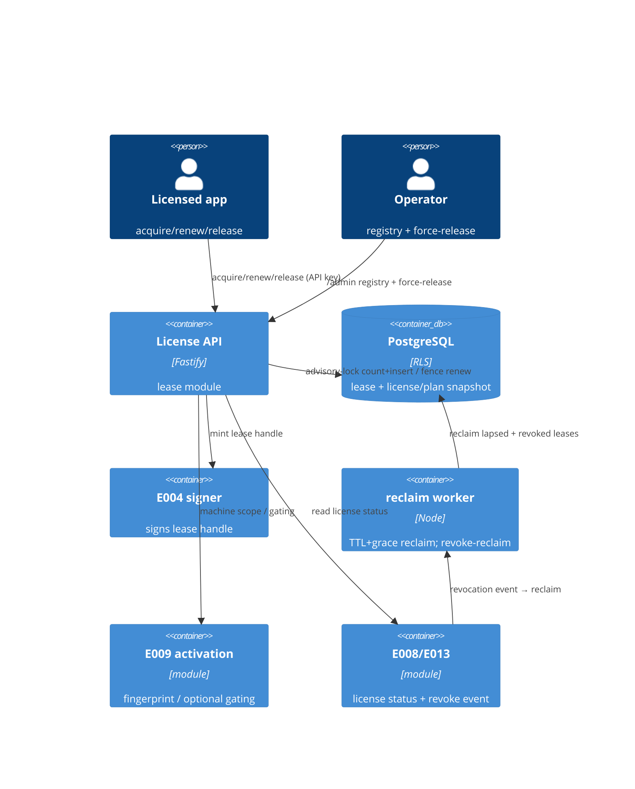

# Implementation Plan: Floating & Concurrent Seats

**Branch**: `00016-floating-and-concurrent-seats` | **Date**: 2026-07-22 | **Spec**: [spec.md](spec.md)

## Summary

**Goal**: Add online concurrent-use licensing — a licensed app acquires a TTL-bounded seat **lease** against a license's concurrency cap, renews it by heartbeat, releases on exit, and the server auto-reclaims dead-machine leases — race-safe, tenant-isolated, and independent of node-lock activation.
**Approach**: A new `lease` module: a race-safe acquire (per-license advisory-lock count+insert), idempotent heartbeat renew + release guarded by a monotonic generation fence, an E004-signed short-TTL lease handle, a fail-open time-driven reclaim sweeper (also the revoke-reclaim path), a per-plan concurrency **scope** (session/machine/user) + overage policy, and an operator lease registry + force-release — all sequential migration `0011_leases.sql`.
**Key Constraint**: Online-only (server is authoritative for the live count); race-safe accounting under concurrency (no over-allocation); reclaim/renew must never double-count a seat; the E004 signer reused with domain separation (no new crypto); floating cap is a NEW dimension independent of `max_activations`.

## Technical Context

**Language/Version**: TypeScript 5.6 / Node 22 (ESM)
**Primary Dependencies**: Fastify 5, pg 8, Zod 3, @fastify/rate-limit, node:crypto; reuses E004 signer (lease handle), E008 license status + snapshot, E009 activation/fingerprint (machine scope + optional gating), E007 plan attributes, E013 revocation event, E005 API-key scope + console RBAC/CSRF
**Storage**: PostgreSQL 16 (additive migration `0011_leases.sql`; forced RLS; expand-only columns on `plan`/`license`)
**Testing**: Vitest 2 + @testcontainers/postgresql
**Target Platform**: Linux container (self-host + managed)
**Project Type**: single (modular monolith server) + React admin-ui
**Project Mode**: brownfield
**Performance Goals**: acquire/renew fast-ack (< ~200 ms p95); tiny per-license critical section; sweeper low-load
**Constraints**: online-only; race-safe (no over-allocation); reclaim/renew no double-count; server-authoritative seat count; tenant-scoped; floating independent of node-lock; honest-client threat model
**Scale/Scope**: per-license concurrency pool; large fleets heartbeating (jittered); one live lease per (license, holder-key)

## Instructions Check

*GATE: Must pass before Phase 0 research. Re-check after Phase 1 design.*

| Principle | Status | Evidence |
|-----------|--------|----------|
| I. Offline-first / keys never exposed | PASS | Floating is an explicitly ONLINE layer that does not alter offline node-lock (E009); the optional lease handle reuses the E004 signer with a domain-separated payload (`LICSRV-LEASE-v1`), NO new crypto; the signing private key never returned/logged (FR-022, SC-015) |
| II. Multi-tenant isolation + RBAC | PASS | `lease` forced-RLS, tenant-scoped via `withTenant`; runtime surface behind a scoped API key (FR-002); admin registry/force-release behind console RBAC + double-submit CSRF (FR-015/FR-016); cross-tenant → 404 (FR-019) |
| III. Single security core, audited | PASS | Reuses E004 signer + E008 lifecycle; no per-language crypto; append-only audit of every acquire/renew/release/reclaim/force-release/denial (FR-018) |
| PII minimization | PASS | Only the salted hash of a client-supplied holder reference is stored (salt server-held, per-tenant, rotatable, never distributed — FR-026); no raw hardware identifiers; GDPR-erasable (FR-020, FR-026, SC-015, SC-023) |
| Anti-replay + rate limiting | PASS | Single-use acquire idempotency token (FR-014); per-API-key rate limit + 429 + Retry-After + audit (FR-017); generation fence rejects stale renew (FR-011) |
| Race-safe accounting | PASS | Per-license advisory-lock count+insert (AD-001) proven by a concurrency test — live leases never exceed `max_concurrent` (FR-003, SC-002); reuses E009's race-safe seat pattern |
| Migration ordering / raw-SQL / src-layout | PASS | Sequential `0011_leases.sql` after `0010_billing.sql`; expand-only; node-postgres raw SQL; new `src/server/modules/lease/` module |

**Gate: PASS** — no violations; Complexity Tracking omitted.

## Architecture



## Architecture Decisions

Feature-local tradeoffs. The overarching online seat-lease concurrency model is a project-wide decision → see **ADR-0012**.

| ID | Decision | Options Considered | Chosen | Rationale |
|----|----------|--------------------|--------|-----------|
| AD-001 | Race-safe concurrency accounting | naive `WHERE count<cap` / `SELECT FOR UPDATE` counter / per-license `pg_advisory_xact_lock` count+insert / partial-unique-index | Per-license `pg_advisory_xact_lock(license_id)` wrapping count+insert | Serializes only the hot license row with a tiny critical section, no MVCC row bloat; mirrors E009's proven race-safe seat locking; a naive count check over-allocates |
| AD-002 | Dead-machine reclamation | lazy on-read reclaim / DB TTL job / time-driven sweeper worker | Time-driven, unref'd, fail-open sweeper (also serves revoke-reclaim) | Deterministic seat recovery with no client action; reuses the E013 CRL / E014 grace-worker pattern; fail-open never blocks the live surface |
| AD-003 | Reclaim ↔ renew mutual exclusion | optimistic version only / status predicate only / monotonic generation fence + status/expiry predicate | Generation fence + `WHERE status='live' AND expires_at>now AND generation=$g` on renew | A late renew after reclaim touches 0 rows and is rejected; prevents a reclaimed seat being revived and double-counted (FR-011) |
| AD-004 | Lease grant shape | plain authorization / E004-signed short-TTL handle / reuse E013 LIC1 token | E004-signed short-TTL handle (default on, configurable off), domain-separated `LICSRV-LEASE-v1` | Tamper-evident, verifiable by a local gate between heartbeats; reuses E004 (no new crypto); server stays authoritative; distinct domain prevents cross-protocol confusion |
| AD-005 | Concurrency-counting scope | fixed session-only / per-plan session\|machine\|user | Per-plan `concurrency_scope` (default session); holder-key = salted hash of a client-supplied reference per scope | Flexibility (per user's steer); the "one live lease per (license, holder-key)" invariant controls dupes/over-concurrency in every mode (FR-023) |
| AD-006 | Cap + policy storage | derive from max_activations / new plan attribute snapshotted onto license | New `max_concurrent` + scope + overage + timings + reason-policy on `plan`, snapshotted onto `license` (like max_activations); absent ⇒ floating disabled fail-closed | Keeps the two seat dimensions independent (FR-005); snapshot immunizes live leases from later plan edits |
| AD-007 | License-state → live-lease effect | always timer / always immediate / configurable by reason | Revoke ⇒ proactive reclaim via the sweeper path; suspend/expire ⇒ lapse-on-timer; configurable (FR-024) | Revocation is urgent (near-immediate seat recovery), suspension administrative; renew re-checks live status |
| AD-008 | Module placement | extend `activation` / new `lease` module | New `src/server/modules/lease/` with `registerLease` seam, beside `activation`/`enforcement` | Floating is a distinct dimension; a separate module keeps node-lock accounting untouched (module-boundary lint) |

## Data Model Summary

| Entity | Key Fields | Relationships | Notes |
|--------|-----------|---------------|-------|
| **lease** *(new)* | `(tenant_id, id)` PK; `holder_key` bytea (salted hash); `concurrency_scope`; `status` live\|released\|reclaimed; `acquired_at`/`last_renewed_at`/`expires_at`; `generation` bigint fence; `overage`; `activation_id?`; `nonce` UNIQUE; `handle_key_id?`; `ended_at?` | FK `(tenant_id, license_id) → license` NO ACTION (FR-021); optional FK `(tenant_id, activation_id) → activation` NO ACTION (FR-025, informational); `tenant_id → tenant` | Forced RLS; partial unique `lease_one_live` WHERE status='live' (one seat per holder, FR-023); race-safe cap via per-license `pg_advisory_xact_lock` count+insert (AD-001); fence-guarded renew (AD-003/FR-011); indexes `lease_seat`, partial `lease_reclaim` (sweeper), BRIN `lease_prune`; grants SELECT/INSERT/UPDATE (no DELETE — soft transitions + retention purge); pseudonymous + GDPR-erasable (FR-020) |
| **plan** *(expanded, E007)* | + `max_concurrent?`, `concurrency_scope`, `concurrency_overage`, `concurrency_require_activation`, `lease_signed_handle`, `lease_heartbeat_seconds`, `lease_ttl_seconds`, `lease_grace_seconds`, `lease_sweep_seconds`, `lease_policy_on_{revoke,suspend,expire}` | `plan → product`; source of the license snapshot | Expand-only; `max_concurrent` NULL ⇒ floating not sold (FR-005); CHECK TTL ≥ 3× heartbeat (FR-009); scope/overage/policy CHECKs |
| **license** *(expanded, E008)* | + `max_concurrent?`, `concurrency_scope`, `concurrency_overage`, `lease_heartbeat_seconds`, `lease_ttl_seconds`, `lease_grace_seconds`, `lease_sweep_seconds`, `lease_policy_on_{revoke,suspend,expire}` | `license → plan/product/customer`; has_many `lease` + `activation` | **Snapshot at issuance** (like `max_activations`, AD-006) — immunizes live leases from plan edits; `max_concurrent` NULL ⇒ acquire fail-closed (SC-019); status drives revoke-reclaim vs timer (FR-024) |
| **activation** *(referenced, E009)* | `(tenant_id, id)`; `machine_id`; `status` | `activation → license`; optionally referenced by `lease` | Independent node-lock dimension; referenced only informationally (FR-025); optional gating reads it live |
| **audit_log** *(referenced, E002)* | `(tenant_id, id)`; `actor`,`action`,`target`,`security_event`,`ts` | tenant-scoped | Append-only; records every lease op + denial; meters soft-cap overage (FR-013/FR-018); no secrets / raw hardware ids (SC-015) |

**Detail**: `FEATURE_DIR/data-model.md` — migration `0011_leases.sql`, ER + state diagrams, invariants. (GUC is `app.current_tenant` per existing migrations; `holder_key` is `bytea`.)

## API Surface Summary

| Method | Path | Purpose | Auth | Req/Res Types |
|--------|------|---------|------|---------------|
| POST | `/v1/leases` | Acquire a floating seat (race-safe; returns server `expiresAt` + TTL/heartbeat guidance + signed handle) | Runtime API key, `lease` scope; rate-limited (429 + `Retry-After`) | `AcquireLeaseRequest` / `LeaseGrant` (201 fresh, 200 idempotent replay) |
| POST | `/v1/leases/{leaseId}/renew` | Heartbeat renew — extend `expiresAt`, keep exactly one seat (idempotent) | Runtime API key, `lease` scope; rate-limited | `RenewLeaseRequest` / `LeaseGrant` (200) |
| POST | `/v1/leases/{leaseId}/release` | Idempotent release — free the seat; unknown/already-ended → 200 no-op | Runtime API key, `lease` scope; rate-limited | none / `ReleaseResult` (200) |
| GET | `/admin/licenses/{licenseId}/leases` | Lease registry — live + recently-ended, pseudonymous `holderKey`, status, timestamps, used-vs-cap; deterministic + `truncated` | Console session + RBAC `viewer` | none (opt `?status`) / `LeaseRegistry` (200) |
| POST | `/admin/leases/{leaseId}/force-release` | Admin force-release a lease (reclaim seat); audited | Console session + RBAC `admin` + CSRF `X-CSRF-Token` | none / `ForceReleaseResult` (200) |

**Detail**: `FEATURE_DIR/contracts/lease-api.openapi.yaml` — OpenAPI 3.1, `{code,message,details?}` envelope, new `lease` API-key scope. Note: `release` of an unknown/cross-tenant id is a 200 no-op (idempotency wins over the 404 rule — not an enumeration oracle); renew + admin routes keep cross-tenant → 404.

## Testing Strategy

| Tier | Tool | Scope | Mock Boundary | Install |
|------|------|-------|---------------|---------|
| Unit | Vitest 2 | scope→holder-key derivation, TTL/timing + invariant resolvers, overage math, fence/predicate logic, config resolvers | pure functions; no DB | configured |
| Integration | Vitest 2 + @testcontainers/postgresql | acquire/renew/release/reclaim on real Postgres + real E004 signer; **concurrency race** (N acquires, exactly C succeed); revoke-reclaim; stale-renew rejection; RLS isolation; rate-limit; registry/force-release RBAC+CSRF | real DB + signer; time advanced via injected clock | configured |
| Security | semgrep (`p/typescript`,`p/owasp-top-ten`) + `npm audit --omit=dev` + secret-leakage test | no signing key / holder-raw / handle secret in any response/log; PII-minimized | — | configured (semgrep CI-only) |
| Coverage | Vitest v8 | global gate lines ≥80 / branches ≥80; ≥80% line+branch on `src/server/modules/lease/**` | — | configured |

## Error Handling Strategy

| Error Category | Pattern | Response | Retry |
|----------------|---------|----------|-------|
| Validation (Zod) | fail-fast | 400 `{code,message,details}` | no |
| Missing/insufficient API-key scope | fail-closed | 401/403 | no |
| No concurrency entitlement (absent `max_concurrent`) | fail-closed | 403 `no_concurrency_entitlement` | no |
| License not active (suspended/revoked/expired) | fail-closed | 409 `license_not_active` | no |
| Capacity exhausted (hard cap / overage exceeded) | business refusal, audited | 409 `seat_capacity_exhausted` — ONE code for BOTH hard-cap-at-capacity and soft-cap-overage-exhausted, distinguished by `details {maxConcurrent, concurrencyUsed, overageAllowance}` (an `overageAllowance>0` with `concurrencyUsed = maxConcurrent + overageAllowance` marks an exhausted soft cap), NOT a second error code | client may retry later |
| Stale/late renew after reclaim (fence mismatch) | fail-closed | 409 `lease_not_renewable` (re-acquire) | re-acquire |
| Activation required (FR-025 gating on, no valid activation) | fail-closed | 409 `activation_required` | no (activate first) |
| Signer fault while minting handle (signed-handle mode) | fail-closed, no seat consumed | 503 `signer_unavailable` | yes (transient) |
| Rate limit exceeded | shed + audit | 429 `rate_limited` + `Retry-After` | yes (backoff) |
| Cross-tenant / unknown resource | fail-closed | 404 — TWO distinct codes: `license_not_found` (acquire, unresolved `licenseKey`/`licenseId`) and `not_found` (renew / registry / force-release, unresolved `leaseId`/`licenseId`); a cross-tenant id resolves here (never 403), and the runtime release route is the sole carve-out (idempotent 200 no-op, not 404) (FR-019) | no |
| CSRF missing/mismatch (admin) | fail-closed | 403 | no |
| Reclaim-worker fault | fail-open | logged, continue; never blocks live surface | n/a |

## Integration Points

| Spec Reference | System/Service | Technical Approach | Contract |
|----------------|----------------|--------------------|----------|
| FR-005/FR-006/FR-024 | E008 license (status + snapshot) | acquire reads live status; `max_concurrent`+policy snapshotted onto `license` at issuance | `license` row (0011 adds columns) |
| FR-022/SC-018 | E004 signer | mint the signed lease handle with domain `LICSRV-LEASE-v1`; only public artifact + opaque key id returned | `app.signer` (E004) |
| FR-023 (machine)/FR-025 | E009 activation | machine-scope holder-key from the E009 fingerprint; optional "activated-devices-only" gating reads current activation | activation module (read-only) |
| FR-024 | E013 revocation event | a revoke event triggers the sweeper's revoke-reclaim path (server-side seat hygiene) | enforcement/lifecycle hook |
| FR-005/FR-023 (config) | E007 plan | `max_concurrent`, scope, overage, timings, reason-policy as plan attributes (0011 adds columns) | `plan` row |
| FR-002/FR-015/FR-016 | E005 auth | scoped runtime API key; console session + RBAC + double-submit CSRF | api-key + rbac-middleware |

## Risk Mitigation

| Risk (from spec) | Likelihood | Impact | Mitigation | Owner |
|-------------------|------------|--------|------------|-------|
| Lease-accounting race (over-allocation) | M | H | Per-license `pg_advisory_xact_lock` count+insert (AD-001); a concurrency integration test asserts exactly-C-of-N | `lease-repo.ts` |
| Reclaim/renew double-count | M | H | Generation fence + status/expiry predicate on renew (AD-003); reclaim sets terminal status; integration test for stale-renew | `lease-repo.ts` |
| Heartbeat storm / rate-limit collision | M | M | Client heartbeat jitter guidance; per-API-key threshold sized to cadence (FR-017); tiny critical section; sweeper batch bound | `routes.ts` / `reclaim-worker.ts` |

## Requirement Coverage Map

| Req ID | Component(s) | File Path(s) | Notes |
|--------|--------------|--------------|-------|
| FR-001 | acquire, repo, routes | `modules/lease/acquire.ts`, `lease-repo.ts`, `routes.ts` | record lease + holder-key + server expiry + handle |
| FR-002 | routes (auth) | `modules/lease/routes.ts` | scoped API key, fail-closed |
| FR-003 | repo | `modules/lease/lease-repo.ts` | advisory-lock count+insert ≤ cap |
| FR-004 | acquire | `modules/lease/acquire.ts` | hard-cap refusal `seat_capacity_exhausted` |
| FR-005 | migration, acquire | `migrations/0011_leases.sql`, `acquire.ts` | new independent `max_concurrent`; absent ⇒ fail-closed |
| FR-006 | acquire | `modules/lease/acquire.ts` | refuse non-active license |
| FR-007 | renew, repo | `modules/lease/renew.ts`, `lease-repo.ts` | idempotent expiry extension |
| FR-008 | release | `modules/lease/release.ts` | idempotent release |
| FR-009 | config, repo | `modules/lease/config.ts`, `lease-repo.ts` | server-time TTL, per-plan timings, TTL≥3×HB invariant |
| FR-010 | reclaim-worker, main | `modules/lease/reclaim-worker.ts`, `main.ts` | fail-open sweeper |
| FR-011 | repo | `modules/lease/lease-repo.ts` | generation fence + predicate |
| FR-012 | acquire, config | `modules/lease/acquire.ts`, `config.ts` | integer soft-cap allowance, default 0 |
| FR-013 | acquire (audit) | `modules/lease/acquire.ts` | overage metered to audit_log |
| FR-014 | acquire, repo | `modules/lease/acquire.ts`, `lease-repo.ts` | single-use idempotency token |
| FR-015 | routes, repo | `modules/lease/routes.ts`, `lease-repo.ts` | registry, viewer RBAC |
| FR-016 | routes, rbac | `modules/lease/routes.ts`, `console/rbac-middleware.ts` | admin force-release + CSRF |
| FR-017 | routes | `modules/lease/routes.ts` | @fastify/rate-limit + 429 + Retry-After |
| FR-018 | all | `modules/lease/*` | append-only audit |
| FR-019 | migration, repo | `migrations/0011_leases.sql`, `lease-repo.ts` | forced RLS, withTenant, cross-tenant 404 |
| FR-020 | acquire, migration | `modules/lease/acquire.ts` | salted-hash holder-key; GDPR-erase path |
| FR-021 | migration | `migrations/0011_leases.sql` | composite FK ON DELETE NO ACTION |
| FR-022 | handle, config | `modules/lease/handle.ts`, `config.ts` | E004-signed handle, domain-sep, toggle |
| FR-023 | config, acquire | `modules/lease/config.ts`, `acquire.ts` | scope session\|machine\|user → holder-key |
| FR-024 | reclaim-worker, lifecycle hook | `modules/lease/reclaim-worker.ts`, `renew.ts` | revoke ⇒ reclaim; suspend/expire ⇒ timer; renew re-checks status |
| FR-025 | acquire | `modules/lease/acquire.ts` | optional activated-devices-only gating |
| FR-026 | config, holder-key | `modules/lease/config.ts`, `holder-key.ts` | per-tenant/product server-held rotatable holder-key salt (never distributed to client); rotation leaves live leases intact |

## Project Structure

### Source Code

```text
+ src/server/modules/lease/
+   index.ts                         registerLease seam, LeaseError, app.lease
+   config.ts                        timings (HB/TTL/grace/sweep + TTL≥3×HB), scope, cap/overage, rate-limit, handle toggle, holder-key salt (server-held, per-tenant, rotatable — FR-026) resolvers
+   lease-repo.ts                    race-safe acquire (advisory-lock count+insert), fence renew, release, sweep-reclaim, list; withTenant/privileged
+   acquire.ts                       entitlement + scope→holder-key + overage + idempotency + optional activation gating
+   renew.ts                         heartbeat renew (license re-check, fence guard)
+   release.ts                       idempotent release
+   handle.ts                        E004-signed short-TTL lease handle (domain LICSRV-LEASE-v1)
+   reclaim-worker.ts                time-driven fail-open sweeper + revoke-reclaim; synthetic-actor audit
+   routes.ts                        runtime acquire/renew/release (API key, rate-limited) + admin registry/force-release (session+RBAC+CSRF)
+   migrations/0011_leases.sql       lease table (RLS/policy/grants/indexes) + plan/license snapshot columns
+   __tests__/                       unit + integration (concurrency race, reclaim, stale-renew, isolation, rate-limit, registry, secret-leakage, perf)
~ src/server/modules/index.ts        register lease after enforcement
~ src/server/main.ts                 start reclaim worker (fail-open, unref'd, app.close)
~ src/server/config/index.ts         lease config keys
~ src/admin-ui/src/pages/leases/…    console Concurrency/Leases view (registry + force-release)
~ src/admin-ui/src/api.ts            leaseApi
~ src/admin-ui/src/components/Shell.tsx  nav tab
```

**Patterns to reuse**: E009 race-safe seat locking (`activation` module) for AD-001; E013 `crl-worker.ts` / E014 grace/reconcile/retention workers for the fail-open sweeper; E004 signer with domain separation (like E013 CRL's `LICSRV-CRL-v1`) for the lease handle; `withTenant`/`privileged` + forced RLS; `@fastify/rate-limit`; console session + `rbac-middleware.ts` + CSRF; append-only `audit_log`.
**Tests to extend**: reuse the `@testcontainers/postgresql` + real-signer harness pattern from `activation`/`enforcement`/`billing` `__tests__/`.
**Naming conventions**: `register<Module>` seam, `<Module>Error(code,status,…)`, ESM `.js` import specifiers, per-module `config.ts`/`routes.ts`/`*-repo.ts`.

## Implementation Hints

- **[HINT-001]** Concurrency: the acquire count+insert MUST run inside a per-license `pg_advisory_xact_lock` (or `SELECT … FOR UPDATE` on a counter) — a naive `WHERE live_count < cap` races and over-allocates. Reuse E009's proven mechanism; keep the critical section to just count+insert.
- **[HINT-002]** Reclaim/renew race: renew updates with `WHERE status='live' AND expires_at>now() AND generation=$g` and bumps `generation`; reclaim/release set a terminal status. A late renew after reclaim then matches 0 rows → reject `lease_not_renewable`. Never let a reclaimed-then-renewed seat be counted twice.
- **[HINT-003]** Signed handle: reuse the E004 signer with a DOMAIN-SEPARATED payload (`LICSRV-LEASE-v1`), distinct from the LIC1 token and CRL domains, to prevent cross-protocol confusion; return only the public artifact + opaque key id — never the signing key.
- **[HINT-004]** Worker: model `reclaim-worker.ts` on E013 `crl-worker`/E014 grace-worker — unref'd interval, fail-open (catch+log, never crash), synthetic-actor audit with the subscription/lease id, tied to `app.close()`. The revoke-triggered reclaim (FR-024) reuses the same sweep query filtered by license.
- **[HINT-005]** Rate limit vs heartbeat: the renew path is high-frequency; size the per-API-key threshold to a generous multiple of heartbeat cadence so legitimate (jittered) heartbeats never 429; keep acquire idempotency-token storage on the lease row (like E009's nonce), purged by the retention path.
