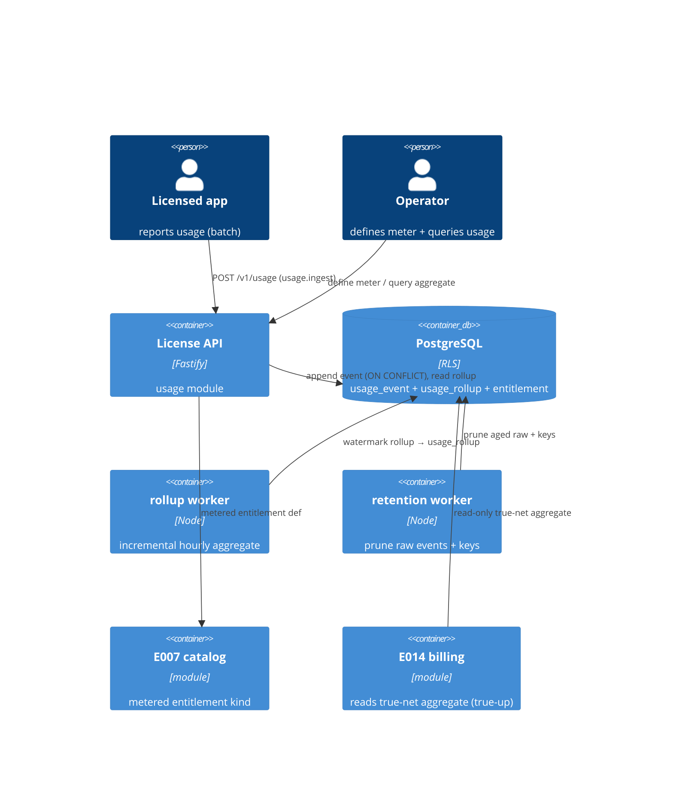

# Implementation Plan: Usage Metering & Aggregation

**Branch**: `00017-usage-metering-and-aggregation` | **Date**: 2026-07-24 | **Spec**: [spec.md](spec.md)

## Summary

**Goal**: Add a metered entitlement kind plus an idempotent, high-write usage-event ingestion path that accrues reported usage into a reproducible per-(license, entitlement, hour) aggregate — counting a re-reported event exactly once — and exposes that aggregate for querying, strictly separate from pricing/billing.
**Approach**: A new `usage` module: a dedicated fast-ack batch ingest endpoint (`usage.ingest` scope) that appends raw events deduped by `(tenant, source, event_id)` ON CONFLICT DO NOTHING (per {SAD:ADR-0013}); an incremental, watermark-driven rollup worker into hourly `usage_rollup` buckets (no per-event hot counter); a fail-open retention/prune worker; a reproducible aggregate query (true signed net stored, floored-at-zero for display); and a `metered` extension of the E007 `entitlement` — all sequential migration `0012_usage_metering.sql`.
**Key Constraint**: High-write, fast-ack ingest with exactly-once accrual; reproducible aggregates (identical on re-query, true-net consumed by E014); metering computes NO money; append-only events (corrections via reversal only); bounded dedupe/retention window; tenant-scoped.

## Technical Context

**Language/Version**: TypeScript 5.6 / Node 22 (ESM)
**Primary Dependencies**: Fastify 5, pg 8, Zod 3, @fastify/rate-limit; reuses E007 catalog entitlement model, E005 API-key scope + console RBAC, E008 license, and mirrors the E014 `billing_event` idempotency + retention-worker pattern
**Storage**: PostgreSQL 16 (additive migration `0012_usage_metering.sql`; forced RLS; append-only raw + hourly rollup; expand-only `entitlement` columns)
**Testing**: Vitest 2 + @testcontainers/postgresql
**Target Platform**: Linux container (self-host + managed)
**Project Type**: single (modular monolith server) + React admin-ui
**Project Mode**: brownfield
**Performance Goals**: ingest fast-ack (< ~200 ms p95) under high write; rollup async/low-load; query reproducible
**Constraints**: exactly-once accrual under concurrency; reproducible aggregates; no money computed; append-only (reversal-only corrections); bounded retention; tenant-scoped; honest-client
**Scale/Scope**: high-write per-tenant ingest; per (license, entitlement, hour) rollup; counter aggregations (SUM/COUNT/UNIQUE_COUNT)

## Instructions Check

*GATE: Must pass before Phase 0 research. Re-check after Phase 1 design.*

| Principle | Status | Evidence |
|-----------|--------|----------|
| I. Offline-first / keys never exposed | PASS | Metering is an ONLINE control-plane feature that does not touch offline verification and introduces NO new crypto / no signer; FR-019 forbids exposing any secret/API key/signing key in any response, log, or audit |
| II. Multi-tenant isolation + RBAC | PASS | `usage_event`/`usage_rollup`/`usage_unique_value` forced-RLS, tenant-scoped via `withTenant`; ingest behind the new `usage.ingest` scoped API key (FR-001), fail-closed on a non-active license (FR-021); operator query behind console RBAC with the raw true-net bounded to admin/E014 (SC-019); cross-tenant → not found (FR-006/FR-017) |
| III. Single security core, audited | PASS | No per-language crypto; append-only `usage_event` (FR-003) + append-only audit of ingest batch / definition / quota / reversal / prune, workers a synthetic actor (FR-018) |
| PII minimization | PASS | Usage minimized to license/entitlement refs + server-schema-validated dimensions, no PII; GDPR-erasable (FR-016, SC-013) |
| Anti-replay + idempotency + rate limiting | PASS | Client idempotency key unique `(tenant, source, event_id)` + ON CONFLICT DO NOTHING → accrue-once (FR-002, mirrors E014); per-key rate limit + 429 + Retry-After + batch cap (FR-005) |
| Payment/billing boundary | PASS | Metering computes NO price/money; aggregate read-only to E014 true-up (true signed net), no card/PAN data (FR-020) |
| Migration ordering / raw-SQL / src-layout | PASS | Sequential `0012_usage_metering.sql` after `0011_leases.sql`; expand-only entitlement columns; node-postgres raw SQL; new `src/server/modules/usage/` module |

**Gate: PASS** — no violations; Complexity Tracking omitted.

## Architecture



## Architecture Decisions

Feature-local tradeoffs. The overarching usage-metering ingestion + aggregation model is a project-wide decision → see **ADR-0013**.

| ID | Decision | Options Considered | Chosen | Rationale |
|----|----------|--------------------|--------|-----------|
| AD-001 | Idempotent ingest dedupe | separate dedupe store / unique + ON CONFLICT DO NOTHING | Batch INSERT with UNIQUE `(tenant, source, event_id)` + ON CONFLICT DO NOTHING in one tx | Atomic single-round-trip dedupe, exactly-once accrual, no second store; mirrors the shipped E014 `billing_event` ledger pattern |
| AD-002 | Aggregation strategy | per-event counter UPDATE / append-only raw + async incremental rollup | Append-only raw `usage_event` + watermark-driven async rollup into `usage_rollup` (on-read fallback for the open bucket) | Avoids hot-row write contention on the high-write path; rollup collapses many inserts into one recompute; reproducible |
| AD-003 | Rollup grain & period | per-entitlement configurable / billing-aligned / fixed hourly | Fixed HOURLY time-bucket storage; "per period" = sum buckets over a query window; billing alignment at E014 read | Deterministic reproducible schema; keeps billing-cycle knowledge out of metering (boundary); hourly balances index cardinality vs late-event granularity |
| AD-004 | Reversal & floor | reference-required / hard-floor storage / reference-free signed + display floor | Reference-free signed-negative events; `usage_rollup` stores the TRUE signed net; query floors at zero for display; E014 reads true net | Fits pre-aggregated batch clients; reproducible storage; operators never see negative usage; net-negative correction stays visible to true-up (FR-020) |
| AD-005 | Metered entitlement modeling | separate metered_entitlement table / extend E007 entitlement enum + columns | Add `metered` to the E007 `entitlement` type enum + metered-only columns (aggregation, unit, allowance) on the existing catalog surface | One authoring flow; freeze-on-usage rule colocated with entitlement edit; additive (E007 boolean/limit unchanged) |
| AD-006 | Ingest transport & auth | piggyback on E013 heartbeat / reuse validate scope / dedicated endpoint + new scope | Dedicated `POST /v1/usage` batch endpoint + new ingest-only `usage.ingest` scope (E005), rate-limited fast-ack | Isolates the high-write path + its rate limit from E013 validation SLAs; least-privilege (validating clients gain no usage-write); independently revocable |
| AD-007 | Retention & prune | keep-forever / TTL job / fail-open time-driven prune worker | Bounded ~35d window for raw events + idempotency keys; fail-open prune worker (owner-role DELETE), rollup survives | Caps raw/key growth on the hot path; mirrors E014 retention-worker; dedupe guaranteed within the window (documented) |
| AD-008 | Batch semantics | all-or-nothing / per-event outcome summary | Per-event outcome (accrue new, no-op duplicate, reject invalid) with a per-batch summary; over-cap batch rejected pre-accrual | A single bad event never fails a legitimate batch; matches robust ingest APIs; the cap bounds tx size on fast-ack |
| AD-009 | Module placement | extend `catalog`/`billing` / new `usage` module | New `src/server/modules/usage/` with `registerUsage` seam, beside `billing`/`lease`; the metered-entitlement *definition* extends `catalog` | Ingest/rollup/query/workers are a distinct concern; only the entitlement kind touches E007 (module-boundary respected) |

## Data Model Summary

| Entity | Key Fields | Relationships | Notes |
|--------|-----------|---------------|-------|
| `usage_event` *(new)* | `PK (tenant_id, id)`; `UNIQUE (tenant_id, source, event_id)`; `event_time`, `quantity` (signed), `dimensions` jsonb, `ingested_at` | FK `(tenant_id, license_id)→license`, `(tenant_id, entitlement_id)→entitlement` (both `ON DELETE NO ACTION`) | Append-only raw; ON CONFLICT DO NOTHING dedupe (AD-001); grants SELECT/INSERT only; FORCED RLS; pruned by owner after window; BRIN(ingested_at) for prune+watermark; btree (tenant,license,entitlement,event_time) for rollup scan. |
| `usage_rollup` *(new)* | `PK (tenant_id, id)`; `UNIQUE (tenant_id, license_id, entitlement_id, bucket)`; `agg_type`, `value` (true signed net), `event_count`, `over_quota`, `watermark_ingested_at` | FK `(tenant_id, license_id)→license`, `(tenant_id, entitlement_id)→entitlement` (`ON DELETE NO ACTION`) | Durable per-hour aggregate; worker UPSERTs (grants SELECT/INSERT/UPDATE); FORCED RLS; hourly-UTC bucket CHECK; value NOT floored (display floors at zero, true-net to E014); survives raw prune. |
| `usage_unique_value` *(new)* | `PK (tenant_id, id)`; `UNIQUE (tenant_id, license_id, entitlement_id, bucket, value_hash)`; `first_ingested_at` | FK `(tenant_id, license_id)→license`, `(tenant_id, entitlement_id)→entitlement` (`ON DELETE NO ACTION`) | Exact, prune-safe distinct set backing UNIQUE_COUNT (AD-002/HINT-002); grants SELECT/INSERT; FORCED RLS; UNIQUE_COUNT = COUNT(*) per bucket; distinct set monotonic within a bucket. |
| `entitlement` *(E007, extended)* | existing `PK (tenant_id, id)`, `UNIQUE (tenant_id, key)`; new `type='metered'`, `aggregation`, `unit`, `allowance` | existing FKs; referenced by the three usage tables | Expand-only; `type` CHECK adds `metered` to `('boolean','integer_limit')`; metered-only cols set IFF metered; freeze aggregation/unit on usage is SERVICE-LAYER (FR-009); boolean/integer_limit unchanged. |

**Detail**: `FEATURE_DIR/data-model.md` — migration `0012_usage_metering.sql`, ER + rollup/watermark flow, invariants. (GUC `app.current_tenant`; hourly-bucket CHECK uses the immutable 3-arg `date_trunc`; verify the auto-named `entitlement_type_check` before ALTER.)

## API Surface Summary

| Method | Path | Purpose | Auth | Req/Res Types |
|--------|------|---------|------|---------------|
| POST | `/v1/usage` | Ingest a batch of usage events (idempotent, fast-ack, per-event summary; new/duplicate/rejected) | API key `X-API-Key` + `usage.ingest` scope (tenant+license-bound); rate-limited (429 + Retry-After) | `IngestUsageRequest` → `IngestSummary` (200 sync / 202 decoupled) |
| GET | `/admin/licenses/{licenseId}/usage` | Aggregated usage per metered entitlement over a caller window (from/to, optional entitlementId, hour/day/period bucket); floored-at-zero display, `raw=true` for the true signed net (E014) | `admin_session` cookie + RBAC `viewer` | query params → `UsageQueryResult` |

**Detail**: `FEATURE_DIR/contracts/usage-api.openapi.yaml` — OpenAPI 3.1. Two refusal vocabularies: top-level HTTP `Error.code` (batch_too_large/unauthorized/not_found/rate_limited) vs per-event `PerEventRejectionCode` (not_found/not_metered/archived/license_inactive/stale_event/future_event/validation_error) inside the 200/202 summary — one bad event never fails the batch. Metered-entitlement definition extends the E007 catalog surface (integration point, not re-defined). App self-read of its own aggregate: internal read path (kept off the `/admin` plane to preserve the `/v1` apiKey vs `/admin` session split).

## Testing Strategy

| Tier | Tool | Scope | Mock Boundary | Install |
|------|------|-------|---------------|---------|
| Unit | Vitest 2 | rollup math per aggregation (sum/count/unique), dedupe outcome, dimension-schema validation, skew/retention/config resolvers, floor-at-zero display | pure functions; no DB | configured |
| Integration | Vitest 2 + @testcontainers/postgresql | idempotent + **concurrent-dedupe race** ingest; rollup correctness incl. late/out-of-order re-open + reversal net; reproducible query; retention prune (raw gone, rollup intact); RLS isolation; rate-limit; over-cap batch; true-net vs display floor | real Postgres; injected clock; async rollup driven deterministically | configured |
| Security | semgrep (`p/typescript`,`p/owasp-top-ten`) + `npm audit --omit=dev` + secret/PII-leakage test | no secret/API key in any response/log; no PII beyond refs/dimensions; dimension allow-list enforced; no card/PAN | — | configured (semgrep CI-only) |
| Coverage | Vitest v8 | global gate lines ≥80 / branches ≥80; ≥80% line+branch on `src/server/modules/usage/**` | — | configured |

## Error Handling Strategy

**Two refusal vocabularies (reconciled — ONE truth).** A refusal is EITHER a WHOLE-REQUEST HTTP error (the request never begins accrual / aggregation) OR a PER-EVENT rejection reported inside the `200`/`202` ingest summary's `rejected[]` (a single bad event NEVER fails the batch, FR-007/AD-008). Per-event codes are NOT HTTP statuses and the two sets are disjoint — each code is distinct and testable, matching `contracts/usage-api.openapi.yaml` (`Error.code` vs `PerEventRejectionCode`). The `Vocabulary` column below states which set a row belongs to.

| Error Category | Vocabulary | Pattern | Response | Retry |
|----------------|-----------|---------|----------|-------|
| Malformed request envelope / non-JSON / empty `events` (ingest) or bad query params (query) | whole-request HTTP | fail-fast pre-accrual | `400 validation_error` `{code,message,details}` | no |
| Batch over size cap | whole-request HTTP | fail-fast pre-accrual | `400 batch_too_large` `{max,size}` | no (split batch) |
| Query window over the configured max span / bucket-count bound | whole-request HTTP | fail-fast pre-aggregation | `400 window_too_large` `{maxHours,hours}` | no (narrow window / coarser bucket) |
| Missing/insufficient `usage.ingest` scope (ingest) | whole-request HTTP | fail-closed | `401 unauthorized` (no tenant) / `403 forbidden` (scope missing) | no |
| Missing session (query) / RBAC deny (query, e.g. `viewer` requesting `raw=true`) | whole-request HTTP | fail-closed | `401 unauthenticated` / `403 forbidden` | no |
| Cross-tenant / unknown license on the query route | whole-request HTTP | fail-closed (never `403`) | `404 not_found` | no |
| Rate limit exceeded (ingest) | whole-request HTTP | shed + audit | `429 rate_limited` + `Retry-After` (= `details.retryAfterSeconds`) | yes (backoff) |
| Unknown / archived / non-metered / cross-tenant license or entitlement (ingest event) | per-event (in summary) | reject per event | per-event `not_found` / `not_metered` / `archived` in the `200`/`202` `rejected[]` (NOT an HTTP status) | no |
| License not in an active state — expired/suspended/revoked/inactive (ingest event) | per-event (in summary) | reject per event | per-event `license_inactive` (FR-021) | no |
| Event too old (> retention) or future-dated (> skew) (ingest event) | per-event (in summary) | reject per event | per-event `stale_event` / `future_event` (NOT an HTTP status) | no |
| Bad event / dimension-schema violation / malformed per-aggregation `quantity` (ingest event) | per-event (in summary) | reject per event | per-event `validation_error` | no |
| Aggregation/unit edit after usage exists (E007 catalog surface) | whole-request HTTP (catalog plane) | fail-closed | `409 aggregation_frozen` | no |
| Rollup / prune worker fault | internal | fail-open | logged, continue; on-read fallback for open bucket; never blocks ingest | n/a |

## Integration Points

| Spec Reference | System/Service | Technical Approach | Contract |
|----------------|----------------|--------------------|----------|
| FR-008/FR-009 | E007 catalog entitlement | add `metered` enum value + aggregation/unit/allowance columns; freeze-on-usage in entitlement edit | `entitlement` row (0012 adds columns) |
| FR-001/FR-006 | E008 license | usage reported/aggregated per license; cross-tenant/unknown → not found | `license` (read) |
| FR-001 | E005 auth | new `usage.ingest` scope on runtime keys; operator query via console session + RBAC | api-key scope + rbac |
| FR-020/SC-014/SC-017 | E014 billing | E014 reads the true-net aggregate read-only for true-up (not the floored display) | `usage_rollup` (read) |
| FR-001 (eligibility) | E009/E013 | reporting clients are activated/validated; ingest is a dedicated endpoint (transport independent of validate/heartbeat) | runtime API key |

## Risk Mitigation

| Risk (from spec) | Likelihood | Impact | Mitigation | Owner |
|-------------------|------------|--------|------------|-------|
| Hot-row write contention | M | H | Append-only raw + async watermark rollup (no per-event counter UPDATE) (AD-002); high-write + concurrent-dedupe tests | `usage-repo.ts` / `rollup-worker.ts` |
| Unbounded raw-event / key growth | H | M | Bounded ~35d window + fail-open prune worker (AD-007); dedupe guaranteed only in-window (documented) | `retention-worker.ts` |
| Aggregate drift (late / out-of-order / reversal) | M | H | Event-timestamp accrual + bucket re-open + append-only reversal + reproducible rollup (AD-003/004); late+reversal tests | `rollup.ts` |

## Requirement Coverage Map

| Req ID | Component(s) | File Path(s) | Notes |
|--------|--------------|--------------|-------|
| FR-001 | ingest, routes | `modules/usage/ingest.ts`, `routes.ts` | dedicated /v1/usage, `usage.ingest` scope |
| FR-002 | usage-repo, migration | `modules/usage/usage-repo.ts`, `migrations/0012_usage_metering.sql` | UNIQUE (tenant,source,event_id) + ON CONFLICT |
| FR-003 | usage-repo, migration | `usage-repo.ts`, migration | append-only; SELECT/INSERT grants only |
| FR-004 | ingest, config | `ingest.ts`, `config.ts` | accrue by event_time; skew bounds |
| FR-005 | routes, config | `routes.ts`, `config.ts` | rate-limit + 429/Retry-After + batch cap 1000 |
| FR-006 | ingest | `ingest.ts` | reject unknown/archived/non-metered/cross-tenant |
| FR-007 | ingest | `ingest.ts` | per-event batch summary |
| FR-008 | catalog (metered kind) | `modules/catalog/validation.ts`, `entitlements.ts`, migration | metered enum + aggregation/unit/allowance |
| FR-009 | catalog | `modules/catalog/entitlements.ts` | freeze aggregation/unit once usage exists |
| FR-010 | rollup, rollup-worker | `modules/usage/rollup.ts`, `rollup-worker.ts` | hourly bucket, watermark incremental |
| FR-011 | query, routes | `modules/usage/query.ts`, `routes.ts` | per license/entitlement/period, reproducible |
| FR-012 | rollup | `rollup.ts` | late event → re-open bucket |
| FR-013 | ingest, rollup, query | `ingest.ts`, `rollup.ts`, `query.ts` | reference-free signed reversal; true-net stored |
| FR-014 | rollup, catalog | `rollup.ts`, catalog allowance | over-quota flag + audit; signal only |
| FR-015 | retention-worker, main | `modules/usage/retention-worker.ts`, `main.ts` | fail-open prune, rollup survives |
| FR-016 | ingest, migration | `ingest.ts` (dimension schema), migration | minimized; GDPR-erase path |
| FR-017 | migration, usage-repo | migration (RLS), `usage-repo.ts` | forced RLS, cross-tenant not found |
| FR-018 | all | `modules/usage/*` | append-only audit + synthetic worker actor |
| FR-019 | routes, query | `routes.ts`, `query.ts` | no secret/key in any response/log |
| FR-020 | query | `query.ts` | true-net read for E014/app/admin only; viewer floored; no money |
| FR-021 | ingest | `ingest.ts` | reject per-event `license_inactive` on non-active license lifecycle |

## Project Structure

### Source Code

```text
+ src/server/modules/usage/
+   index.ts                         registerUsage seam, UsageError, app.usage
+   config.ts                        retention/dedupe window, skew, hourly bucket, rollup interval, rate-limit, batch cap resolvers
+   usage-repo.ts                    batch append (ON CONFLICT DO NOTHING) + per-event outcome; rollup read/upsert; watermark; withTenant/privileged
+   ingest.ts                        batch validate + dimension-schema allow-list + event-time skew + accrue → per-batch summary
+   rollup.ts                        incremental hourly rollup per aggregation (sum/count/unique); late-event bucket re-open; reversal net; over-quota flag
+   rollup-worker.ts                 fail-open time-driven watermark rollup sweeper; synthetic-actor audit
+   retention-worker.ts              fail-open prune of aged raw events + idempotency keys (owner role); rollup survives
+   query.ts                         aggregate query per license/entitlement/period (floor-at-zero display; true-net read for E014)
+   routes.ts                        POST /v1/usage (usage.ingest, rate-limited, fast-ack) + admin/app aggregate query (session/RBAC)
+   migrations/0012_usage_metering.sql   usage_event + usage_rollup (RLS/grants/indexes) + entitlement metered columns
+   __tests__/                       unit + integration (idempotent/concurrent dedupe, rollup, late/reversal, retention, isolation, rate-limit, query, secret/PII)
~ src/server/modules/index.ts        register usage after registerLease
~ src/server/main.ts                 start rollup + retention workers (fail-open, unref'd, app.close)
~ src/server/config/index.ts         usage config keys
~ src/server/auth/rbac.ts            add `usage.ingest` scope
~ src/server/modules/catalog/{validation.ts,entitlements.ts}  metered entitlement kind (aggregation/unit/allowance + freeze-on-usage)
~ src/admin-ui/src/pages/usage/…     console Usage view (per-license/entitlement aggregate, over-quota) + api.ts + Shell nav
```

**Patterns to reuse**: E014 `billing/ledger-repo.ts` (ON CONFLICT DO NOTHING idempotency) + `retention-worker.ts` (owner-role fail-open prune) for AD-001/AD-007; E014/E015 grace/reconcile/reclaim workers for the rollup + retention workers (unref'd, fail-open, synthetic-actor audit, app.close); E014 `payload_summary` allow-list for the dimension schema (HINT-005); `withTenant`/`privileged` + forced RLS; `@fastify/rate-limit`; E007 `catalog/validation.ts` entitlement-type handling for the metered extension; append-only `audit_log`.
**Tests to extend**: reuse the `@testcontainers/postgresql` harness pattern from `billing`/`lease` `__tests__/`.
**Naming conventions**: `register<Module>` seam, `<Module>Error(code,status,…)`, ESM `.js` specifiers, per-module `config.ts`/`routes.ts`/`*-repo.ts`.

## Implementation Hints

- **[HINT-001]** Dedupe: batch-append with a single `INSERT ... ON CONFLICT (tenant_id, source, event_id) DO NOTHING` and derive the per-event summary from `RETURNING` (inserted rows = new; absent = duplicate) — do NOT pre-SELECT then insert (races). Mirror E014 `ledger-repo.recordEvent`.
- **[HINT-002]** Rollup: process by a watermark (events with `ingested_at`/`event_time` beyond the last-processed marker). A late event landing in an already-rolled hour MUST re-open that bucket and recompute it from the retained raw within the window. UNIQUE_COUNT is backed by the exact, prune-safe `usage_unique_value` side table (UNIQUE_COUNT = `COUNT(*)` per bucket). Per-aggregation reversal + quantity rules (PINNED, enforced at ingest — a malformed quantity is a per-event `validation_error`, never silently coerced or dropped): SUM accepts any finite signed `numeric` quantity (a negative value is a reversal). COUNT is an event-cardinality meter — its `quantity` MUST be a NON-ZERO INTEGER (typically `+1`; a `-1` is a reversal that decrements COUNT); a non-integer, zero, missing, or non-finite COUNT quantity is a per-event `validation_error`. UNIQUE_COUNT counts distinct `value_hash`es and its distinct set is MONOTONIC within a bucket — its `quantity` MUST be a POSITIVE integer (typically `+1`); a reversal CANNOT retract a distinct value, so a negative/zero/non-integer UNIQUE_COUNT quantity is a per-event `validation_error` (documented, consistent with counter-only MVP scope, FR-008). This guarantees a malformed quantity cannot corrupt an aggregate.
- **[HINT-003]** Reversal & floor: store the TRUE signed net in `usage_rollup.value`; the query response computes `max(0, net)` for operator display, but the E014 true-up read path returns the true signed net (a distinct read or an explicit `raw=true`). Never hard-floor storage (lossy/non-reproducible).
- **[HINT-004]** Workers: model `rollup-worker.ts` + `retention-worker.ts` on E014 grace/reconcile/retention + E015 reclaim workers — unref'd interval, fail-open (catch+log, never crash), synthetic-actor audit, tied to `app.close()`; retention prune runs on the owner (`privileged`) connection since the app role has no DELETE grant. Workers MUST be tenant-scoped so a worker can never cross tenants: the rollup worker iterates tenant-by-tenant, setting `app.current_tenant` per pass (with FORCED RLS, an unset GUC yields zero rows, so a pass is confined to exactly one tenant and every rollup/unique-value key already carries `tenant_id`); the owner-role prune/GDPR-erase run with an explicit `tenant_id`-scoped predicate (per-tenant), never a tenant-agnostic bulk statement. No aggregation, prune, or erase ever spans more than one tenant.
- **[HINT-005]** Dimensions & PII: validate client-supplied `dimensions` against a server-side allow-list schema (bounded keys, scalar values, size caps) at ingest so PII cannot leak into free-form dimensions (SC-013) — mirror the E014 `payload_summary` allow-list; the ingest is fast-ack so keep validation cheap.
