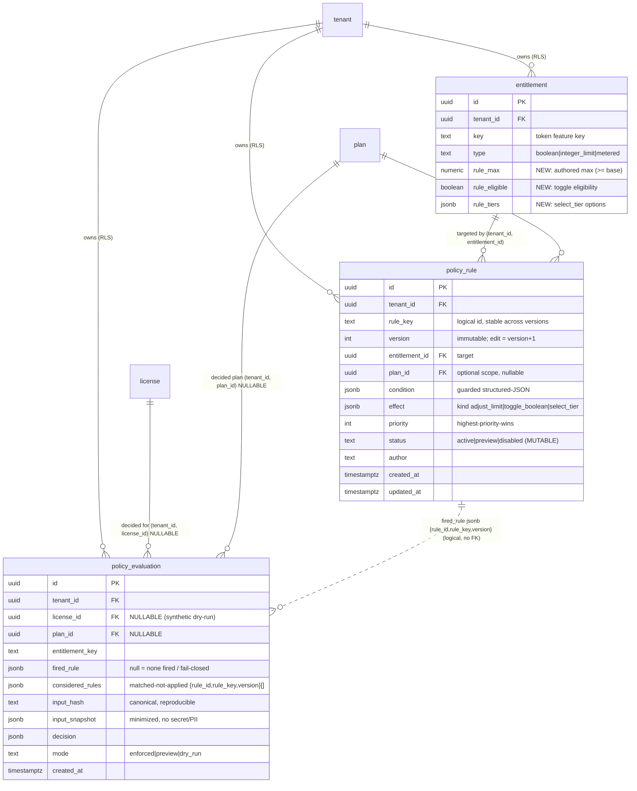

# Data Model: Low-Code Policy Rules (E017)

**Feature**: `00018-low-code-policy-rules` | **Migration**: `0013_policy_rules.sql` (sequential after `0012_usage_metering.sql`) | **Storage**: PostgreSQL 16, raw SQL (no ORM)

Derived from `spec.md` (Key Entities, FR-001..FR-018, SC-001..SC-015, Clarifications, STF-001) and `plan.md` (AD-001..009, HINT-001..005). Conventions are copied verbatim from the existing tenant-owned tables — E007 `0006_catalog.sql`, E014 `0010_billing.sql`, E016 `0012_usage_metering.sql`: `ENABLE`+`FORCE ROW LEVEL SECURITY`, a `tenant_isolation` policy on `NULLIF(current_setting('app.current_tenant', true), '')::uuid`, composite intra-tenant FKs `(tenant_id, x)` `ON DELETE NO ACTION`, least-privilege grants to the non-owner `licensesrv_app` role, `tenant_id`-leading indexes, and append-only ledgers granted `SELECT, INSERT` only.

## Scope & non-goals (data layer)

- **New**: two tenant-owned tables — `policy_rule` (immutably versioned, forced-RLS) and `policy_evaluation` (unified mode-marked, append-only audit, forced-RLS).
- **Expand-only**: three additive columns on the E007 `entitlement` table (`rule_max`, `rule_eligible`, `rule_tiers`) — the authored per-entitlement bound surface. No existing `entitlement` / `plan_entitlement` column is changed (the boolean / integer_limit / metered semantics from E007/E016 are untouched).
- **No new crypto, no signing surface, no token-format change** (FR-018, SC-014): the policy engine performs no cryptography and does not touch the E004 signer or the E001 verifier core. Nothing in this migration stores a secret, key, or PII — the decision context and every audit projection are minimized to allow-listed, pseudonymous references (FR-017, SC-013).

## Entities

### 1. `policy_rule` (new) — tenant-scoped, immutably versioned rule

A logical rule (identified by `rule_key`) is a group of **immutable version rows**. A content edit (condition / effect / priority / target) INSERTs a new `version` row; a prior version is never mutated (AD-006, FR-011, HINT-004). Each row carries a guarded structured-JSON `condition` (JSONLogic-subset, validated at author time) and a closed typed `effect` descriptor (AD-002).

**Status is a mutable column on the version row — NOT a status-only new version.** Justification (the "simpler and justify" decision the task asks for): enable / disable / preview is an *operational lifecycle toggle*, orthogonal to rule *content*. Modeling it as a new immutable version would (a) inflate `version` history with non-content transitions and blur "which content version fired," and (b) force a full content copy for a one-word status flip. Instead the immutable half is the content (`rule_key`, `version`, `entitlement_id`, `plan_id`, `condition`, `effect`, `priority`, `author`, `created_at` — never updated); the only mutable field is `status` (via a `SELECT, INSERT, UPDATE` grant, with the UPDATE restricted to `status`/`updated_at` at the repo layer). Every status transition and every new version is still recorded in the shared `audit_log` (FR-014/FR-016), so lifecycle history is preserved without a version explosion. A partial unique index (`policy_rule_one_live`) guarantees at most one live (`active` or `preview`) version per logical `rule_key`, so "the current version" is unambiguous for evaluation.

- **Target**: `entitlement_id` (composite FK → `entitlement`, `ON DELETE NO ACTION`) is the entitlement whose decision the rule adjusts; the entitlement's `key` is what embeds into the E001 token. `plan_id` (nullable composite FK → `plan`, `ON DELETE NO ACTION`) optionally narrows the rule to one plan scope; NULL = applies for any plan that grants the target entitlement.
- **Effect**: `effect` jsonb `{kind, target, value}` with a CHECK that `kind ∈ {adjust_limit, toggle_boolean, select_tier}` (AD-002, FR-003). The DB constrains *shape*; the "≤ authored maximum / rule-eligible / plan-defined tier" *bound* is enforced by the trusted applier at author validation and at evaluation (service layer — a CHECK cannot join `entitlement`/`plan_entitlement`, HINT-003).
- **Order**: `priority` int (highest-priority-wins, AD-005/FR-006) with a stable `(rule_key, version)` tiebreak.

### 2. `policy_evaluation` (new) — tenant-scoped, append-only decision audit

One unified, mode-marked, RLS-protected, append-only trail for every evaluation (AD-008, FR-014). `mode ∈ {enforced, preview, dry_run}`. `license_id` is **nullable** so a supplied-context dry-run can carry a synthetic/absent license reference; when present it is a same-tenant composite FK → `license` `ON DELETE NO ACTION`. `fired_rule` jsonb records the single applied rule (`{rule_id, rule_key, version}`) or NULL when none fired (base static decision stood, incl. a fail-closed skip, FR-010). `considered_rules` jsonb records the matched-but-not-applied rules the highest-priority-wins scan skipped, as an array of `{rule_id, rule_key, version}` (FR-006/FR-014/SC-009); NULL or `[]` when none. `input_hash` (a stable minimized CANONICAL hash — stable key ordering so an identical context reproduces the identical hash, FR-005/SC-003, INV-12) plus an optional minimized `input_snapshot` jsonb (no secret/PII, FR-017) capture the deciding context; `decision` jsonb holds the resolved adjusted value. Grant is `SELECT, INSERT` only — append-only; retention is a BOUNDED, config-sourced age window pruned on the owner role via BRIN on `created_at` (like `usage_event`/`billing_event`), so the trail does not grow unbounded.

### 3. `entitlement` (E007, extended — expand-only) — the authored per-entitlement bound

Three additive columns carry the vendor-authored bound the applier clamps to (AD-003, FR-007). Existing `boolean`/`integer_limit`/`metered` columns are unchanged.

- `rule_max` numeric NULL — the authored maximum for an `adjust_limit` effect (must be ≥ the base plan value; the "≥ base" comparison is a **service-layer** check at author validation + evaluation, because the base value lives on `plan_entitlement.int_value` and a single-table CHECK cannot join it — HINT-003). CHECK: `rule_max IS NULL OR rule_max >= 0`.
- `rule_eligible` boolean NOT NULL DEFAULT false — whether a `toggle_boolean` effect may flip this boolean entitlement (the plan defines reachable states, FR-003/FR-007). Existing rows default to `false` (not rule-eligible → safe).
- `rule_tiers` jsonb NULL — the plan-defined `select_tier` options a rule may select among. CHECK: `rule_tiers IS NULL OR jsonb_typeof(rule_tiers) = 'array'`.

### 4–6. Read-only decision-context entities (unchanged)

`entitlement` static values (E007), `license` claims (E008), and `usage_rollup`/`usage_event` aggregates (E016) are read-only inputs assembled into the bounded decision context (FR-004). A rule never redefines them; it only adjusts the resolved entitlement value within bounds. `usage` (E016) fields are `has()`-guarded (FR-004/FR-010). No schema change to these in this migration beyond the three `entitlement` columns above.

## Migration DDL — `migrations/0013_policy_rules.sql`

```sql
-- E017 low-code policy rules (FR-001..FR-018). Extends the E002 tenancy substrate and the E007 catalog
-- `entitlement` (expand-only, sequential after 0012_usage_metering.sql). Two new tenant-owned tables:
-- policy_rule (immutably versioned, guarded structured-JSON condition + bounded typed effect) and
-- policy_evaluation (ONE unified, mode-marked, append-only decision audit). Same tenant-scoped forced-RLS +
-- composite-FK + append-only-ledger pattern as 0006/0007/0008/0009/0010/0011/0012. NO change to any EXISTING
-- column: the E007 boolean/integer_limit + E016 metered entitlement semantics and their plan_entitlement value
-- columns are UNTOUCHED -- the rule_max/rule_eligible/rule_tiers columns are ADDITIVE authored-bound attributes.
--
-- No new crypto / no signing surface (FR-018, SC-014): the policy engine performs no cryptography and does not
-- touch the E004 signer or the E001 verifier core; issuance keeps signing the (possibly rule-adjusted) snapshot
-- with the existing signer. Nothing here stores a secret, signing key, or PII -- the condition, effect,
-- input_snapshot, and decision are minimized, allow-listed, pseudonymous (FR-017, SC-013).
--
-- Immutable versioning (AD-006, FR-011, HINT-004): a logical rule (rule_key) is a set of IMMUTABLE version
-- rows; a content edit INSERTs a NEW (rule_key, version) row and never mutates a prior version. STATUS is the
-- ONLY mutable field -- enable/disable/preview flips status in place (a lifecycle toggle, not a content edit),
-- so the app role gets UPDATE (repo-restricted to status/updated_at). policy_rule_one_live guarantees at most
-- one live (active|preview) version per rule_key -> "the current version" is unambiguous for evaluation.
--
-- Highest-priority-wins (AD-005, FR-006): exactly ONE matching rule's effect applies per entitlement; the
-- (tenant_id, entitlement_id, status, priority DESC) lookup index drives the deterministic priority scan with a
-- stable (rule_key, version) tiebreak. Others are recorded considered-but-not-applied in the audit.
--
-- Effect bounds (AD-002/003, FR-007, HINT-003): the DB constrains effect SHAPE (kind in the allow-list); the
-- "<= authored rule_max / rule_eligible boolean / plan-defined tier" BOUND is enforced by the trusted applier at
-- author validation AND evaluation -- a single-table CHECK cannot join entitlement/plan_entitlement (the base
-- plan value lives on plan_entitlement.int_value). rule_max must be >= the base plan value: a service-layer check.
--
-- Append-only audit (AD-008, FR-014): policy_evaluation is a unified mode-marked (enforced|preview|dry_run)
-- trail; SELECT,INSERT only (no app UPDATE/DELETE). license_id is NULLABLE for a supplied-context synthetic
-- dry-run; BRIN(created_at) backs the age-based retention prune (owner-role, like usage_event/billing_event).

-- =====================================================================================================
-- 1. entitlement (E007) -- expand-only authored per-entitlement rule bound. Existing rows unchanged.
-- =====================================================================================================
-- The authored MAXIMUM (>= base plan value) an adjust_limit effect clamps to (FR-007), toggle-boolean
-- eligibility (the plan defines reachable states, FR-003), and the plan-defined select_tier options. Existing
-- boolean/integer_limit/metered rows carry rule_eligible=false (safe: not rule-eligible) and NULL bounds.
ALTER TABLE entitlement
  ADD COLUMN rule_max      numeric,                          -- authored max for adjust_limit; NULL = no rule-raise (>= base: service-layer, HINT-003)
  ADD COLUMN rule_eligible boolean NOT NULL DEFAULT false,   -- may a toggle_boolean effect flip this boolean entitlement? (FR-003/007)
  ADD COLUMN rule_tiers    jsonb;                            -- plan-defined select_tier options; NULL = no tiers

ALTER TABLE entitlement
  ADD CONSTRAINT entitlement_rule_max_nonneg
    CHECK (rule_max IS NULL OR rule_max >= 0),
  ADD CONSTRAINT entitlement_rule_tiers_array
    CHECK (rule_tiers IS NULL OR jsonb_typeof(rule_tiers) = 'array');
-- NOTE (FR-007, service-layer): rule_max MUST be >= the base plan value for that entitlement (a contract
-- override lifts ABOVE base, never above rule_max). The base value lives on plan_entitlement.int_value; a DB
-- CHECK cannot join it, so the author-validation + evaluation applier enforce the ">= base" bound. Not in DDL.

-- =====================================================================================================
-- 2. policy_rule -- tenant-scoped, immutably versioned guarded rule (condition + bounded typed effect).
-- =====================================================================================================
CREATE TABLE policy_rule (
  id             uuid        NOT NULL,
  tenant_id      uuid        NOT NULL REFERENCES tenant(id),
  rule_key       text        NOT NULL,                       -- LOGICAL rule id; stable across versions (FR-011)
  version        int         NOT NULL CHECK (version >= 1),  -- immutable version; a content edit INSERTs version+1
  entitlement_id uuid        NOT NULL,                       -- TARGET entitlement (composite FK below); its key embeds into the token
  plan_id        uuid,                                       -- OPTIONAL plan scope; NULL = any plan granting the entitlement (composite FK below)
  condition      jsonb       NOT NULL,                       -- guarded structured-JSON (JSONLogic-subset) condition; allow-list validated at author time (FR-001/002)
  effect         jsonb       NOT NULL,                       -- closed typed descriptor {kind,target,value}; bounds applied by the trusted applier (AD-002, FR-003/007)
  priority       int         NOT NULL DEFAULT 0,             -- explicit order; highest-priority-wins (AD-005, FR-006)
  status         text        NOT NULL DEFAULT 'preview'      -- MUTABLE lifecycle: preview (report-only) | active (enforced) | disabled (never evaluates)
                   CHECK (status IN ('active','preview','disabled')),
  author         text        NOT NULL,                       -- authoring admin principal (pseudonymous ref, no PII)
  created_at     timestamptz NOT NULL DEFAULT now(),
  updated_at     timestamptz NOT NULL DEFAULT now(),         -- bumped only on a status transition (content is immutable)
  PRIMARY KEY (tenant_id, id),
  -- Immutable versioning key: at most one row per (tenant, logical rule, version); a content edit = version+1.
  CONSTRAINT policy_rule_version_uniq UNIQUE (tenant_id, rule_key, version),
  -- effect SHAPE: closed allow-listed kind (the <= max / rule-eligible / plan-tier BOUND is service-layer).
  CONSTRAINT policy_rule_effect_kind CHECK (
    jsonb_typeof(effect) = 'object'
    AND effect ? 'kind'
    AND effect->>'kind' IN ('adjust_limit','toggle_boolean','select_tier')),
  -- condition MUST be a structured-JSON object (a free-text expression is refused at author time, FR-001/002).
  CONSTRAINT policy_rule_condition_object CHECK (jsonb_typeof(condition) = 'object'),
  -- intra-tenant composite FK: a rule can never target another tenant's entitlement (FR-015). ON DELETE NO
  -- ACTION: an entitlement referenced by any rule version cannot be hard-deleted (codebase uniformity).
  CONSTRAINT policy_rule_entitlement_fk
    FOREIGN KEY (tenant_id, entitlement_id) REFERENCES entitlement (tenant_id, id) ON DELETE NO ACTION,
  -- intra-tenant composite FK: an optional plan scope can never be another tenant's plan (NULL = unscoped).
  CONSTRAINT policy_rule_plan_fk
    FOREIGN KEY (tenant_id, plan_id)        REFERENCES plan        (tenant_id, id) ON DELETE NO ACTION
);

-- =====================================================================================================
-- 3. policy_evaluation -- tenant-scoped, unified mode-marked, APPEND-ONLY decision audit.
-- =====================================================================================================
CREATE TABLE policy_evaluation (
  id              uuid        NOT NULL,
  tenant_id       uuid        NOT NULL REFERENCES tenant(id),
  license_id      uuid,                                      -- NULLABLE: a supplied-context synthetic dry-run has none (composite FK below)
  plan_id         uuid,                                      -- decided plan; NULL for a supplied/synthetic dry-run (composite FK below)
  entitlement_key text        NOT NULL,                      -- the entitlement decided (token feature key; minimized, no PII)
  fired_rule      jsonb,                                     -- {rule_id, rule_key, version} of the ONE applied rule; NULL = none fired / fail-closed base decision (FR-006/010)
  considered_rules jsonb,                                    -- array of {rule_id, rule_key, version} matched-but-not-applied by highest-priority-wins (FR-006/FR-014/SC-009); NULL/[] = none
  input_hash      text        NOT NULL,                      -- stable minimized CANONICAL hash of the decision context (stable key order -> reproducible, FR-005/SC-003/INV-12)
  input_snapshot  jsonb,                                     -- OPTIONAL minimized context snapshot; allow-listed, NO secret/PII (FR-017)
  decision        jsonb       NOT NULL,                      -- resolved (adjusted) entitlement value
  mode            text        NOT NULL                       -- enforced (issuance) | preview (report-only) | dry_run (simulate)
                    CHECK (mode IN ('enforced','preview','dry_run')),
  created_at      timestamptz NOT NULL DEFAULT now(),        -- append time; drives the BRIN retention prune
  PRIMARY KEY (tenant_id, id),
  -- enforced/preview run at issuance against a REAL license -> license_id required; only a dry_run may be synthetic.
  CONSTRAINT policy_evaluation_license_shape CHECK (mode = 'dry_run' OR license_id IS NOT NULL),
  -- intra-tenant composite FK (NULLABLE, MATCH SIMPLE): a real evaluation references a same-tenant license; a
  -- synthetic dry-run leaves it NULL (FK not enforced when null). ON DELETE NO ACTION: audit is retained.
  CONSTRAINT policy_evaluation_license_fk
    FOREIGN KEY (tenant_id, license_id) REFERENCES license (tenant_id, id) ON DELETE NO ACTION,
  -- intra-tenant composite FK (NULLABLE): the decided plan; NULL for a supplied/synthetic dry-run context.
  CONSTRAINT policy_evaluation_plan_fk
    FOREIGN KEY (tenant_id, plan_id)    REFERENCES plan    (tenant_id, id) ON DELETE NO ACTION,
  -- considered_rules must be a JSON array when present (matched-but-not-applied set; shape only, FR-006/SC-009).
  CONSTRAINT policy_evaluation_considered_array
    CHECK (considered_rules IS NULL OR jsonb_typeof(considered_rules) = 'array')
);

-- =====================================================================================================
-- Indexes (tenant_id-leading, matching the RLS predicate; E002 convention).
-- =====================================================================================================
-- Evaluation lookup (AD-005, FR-006): fetch a target entitlement's LIVE rules in deterministic priority order.
-- Highest-priority-wins scans (tenant, entitlement, status) ordered by priority DESC; (rule_key, version) is the
-- stable tiebreak, applied in the query.
CREATE INDEX policy_rule_eval ON policy_rule (tenant_id, entitlement_id, status, priority DESC);
-- Invariant: at most ONE live (active|preview) version per logical rule -> "the current version" is unambiguous;
-- a disabled/superseded version does not occupy the slot. Enforces the single-current-version lifecycle (AD-006).
CREATE UNIQUE INDEX policy_rule_one_live ON policy_rule (tenant_id, rule_key)
  WHERE status IN ('active','preview');

-- Per-license decision trail (US5/FR-014): "show me this license's evaluations" ordered by recency.
CREATE INDEX policy_evaluation_license ON policy_evaluation (tenant_id, license_id, created_at DESC)
  WHERE license_id IS NOT NULL;
-- Age-based retention prune (owner-role, like usage_event/billing_event) -> BRIN on the append-correlated time
-- column; a high-write append keeps created_at physically ordered, so BRIN is compact + fast.
CREATE INDEX policy_evaluation_prune ON policy_evaluation USING brin (created_at);

-- =====================================================================================================
-- RLS: same form as E002 (0002) / E007 (0006) / E014 (0010) / E016 (0012). Unset GUC -> NULL -> zero rows
-- (refuse unscoped access, SC-012); a cross-tenant reference -> not found (FR-015).
-- =====================================================================================================
ALTER TABLE policy_rule       ENABLE ROW LEVEL SECURITY; ALTER TABLE policy_rule       FORCE ROW LEVEL SECURITY;
ALTER TABLE policy_evaluation ENABLE ROW LEVEL SECURITY; ALTER TABLE policy_evaluation FORCE ROW LEVEL SECURITY;

CREATE POLICY tenant_isolation ON policy_rule
  USING (tenant_id = NULLIF(current_setting('app.current_tenant', true), '')::uuid)
  WITH CHECK (tenant_id = NULLIF(current_setting('app.current_tenant', true), '')::uuid);
CREATE POLICY tenant_isolation ON policy_evaluation
  USING (tenant_id = NULLIF(current_setting('app.current_tenant', true), '')::uuid)
  WITH CHECK (tenant_id = NULLIF(current_setting('app.current_tenant', true), '')::uuid);

-- =====================================================================================================
-- Grants (least-privilege, non-owner licensesrv_app role).
-- =====================================================================================================
-- policy_rule: SELECT, INSERT (author / new immutable version) + UPDATE (status transition ONLY -- the repo
--   restricts UPDATE to status/updated_at; content columns are never updated). No app DELETE -- versions are
--   retained for audit/explainability; a GDPR/tenant erase runs on the OWNER role.
GRANT SELECT, INSERT, UPDATE ON policy_rule       TO licensesrv_app;
-- policy_evaluation: APPEND-ONLY (SELECT, INSERT) -- no app UPDATE/DELETE. The retention prune runs on the
--   OWNER role (the app role has NO DELETE grant), mirroring usage_event / billing_event.
GRANT SELECT, INSERT         ON policy_evaluation TO licensesrv_app;
-- The additive entitlement columns are covered by E007's existing table-level grant (no new grant needed).
```

## ER diagram



## Immutable versioning + status lifecycle

Two orthogonal axes (AD-006, FR-011/FR-012):

**Content axis (immutable, append-only).** `rule_key` groups the version rows. Authoring a new rule INSERTs `(rule_key, version=1)`. A content edit (any change to `condition`, `effect`, `priority`, `entitlement_id`, or `plan_id`) INSERTs `(rule_key, version=N+1)` and never mutates `version=N`. In-flight and prior evaluations reference the exact version that decided them via `policy_evaluation.fired_rule.version` (SC-008/SC-009). `policy_rule_version_uniq` forbids a duplicate version.

**Status axis (mutable, per version row).**

```text
             author new content (INSERT version N+1)
                     │
                     ▼
   ┌──────────────────────────────────┐
   │  preview  ── activate ──► active  │   preview: evaluates, LOGS a would-be
   │     ▲                        │     │            decision, does NOT enforce (FR-012)
   │  set-preview            disable    │   active:  evaluates AND enforces at issuance (FR-011)
   │     │                        ▼     │   disabled: never evaluates (FR-011)
   │  disabled ◄── disable ── (from any)│
   └──────────────────────────────────┘
```

- Only an `active` version (of the current content) enforces; a `preview` version logs its would-be decision report-only; a `disabled` version never evaluates.
- `policy_rule_one_live` guarantees at most one `active`-or-`preview` version per `rule_key`, so promotion is: set the new version `active`/`preview` and the prior live version `disabled` (a two-statement transition inside one tenant tx). This keeps "which version is current" unambiguous without scanning `MAX(version)`.
- Every status transition and every new version is appended to the shared `audit_log` (FR-014/FR-016) — the DB `updated_at` bump on the row is only a convenience timestamp, not the audit of record.

## Invariants

- **INV-1 (tenant isolation, fail-closed)**: forced RLS on both tables; an unset `app.current_tenant` GUC yields zero rows and a cross-tenant reference resolves to not found (FR-015, SC-012). No cross-tenant FK is possible — every FK is composite `(tenant_id, x)`.
- **INV-2 (immutable content)**: a content field (`condition`, `effect`, `priority`, `entitlement_id`, `plan_id`, `rule_key`, `version`, `author`, `created_at`) is never updated; a content change is a new `(rule_key, version+1)` row (FR-011, AD-006). `status`/`updated_at` are the only mutable columns (repo-restricted UPDATE).
- **INV-3 (one current version per logical rule)**: `policy_rule_one_live` — at most one live (`active`|`preview`) version per `(tenant_id, rule_key)`.
- **INV-4 (effect ≤ authored maximum)**: an applied `adjust_limit` effect never exceeds `entitlement.rule_max` (≥ the base plan value); a `toggle_boolean` fires only where `entitlement.rule_eligible`; a `select_tier` selects only a value present in `entitlement.rule_tiers`. The DB enforces effect *shape* (`policy_rule_effect_kind`); the *bound* is enforced by the applier at author validation AND evaluation — refused at author time, clamped/skipped at evaluation (FR-007, SC-004/SC-015, HINT-003). Setting or raising `rule_max` (and `rule_eligible`/`rule_tiers`) is itself an admin-only, CSRF-protected, audited catalog action, validated `≥ base plan value` and within a configured absolute per-entitlement cap — the ceiling cannot be raised arbitrarily to defeat the bound (FR-021, SC-019).
- **INV-5 (one fired rule per entitlement)**: highest-priority-wins — exactly one matching rule's effect applies per target entitlement; the deterministic `(tenant_id, entitlement_id, status, priority DESC)` scan with a stable `(rule_key, version)` tiebreak makes it reproducible; others are recorded considered-but-not-applied (FR-006, SC-010). No effect chaining.
- **INV-6 (deterministic evaluation)**: the same decision context yields the same `decision` and `fired_rule`; time enters only via an injected decision timestamp in the context (never wall-clock/random/network) — the evaluator has no such operator (FR-005, SC-003).
- **INV-7 (fail-closed, audited)**: on any rule error / timeout / resource-bound breach / unguarded absent-field access, the base static decision stands (`fired_rule = NULL`) and the failure is still appended to `policy_evaluation` — the issuance path never crashes or blocks (FR-010, SC-006).
- **INV-8 (append-only audit)**: `policy_evaluation` is append-only (grant `SELECT, INSERT`; no app UPDATE/DELETE). Every enforced / preview / dry-run evaluation writes exactly one mode-marked row with the fired rule id+version (or null), the CONSIDERED-but-not-applied matching rules (`considered_rules`, an array of `{rule_id, rule_key, version}`, FR-006), an input hash/snapshot, and the resolved decision (FR-014, SC-009). Retention prune is owner-role (BRIN on `created_at`) over a BOUNDED, config-sourced retention window (mirroring `usage_event`/`billing_event`), so the trail cannot grow unbounded. An audit-write failure fails closed WITHOUT blocking issuance — the base static decision stands, the token is still issued, and the persistence failure goes to operational logging, never the signing path (FR-010, FR-014, SC-020).
- **INV-12 (canonical input hashing)**: `input_hash` (and any `input_snapshot`) is computed over a CANONICAL serialization of the decision context — stable key ordering and normalized value encoding — so an identical decision context deterministically reproduces the identical hash; re-evaluating the same context yields the same `decision`, `fired_rule`, AND `input_hash` (FR-005, SC-003, INV-6).
- **INV-9 (dry-run isolation)**: a `dry_run` evaluation persists a `policy_evaluation` audit row but changes no live decision, license, or rule state; its `license_id`/`plan_id` may be NULL for a supplied synthetic context (`policy_evaluation_license_shape` permits null only for `dry_run`) (FR-013, SC-007).
- **INV-10 (minimization, no secret/PII)**: neither `condition`, `effect`, `input_snapshot`, `decision`, nor any projection stores a secret, signing key, or PII beyond a pseudonymous reference (FR-017, SC-013). No column holds a secret (contrast E014 `billing_connection`, which does and is view-masked — this migration adds no such column).
- **INV-11 (no-crypto / no-token-change)**: this migration adds no cryptographic material and no signing surface; the E004 signer and E001 verifier core are untouched, and an already-issued offline token verifies byte-identical (FR-018, SC-014). Rule effects adjust the pre-sign snapshot only; the engine performs no cryptography.

## Data Model Summary

| Entity | Key Fields | Relationships | Notes |
|--------|------------|---------------|-------|
| `policy_rule` (new) | `(tenant_id, id)` PK; `UNIQUE (tenant_id, rule_key, version)`; `partial UNIQUE (tenant_id, rule_key) WHERE status IN (active,preview)`; `condition` jsonb, `effect` jsonb `{kind∈adjust_limit\|toggle_boolean\|select_tier}`, `priority` int, `status∈active\|preview\|disabled`, `author`, `created_at` | FK `(tenant_id, entitlement_id)`→`entitlement` (target, NO ACTION); FK `(tenant_id, plan_id)`→`plan` (optional scope, nullable, NO ACTION); tenant NO ACTION | Immutable content versioning (edit = new version); STATUS is the only mutable column (simpler than status-only versions); forced RLS; grant SELECT/INSERT/UPDATE (UPDATE = status only). Effect bound (≤ rule_max / rule-eligible / plan-tier) enforced service-side (AD-002/003/006, FR-003/006/007/011) |
| `policy_evaluation` (new) | `(tenant_id, id)` PK; `mode∈enforced\|preview\|dry_run`; `license_id` NULLABLE; `fired_rule` jsonb (or null); `considered_rules` jsonb array (or null); `input_hash` (canonical) + optional `input_snapshot` jsonb; `decision` jsonb; `created_at` | FK `(tenant_id, license_id)`→`license` (NULLABLE, NO ACTION); FK `(tenant_id, plan_id)`→`plan` (NULLABLE, NO ACTION); logical ref to `policy_rule` via `fired_rule`/`considered_rules` (no FK) | Unified mode-marked APPEND-ONLY audit; grant SELECT/INSERT only; BRIN(created_at) retention over a bounded config-sourced window (owner-role prune); `(tenant_id, license_id, created_at DESC)` trail; forced RLS; `dry_run` may carry a synthetic null license; audit-write failure fails closed without blocking issuance; no secret/PII (AD-008, FR-010/013/014/017, SC-020) |
| `entitlement` (E007, extended) | +`rule_max` numeric NULL (CHECK ≥0), +`rule_eligible` boolean NOT NULL DEFAULT false, +`rule_tiers` jsonb NULL (CHECK array) | targeted by `policy_rule.entitlement_id` | Expand-only authored per-entitlement bound; existing boolean/integer_limit/metered columns UNCHANGED; "≥ base plan value" (base on `plan_entitlement.int_value`) is service-layer, not DDL (AD-003, FR-007, HINT-003) |
| `plan` / `license` / `plan_entitlement` / `usage_rollup` (existing) | (unchanged) | read-only decision-context inputs; `policy_rule` optional plan scope; `policy_evaluation` license/plan refs | Read-only context (FR-004); no schema change beyond the `entitlement` columns above; usage fields `has()`-guarded |
