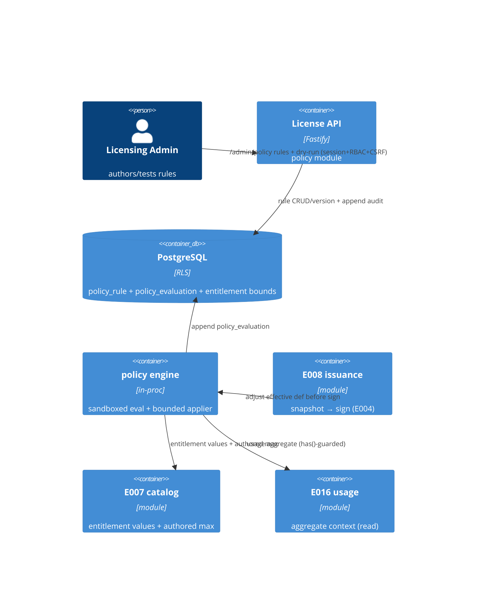

# Implementation Plan: Low-Code Policy Rules

**Branch**: `00018-low-code-policy-rules` | **Date**: 2026-08-11 | **Spec**: [spec.md](spec.md)

## Summary

**Goal**: Let a Licensing Admin author sandboxed, guarded `when → then` rules (structured JSON, no free-form code) that adjust an entitlement decision within a vendor-authored maximum — evaluated deterministically on the server at issuance, with the offline verifier and signed-token format unchanged.
**Approach**: A new `policy` module: an author-time validator (structural + operator allow-list + context type-check + effect-bounds) over a sandboxed, allow-listed JSONLogic-subset evaluator (no `eval`/`vm`, injected clock, resource bounds); a bounded typed effect applier (adjust-limit ≤ authored max, toggle rule-eligible boolean, select plan-defined tier); a highest-priority-wins evaluator hooked into the E008 issuance snapshot BEFORE signing; immutable rule versioning + preview/active/disabled lifecycle; a unified mode-marked append-only `policy_evaluation` audit; and dry-run/simulate — all sequential migration `0013_policy_rules.sql`. Per {SAD:ADR-0014}.
**Key Constraint**: No arbitrary code execution (hard sandbox boundary); deterministic evaluation (injected clock, no wall-clock/random/network); every effect clamped to the authored per-entitlement maximum; runs ONLY on the server control plane at issuance — never in the offline verifier core, no token-format change, no new crypto; tenant-scoped.

## Technical Context

**Language/Version**: TypeScript 5.6 / Node 22 (ESM)
**Primary Dependencies**: Fastify 5, pg 8, Zod 3; reuses E007 catalog entitlement model, E008 issuance (`getEffectivePlanDefinition` + snapshot), E005 console session/RBAC/CSRF, E016 usage read (context); a sandboxed allow-listed JSONLogic-subset evaluator (in-house, no eval/vm — no new runtime dependency on the eval path)
**Storage**: PostgreSQL 16 (additive migration `0013_policy_rules.sql`; forced RLS; immutable rule versioning + append-only evaluation audit; expand-only `entitlement` rule-bound columns)
**Testing**: Vitest 2 + @testcontainers/postgresql
**Target Platform**: Linux container (self-host + managed)
**Project Type**: single (modular monolith server) + React admin-ui
**Project Mode**: brownfield
**Performance Goals**: author-time validation fast; evaluation bounded (timeout + size/depth caps) so the issuance path stays fast; deterministic
**Constraints**: no arbitrary code (sandbox); deterministic; effect ≤ authored max; server-control-plane/issuance-only; offline verifier + token unchanged; no new crypto; tenant-scoped
**Scale/Scope**: per-tenant rule sets; evaluation at issuance (initial + re-issuance); highest-priority-wins one effect per entitlement

## Instructions Check

*GATE: Must pass before Phase 0 research. Re-check after Phase 1 design.*

| Principle | Status | Evidence |
|-----------|--------|----------|
| I. Offline-first / keys never exposed / single crypto core | PASS | The engine runs ONLY on the issuance/signing path, adjusting pre-sign values via a trusted applier; it never runs in the offline verifier core, changes no token bytes, and performs NO cryptography (reuses the E004 signer at issuance unchanged) — FR-008/FR-018, SC-014. This is the epic's key risk and is structurally cleared |
| II. Multi-tenant isolation + RBAC | PASS | `policy_rule`/`policy_evaluation` forced-RLS, tenant-scoped via `withTenant`; admin surface behind console session + RBAC (admin authors, viewer reads) + double-submit CSRF (FR-001/FR-016); cross-tenant → not found (FR-015) |
| III. Single security core, audited | PASS | No per-language crypto (the policy engine is not crypto); append-only `policy_evaluation` (every enforced/preview/dry-run) + append-only rule-change audit (FR-014) |
| Sandbox (hard boundary) — no arbitrary code | PASS | Allow-listed JSONLogic-subset evaluator (no `eval`/`Function`/`vm`/host/I-O), author-time safety-lint (FR-002), resource bounds + fail-closed (FR-009/FR-010) |
| PII minimization / secret non-exposure | PASS | Bounded allow-listed decision context; no secret/signing key/PII beyond a pseudonymous ref in expression/context/audit (FR-017, SC-013) |
| Deterministic evaluation | PASS | Injected decision timestamp only; no wall-clock/random/network/lookup; stable priority + id/version tiebreak (FR-005/FR-006, SC-003) |
| Migration ordering / raw-SQL / src-layout | PASS | Sequential `0013_policy_rules.sql` after `0012_usage_metering.sql`; expand-only entitlement columns; node-postgres raw SQL; new `src/server/modules/policy/` module |

**Gate: PASS** — no violations; Complexity Tracking omitted.

## Architecture



## Architecture Decisions

Feature-local tradeoffs. The overarching sandboxed policy-rule engine + issuance-time bounded-effect model is a project-wide decision → see **ADR-0014**.

| ID | Decision | Options Considered | Chosen | Rationale |
|----|----------|--------------------|--------|-----------|
| AD-001 | Guarded engine | free-text CEL / `json-logic-js` restricted / in-house allow-listed JSONLogic-subset | In-house allow-listed JSONLogic-subset evaluator (structured JSON; no eval/vm; fixed pure operator set; injected clock; size/depth/timeout bounds) | Structured-JSON authoring (clarify Q4); the operator allow-list IS the security boundary; zero new runtime dependency on the eval path; full control over determinism (no time/random op) and bounds — safest for a licensing server |
| AD-002 | Effect model | free mutation / closed typed effect descriptor + trusted applier | Closed typed effect descriptor `{kind: adjust_limit\|toggle_boolean\|select_tier, target, value}` applied by a trusted server-side applier | A rule never mutates state; it returns a descriptor the applier validates + applies — keeps the effect surface allow-listed and typed (FR-003) |
| AD-003 | Effect bound source | plan's own value / separately-authored per-entitlement max | A new authored per-entitlement MAXIMUM (≥ base plan value) + rule-eligibility on the E007 entitlement; applier clamps to it | Makes the contract-override "lift above base" expressible while provably bounded (clarify Q2, FR-007); expand-only catalog columns |
| AD-004 | Evaluation point | issuance-only / online E013 / both | Issuance/signing path ONLY — post-process the effective definition before the snapshot is signed (initial + re-issuance); online E013 deferred | Clarify Q1; keeps the engine off the verify hot path, determinism trivial (context frozen at issue), offline token + verifier untouched (Principle I) |
| AD-005 | Conflict resolution | highest-priority-wins one effect / chaining | Highest-priority-wins — exactly ONE effect per entitlement target; deterministic priority + rule-id/version tiebreak; others recorded considered-not-applied | Clarify Q3; simplest, safest, single-fired-rule audit, trivial bounds check (FR-006) |
| AD-006 | Rule versioning + lifecycle | mutable rows / immutable versions | A logical rule id groups IMMUTABLE version rows (content edit = new version); status active\|preview\|disabled; only enabled active-version rules enforce, preview logs report-only | Reversible + explainable; the audit records the exact fired version (FR-011/FR-012, AD-008) |
| AD-007 | Determinism | ambient clock / injected clock | Inject the decision timestamp as a context field; the evaluator has no time/random/network operators and is pure | Same context → same decision; idempotent re-evaluation (FR-005, SC-003) |
| AD-008 | Evaluation audit | per-mode tables / one unified trail | One tenant-scoped, forced-RLS, append-only `policy_evaluation` trail, mode-marked (enforced\|preview\|dry-run), nullable license ref for synthetic dry-runs | One reproducibility trail + isolation; retention can key off mode later (clarify Q7, FR-014) |
| AD-009 | Module placement + issuance hook | extend catalog/issuance / new policy module | New `src/server/modules/policy/` with `registerPolicy` seam + an `evaluate` seam consumed by E008 issuance; only the authored-max/rule-eligible attributes touch E007 catalog | Distinct concern; keeps issuance/catalog edits minimal (module-boundary respected) |

## Data Model Summary

| Entity | Key Fields | Relationships | Notes |
|--------|------------|---------------|-------|
| `policy_rule` *(new)* | `(tenant_id, id)` PK; `UNIQUE (tenant_id, rule_key, version)`; partial `UNIQUE (tenant_id, rule_key) WHERE status IN (active,preview)`; `condition` jsonb, `effect` jsonb `{kind∈adjust_limit\|toggle_boolean\|select_tier}`, `priority` int, `status∈active\|preview\|disabled`, `author`, `created_at` | FK `(tenant_id, entitlement_id)`→`entitlement` (target, NO ACTION); optional `(tenant_id, plan_id)`→`plan` (nullable, NO ACTION) | Immutable content versioning (edit = new version); **status (+ `updated_at`) is the only mutable column** (content columns immutable, INV-2; simpler than status-only versions); forced RLS; grant SELECT/INSERT/UPDATE (UPDATE repo-restricted to status/updated_at). Effect bound (≤ rule_max / rule-eligible / plan-tier) enforced service-side (AD-002/003/006) |
| `policy_evaluation` *(new)* | `(tenant_id, id)` PK; `mode∈enforced\|preview\|dry_run`; `entitlement_key` NOT NULL; `license_id` NULLABLE; `plan_id` NULLABLE; `fired_rule` jsonb (or null); `considered_rules` jsonb (ranked ids+versions considered but not applied, FR-006/SC-009); canonical `input_hash` (INV-12) + optional `input_snapshot` jsonb; `decision` jsonb; `created_at` | FK `(tenant_id, license_id)`→`license` (NULLABLE, NO ACTION); FK `(tenant_id, plan_id)`→`plan` (NULLABLE, NO ACTION); logical ref to `policy_rule` via `fired_rule` (no FK) | Unified mode-marked APPEND-ONLY audit; grant SELECT/INSERT only; BRIN(created_at) retention; `(tenant_id, license_id, created_at DESC)` trail; forced RLS; dry_run may carry a synthetic null license; no secret/PII (AD-008) |
| `entitlement` *(E007, extended)* | +`rule_max` numeric NULL (CHECK ≥0), +`rule_eligible` boolean NOT NULL DEFAULT false, +`rule_tiers` jsonb NULL (CHECK array) | targeted by `policy_rule.entitlement_id` | Expand-only authored per-entitlement bound; existing boolean/integer_limit/metered UNCHANGED; "≥ base plan value" (base on `plan_entitlement.int_value`) is service-layer, not DDL (AD-003, HINT-003) |

**Detail**: `FEATURE_DIR/data-model.md` — migration `0013_policy_rules.sql`, ER + versioning/lifecycle flow, 11 invariants. (GUC `app.current_tenant`; effect-bound is service-layer since a single-table CHECK can't join the base plan value.)

## API Surface Summary

| Method | Path | Purpose | Auth | Req/Res Types |
|--------|------|---------|------|---------------|
| POST | `/admin/policy/rules` | Author a rule (structured-JSON condition + typed effect + priority + target); validate-before-persist | session; RBAC `admin`; CSRF | `CreatePolicyRuleRequest` → `201 PolicyRuleVersion` (400 `invalid_condition`/`unsafe_operator`/`effect_out_of_bounds`/`condition_too_large`/`rule_set_limit_exceeded`) |
| GET | `/admin/policy/rules` | List rules (filter entitlement/status; deterministic + `truncated`) | session; RBAC `viewer` | → `200 PolicyRuleList` |
| GET | `/admin/policy/rules/{ruleKey}` | Get a rule incl. full immutable version history | session; RBAC `viewer` | → `200 PolicyRuleDetail` (404) |
| PATCH | `/admin/policy/rules/{ruleKey}` | Edit → create a new immutable version | session; RBAC `admin`; CSRF | `EditPolicyRuleRequest` → `200 PolicyRuleVersion` |
| POST | `/admin/policy/rules/{ruleKey}/status` | Lifecycle active/preview/disabled | session; RBAC `admin`; CSRF | `StatusTransitionRequest` → `200 PolicyRuleSummary` (400 `validation_error`; 409 `invalid_state_transition`) |
| POST | `/admin/policy/rules/{ruleKey}/dry-run` | Simulate vs supplied/real context; would-be decision + fired rule + considered-not-applied; non-enforcing `mode=dry_run` | session; RBAC `admin`; CSRF | `DryRunRequest` → `200 DryRunResult` |

**Detail**: `FEATURE_DIR/contracts/policy-api.openapi.yaml` — OpenAPI 3.1, **admin-only** (no API-key/runtime plane). `PolicyEffect` is a closed discriminated union (adjust_limit/toggle_boolean/select_tier); `PolicyCondition` is structured JSON (not free text); the internal issuance-path evaluation seam is documented as NOT a wire op. Cross-tenant ruleKey → 404; no secret/PII in any request/response.

## Testing Strategy

| Tier | Tool | Scope | Mock Boundary | Install |
|------|------|-------|---------------|---------|
| Unit | Vitest 2 | the sandboxed evaluator (allow-list enforcement, no-eval, resource bounds, determinism), effect clamp/rule-eligible/select-tier, author-time validation, context-builder minimization, highest-priority-wins | pure functions; no DB | configured |
| Integration | Vitest 2 + @testcontainers/postgresql | rule CRUD + immutable versioning + status; evaluation adjusts the entitlement decision at issuance (+ clamped to authored max); fail-closed on error/timeout; conflict precedence; dry-run/preview no-enforce; RLS isolation; append-only audit | real Postgres; injected clock; issuance seam driven directly | configured |
| Security | semgrep (`p/typescript`,`p/owasp-top-ten`) + `npm audit --omit=dev` + sandbox-escape + secret/PII-leakage test | no arbitrary code / host / I-O reachable from a rule; no secret/key/PII in expression/context/audit; effect never exceeds the authored max | — | configured (semgrep CI-only) |
| Coverage | Vitest v8 | global gate lines ≥80 / branches ≥80; ≥80% line+branch on `src/server/modules/policy/**` | — | configured |

## Error Handling Strategy

| Error Category | Pattern | Response | Retry |
|----------------|---------|----------|-------|
| Rule validation (structural / unsafe operator / over-size-depth / over-bound effect) | fail-fast at author time | 400 `{code,message,details}` (distinct: `invalid_condition` / `unsafe_operator` / `effect_out_of_bounds` / `condition_too_large`) | no |
| Missing/insufficient RBAC (viewer authoring) | fail-closed | 401/403 | no |
| Missing/mismatched CSRF (admin mutation) | fail-closed | 403 | no |
| Unknown / cross-tenant rule reference | fail-closed | 404 not found | no |
| Invalid lifecycle status transition (valid status value, not permitted from current state, FR-011/012) | fail-closed | 409 `invalid_state_transition` | no |
| Rule evaluation error / timeout / bound breach (at issuance) | **fail-closed** | base static decision stands; rule skipped; audited (no HTTP error — internal) | n/a |
| Unguarded absent context field (rule) | fail-closed for that rule | base decision for that entitlement; audited | n/a |
| Per-decision rule cap exceeded at issuance (FR-019) | **fail-closed** | base static decision stands; audited (no HTTP error — internal) | n/a |
| Rule-set size cap exceeded at author time (FR-019) | fail-fast at author time | 400 `rule_set_limit_exceeded` | no |
| Dry-run supplied context out-of-schema / oversized / over-depth (FR-020) | fail-closed | 400 `validation_error` (rejected before evaluation) | no |
| Authored maximum below base / over absolute cap, or non-admin change (FR-021) | fail-closed | 400 `effect_out_of_bounds` (catalog validation) / 403 (non-admin) | no |

## Integration Points

| Spec Reference | System/Service | Technical Approach | Contract |
|----------------|----------------|--------------------|----------|
| FR-008 | E008 issuance | policy `evaluate` seam post-processes `getEffectivePlanDefinition` BEFORE the snapshot is signed; reuses the E004 signer unchanged | issuance hook (internal seam) |
| FR-003/FR-007 | E007 catalog entitlement | new authored per-entitlement MAXIMUM + rule-eligibility (+ tiers) columns; the applier clamps to them | `entitlement` row (0013 adds columns) |
| FR-004 | E016 usage | usage aggregate read into the decision context, `has()`-guarded | usage query (read-only) |
| FR-001/FR-016 | E005 auth | console session + RBAC (admin/viewer) + double-submit CSRF on the rule surface | rbac-middleware |
| FR-018 | E004 signer / E001 verifier | UNCHANGED — engine performs no crypto; offline verifier + token bytes untouched | (no change) |

## Risk Mitigation

| Risk (from spec) | Likelihood | Impact | Mitigation | Owner |
|-------------------|------------|--------|------------|-------|
| Sandbox escape / arbitrary code | L | H | Allow-listed JSONLogic-subset evaluator (no eval/vm/host), author-time safety-lint, resource bounds (AD-001); a sandbox-escape security test proves no host state reachable | `condition.ts` / `validate.ts` |
| Non-deterministic / unbounded evaluation | M | H | Injected clock, no time/random/network operators, size/depth/timeout bounds, fail-closed (AD-007); re-evaluation + timeout tests | `condition.ts` |
| Over-permissive effect | M | M | Closed typed effect + clamp to authored max + rule-eligible/plan-defined-tier checks at author time and evaluation (AD-002/003, FR-007) | `effect.ts` / `validate.ts` |

## Requirement Coverage Map

| Req ID | Component(s) | File Path(s) | Notes |
|--------|--------------|--------------|-------|
| FR-001 | routes, rule-repo | `modules/policy/routes.ts`, `rule-repo.ts` | admin authoring, structured JSON, session+RBAC+CSRF |
| FR-002 | validate | `modules/policy/validate.ts` | parse/shape + allow-list + type-check + effect-bounds, reject-before-persist |
| FR-003 | effect, validate | `modules/policy/effect.ts`, `validate.ts` | closed typed effect descriptor |
| FR-004 | context | `modules/policy/context.ts` | allow-listed schema, has()-guard, minimized |
| FR-005 | condition | `modules/policy/condition.ts` | injected clock, pure, deterministic |
| FR-006 | evaluate | `modules/policy/evaluate.ts` | highest-priority-wins + tiebreak |
| FR-007 | effect, migration | `modules/policy/effect.ts`, `migrations/0013_policy_rules.sql` | clamp to authored max |
| FR-008 | evaluate, issuance hook | `modules/policy/evaluate.ts`, `modules/issuance/*` | issuance-path only; no token/verifier change |
| FR-009 | condition, validate | `modules/policy/condition.ts`, `validate.ts` | sandbox + resource bounds |
| FR-010 | evaluate | `modules/policy/evaluate.ts` | fail-closed, audited |
| FR-011 | rule-repo, migration | `modules/policy/rule-repo.ts`, migration | immutable versioning + enable/disable |
| FR-012 | evaluate, rule-repo | `modules/policy/evaluate.ts`, `rule-repo.ts` | preview report-only |
| FR-013 | routes, evaluate | `modules/policy/routes.ts`, `evaluate.ts` | dry-run/simulate no-persist/no-enforce |
| FR-014 | rule-repo, migration | `modules/policy/rule-repo.ts`, migration | unified mode-marked append-only audit |
| FR-015 | migration, rule-repo | `migrations/0013_policy_rules.sql`, `rule-repo.ts` | forced RLS, cross-tenant not found |
| FR-016 | routes | `modules/policy/routes.ts` | RBAC admin/viewer + CSRF + audit |
| FR-017 | context, evaluate | `modules/policy/context.ts`, `evaluate.ts` | minimized, no secret/PII |
| FR-018 | evaluate (no-crypto) | `modules/policy/*` | no crypto; verifier + token untouched |
| FR-019 | config, evaluate, validate | `modules/policy/config.ts`, `evaluate.ts`, `validate.ts` | per-tenant rule-set size cap (author-time reject) + per-issuance rule cap (fail-closed) |
| FR-020 | context, routes | `modules/policy/context.ts`, `routes.ts` | dry-run supplied context validated vs same allow-listed schema + size/depth bounds |
| FR-021 | catalog validation | `modules/policy/config.ts`, `catalog/validation.ts` | authored-max admin-only + audited; ≥ base and within absolute cap |

## Project Structure

### Source Code

```text
+ src/server/modules/policy/
+   index.ts                         registerPolicy seam, PolicyError, app.policy (evaluate seam)
+   config.ts                        eval resource bounds (timeout, JSON size/depth/complexity caps), decision-context size/JSON-depth/field-count caps (FR-004/FR-020), per-entitlement + per-tenant max rule-set size + max rules/issuance (three caps, FR-019), absolute per-entitlement authored-max cap (FR-021), policy_evaluation retention-window key (FR-014), conflict policy
+   condition.ts                     sandboxed allow-listed JSONLogic-subset evaluator (no eval/vm, injected clock, bounds)
+   validate.ts                      author-time validation: shape + operator allow-list + context type-check + effect-bounds
+   context.ts                       bounded decision-context builder (E007/E008/E016 allow-listed, has()-guard, minimized) + canonical serialization → `input_hash` (INV-12, deterministic key order)
+   effect.ts                        bounded typed effect applier (clamp to authored max, rule-eligible boolean, select-tier)
+   evaluate.ts                      highest-priority-wins evaluation → adjusted decision + fired rules + fail-closed + audit
+   rule-repo.ts                     rule CRUD + immutable versioning + status; policy_evaluation append; reads; withTenant
+   retention-worker.ts              owner-role policy_evaluation prune on the config retention window (fail-open, synthetic-actor audit; mirrors E014/E016) (FR-014)
+   routes.ts                        admin rule CRUD + enable/disable/preview + dry-run/simulate (session+RBAC+CSRF)
+   __tests__/                       unit + integration (sandbox-escape, determinism, effect-clamp, versioning, issuance-adjust, dry-run, isolation, audit, secret/PII)
+ migrations/0013_policy_rules.sql     (repo ROOT, sequential after 0012) policy_rule + policy_evaluation (RLS/grants/indexes) + entitlement rule-bound columns
~ src/server/modules/index.ts        register policy after registerUsage
~ src/server/main.ts                  start the policy_evaluation retention-prune worker (alongside E014/E016 workers)
~ src/server/modules/issuance/…       hook app.policy.evaluate into the effective-definition → snapshot (before sign)
~ src/server/modules/catalog/{validation.ts,entitlements.ts}  authored per-entitlement max + rule-eligibility attributes
~ src/server/config/index.ts         policy config keys
~ src/admin-ui/src/pages/policy/…    console Policy Rules surface (author/validate, priority, preview/active, dry-run, versions)
```

**Patterns to reuse**: E016 `usage` / E014 `billing` module shape (`register<Module>`, `<Module>Error`, `config.ts`, `*-repo.ts`, forced-RLS migration, append-only audit table); E007 `catalog/validation.ts` for the entitlement attribute extension; E008 issuance `getEffectivePlanDefinition` as the pre-sign hook point (note in `effective.ts`: "no dynamic policy logic (that is E017)"); `withTenant`/`privileged`; console session + `rbac-middleware.ts` + CSRF; `audit_log`.
**Tests to extend**: reuse the `@testcontainers/postgresql` + admin-session harness from `billing`/`usage` `__tests__/`.
**Naming conventions**: `register<Module>` seam, `<Module>Error(code,status,…)`, ESM `.js` specifiers, per-module `config.ts`/`routes.ts`/`*-repo.ts`.

## Implementation Hints

- **[HINT-001]** Sandbox: build an in-house allow-listed JSONLogic-subset evaluator — NEVER `eval`/`Function`/`vm`. The operator allow-list (comparison, boolean logic, allow-listed field access, bounded arithmetic — NO time/random/custom ops) IS the security boundary; enforce a JSON size/AST-depth cap at author validation and a per-evaluation timeout; inject the decision timestamp as a context field (never `Date.now()`).
- **[HINT-002]** Issuance hook: the engine post-processes the effective definition (`catalog/effective.ts` → E008 issuance) BEFORE the snapshot is signed; it MUST NOT touch the E004 signer, the token bytes, or the E001 verifier — reuse issuance's existing sign path unchanged. Offline verification stays byte-identical (SC-014).
- **[HINT-003]** Effect clamp: the trusted applier clamps `adjust_limit` to the entitlement's authored maximum (a new E007 column, ≥ base), toggles a boolean only if `rule_eligible`, and selects only a plan-defined tier; an over-bound effect is refused at author time (FR-002) and clamped/skipped at evaluation (FR-007) — validate bounds in BOTH places.
- **[HINT-004]** Versioning + audit: a content edit INSERTs a new immutable `policy_rule` version (append-only); enable/disable/preview is a status transition; every evaluation writes a `policy_evaluation` row recording the exact fired rule id + version (+ mode enforced|preview|dry-run, nullable license ref for synthetic dry-runs) so any decision is reproducible.
- **[HINT-005]** Fail-closed: wrap each rule's evaluation so an error, timeout, bound breach, or unguarded-absent-field skips that rule (the base static decision for that entitlement stands) and writes an audited failure — a bad rule MUST NEVER crash or block the issuance path.
