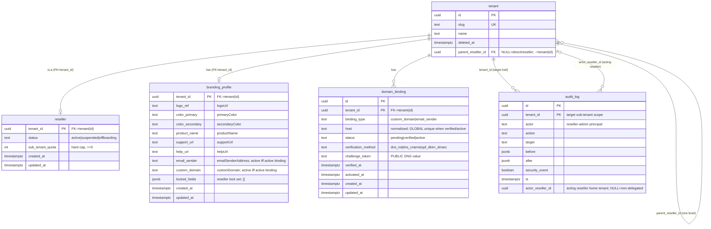

# Data Model — E018 Reseller and White-label Tenancy

**Feature**: `00019-reseller-and-white-label-tenancy` | **Migration**: `migrations/0014_reseller_branding.sql` (expand-only, sequential after `0013_policy_rules.sql`) | **Store**: PostgreSQL 16, raw SQL, forced RLS.

This model is a **shallow, one-level reseller → sub-tenant overlay + per-tenant white-label branding** layered on the existing E002 tenancy substrate. It is **additive only**: one self-ref column on `tenant`, one nullable column on `audit_log`, and three new tenant-owned tables. **The per-tenant `tenant_isolation` RLS predicate is unchanged** — reseller cross-tenant reach is confined to the existing audited `privileged` platform-admin seam, never a broadened predicate (AD-001/AD-002, HINT-001).

## Entities

| Entity | Attributes (name: type, constraints) | Relationships | State Transitions |
|--------|--------------------------------------|---------------|-------------------|
| **tenant** *(E002, extended)* | `parent_reseller_id: uuid NULL` FK→`tenant(id)` ON DELETE NO ACTION, CHECK(`<> id`); partial index `WHERE NOT NULL`. All existing columns untouched. | self-ref: a sub-tenant → its managing reseller tenant (one level); NULL = direct-platform tenant OR a reseller tenant itself | link set at onboarding/provision; re-pointed by operator transfer; NULL on reassign-to-platform (FR-015) |
| **reseller** *(new, PK=tenant_id)* | `tenant_id: uuid PK` FK→`tenant(id)`; `status: text NOT NULL DEFAULT 'active' CHECK IN(active,suspended,offboarding)`; `sub_tenant_quota: int NOT NULL CHECK(>=0)`; `created_at`/`updated_at: timestamptz`. Forced RLS. | 1:1 with a tenant that IS a reseller; `has_many` sub-tenants via `tenant.parent_reseller_id` | `active → suspended` (reversible read-only cascade, AD-007) `→ active`; `active → offboarding` (blocked until every sub-tenant resolved, FR-012) |
| **branding_profile** *(new, PK=tenant_id)* | `tenant_id: uuid PK` FK→`tenant(id)`; `logo_ref`(=logoUrl),`color_primary`,`color_secondary`,`product_name`,`support_url`,`help_url`,`email_sender`(=emailSenderAddress),`custom_domain: text NULL`; `locked_fields: jsonb NOT NULL DEFAULT '[]' CHECK(array)`; timestamps. Forced RLS. No secret/PII. Column set = contract `BrandingFieldName` (8 fields). | 1:1 with a tenant (reseller-default layer OR sub-tenant-override layer, same shape) | none (mutable config); applied branding computed per-field at read, never stored resolved (AD-004) |
| **domain_binding** *(new, PK=(tenant_id,id))* | `id: uuid`; `tenant_id: uuid` FK→`tenant(id)`; `binding_type: text CHECK IN(custom_domain,email_sender)`; `host: text` (normalized); `status: text DEFAULT 'pending' CHECK IN(pending,verified,active)`; `verification_method: text CHECK IN(dns_txt,dns_cname,spf_dkim_dmarc)`; `challenge_token: text` (PUBLIC DNS value); `verified_at`,`activated_at: timestamptz NULL`; timestamps; method + status-shape CHECKs. Forced RLS **+ global partial-unique** `(binding_type,host) WHERE status IN ('verified','active')`. | `belongs_to` tenant; an `active` binding backs `branding_profile.custom_domain`/`email_sender` | `pending → verified → active` (DNS proof, then explicit `/activate`); one host may have many `pending` but ≤1 `verified`/`active` globally |
| **audit_log** *(E002, extended)* | `actor_reseller_id: uuid NULL` (acting reseller's HOME tenant id; NULL for ordinary non-delegated actions; no FK; append-only). All existing columns/grants untouched (SELECT,INSERT only). | a reseller action row: `tenant_id`=target sub-tenant, `actor`=reseller-admin user, `actor_reseller_id`=acting reseller tenant | append-only, immutable (tamper-evident) |

### Branding precedence (per-field resolution, computed at read — AD-004, FR-007)

For each of the 8 contract `BrandingFieldName` fields independently (`logoUrl`,`primaryColor`,`secondaryColor`,`productName`,`supportUrl`,`helpUrl`,`emailSenderAddress`,`customDomain` → columns `logo_ref`,`color_primary`,`color_secondary`,`product_name`,`support_url`,`help_url`,`email_sender`,`custom_domain`): **sub-tenant override → reseller default → platform default (config)**. A field named in the **reseller's** `locked_fields` is authoritative — any sub-tenant override for it is **ignored** and it is presented to the sub-tenant as non-editable ("set by your provider") **without revealing the reseller hierarchy** (FR-006/FR-014, STF-004). `emailSenderAddress`/`customDomain` only take effect once a matching `domain_binding` reaches `status='active'` (FR-013). Trust signals (revocation/tamper/security notices, signing identity, audit, legal text) are **never** sourced from `branding_profile` (FR-008). The reseller-default layer is read cross-tenant via the `privileged` seam using `tenant.parent_reseller_id`; a sub-tenant cannot read its reseller's row under RLS.

## The isolation crux — why no RLS predicate is broadened

| Operation | Mechanism | Scope |
|-----------|-----------|-------|
| Reseller **subtree READ** ("list my customers") | `privileged` seam, `WHERE parent_reseller_id = :reseller` **after** asserting the caller owns that reseller (AD-002) | cross-tenant, audited platform-admin path — **never** a tenant session, **never** a widened predicate |
| Reseller **ACTION on a sub-tenant** | subtree-membership **gate** (assert ownership) → **scoped descent**: mutation runs under the sub-tenant's OWN `app.current_tenant` via `withTenant` (AD-001) | the sub-tenant's own RLS scope — the write is checked against the sub-tenant's rows |
| Out-of-subtree reference (sibling/parent/platform) | resolves to **zero rows → 404**, no existence disclosure, + `security_event` audit (HINT-002) | fail-closed |
| Suspend read-only cascade | **derived** at request time from the reseller's `reseller.status` (read via `privileged` seam) — no fan-out write (AD-007) | reversible by flipping `reseller.status` |
| Inbound Host → tenant routing (custom domain) | `privileged` seam lookup on the global `domain_binding_host_bound_uniq` index (request has no tenant scope yet) | cross-tenant controlled lookup, not RLS |

**One-binding-per-host under forced RLS**: a `UNIQUE INDEX` is a *physical* constraint enforced across **all** rows regardless of RLS — RLS filters row visibility / per-tenant DML matching but does **not** weaken unique-index enforcement and does **not** read `app.current_tenant`. So `domain_binding_host_bound_uniq` (partial on `status IN ('verified','active')`) guarantees global single-binding even under forced RLS and even with an unset GUC. Covering **both** bound states is critical: an `active` host cannot be re-verified/claimed by another tenant (a `verified`-only predicate would let an active row escape the guarantee). Multiple tenants may still hold a `pending` claim (no squatting lock-out of the true owner), but only one may reach `verified`/`active` — the losing verify/activate attempt hits the index → `unique_violation` → `409 binding_conflict` with **no** cross-tenant disclosure. This is the **one deliberately non-tenant-scoped index** in the schema.

## DDL — `migrations/0014_reseller_branding.sql`

The full migration is authored at `migrations/0014_reseller_branding.sql`. Summary of its structure:

1. **`tenant`** — `ADD COLUMN parent_reseller_id uuid`; self-ref FK `REFERENCES tenant(id) ON DELETE NO ACTION`; CHECK `<> id`; partial index `tenant_parent_reseller (parent_reseller_id) WHERE NOT NULL` (privileged subtree seam, **not** tenant_id-leading by design).
2. **`reseller`** (PK `tenant_id`) — `status` CHECK(active|suspended|offboarding), `sub_tenant_quota int CHECK(>=0)`, timestamps; FK→`tenant`; forced RLS; `reseller_status` index (operator seam).
3. **`branding_profile`** (PK `tenant_id`) — the 8 contract `BrandingFieldName` columns (`logo_ref`,`color_primary`,`color_secondary`,`product_name`,`support_url`,`help_url`,`email_sender`,`custom_domain`) + `locked_fields jsonb CHECK(array)`; FK→`tenant`; forced RLS; no secret/PII.
4. **`domain_binding`** (PK `(tenant_id,id)`) — type/host/status(`pending|verified|active`)/method/`challenge_token`/`verified_at`/`activated_at`; method-shape + status-shape CHECKs; FK→`tenant`; forced RLS; `domain_binding_tenant (tenant_id,binding_type,status)` index; **global** `domain_binding_host_bound_uniq (binding_type,host) WHERE status IN ('verified','active')`.
5. **`audit_log`** — `ADD COLUMN actor_reseller_id uuid` (acting reseller's home tenant id — the second identity; append-only grant unchanged).
6. **RLS** — `ENABLE`+`FORCE` + `tenant_isolation` on `NULLIF(current_setting('app.current_tenant', true), '')::uuid` (USING+WITH CHECK) for all three new tables.
7. **Grants** — `SELECT,INSERT,UPDATE,DELETE` to `licensesrv_app` on the three config tables; `audit_log` stays `SELECT,INSERT` (append-only); new columns covered by existing table grants.

ER Diagram (visual reference)

## Invariants

1. **Tenant isolation fail-closed** — every new tenant-owned table (`reseller`, `branding_profile`, `domain_binding`) is `ENABLE`+`FORCE ROW LEVEL SECURITY` with `tenant_isolation` on `NULLIF(current_setting('app.current_tenant', true), '')::uuid` (USING+WITH CHECK). An unset/empty GUC → NULL → **zero rows** (unscoped access refused, not unscoped); the owner is subject to RLS too (FORCE).
2. **Downward-only subtree, no RLS broadening** — the per-tenant `tenant_isolation` predicate is **never** widened to include `parent_reseller_id`. Subtree READs run on the `privileged` seam filtered by `parent_reseller_id` after asserting caller ownership; a reseller ACTION on a sub-tenant is a scoped descent under the sub-tenant's OWN `app.current_tenant`. No upward/lateral path; out-of-subtree reference → 404 (no disclosure) + `security_event` (FR-004/005, SC-002/007).
3. **One reseller level** — `parent_reseller_id <> id` (CHECK); a reseller (a tenant with a `reseller` row) must not itself carry a `parent_reseller_id` — nesting refused at the service layer (a single-column CHECK cannot assert "not referenced as a parent"). Existing rows keep NULL.
4. **Branding per-field precedence + lock** — applied branding is resolved per field independently (sub-tenant → reseller → platform), computed at read, never stored resolved (no drift). A field in the reseller's `locked_fields` ignores any sub-tenant override and is shown non-editable without revealing the hierarchy (FR-006/007/014).
5. **One-binding-per-host** — the global partial `UNIQUE INDEX (binding_type, host) WHERE status IN ('verified','active')` guarantees ≤1 bound (verified OR active) binding per host across ALL tenants, enforced physically independent of RLS/GUC (the single deliberately non-tenant-scoped index). Covering both bound states stops an `active` host being re-verified/claimed by another tenant. Losing verify/activate → `409 binding_conflict`, no cross-tenant disclosure; inbound Host→tenant routing resolves on the `privileged` seam (FR-013, SC-011).
6. **Verify-before-activate** — a `custom_domain`/`email_sender` may white-label only when a matching `domain_binding` reaches `status='active'` via the lifecycle `pending → verified` (DNS proof, `verified_at` set) `→ active` (explicit `/activate`, `activated_at` set); `verification_method` matches `binding_type` and the status/timestamp shape is CHECK-enforced; `challenge_token` is a PUBLIC DNS value, never a secret.
7. **No secret / PII minimized** — `branding_profile` and `domain_binding` store only presentation refs, business identities, and public DNS challenges — no keys, secrets, or personal PII (INV minimized).
8. **Append-only audit, dual-identity** — a reseller action is ONE append-only `audit_log` row written under the sub-tenant (target) scope carrying BOTH identities: `tenant_id`=target sub-tenant, `actor`=reseller-admin user, `actor_reseller_id`=the acting reseller's home tenant id (NULL for ordinary non-delegated actions). `actor_reseller_id` is stored independently of the mutable `tenant.parent_reseller_id`, so the attribution **survives a later sub-tenant transfer**. `security_event=true` for a denied escalation. `audit_log` keeps `SELECT,INSERT` only (no UPDATE/DELETE grant) — tamper-evident; no role may edit/delete (FR-009, SC-005).
9. **Presentation-only, no token change** — nothing here touches the E004 signer or E001 verifier; branding never alters a license's contents or the signed token; already-issued licenses verify offline unchanged; the suspend read-only cascade is derived at request time (Principle I, FR-011).
10. **Expand-only migration** — additive `tenant.parent_reseller_id` + `audit_log.actor_reseller_id` + three new tables; no existing column altered; forced RLS preserved; sequential after `0013`.
11. **Least-privilege grants** — config tables (`reseller`, `branding_profile`, `domain_binding`) get `SELECT,INSERT,UPDATE,DELETE` on the non-owner `licensesrv_app`; `audit_log` append-only unchanged; stale-pending-binding reaping and GDPR/tenant erase run on the owner role.

## Data Model Summary (rows for `plan.md`)

| Entity | Attributes (name: type, constraints) | Relationships | State Transitions |
|--------|--------------------------------------|---------------|-------------------|
| tenant *(E002, extended)* | `+parent_reseller_id: uuid NULL` FK→tenant(id) ON DELETE NO ACTION, CHECK(<>id), partial idx WHERE NOT NULL; existing cols untouched | self-ref sub-tenant→managing reseller (1 level); NULL=direct-platform or reseller | link set at onboard/provision; operator transfer re-points; NULL on reassign-to-platform |
| reseller *(new, PK=tenant_id)* | tenant_id: uuid PK FK→tenant; status: text CHECK(active\|suspended\|offboarding) DEFAULT active; sub_tenant_quota: int CHECK(>=0); offboarding_started_at: timestamptz NULL (present iff offboarding — stable grace anchor, `graceEndsAt = offboarding_started_at + grace window`); created_at/updated_at; `reseller_offboarding_shape` CHECK; forced RLS | 1:1 tenant-that-is-a-reseller; has_many sub-tenants via tenant.parent_reseller_id | active⇄suspended (reversible read-only cascade); active→offboarding (gated on sub-tenant resolution) |
| branding_profile *(new, PK=tenant_id)* | tenant_id: uuid PK FK→tenant; logo_ref/color_primary/color_secondary/product_name/support_url/help_url/email_sender/custom_domain: text NULL (= contract BrandingFieldName set of 8); locked_fields: jsonb NOT NULL DEFAULT '[]' CHECK(array), members = the 8 field names (service-layer); timestamps; forced RLS; no secret/PII | 1:1 tenant (reseller-default OR sub-tenant-override layer) | none (mutable config); applied branding resolved per-field at read, never stored |
| domain_binding *(new, PK=(tenant_id,id))* | id/tenant_id: uuid FK→tenant; binding_type: CHECK(custom_domain\|email_sender); host: text normalized; status: CHECK(pending\|verified\|active) DEFAULT pending; verification_method: CHECK(dns_txt\|dns_cname\|spf_dkim_dmarc); challenge_token: text PUBLIC; verified_at; activated_at; method + status-shape CHECKs; forced RLS; **global partial-unique (binding_type,host) WHERE status IN ('verified','active')**; idx (tenant_id,binding_type,status) | belongs_to tenant; active binding backs branding_profile.custom_domain/email_sender | pending→verified→active (DNS proof, then explicit /activate); ≤1 verified/active per host globally |
| audit_log *(E002, extended)* | `+actor_reseller_id: uuid NULL` (acting reseller's HOME tenant id; NULL for ordinary non-delegated actions; no FK; append-only); existing cols/grants untouched | reseller action: tenant_id=target sub-tenant, actor=reseller-admin user, actor_reseller_id=acting reseller tenant | append-only, immutable (tamper-evident) |

## Resolved modeling decisions

- **Audit dual-identity column (RESOLVED — coordinator, FR-009)** — the expand-only `audit_log` column is **`actor_reseller_id uuid NULL`** = the acting reseller's HOME tenant id, NOT `target_tenant_id`. The row is written under the sub-tenant (target) scope, so `tenant_id` already equals the target; the second identity that scope cannot carry is WHO acted, so `actor_reseller_id` captures the reseller. Net dual-identity: `tenant_id`=target sub-tenant, `actor`=reseller-admin user, `actor_reseller_id`=acting reseller tenant. Stored independently of the mutable `tenant.parent_reseller_id` so it **survives a later sub-tenant transfer**. NULL for ordinary non-delegated actions. Expand-only; append-only grants unchanged.
- **`domain_binding` status set + uniqueness scope (RESOLVED — contract-aligned)** — three-state `pending → verified → active` lifecycle (contract `/activate` step, `activated_at` timestamp) with the global partial-unique widened to **`(binding_type, host) WHERE status IN ('verified','active')`** so an `active` host cannot be re-verified/claimed by another tenant (INV-5/SC-011). Anti-squatting preserved: unverified `pending` claims never lock out the true owner; first-to-bind wins. Follow-up (NOT this migration): an owner-role reaper prunes stale `pending` bindings.
- **`branding_profile` field set (RESOLVED — contract-aligned)** — columns reconciled to the contract `BrandingFieldName`/`BrandingFields` set of 8: `logo_ref`(=logoUrl), `color_primary`, `color_secondary`, `product_name`, `support_url`, **`help_url`(=helpUrl, added)**, `email_sender`(=emailSenderAddress), `custom_domain`; **`support_email` dropped** (redundant — support covered by `support_url`/`help_url`). The `locked_fields` allow-list enumerates exactly these 8 names (service-layer).
- **`sub_tenant_quota` default (RESOLVED — accepted)** — `NOT NULL` with **no DB default**; onboarding supplies the platform-configured value from `reseller/config.ts` (FR-003/010), avoiding a magic number baked into DDL.
- **`branding_profile.locked_fields` (RESOLVED — accepted)** — `jsonb` array (CHECK: array); the valid field-name set is the 8 contract `BrandingFieldName`s, validated by a **service-layer member allow-list** (a DB CHECK cannot cleanly enumerate/evolve the field set), per AD-005.
- **`email_sender` PII posture (RESOLVED — accepted)** — the `emailSenderAddress` (and the `support_url`/`help_url` links) are treated as **minimized business identities, not personal PII**; no schema change.
- **`domain_binding.host` normalization (RESOLVED — standard default)** — `host` is stored **NORMALIZED** so the global `(binding_type, host)` uniqueness comparison is deterministic and testable: (1) trim surrounding whitespace, (2) lower-case, (3) strip any trailing dot (drop the root label), and (4) convert Unicode/IDN labels to ASCII **punycode** (IDNA2008 / ToASCII). The SAME normalization is applied at write time AND at inbound `Host` → tenant lookup, so the unique index and the routing seam always compare canonical forms (INV-5, FR-013, SC-011). No wildcard/port/scheme is stored in `host`.
- **`ON DELETE NO ACTION` vs the offboard gate (RESOLVED — reconciled)** — the self-ref `tenant.parent_reseller_id` FK and the `reseller.tenant_id` FK both use `ON DELETE NO ACTION`, so a reseller (or any tenant) still **referenced by dependents cannot be hard-deleted**. This does NOT contradict offboarding (FR-012): offboard IS the resolution path — every sub-tenant is first **transferred or reassigned** (its `parent_reseller_id` re-pointed to another reseller or NULLed to direct-platform) so no reference remains, and tenants are **tombstoned (soft-deleted), never hard-deleted**. The FK guard (no silent orphaning/cascade) and the offboard gate (explicit resolve-then-tombstone) are therefore complementary, not conflicting.
