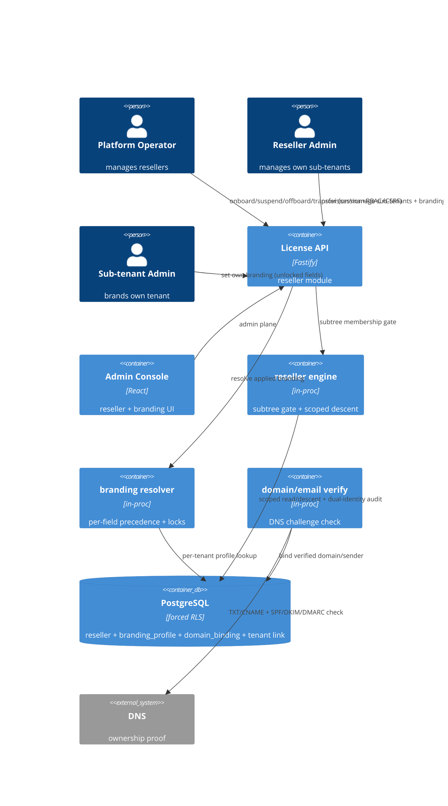

# Implementation Plan: Reseller and White-label Tenancy

**Branch**: `00019-reseller-and-white-label-tenancy` | **Date**: 2026-08-12 | **Spec**: [spec.md](spec.md)

## Summary

**Goal**: Let a vendor/platform operator onboard **resellers** that manage their own **sub-tenants** (customers) under delegated, downward-only administration, and let resellers/customers **white-label** the experience per tenant — all without weakening strict tenant isolation.
**Approach**: An additive `reseller` module over the existing E002 tenancy substrate + E005/E006 console: a self-referential parent→child link on `tenant` (one level), a per-tenant `branding_profile` with per-field locks + domain/email verification, and a **gated scoped-descent** authorization model — a reseller-admin's authority over a sub-tenant is a subtree-membership check that then executes under the sub-tenant's OWN tenant scope, with dual-identity append-only audit. No change to the per-tenant RLS predicate; cross-tenant reseller reads run on a controlled, audited platform-admin seam. Per {SAD:ADR-0015}.
**Key Constraint**: Strict tenant isolation preserved (downward-only, enforced at the data-access layer, no upward/lateral path); branding is presentation-only (no license/token/crypto change, Principle I); every reseller action on a sub-tenant is audited (dual-identity) and CSRF-protected.

## Technical Context

**Language/Version**: TypeScript 5.6 / Node 22 (ESM)
**Primary Dependencies**: Fastify 5, pg 8, Zod 3; reuses E002 tenancy (forced RLS, `withTenant`/`privileged`, GUC `app.current_tenant`), E005 console (session + RBAC `owner>admin>viewer` + double-submit CSRF), E006 admin module (`tenant`/user/`audit_log` management); a DNS-based domain/email verification surface (EXTERNAL-SERVICE, P2)
**Storage**: PostgreSQL 16 (additive expand-only migration `0014_reseller_branding.sql`; forced RLS; self-ref `tenant.parent_reseller_id`; new `reseller`, `branding_profile`, `domain_binding` tenant-owned tables; append-only `audit_log` reused with a target-tenant dual-identity projection)
**Testing**: Vitest 2 + @testcontainers/postgresql
**Target Platform**: Linux container (self-host + managed) + React admin-ui
**Project Type**: single (modular monolith server) + React admin-ui
**Project Mode**: brownfield
**Performance Goals**: admin-plane operations; subtree listing bounded + tenant_id-leading indexes; branding resolution is a small per-tenant lookup resolved server-side per request
**Constraints**: downward-only isolation enforced at the data layer; no upward/lateral escalation; presentation-only branding (no token/crypto/verifier change); CSRF on every mutation; append-only dual-identity audit; expand-only migration preserving forced RLS
**Scale/Scope**: one reseller level (reseller → customer); per-reseller sub-tenant sets bounded by a hard quota

## Instructions Check

*GATE: Must pass before Phase 0 research. Re-check after Phase 1 design.*

| Principle | Status | Evidence |
|-----------|--------|----------|
| I. Offline-first / single crypto core / keys never exposed / no token change | PASS | This epic touches NO signing/verification/token surface: branding is presentation-layer only and never alters a license's contents or the signed token; already-issued tokens verify offline unchanged (spec FR-018-equivalent Assumptions, SC-006). The reseller/branding tables store no key or crypto material. |
| II. Multi-tenant isolation (forced-RLS + RBAC + audit + CSRF) | PASS | The per-tenant forced-RLS predicate is UNCHANGED; a reseller-admin's cross-tenant authority is a gated scoped-descent (subtree-membership check → operate under the sub-tenant's own `app.current_tenant`), and reseller subtree READS run on the existing audited platform-admin seam (`privileged`) filtered by `parent_reseller_id` — never a broadening of RLS. RBAC extends `owner>admin>viewer` (reseller-admin = admin/owner of a reseller tenant), fail-closed. Every mutation is double-submit CSRF-protected; every reseller action on a sub-tenant writes a dual-identity `audit_log` row (FR-002/004/005/009/016, SC-001/002/005/007/012). |
| III. Single security core, append-only audit | PASS | No new crypto; the append-only `audit_log` (no app UPDATE/DELETE) is reused with a target-tenant projection for dual-identity reseller actions; trust signals (revocation/tamper/signing identity/audit/legal) are never white-labeled (FR-008, SC-006). |
| PII / privacy minimization | PASS | FR-017 resolved to metadata-only — a reseller-admin never sees a sub-tenant's license/usage/activation data; `branding_profile` holds no secret/PII (a custom-domain/email verification token is a public DNS challenge, not a secret). |
| Migration ordering / raw-SQL / expand-only / src-layout | PASS | Sequential `0014_reseller_branding.sql` after `0013_policy_rules.sql`; expand-only `tenant` columns (self-ref link) + new tenant-owned tables; node-postgres raw SQL; new `src/server/modules/reseller/` module. |

**Gate: PASS** — no violations; the isolation model is the key risk and is structurally cleared by the scoped-descent + controlled-seam design. Complexity Tracking omitted.

## Architecture



## Architecture Decisions

Feature-local tradeoffs. The overarching reseller-hierarchy + delegated cross-tenant administration model is a project-wide decision → see **ADR-0015**.

| ID | Decision | Options Considered | Chosen | Rationale |
|----|----------|--------------------|--------|-----------|
| AD-001 | Reseller authorization model | new global `reseller_admin` role / gated scoped-descent (reseller-tenant admin + subtree gate) | Gated scoped-descent: a reseller-admin is an `admin`/`owner` of a reseller tenant; acting on a sub-tenant requires a subtree-membership gate, then the op runs under the sub-tenant's OWN `app.current_tenant` scope | Keeps the per-tenant forced-RLS predicate unchanged (Principle II), reuses the existing role model, and confines cross-tenant reach to a single audited gate — smallest isolation-reasoning surface (FR-002/004/005) |
| AD-002 | Reseller subtree READ (list my customers) | broaden RLS predicate to include `parent_reseller_id` / controlled `privileged` seam filtered by reseller id + membership assertion | Controlled platform-admin seam (`privileged`) that reads `tenant` rows `WHERE parent_reseller_id = :reseller` after asserting the caller owns that reseller | Matches E002's "cross-tenant only via an explicit audited platform-admin path"; avoids weakening the RLS predicate for every query (a broadened predicate risks sibling leakage) |
| AD-003 | Reseller attributes placement | columns on `tenant` / a 1:1 `reseller` table keyed by tenant_id | A `reseller` table (tenant_id PK) for reseller-only attributes (status, quota) + a single expand-only `tenant.parent_reseller_id` self-ref link on the sub-tenant | Keeps the hot `tenant` row lean; reseller lifecycle state lives with reseller semantics; the parent link is the one field every subtree query needs |
| AD-004 | Branding resolution | stored resolved profile / compute per-field precedence at read | Compute per-field precedence at read (sub-tenant override → reseller default → platform default), honoring reseller `locked` flags | A small per-tenant lookup; storing a resolved copy would drift when a reseller default or lock changes (FR-006/007, SC-004) |
| AD-005 | Branding locks | separate lock table / per-field `locked` flags on the reseller profile | Per-field `locked` boolean set on the reseller's own `branding_profile` | The lock is a property of the reseller's field; a sub-tenant override is simply ignored for a locked field at resolution (FR-006/007, STF-001/002) |
| AD-006 | Domain/email verification | trust-on-submit / DNS-proof before activation | DNS-proof before activation — domain via TXT/CNAME challenge, email sender via SPF+DKIM/DMARC alignment; a `domain_binding` row is `pending`→`verified` and unique per host | Anti-spoofing (spec Risk), proves send-authorization not mere address control; a domain/sender binds to at most one tenant (FR-013, SC-011) |
| AD-007 | Suspend cascade | store per-sub-tenant flag / derive read-only from reseller status at request time | Derive at request time: a sub-tenant under a `suspended` reseller resolves to read-only (login+read allowed; no provisioning/activation/branding mutation) | No fan-out write across sub-tenants on suspend/reinstate; reversible by flipping reseller status; issued licenses keep verifying offline (FR-011, SC-009) |
| AD-008 | Dual-identity audit | new audit table / reuse `audit_log` with an acting-reseller projection | Reuse the append-only `audit_log`; a reseller action row is written under the SUB-TENANT scope (`tenant_id`=target sub-tenant, `actor`=reseller-admin user) plus an expand-only `actor_reseller_id` = the acting reseller's home tenant (NULL for ordinary actions) | One tamper-evident trail (Principle III); `actor_reseller_id` captures WHICH reseller acted and survives a later sub-tenant transfer — full dual identity (FR-009, SC-005) |
| AD-009 | Module placement | extend `admin` module / new `reseller` module | New `src/server/modules/reseller/` (subtree gate, branding resolver, verification) + a thin branding read consumed by console surfaces; minimal edits to `admin` (tenant provisioning) | Distinct concern; keeps the tenant/user/audit core edits minimal (module-boundary respected, mirrors E016/E017) |

## Data Model Summary

Migration `migrations/0014_reseller_branding.sql` (expand-only, sequential after `0013_policy_rules.sql`). The per-tenant `tenant_isolation` RLS predicate is UNCHANGED — reseller cross-tenant reach is confined to the audited `privileged` seam (AD-001/002).

| Entity | Attributes (name: type, constraints) | Relationships | State Transitions |
|--------|--------------------------------------|---------------|-------------------|
| tenant *(E002, extended)* | `+parent_reseller_id: uuid NULL` FK→tenant(id) ON DELETE NO ACTION, CHECK(<>id), partial idx WHERE NOT NULL; existing cols untouched | self-ref sub-tenant→managing reseller (1 level); NULL=direct-platform or reseller | link set at onboard/provision; operator transfer re-points; NULL on reassign-to-platform |
| reseller *(new, PK=tenant_id)* | tenant_id: uuid PK FK→tenant; status: text CHECK(active\|suspended\|offboarding) DEFAULT active; sub_tenant_quota: int CHECK(>=0); offboarding_started_at: timestamptz NULL (stable grace anchor, present iff offboarding — `graceEndsAt = offboarding_started_at + grace window`); created_at/updated_at; shape CHECK; forced RLS | 1:1 tenant-that-is-a-reseller; has_many sub-tenants via tenant.parent_reseller_id | active⇄suspended (reversible read-only cascade); active→offboarding (gated on sub-tenant resolution) |
| branding_profile *(new, PK=tenant_id)* | tenant_id: uuid PK FK→tenant; logo_ref/color_primary/color_secondary/product_name/support_url/help_url/email_sender/custom_domain: text NULL (= contract BrandingFieldName set of 8); locked_fields: jsonb NOT NULL DEFAULT '[]' CHECK(array), members = the 8 field names (service-layer); timestamps; forced RLS; no secret/PII | 1:1 tenant (reseller-default OR sub-tenant-override layer) | none (mutable config); applied branding resolved per-field at read, never stored |
| domain_binding *(new, PK=(tenant_id,id))* | id/tenant_id: uuid FK→tenant; binding_type: CHECK(custom_domain\|email_sender); host: text normalized; status: CHECK(pending\|verified\|active) DEFAULT pending; verification_method: CHECK(dns_txt\|dns_cname\|spf_dkim_dmarc); challenge_token: text PUBLIC; verified_at; activated_at; method + status-shape CHECKs; forced RLS; **global partial-unique (binding_type,host) WHERE status IN ('verified','active')**; idx (tenant_id,binding_type,status) | belongs_to tenant; active binding backs branding_profile.custom_domain/email_sender | pending→verified→active (DNS proof, then explicit /activate); ≤1 verified/active per host globally |
| audit_log *(E002, extended)* | `+actor_reseller_id: uuid NULL` (the acting reseller's home tenant; NULL for ordinary actions; no FK; append-only); existing cols/grants untouched | reseller action: tenant_id=target sub-tenant, actor=reseller-admin user, actor_reseller_id=acting reseller | append-only, immutable (tamper-evident); dual-identity survives sub-tenant transfer |

**Detail**: `FEATURE_DIR/data-model.md`

## API Surface Summary

Admin-plane, console-only (E005 `admin_session` cookie + RBAC `owner>admin>viewer` + double-submit `X-CSRF-Token` on every mutation). NO runtime/API-key plane; NO signing/crypto/token surface. Each operation carries `x-rbac.plane` ∈ {operator, reseller, sub_tenant}. Out-of-scope/cross-tenant ids → `404 not_found` (never `403`, no disclosure). Branding is presentation-only; trust signals are never white-labeled.

| Method | Path | Purpose | Auth (plane / minRole / CSRF) | Req → Res |
|--------|------|---------|-------------------------------|-----------|
| POST | `/admin/operator/resellers` | Onboard a reseller — create-new OR promote-existing; first admin + quota (FR-001/010) | operator / admin / yes | OnboardResellerRequest (oneOf create_new\|promote_existing) → 201 Reseller |
| GET | `/admin/operator/resellers` | List resellers (deterministic, bounded) | operator / viewer / no | → ResellerList |
| GET | `/admin/operator/resellers/{resellerId}` | Get one reseller | operator / viewer / no | → Reseller |
| PATCH | `/admin/operator/resellers/{resellerId}/quota` | Update hard sub-tenant quota — operator-only (FR-003) | operator / admin / yes | UpdateQuotaRequest → Reseller |
| POST | `/admin/operator/resellers/{resellerId}/suspend` | Suspend (reversible; read-only cascade) (FR-011) | operator / admin / yes | → Reseller |
| POST | `/admin/operator/resellers/{resellerId}/reinstate` | Reinstate a suspended reseller (FR-011) | operator / admin / yes | → Reseller |
| POST | `/admin/operator/resellers/{resellerId}/offboard` | Offboard — blocked 409 `sub_tenants_unresolved`; grace window (FR-012) | operator / admin / yes | → OffboardResult |
| POST | `/admin/operator/sub-tenants/{subTenantId}/move` | Move sub-tenant between resellers / to-from direct-platform; audited both sides (FR-015) | operator / admin / yes | MoveSubTenantRequest (oneOf to_reseller\|to_direct_platform) → SubTenant |
| GET | `/admin/reseller/sub-tenants` | List own sub-tenants (metadata only, FR-017) | reseller / viewer / no | → SubTenantList |
| POST | `/admin/reseller/sub-tenants` | Provision sub-tenant — 409 `quota_exceeded` at hard cap (FR-003) | reseller / admin / yes | ProvisionSubTenantRequest → 201 SubTenant |
| GET | `/admin/reseller/sub-tenants/{subTenantId}` | Get own sub-tenant (metadata only; out-of-subtree → 404) (FR-004/017) | reseller / viewer / no | → SubTenant |
| GET | `/admin/reseller/branding` | Get reseller branding profile + per-field locked flags (FR-006/007) | reseller / viewer / no | → ResellerBrandingProfile |
| PUT | `/admin/reseller/branding` | Set reseller branding + locked flags (FR-006/007) | reseller / admin / yes | SetResellerBrandingRequest → ResellerBrandingProfile |
| GET | `/admin/reseller/domains` | List domain/email-sender bindings + status (FR-013) | reseller / viewer / no | → DomainBindingList |
| POST | `/admin/reseller/domains` | Initiate DNS verification; host bound → 409 `binding_conflict` (FR-013) | reseller / admin / yes | InitiateVerificationRequest → 201 DomainBinding |
| GET | `/admin/reseller/domains/{bindingId}` | Get a binding + verification status (FR-013) | reseller / viewer / no | → DomainBinding |
| POST | `/admin/reseller/domains/{bindingId}/verify` | Check DNS; pending→verified; 409 `not_verified` if unmet (FR-013) | reseller / admin / yes | → DomainBinding |
| POST | `/admin/reseller/domains/{bindingId}/activate` | Activate for white-label; refused 409 `not_verified` until verified (FR-013) | reseller / admin / yes | → DomainBinding |
| GET | `/admin/branding` | Get own branding overrides + resolved applied branding (FR-006/007/014) | sub_tenant / viewer / no | → SubTenantBranding |
| PUT | `/admin/branding` | Set own overrides — reseller-locked field → 409 `field_locked` (FR-006/007) | sub_tenant / admin / yes | SetSubTenantBrandingRequest → SubTenantBranding |

**Error codes** (`{code, message, details?}`): `validation_error`(400), `unauthorized`(401), `forbidden`(403 RBAC/plane + CSRF), `not_found`(404 out-of-scope/cross-tenant, no disclosure), and 409: `onboarding_conflict` (promote a tenant already a reseller/sub-tenant — the one-level rule), `quota_exceeded`, `field_locked`, `not_verified`, `binding_conflict`, `sub_tenants_unresolved`, `reseller_suspended`, `last_owner`, `invalid_state_transition` (suspend non-active / reinstate non-suspended / move into offboarding). `last_owner` (FR-016) is enforced on the reused E005/E006 user-admin surface, not a new endpoint here.

**Detail**: `FEATURE_DIR/contracts/reseller-api.openapi.yaml` — OpenAPI 3.1, 20 operations, three actor planes, admin-only. A reseller sets only its OWN branding + locks (never a sub-tenant's — metadata-only, FR-017); verify and activate are two steps so `not_verified` has a precise trigger.

## Testing Strategy

| Tier | Tool | Scope | Mock Boundary | Install |
|------|------|-------|---------------|---------|
| Unit | Vitest 2 | branding per-field precedence + lock resolution, subtree-membership gate logic, suspend-cascade derivation, quota check, verification-state machine | pure functions; no DB | configured |
| Integration | Vitest 2 + @testcontainers/postgresql | reseller onboard/suspend/offboard/transfer; downward-only visibility + cross-tenant 404 + unset-GUC 0-rows; dual-identity audit; branding CRUD + resolution + locks; domain/email verify-before-activate; quota enforcement; RLS isolation across two resellers | real Postgres; injected DNS-verification result; console admin session | configured |
| Security | semgrep (`p/typescript`,`p/owasp-top-ten`) + `npm audit --omit=dev` + an isolation/escalation test (upward/lateral/IDOR) | no upward/lateral cross-tenant path reachable; no reseller access to sub-tenant operational data (FR-017); CSRF on every mutation | — | configured (semgrep CI-only) |
| Coverage | Vitest v8 | global gate lines ≥80 / branches ≥80; ≥80% line+branch on `src/server/modules/reseller/**` | — | configured |

## Error Handling Strategy

| Error Category | Pattern | Response | Retry |
|----------------|---------|----------|-------|
| Cross-subtree / out-of-scope tenant reference (reseller reaching a sibling/parent/platform) | fail-closed, no existence disclosure | 404 not found (+ security-event audit) | no |
| Missing/insufficient RBAC (viewer or non-reseller acting) | fail-closed | 401/403 (+ security-event audit) | no |
| Missing/mismatched CSRF (admin mutation) | fail-closed | 403 | no |
| Onboard/promote a tenant that is already a reseller or a sub-tenant (one-level rule) | fail-closed | 409 `onboarding_conflict` | no |
| Invalid lifecycle transition (suspend non-active / reinstate non-suspended / move into an offboarding reseller) | fail-closed | 409 `invalid_state_transition` | no |
| Sub-tenant quota exceeded (reseller provisioning) | fail-fast | 409 `quota_exceeded` | no |
| Branding: sub-tenant overriding a reseller-locked field | fail-closed | 409 `field_locked` | no |
| Domain/email used before verification, or already bound to another tenant | fail-closed | 409 `not_verified` / `binding_conflict` | no |
| Offboard a reseller with unresolved sub-tenants | fail-closed | 409 `sub_tenants_unresolved` | no |
| Mutation on a sub-tenant under a suspended reseller (read-only cascade) | fail-closed | 409 `reseller_suspended` | no |
| Last-owner removal/demotion (reseller or sub-tenant) | fail-closed | 409 `last_owner` | no |

## Integration Points

| Spec Reference | System/Service | Technical Approach | Contract |
|----------------|----------------|--------------------|----------|
| FR-001/003/015 | E006 admin (tenant provisioning) | reseller onboarding creates-or-promotes a `tenant`; sub-tenant provisioning reuses tenant-create; operator transfer re-points `parent_reseller_id` | admin tenant seam |
| FR-002/004/005/009 | E002 tenancy + E005 console | subtree gate + scoped descent over `withTenant`/`privileged`; console session + RBAC + CSRF; dual-identity `audit_log` | `withTenant`/`privileged`, `rbac-middleware`, `audit_log` |
| FR-006/007/008/014 | console surfaces (all tenant-facing) | branding resolver applies per-field precedence; trust signals excluded from white-label | branding read seam |
| FR-013 | DNS (external) | TXT/CNAME domain proof + SPF/DKIM/DMARC email alignment check before activation | `domain_binding` verification |
| (Principle I) | E004 signer / E001 verifier | UNCHANGED — no crypto, no token, no verifier touch | (no change) |

## Risk Mitigation

| Risk (from spec) | Likelihood | Impact | Mitigation | Owner |
|-------------------|------------|--------|------------|-------|
| Isolation regression / privilege escalation via the hierarchy | M | H | Unchanged per-tenant RLS predicate; single audited subtree gate (AD-001/002); explicit upward/lateral/IDOR security tests; unset-GUC-0-rows + cross-tenant-404 assertions | `reseller/` gate + migration |
| Branding trust abuse (spoofing / hidden signer) | M | M | DNS-proof-before-activate + one-binding-per-host (AD-006); non-white-labelable trust-signal set enforced at the resolver (FR-008) | `reseller/` verify + branding resolver |
| Orphaned sub-tenants on reseller offboarding | L | H | Offboard blocked until every sub-tenant is transferred/reassigned; grace window; audited (FR-012) | `reseller/` lifecycle |

## Requirement Coverage Map

| Req ID | Component(s) | File Path(s) | Notes |
|--------|--------------|--------------|-------|
| FR-001 | reseller lifecycle, admin tenant | `modules/reseller/lifecycle.ts`, `modules/admin/*` | onboard: create-new or promote-existing reseller + first admin + quota |
| FR-002 | subtree gate, rbac | `modules/reseller/gate.ts`, `console/rbac-middleware.ts` | reseller-admin = admin/owner of reseller tenant; whole-subtree authority; fail-closed |
| FR-003 | reseller lifecycle, repo | `modules/reseller/lifecycle.ts`, `reseller-repo.ts` | provision sub-tenant under hard quota |
| FR-004 | subtree gate | `modules/reseller/gate.ts` | downward-only; out-of-subtree → 404, no disclosure |
| FR-005 | subtree gate, migration | `modules/reseller/gate.ts`, `migrations/0014_reseller_branding.sql` | no upward/lateral; data-layer enforcement |
| FR-006 | branding repo/resolver | `modules/reseller/branding.ts` | per-tenant profile + per-field locks; hierarchy-safe lock presentation |
| FR-007 | branding resolver | `modules/reseller/branding.ts` | per-field precedence sub-tenant→reseller→platform; locks win |
| FR-008 | branding resolver | `modules/reseller/branding.ts` | trust-signal set never white-labeled |
| FR-009 | audit projection | `modules/reseller/audit.ts`, `modules/admin/audit.ts` | dual-identity append-only audit |
| FR-010 | reseller lifecycle | `modules/reseller/lifecycle.ts` | onboarding establishes reseller + first admin + default quota |
| FR-011 | suspend cascade | `modules/reseller/lifecycle.ts`, `gate.ts` | reversible suspend; read-only cascade derived at request time |
| FR-012 | offboard lifecycle | `modules/reseller/lifecycle.ts` | transfer-or-reassign all sub-tenants; grace window; audited |
| FR-013 | verification | `modules/reseller/verify.ts`, `domain_binding` | DNS TXT/CNAME + SPF/DKIM/DMARC before activation; one binding per host |
| FR-014 | branding resolver, gate | `modules/reseller/branding.ts`, `gate.ts` | sub-tenant experience unchanged bar branding; hierarchy hidden |
| FR-015 | transfer lifecycle | `modules/reseller/lifecycle.ts`, `branding.ts` | operator-only move; keep overrides, re-resolve locks; audit both |
| FR-016 | rbac / tenant | `console/rbac-middleware.ts`, `modules/admin/users.ts` | last-owner protection preserved (reseller + sub-tenant) |
| FR-017 | subtree gate | `modules/reseller/gate.ts` | metadata-only; no license/usage/activation exposure to reseller |

## Project Structure

### Source Code

```text
+ src/server/modules/reseller/
+   index.ts                         registerReseller seam, ResellerError, app.reseller (subtree gate seam)
+   config.ts                        default sub-tenant quota, offboarding grace window, non-white-labelable trust-signal set, platform-default branding
+   reseller-repo.ts                 reseller CRUD + status/quota; parent_reseller_id link; sub-tenant list (privileged subtree read); withTenant/privileged
+   gate.ts                          subtree-membership gate + scoped descent (assert reseller owns target sub-tenant → operate under sub-tenant scope); downward-only 404
+   lifecycle.ts                     onboard (create/promote) + provision sub-tenant (quota) + suspend/reinstate + offboard (transfer-or-reassign) + operator transfer
+   branding.ts                      branding_profile CRUD + per-field precedence resolver + reseller locks + trust-signal exclusion
+   verify.ts                        domain (TXT/CNAME) + email (SPF/DKIM/DMARC) ownership verification; one-binding-per-host
+   audit.ts                         dual-identity audit projection (actor reseller-admin + target sub-tenant) over audit_log
+   routes.ts                        operator + reseller admin endpoints (session+RBAC+CSRF)
+   __tests__/                       unit + integration (isolation/escalation, branding precedence/locks, verify, quota, lifecycle, dual-audit)
+ migrations/0014_reseller_branding.sql   (repo ROOT, sequential after 0013) reseller + branding_profile + domain_binding + tenant.parent_reseller_id (RLS/grants/indexes)
~ src/server/modules/index.ts        register reseller after registerPolicy
~ src/server/modules/admin/{routes.ts,users.ts}  reseller onboarding + first-admin provisioning hooks (minimal)
~ src/server/config/index.ts         reseller config keys
~ src/admin-ui/src/pages/reseller/…  console: reseller mgmt (operator) + sub-tenant mgmt + branding editor (per-field + locks) + domain/email verify
~ src/admin-ui/src/…                 apply resolved branding across tenant-facing surfaces
~ vitest.config.ts                    add src/server/modules/reseller/** to coverage globs + ≥80% line+branch gate
+ .github/workflows/reseller.yml      reseller CI (typecheck+lint, Testcontainers IT+coverage, npm audit, semgrep; SHA-pinned) mirroring usage.yml
```

**Patterns to reuse**: E016 `usage` / E017 `policy` module shape (`register<Module>`, `<Module>Error`, `config.ts`, `*-repo.ts`, forced-RLS migration); E002 `withTenant`/`privileged` + the audited platform-admin seam; E005 console session + `rbac-middleware.ts` + CSRF; E006 `admin` tenant/user/`audit_log`.
**Tests to extend**: the `@testcontainers/postgresql` + admin-session harness from `admin`/`policy` `__tests__/`.
**Naming conventions**: `register<Module>` seam, `<Module>Error(code,status,…)`, ESM `.js` specifiers, per-module `config.ts`/`routes.ts`/`*-repo.ts`.

## Implementation Hints

- **[HINT-001]** Isolation: NEVER broaden the per-tenant RLS predicate to add `parent_reseller_id`. A reseller subtree READ runs on the `privileged` seam filtered by `parent_reseller_id = :reseller` AFTER asserting the caller owns that reseller; a reseller ACTION on a sub-tenant runs under that sub-tenant's OWN `app.current_tenant` after the subtree gate — a scoped descent, one gate, one audited path (AD-001/002).
- **[HINT-002]** Downward-only: every out-of-subtree reference (sibling, parent, platform) MUST return 404 with no existence disclosure and a security-event audit — not 403 (403 leaks existence). Test upward AND lateral AND IDOR-by-id (FR-004/005, SC-002/007).
- **[HINT-003]** Branding precedence is PER FIELD: resolve each field independently sub-tenant→reseller→platform, but a reseller-`locked` field ignores any sub-tenant override. Present a locked field to the sub-tenant as "set by your provider" WITHOUT revealing the reseller (FR-006/007/014, STF-001/002/004).
- **[HINT-004]** Trust signals (revocation/tamper/security notices, signing identity, audit, legal text) are NEVER sourced from `branding_profile` — the resolver must exclude them so no branding config can spoof them (FR-008, SC-006).
- **[HINT-005]** Suspend cascade + transfer are DERIVED, not fanned out: read-only for a sub-tenant is computed from its reseller's `suspended` status at request time; a transfer re-points `parent_reseller_id`, keeps the sub-tenant's own overrides, and re-resolves locks against the destination reseller — audit both source and destination (AD-007, FR-011/015, STF-006).
