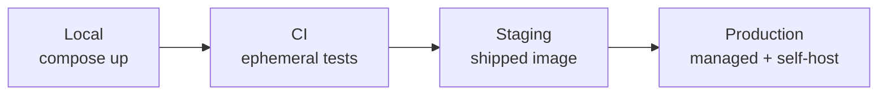
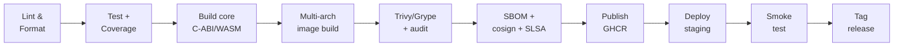
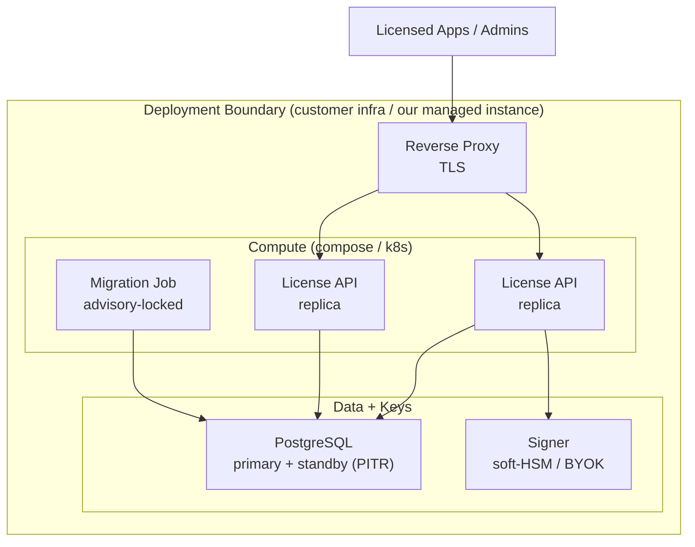

# Deployment & Operations Document: LicenseSrv

> Date: 2026-06-26 | Status: Draft

## Deployment Summary and Context

LicenseSrv ships as a single, multi-arch container image driven entirely by 12-factor environment configuration (see `specs/sad.md`, ADR-0006). The operating model is **self-host-first and cloud-agnostic**: the same image and `docker-compose` stack run on a customer's own infrastructure, in a private cloud, or fully air-gapped, with a managed multi-tenant SaaS as a later deployment of the same artifact. There is **no mandatory cloud dependency** — signing uses a pluggable signer with a soft-HSM/encrypted-keystore default (ADR-0003 self-host path), and Postgres is self-operated. Operational priorities, in order: (1) integrity and custody of signing keys, (2) tenant isolation, (3) offline-verify availability (network-independent), (4) safe, reversible upgrades for self-host operators.

## Environment Strategy

| Environment | Purpose | Promotion Gate | Data Strategy | Parity with Prod |
|-------------|---------|---------------|---------------|------------------|
| Local | Developer workstation; compose up | None | Seed fixtures, fake signer | Minimal |
| CI (ephemeral) | Automated test/integration per push | Lint + tests + coverage ≥80% | Testcontainers Postgres, fake signer | Partial |
| Staging | Pre-release validation on the shipped image | Green CI + smoke pass | Anonymized/synthetic | High (same image+config) |
| Production | Live (our managed instance) / customer self-host | Release approval + signed artifact | Real | Baseline |

### Environment Flow

### Feature Flags and Progressive Rollout

- **Feature flags**: lightweight config/env-driven flags (no external flag SaaS), used to gate P2/P3 capabilities (online enforcement, billing, floating seats) without forking the image.
- **Rollout strategy**: semver-tagged, signed releases promoted through staging. Self-host = versioned releases the operator applies; managed SaaS = rolling (readiness-gated), with blue/green and canary layered later on the same images.
- **Rollback trigger**: failed health/readiness probes, error-budget burn, or failed smoke test → redeploy the previous digest-pinned image (safe because migrations are expand/contract — DDR-004).

## Deployment Targets and Packaging

- **Deployment model**: container image (one multi-arch image: `linux/amd64`, `linux/arm64`).
- **Build artifact**: a single Docker image bundling the Node/TS server plus the prebuilt Rust verifier-core binding artifacts; distributed as a **signed `docker-compose` bundle** and an optional **signed Helm chart**, plus an **offline air-gap bundle** (`docker save` / OCI layout for a private registry mirror).
- **Container registry**: GHCR; customers may mirror into a private in-boundary registry for air-gap.
- **Image tagging**: immutable semver tag + digest pin (no floating `latest` in production).
- **Vulnerability scanning**: Trivy + Grype on the built image (gate on HIGH/CRITICAL), `npm audit`, `cargo audit`.
- **App store distribution**: N/A.
- **Edge/CDN**: optional, deferred — signed keyring/CRL artifacts may be fronted by a CDN/object store; not required for self-host.

## CI/CD Pipeline Design

### Pipeline Stages

- **Pipeline tooling**: GitHub Actions (actions pinned by commit SHA; base image pinned by digest).
- **IaC approach**: Terraform portable modules — deferred until the managed-SaaS deployment is built; self-host uses compose/Helm, not IaC.
- **Deployment method**: self-host = operator-applied compose/Helm; managed = GitOps/rolling on the same image.
- **Rollback automation**: redeploy previous pinned digest (manual trigger, automatable on smoke/health failure).
- **Zero-downtime strategy**: rolling restart gated on readiness; migrations run as a separate gated job before app rollout.
- **Secrets in pipeline**: GitHub Actions OIDC + repo secrets; cosign **keyless** signing (no long-lived key in the build).
- **Rust build note**: native cross-compilation (cargo-zigbuild / cargo-chef) rather than QEMU emulation; dependency-build layers split from source layers to keep cache hits.

## Infrastructure and Hosting

- **Cloud provider**: cloud-agnostic / self-host-first; no provider lock-in. Same artifact runs on customer VMs, on-prem, private cloud, or air-gapped.
- **Compute model**: Docker / docker-compose (default self-host); optional Kubernetes via Helm; managed-SaaS orchestration (k8s/ECS) added later.
- **Networking**: customer-provided reverse proxy/TLS termination (e.g. Caddy/Traefik/nginx); the app binds its own port (12-factor). DNS/cert management is the operator's.
- **Storage infrastructure**: self-operated PostgreSQL 16 with continuous archiving + PITR (`archive_timeout=60`) and a streaming standby; backup/restore runbook shipped to operators.
- **Cost estimation**: see Cost Considerations (runtime cost is the operator's).
- **Budget constraints**: our spend is CI/registry/support, not runtime hosting.

### Infrastructure Diagram

## Observability and Monitoring

### Logging
- **Approach**: structured JSON logs, tagged with `tenant_id`, `request_id`, `product_id`, and license/seat outcome; queryable per tenant.
- **Aggregation**: operator's choice (Loki/ELK/cloud) — cloud-agnostic; managed instance uses a hosted aggregator.
- **Retention**: hot 30 days / cold per operator policy; audit log retained per compliance (rotation guidance provided).

### Metrics
- **Application metrics**: request rate, errors, latency (activate/validate/issue), seat-contention, failed-validation/tamper counts.
- **Infrastructure metrics**: CPU/memory/disk/connections (app + Postgres + signer).
- **DORA metrics**: deployment frequency, lead time, change-failure rate, MTTR — derived from Git release + CI + incident timestamps (Four Keys pattern).
- **Tooling**: Prometheus + Grafana (self-hostable, cloud-agnostic); OpenMetrics endpoint exposed.

### Tracing
- **Distributed tracing**: OpenTelemetry on the online path (app vs DB vs signer attribution).
- **Correlation**: `request_id`/trace IDs propagated through logs and spans.

### Alerting
- **Alert routing**: Prometheus Alertmanager → Grafana OnCall / Slack / email (self-hostable); managed instance may use PagerDuty/Opsgenie.
- **On-call schedule**: lightweight weekly primary + secondary backup; page only on SEV1/SEV2.
- **Escalation policy**: SEV1 auto-escalates if unacked within 10 min; SEV2 escalates to lead at ~30 min.

### SLI/SLO

| Service | SLI | SLO Target | Error Budget | Measurement |
|---------|-----|------------|-------------|-------------|
| Control plane (managed) | availability | 99.9% (99.95% enterprise) | ~43.8 min/month | synthetic + real probes |
| Activation | success rate (excl. policy denials) | ≥ 99.9% | 0.1% requests | structured-log ratio |
| Validate (online) | latency p95/p99 | < 120 ms / < 300 ms | — | latency histogram |
| Issuance | latency p95 | < 300 ms | — | histogram (signer span) |
| Offline verify | network-independent availability | effectively 100% | — | in-process; not control-plane bound |
| Tenant isolation | cross-tenant access blocked | 100% (hard invariant) | 0 | continuous assertion → page |

## Reliability Engineering

- **Availability target**: 99.9% for our managed control plane; self-host availability is the operator's (we publish sizing/HA guidance). Offline verification is network-independent and unaffected by control-plane downtime.
- **RPO**: ≤ 5 min (near-zero with synchronous standby).
- **RTO**: ≤ 1 h, validated by monthly restore drills.

### Disaster Recovery
- **Backup strategy**: Postgres continuous archiving + PITR (pgBackRest or equivalent) and base backups; signer keystore backed up separately from its unlock material.
- **Failover mechanism**: streaming-replica failover; multi-region keys where a cloud KMS adapter is used.
- **DR testing cadence**: monthly timed restore drill (measure real restore throughput vs RTO); key-recovery rehearsal quarterly.

### Capacity and Scaling
- **Scaling approach**: horizontal, stateless API behind the load balancer/proxy; vertical-first for the single instance.
- **Scaling triggers**: CPU/latency/queue-depth thresholds; per-license seat contention is the only stateful hot spot (sharded per license).
- **Load testing**: pre-release load/latency check on activate/validate/issue; Ed25519 verify benchmarked (criterion).

### Incident Management
- **Incident process**: detect → triage (assign severity) → mitigate → resolve → blameless postmortem. SEV1 = verification/issuance down or signing-key compromise; SEV2 = major degradation/key feature broken; SEV3 = minor/localized.
- **Runbook location**: `docs/runbooks/` in-repo (stuck migration/advisory lock, keystore unlock failure, Postgres failover, image rollback, key recovery).
- **Postmortem policy**: blameless, mandatory for SEV1/SEV2 within 48 h; systemic causes + tracked actions.

### Production Readiness Review
- SLOs defined and alerts wired; runbooks exist for top failure modes.
- Backup/restore tested; rollback rehearsed; keystore backup verified (custodian quorum).
- Health/readiness probes validated; migration job dry-run on a prod-like dataset.
- Security review passed (supply-chain gates green, secrets audit, tenant-isolation tests).
- Latency/load budget checked; verify benchmark within target.

## Security and Compliance in Operations

### Supply Chain Security
- **SBOM generation**: Syft per release — CycloneDX (security) + SPDX (license/NTIA); attached to the release and as a cosign attestation.
- **Dependency scanning**: Trivy + Grype (image/deps), `npm audit`, `cargo audit`; gate on HIGH/CRITICAL; deps locked (`package-lock.json`, `Cargo.lock`), actions pinned by SHA, base image by digest.
- **Artifact signing**: cosign keyless (OIDC) image + bundle signing; SLSA build provenance (target Build L3 via hosted isolated builder); customers verify with `cosign verify` / `slsa-verifier` before deploy.

### Runtime Security
- **WAF / DDoS protection**: operator-provided edge (optional); per-tenant rate limiting in-app.
- **Intrusion detection**: operator's stack; app emits tamper/failed-validation security events.
- **Network policies**: container runs non-root, read-only root FS where possible; least-privilege DB role (non-owner, RLS-forced); egress limited.

### Secrets Management
- **Secrets store**: cloud-agnostic — file-mounted Docker/compose secrets (not env-baked) as default; SOPS + age for GitOps; Sealed Secrets on k8s; HashiCorp Vault supported if the operator runs one.
- **Rotation policy**: signing keys rotated on schedule via the keyring (overlapping `key_id`s) so issued licenses keep verifying; API keys/DB creds rotated per policy.
- **Access pattern**: injected at runtime via env/secret files; never in image layers or `docker inspect` output. Keystore unlock material split via Shamir (k-of-n custodians), stored apart from the encrypted keystore.

### Compliance
- **Applicable frameworks**: GDPR (machine/customer data minimized, hashed, erasable); SOC 2 mapping for the managed offering (Security, Availability, Confidentiality; Privacy where PII).
- **Audit logging**: append-only, tamper-evident (hash-chain optional); exportable to the customer's SIEM (JSON/CEF over file/syslog) including air-gapped.
- **Infrastructure access control**: RBAC + SSO for our managed ops; documented break-glass with audit.

## Operational Ownership and Processes

- **Production ownership model**: "you build it, you run it" for the managed instance; for self-host customers we are **tiered escalation support**, the customer runs primary on-call.
- **On-call structure**: lightweight weekly primary + backup; SEV-based paging only.
- **Change management**: PR-based with required CI gates; protected main branch.
- **Release approval**: manual approval after a green staging promotion; releases are signed and semver-tagged.
- **Documentation expectations**: runbooks, upgrade/migration matrix, backup & key-recovery procedures, and a `cosign verify` quickstart shipped with each release.

### Operational Maturity Roadmap

| Phase | Focus | Key Milestones |
|-------|-------|---------------|
| Crawl | CI + signed images + compose | Pipeline green, SBOM+sign, compose bundle, basic alerts, backup runbook |
| Walk | CD to staging, SLOs, runbooks | Helm chart, air-gap bundle, SLO dashboards, DR drill, DORA tracking |
| Run | Managed SaaS hardening | Blue/green + canary, auto-remediation, chaos drills, FinOps, multi-region keys |

## Cost Considerations

- **Estimated monthly cost**: our recurring cost is CI/registry/support, not runtime hosting (self-host customers bear runtime). Managed-SaaS runtime cost is introduced only when that deployment is built.
- **Major cost drivers**: CI build minutes (multi-arch builds — mitigated by native cross-compile), registry storage/egress, air-gap bundle size, and **support load (the dominant variable)**.
- **Cost optimization levers**: native cross-compilation over QEMU; slim multi-stage/distroless image; batch scan/SBOM/sign at release (not per commit); a **bounded supported-version matrix** + skip-version policy to cap support surface; audit-log retention/rotation guidance to bound customer disk.
- **Cost monitoring**: CI minute usage and registry storage reviewed per release; managed-SaaS billing alerts added with that deployment.

## Deployment Decisions

### DDR-001: Self-host-first, cloud-agnostic distribution

- **Status**: Accepted
- **Context**: Buyers need data residency and air-gapped operation; the product must run anywhere without a provider dependency.
- **Decision**: Distribute one signed multi-arch image as a `docker-compose` bundle (+ optional Helm chart) and an offline air-gap bundle; no mandatory cloud services.
- **Rationale**: Satisfies the PRD self-host-or-managed duality from one artifact; air-gap is first-class.
- **Alternatives Considered**: Provider-specific managed deployment first (rejected — lock-in, weakens self-host story); SaaS-only (rejected — excludes regulated/air-gapped buyers).
- **Tradeoffs**: Maximum portability and trust; we forgo managed-cloud conveniences (managed Postgres/KMS) until the SaaS deployment is built.
- **Consequences**: Postgres and signer are self-operated; operators need backup/key-recovery runbooks.

### DDR-002: GitHub Actions CI building one multi-arch signed image

- **Status**: Accepted
- **Context**: A Node + Rust monorepo must produce a single verifiable image.
- **Decision**: GitHub Actions pipeline: lint/test → build core bindings → multi-arch image (native cross-compile) → Trivy/Grype + audits → Syft SBOM + cosign keyless + SLSA provenance → GHCR publish.
- **Rationale**: Verifiable, reproducible supply chain for a security product; broad familiarity.
- **Alternatives Considered**: QEMU multi-arch (rejected — slow Rust builds); unsigned images (rejected — security product must be verifiable).
- **Tradeoffs**: More pipeline complexity for strong provenance.
- **Consequences**: Customers can `cosign verify` before deploy; actions/base image pinned.

### DDR-003: Pluggable signer with soft-HSM/keystore default; Shamir custodian backup

- **Status**: Accepted
- **Context**: Self-host-first forbids a mandatory cloud KMS, but signing keys are tier-0 (ADR-0003).
- **Decision**: A pluggable signer interface with an encrypted-keystore/soft-HSM default and optional cloud-KMS/PKCS#11 adapters; keystore unlock material split via Shamir (k-of-n), backed up separately from the keystore.
- **Rationale**: Hardware-grade custody without a cloud dependency; safe recovery.
- **Alternatives Considered**: Mandatory cloud KMS (rejected — breaks self-host/air-gap); single-passphrase keystore (rejected — single point of catastrophic loss).
- **Tradeoffs**: Operators take on custodian process; strongest portability and resilience.
- **Consequences**: Documented key-recovery (quorum) and rotation procedures required.

### DDR-004: Expand/contract backward-compatible migrations as a gated job

- **Status**: Accepted
- **Context**: Self-host upgrades and rollbacks must be safe without vendor intervention.
- **Decision**: Backward-compatible (expand/contract) migrations only, run as a discrete advisory-locked job before app rollout; destructive changes deferred ≥2 releases.
- **Rationale**: The previous app version still runs against the migrated schema → digest-pinned rollback is safe.
- **Alternatives Considered**: Implicit migrate-on-boot (rejected — replica race, unsafe rollback); destructive migrations (rejected — block rollback).
- **Tradeoffs**: Slightly more migration discipline for safe upgrades/rollbacks.
- **Consequences**: Published upgrade matrix and skip-version policy; DB backup as the escape hatch.

### DDR-005: Cloud-agnostic secrets injection (no cloud secret manager required)

- **Status**: Accepted
- **Context**: The stack must inject secrets without depending on a cloud secret manager.
- **Decision**: File-mounted Docker/compose secrets as default; SOPS+age and Sealed Secrets supported; Vault optional.
- **Rationale**: Portable, GitOps-friendly, no cloud lock-in; keeps secrets out of image layers/env.
- **Alternatives Considered**: Env-only secrets (rejected — leak via `docker inspect`/logs); cloud Secrets Manager required (rejected — breaks cloud-agnostic goal).
- **Tradeoffs**: Operators choose a mechanism; we document hygiene.
- **Consequences**: `.env` hygiene and secret-rotation guidance shipped.

## Risks, Assumptions, Constraints, and Open Questions

### Risks

- Self-host operators may misconfigure backups or keystore custody → catastrophic key/data loss; mitigated by shipped runbooks, readiness checklist, and Shamir custodian backup.
- Unbounded supported-version matrix → support-cost explosion; mitigated by an explicit version/skip policy.
- Air-gap bundle drift (missing image/SBOM) → failed offline install; mitigated by bundling images + SBOM + signatures together with checksums.
- Supply-chain compromise of a dependency/action → mitigated by pinning, dual scanners, signing, and SLSA provenance.

### Assumptions

- Operators can run Docker/compose (or k8s) and a PostgreSQL instance.
- Operators provide TLS termination and DNS.
- Most deployments can pull from GHCR or a mirror; air-gapped ones use the offline bundle.

### Constraints

- No mandatory cloud dependency in the default deployment.
- One image must serve all deployment shapes; configuration only via environment/secret files.
- Migrations must be backward-compatible to keep rollback safe.

### Open Questions

- Helm chart in the first release, or compose-only initially?
- Which managed cloud (if any) backs the first hosted SaaS instance, and when?
- Is a hosted update/telemetry channel (opt-in) desired for self-host version/upgrade notifications?
- Minimum supported Postgres version and HA topology guidance for self-host operators?
