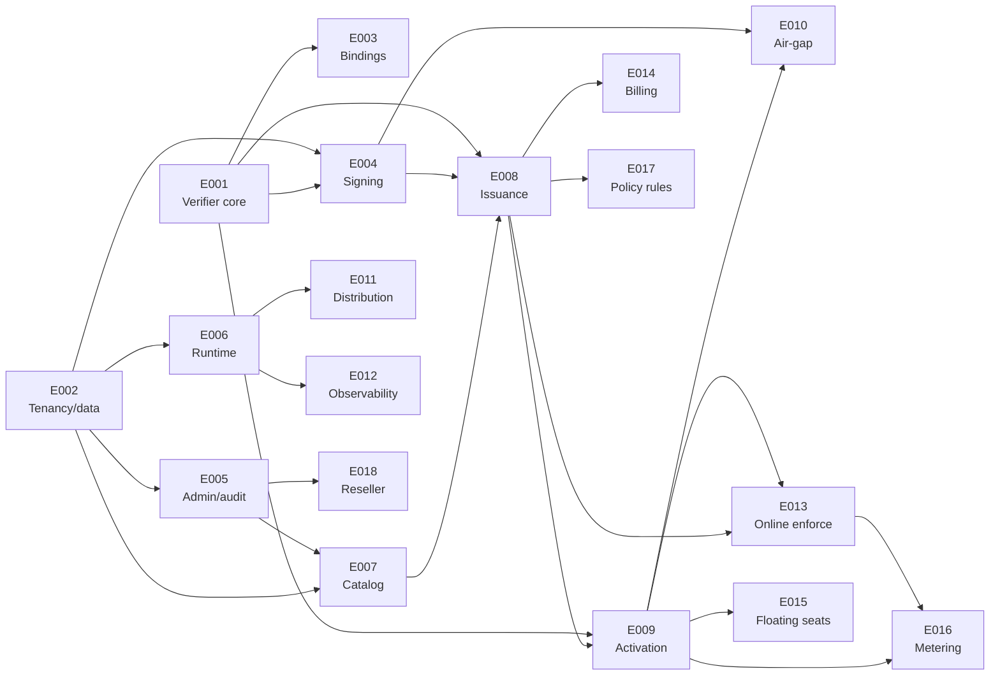

# Project Implementation Plan

**Product**: LicenseSrv | **Created**: 2026-06-26 | **Status**: Draft | **Total Epics**: 18 (P1: 10, P2: 5, P3: 3) | **Waves**: 8

## Epic Checklist

### Wave 1 — Foundations

> No dependencies. Establishes the offline verification core and the tenant-scoped data layer everything else builds on.

- [ ] E001 [P1] [TECHNICAL] {SAD:ADR-0001,ADR-0002}{PRD:CAP-003} Offline verifier core — token format + offline Ed25519 verify, keyring, clock anchor, fingerprint
- [ ] E002 [P1] [TECHNICAL] {SAD:ADR-0004,ADR-0005} Tenancy and data foundation — modular-monolith skeleton, Postgres, tenant repository + RLS, audit write path

### Wave 2 — Core services

> All parallel. Each depends only on Wave 1.

- [ ] E003 [P1] [PRODUCT] [P] {PRD:CAP-004}{SAD:ADR-0002} Embeddable verifier bindings — C-ABI, WASM, generated bindings from the one core
- [ ] E004 [P1] [TECHNICAL] [P] {SAD:ADR-0003}{DOD:DDR-3} Signing service and key custody — per-product keys, pluggable signer, keyring rotation
- [ ] E005 [P1] [PRODUCT] [P] {PRD:CAP-007} Tenant administration and audit — console login, RBAC, tenant scoping, audit views
- [ ] E006 [P1] [OPERATIONAL] [P] {SAD:ADR-0006}{DOD:DDR-4,DDR-5} Containerized runtime and config — single image, 12-factor config, secrets, gated migrations, probes

### Wave 3 — Catalog

> Depends on the data layer and the admin surface.

- [ ] E007 [P1] [PRODUCT] {PRD:CAP-001} No-code licensing catalog — define products, plans, and entitlements

### Wave 4 — Issuance

- [ ] E008 [P1] [PRODUCT] {PRD:CAP-002} License issuance and lifecycle — issue, revoke, suspend, reinstate, transfer signed licenses

### Wave 5 — Activation

- [ ] E009 [P1] [PRODUCT] {PRD:CAP-005} Machine activation and seats — node-lock, seat enforcement, fingerprint tolerance, deactivation

### Wave 6 — Offline completion and hardening

> E010 completes the P1 MVP. E011/E012 harden delivery (parallel).

- [ ] E010 [P1] [PRODUCT] [P] {PRD:CAP-006} Air-gapped activation — signed request/response file exchange
- [ ] E011 [P2] [OPERATIONAL] [P] {DOD:DDR-1,DDR-2} Supply chain and distribution — CI image build, SBOM, signing, compose/air-gap bundles
- [ ] E012 [P2] [OPERATIONAL] [P] {DOD:DDR-2} Observability and SLOs — logging, metrics, tracing, alerting, SLO dashboards (derived from DOD Observability/Reliability)

### Wave 7 — Online enforcement and monetization

> All parallel. P2 capabilities layered on issuance and activation.

- [ ] E013 [P2] [PRODUCT] [P] {PRD:CAP-008} Online enforcement and revocation — heartbeat, short-token renewal, revocation propagation
- [ ] E014 [P2] [PRODUCT] [P] {PRD:CAP-009} Billing-driven entitlement automation — webhooks, provisioning, grace periods
- [ ] E015 [P2] [PRODUCT] [P] {PRD:CAP-010} Floating and concurrent seats — seat leasing and reclamation

### Wave 8 — Advanced

> All parallel. P3 capabilities.

- [ ] E016 [P3] [PRODUCT] [P] {PRD:CAP-011} Usage metering — idempotent usage ingestion and aggregation
- [ ] E017 [P3] [PRODUCT] [P] {PRD:CAP-011} Low-code policy rules — guarded expression rules for dynamic entitlements
- [ ] E018 [P3] [PRODUCT] [P] {PRD:CAP-012} Reseller and white-label tenancy — partner resale and branding

## Dependency Diagram

## Execution Wave Summary

| Wave | Epics | All Parallel? | Notes |
|------|-------|---------------|-------|
| 1 | E001, E002 | Yes | Independent foundations |
| 2 | E003, E004, E005, E006 | Yes | Each needs only Wave 1 |
| 3 | E007 | n/a | Catalog needs data layer + admin |
| 4 | E008 | n/a | Issuance needs catalog + signer |
| 5 | E009 | n/a | Activation needs an issued license |
| 6 | E010, E011, E012 | Yes | E010 completes P1; E011/E012 are P2 hardening |
| 7 | E013, E014, E015 | Yes | P2 capabilities on issuance/activation |
| 8 | E016, E017, E018 | Yes | P3 advanced capabilities |

**P1 MVP** = E001–E010 (Waves 1–6). Demonstrable end to end: configure catalog → issue license → verify offline across stacks → activate node-locked with seats → activate air-gapped, all tenant-isolated and audited.

## Parallel Execution Guidance

### Independent Epics

- Wave 2: E003, E004, E005, E006 share no mutable files and can run fully in parallel.
- Wave 6: E010 (product) is independent of E011/E012 (operational).
- Waves 7 and 8: all member epics are mutually independent.

### Integration Risks

- **Token byte-layout (E001)**: E003 (bindings), E004 (signer), E008 (issuance) all depend on the exact token format. Freeze E001's format and version (`token_version`, `key_id`) before downstream work; treat changes as breaking.
- **Data schema (E002)**: E004, E005, E007, E008, E009 add tables/columns. Use expand-only, backward-compatible migrations to avoid conflicts when parallel epics touch the schema.
- **Runtime REST surface**: E009 (activate/validate) and E013 (online validate/heartbeat) share runtime endpoints; coordinate the route contract to avoid divergence.

### Shared Resource Conflicts

- **Migrations**: any epic adding schema must serialize migration ordering (sequential migration numbers); not safe to merge two schema migrations blindly.
- **Admin SPA shell**: E005 introduces the console shell; E007/E008/E009 add UI slices — coordinate routing/nav to avoid races.
- **Signer interface**: E004 owns the signer contract; E008 and E010 consume it — do not fork the interface.

## Epic Details

### E001 — Offline verifier core

- **Category**: TECHNICAL | **Priority**: P1 | **Source**: {SAD:ADR-0001, ADR-0002}{PRD:CAP-003}
- **Scope**: The single, write-once cryptographic core that parses a license token, verifies its Ed25519 signature against a pinned keyring, and evaluates expiry, clock-rollback, fingerprint, and entitlements with no network. Distributed as an embeddable library.
- **Actors**: Integrating Developer, Licensed Application.
- **Key entities**: License token, keyring, entitlement.
- **Depends on**: —
- **Dependency contracts**: none.
- **Depended on by**: E003, E004, E008, E009.
- **Produces (shared)**: `verifier-core` library; the canonical token format.
- **Constraints**: zero-network verify path; verify p99 < 5 ms; parser must be panic-free (fuzzed); versioned token format.
- **Acceptance criteria**:
  - [ ] A valid token verifies offline and exposes its entitlements.
  - [ ] Tampered, expired, wrong-key, and wrong-machine tokens are rejected.
  - [ ] A keyring with multiple keys verifies tokens across a key rotation.
  - [ ] Clock rollback beyond the allowed skew is rejected.
- **Specify input**: { Description: "Build the embeddable offline license-token verifier and its signed token format."; Actors: integrating developer, licensed app; Key entities: token, keyring, entitlement; Depends on artifacts: ADR-0001, ADR-0002; Constraints: offline, sub-5ms, fuzzed, versioned }
- **Pipeline hints**: skip_clarify

### E002 — Tenancy and data foundation

- **Category**: TECHNICAL | **Priority**: P1 | **Source**: {SAD:ADR-0004, ADR-0005}
- **Scope**: The modular-monolith application skeleton and tenant-scoped data layer: PostgreSQL schema, a repository that injects tenant scope on every query, Row-Level Security as the safety net, the append-only audit write path, and the API/module structure.
- **Actors**: Platform operator, all server modules.
- **Key entities**: tenant, api_key/user/role, audit_log.
- **Depends on**: —
- **Dependency contracts**: none.
- **Depended on by**: E004, E005, E006, E007, E008, E009.
- **Produces (shared)**: tenant repository, RLS policies, audit log, migration harness, module/API skeleton.
- **Constraints**: every tenant-owned query tenant-scoped; RLS forced; connection-pool context isolation; expand/contract migrations.
- **Acceptance criteria**:
  - [ ] A request scoped to tenant A cannot read or write tenant B data (repository + RLS).
  - [ ] Every mutating action writes an append-only audit entry.
  - [ ] Migrations run as a discrete, idempotent, advisory-locked step.
- **Specify input**: { Description: "Build the multi-tenant data layer and modular-monolith skeleton."; Actors: server modules; Key entities: tenant, audit_log, api_key; Depends on artifacts: ADR-0004, ADR-0005; Constraints: RLS, tenant-scoped repo, expand/contract migrations }
- **Pipeline hints**: skip_clarify

### E003 — Embeddable verifier bindings

- **Category**: PRODUCT | **Priority**: P1 | **Source**: {PRD:CAP-004}{SAD:ADR-0002}
- **Scope**: Language bindings that surface the verifier core to any stack — a C ABI for native/desktop, a WASM build for web/Node, and generated bindings for other languages — with no per-language reimplementation of cryptography.
- **Actors**: Integrating Developer.
- **Key entities**: License token, keyring.
- **Depends on**: E001.
- **Dependency contracts**: imports `verifier-core` verify API from E001.
- **Depended on by**: E018.
- **Produces (shared)**: C-ABI header, WASM package, generated-binding packages.
- **Constraints**: no crypto reimplementation; FFI must not panic across the boundary; one core, many targets.
- **Acceptance criteria**:
  - [ ] A non-Rust sample app verifies a token offline via the binding.
  - [ ] The C-ABI and WASM builds expose the same verify result for the same token.
  - [ ] A reference integration demonstrates feature gating from an entitlement.
- **Specify input**: { Description: "Expose the verifier core to native, web, and other-language stacks."; Actors: integrating developer; Key entities: token, keyring; Depends on artifacts: E001 core, ADR-0002; Constraints: write-once crypto, panic-safe FFI }

### E004 — Signing service and key custody

- **Category**: TECHNICAL | **Priority**: P1 | **Source**: {SAD:ADR-0003}{DOD:DDR-3}
- **Scope**: A signing service with a pluggable signer (encrypted-keystore/soft-HSM default, optional cloud-KMS adapter), per-product Ed25519 keys, the signing-key registry, and overlapping keyring rotation. Never exposes private keys.
- **Actors**: Issuance module, Air-gap module, Platform operator.
- **Key entities**: signing_key, product.
- **Depends on**: E001, E002.
- **Dependency contracts**: signs tokens in E001's format; persists `signing_key` rows via E002 repository.
- **Depended on by**: E008, E010.
- **Produces (shared)**: signer interface, keyring/JWKS publication.
- **Constraints**: private key never returned/logged; per-product scope; rotation without invalidating issued licenses; tier-0 availability handling.
- **Acceptance criteria**:
  - [ ] A product issues tokens signed by its own key; another product's key cannot verify them.
  - [ ] Rotating a product's key leaves previously issued tokens verifiable via the keyring.
  - [ ] The signer fails closed and never emits private key material.
- **Specify input**: { Description: "Build the per-product signing service and pluggable key custody."; Actors: issuance, operator; Key entities: signing_key; Depends on artifacts: E001 token, E002 data, ADR-0003, DDR-003; Constraints: keys never exposed, rotation via keyring }
- **Pipeline hints**: skip_clarify

### E005 — Tenant administration and audit

- **Category**: PRODUCT | **Priority**: P1 | **Source**: {PRD:CAP-007}
- **Scope**: The admin console shell with interactive login and tenant-scoped sessions, role-based access control, tenant/user management, runtime API-key management, and audit-log viewing.
- **Actors**: Licensing Admin, Security/Compliance reviewer.
- **Key entities**: user, role, api_key, audit_log.
- **Depends on**: E002.
- **Dependency contracts**: uses E002 tenant repository, RBAC tables, and audit log.
- **Depended on by**: E007, E018.
- **Produces (shared)**: admin SPA shell, auth/session, RBAC middleware, audit views.
- **Constraints**: interactive auth for humans; API keys for machines; all actions tenant-scoped and audited.
- **Acceptance criteria**:
  - [ ] An admin logs in and sees only their tenant's data.
  - [ ] RBAC blocks an unauthorized role from a privileged action.
  - [ ] The audit log shows actor, action, target, and timestamp for every mutation.
- **Specify input**: { Description: "Build the tenant admin console, RBAC, and audit viewing."; Actors: licensing admin, compliance reviewer; Key entities: user, role, api_key, audit_log; Depends on artifacts: E002; Constraints: interactive login + API keys, tenant isolation }

### E006 — Containerized runtime and config

- **Category**: OPERATIONAL | **Priority**: P1 | **Source**: {SAD:ADR-0006}{DOD:DDR-4, DDR-5}
- **Scope**: The single-image runtime: multi-stage Dockerfile, 12-factor environment configuration, file-mounted secret injection, the gated advisory-locked migration job, and startup/liveness/readiness probes, runnable via docker-compose.
- **Actors**: Platform operator, Self-host operator.
- **Key entities**: configuration, secrets, migration state.
- **Depends on**: E002.
- **Dependency contracts**: packages the E002 app and runs its migration harness as a gated job.
- **Depended on by**: E011, E012.
- **Produces (shared)**: Docker image, compose stack, config/secret contract, health endpoints.
- **Constraints**: one image for all deployments; secrets never baked in; migrations gated, not on-boot; readiness fails (not liveness) on dependency degradation.
- **Acceptance criteria**:
  - [ ] `docker compose up` brings up API + Postgres and passes health checks.
  - [ ] Migrations run as a separate gated step before app rollout.
  - [ ] All environment differences come from env/secret files, not the image.
- **Specify input**: { Description: "Containerize the runtime with 12-factor config, gated migrations, and probes."; Actors: operator; Key entities: config, secrets; Depends on artifacts: E002, ADR-0006, DDR-004, DDR-005; Constraints: single image, gated migrations, file-mounted secrets }
- **Pipeline hints**: skip_checklist, lightweight

### E007 — No-code licensing catalog

- **Category**: PRODUCT | **Priority**: P1 | **Source**: {PRD:CAP-001}
- **Scope**: The no-code surface for defining products, plans, and feature entitlements (boolean and integer-limit), with per-plan entitlement values — all without code or config files.
- **Actors**: Licensing Admin.
- **Key entities**: product, plan, entitlement, plan_entitlement.
- **Depends on**: E002, E005.
- **Dependency contracts**: stores catalog via E002 repository; renders in the E005 console shell behind RBAC.
- **Depended on by**: E008, E017.
- **Produces (shared)**: product/plan/entitlement entities and admin REST + UI.
- **Constraints**: no-code (forms only); tenant-scoped; default seat limit of 1.
- **Acceptance criteria**:
  - [ ] An admin creates a product, a plan, and two entitlements (one boolean, one integer) via the console.
  - [ ] Editing an entitlement value persists without any code change.
  - [ ] Catalog entities are visible only within the owning tenant.
- **Specify input**: { Description: "Build the no-code product/plan/entitlement catalog."; Actors: licensing admin; Key entities: product, plan, entitlement; Depends on artifacts: E002, E005; Constraints: no-code, tenant-scoped }

### E008 — License issuance and lifecycle

- **Category**: PRODUCT | **Priority**: P1 | **Source**: {PRD:CAP-002}
- **Scope**: Issuing a signed, offline-verifiable license under a plan for a customer and managing its lifecycle — revoke, suspend, reinstate, and transfer subject to a transfer limit.
- **Actors**: Licensing Admin.
- **Key entities**: license, customer.
- **Depends on**: E007, E004, E001.
- **Dependency contracts**: issues tokens in E001's format signed by E004; references plans/entitlements from E007.
- **Depended on by**: E009, E013, E014, E017.
- **Produces (shared)**: license entity, issuance + lifecycle REST.
- **Constraints**: signed offline-verifiable keys; revoked/suspended licenses cannot be renewed or activated; signing key never exposed.
- **Acceptance criteria**:
  - [ ] An admin issues a license and receives a usable signed key in under a minute.
  - [ ] The key embeds the plan's entitlements, expiry, and seat limit.
  - [ ] Revoking, suspending, reinstating, and transferring a license behave correctly and are audited.
- **Specify input**: { Description: "Build license issuance and lifecycle management."; Actors: licensing admin; Key entities: license, customer; Depends on artifacts: E007 catalog, E004 signer, E001 token; Constraints: offline-verifiable, lifecycle states, transfer limit }

### E009 — Machine activation and seats

- **Category**: PRODUCT | **Priority**: P1 | **Source**: {PRD:CAP-005}
- **Scope**: Binding a license to a machine via a salted fingerprint, enforcing the plan's seat limit race-safely, tolerating partial hardware drift, and supporting deactivation to free a seat.
- **Actors**: Licensed Application, End-Customer Operator.
- **Key entities**: activation (machine), license.
- **Depends on**: E008, E001.
- **Dependency contracts**: activates licenses from E008; uses E001 fingerprint logic and token format.
- **Depended on by**: E010, E013, E015, E016.
- **Produces (shared)**: activation entity, runtime activate/deactivate REST.
- **Constraints**: race-safe seat counting; 3-of-5 fingerprint tolerance; nonce anti-replay; rate-limited.
- **Acceptance criteria**:
  - [ ] Activations are capped at the seat limit; the next is refused with a clear reason.
  - [ ] Deactivating a machine frees a seat for a new activation.
  - [ ] Minor hardware drift does not invalidate an existing activation; concurrent attempts never over-allocate.
- **Specify input**: { Description: "Build node-locked activation with race-safe seat enforcement."; Actors: licensed app, operator; Key entities: activation; Depends on artifacts: E008 license, E001 fingerprint; Constraints: race-safe seats, fingerprint tolerance, anti-replay }

### E010 — Air-gapped activation

- **Category**: PRODUCT | **Priority**: P1 | **Source**: {PRD:CAP-006}
- **Scope**: Activating a fully offline machine via signed file exchange — the client produces a request file, an online portal returns a signed response file, and the client imports it to activate, with no network on the air-gapped machine.
- **Actors**: End-Customer Operator.
- **Key entities**: activation, license, signing_key.
- **Depends on**: E009, E004.
- **Dependency contracts**: consumes a seat via E009 accounting; signs the response file via E004.
- **Depended on by**: —
- **Produces (shared)**: air-gap request/response file format, portal endpoint.
- **Constraints**: no inbound/outbound network on the air-gapped machine; signed, tamper-evident files.
- **Acceptance criteria**:
  - [ ] An offline machine produces a request file and activates from the returned response file.
  - [ ] After import, the license verifies offline with no network.
  - [ ] An air-gap activation consumes a seat in the server's accounting.
- **Specify input**: { Description: "Build air-gapped activation via signed file exchange."; Actors: operator; Key entities: activation, signing_key; Depends on artifacts: E009 activation, E004 signer; Constraints: zero network on client, signed files }

### E011 — Supply chain and distribution

- **Category**: OPERATIONAL | **Priority**: P2 | **Source**: {DOD:DDR-1, DDR-2}
- **Scope**: The CI pipeline that builds the multi-arch image, scans dependencies/images, generates an SBOM, signs the image and provenance, and distributes signed compose/Helm and offline air-gap bundles.
- **Actors**: Platform operator, Self-host operator.
- **Key entities**: release artifact, SBOM, signature.
- **Depends on**: E006.
- **Dependency contracts**: builds and publishes the E006 image.
- **Depended on by**: —
- **Produces (shared)**: release pipeline, signed bundles, verification instructions.
- **Constraints**: multi-arch; SBOM + signing + provenance; pinned deps/actions; air-gap bundle includes images + SBOM + signatures.
- **Acceptance criteria**:
  - [ ] A tagged release produces a signed, multi-arch image with an attached SBOM and provenance.
  - [ ] A customer can verify the artifact signature before deploying.
  - [ ] An offline air-gap bundle installs without outbound internet.
- **Specify input**: { Description: "Build the CI/CD supply chain and signed self-host distribution."; Actors: operator; Key entities: release artifact, SBOM; Depends on artifacts: E006, DDR-001, DDR-002; Constraints: multi-arch, SBOM+sign+provenance, air-gap bundle }
- **Pipeline hints**: skip_checklist, lightweight

### E012 — Observability and SLOs

- **Category**: OPERATIONAL | **Priority**: P2 | **Source**: {DOD:DDR-2}
- **Scope**: The observability baseline — structured per-tenant logging, application/infrastructure metrics, tracing on the online path, alerting, and SLO dashboards for the documented SLIs. (Derived from the DOD Observability and Reliability sections.)
- **Actors**: Platform operator, On-call.
- **Key entities**: log, metric, trace, alert.
- **Depends on**: E006.
- **Dependency contracts**: instruments the E006 runtime.
- **Depended on by**: —
- **Produces (shared)**: metrics/trace exporters, dashboards, alert rules.
- **Constraints**: cloud-agnostic (self-hostable stack); tenant-isolation assertion is a paged invariant.
- **Acceptance criteria**:
  - [ ] Structured logs are queryable per tenant with request correlation.
  - [ ] Dashboards report activation success, validate/issuance latency, and availability against SLOs.
  - [ ] A cross-tenant access attempt raises a page-level alert.
- **Specify input**: { Description: "Build the observability and SLO baseline."; Actors: operator, on-call; Key entities: log, metric, trace; Depends on artifacts: E006, DOD Observability/Reliability; Constraints: cloud-agnostic, SLI/SLO coverage }
- **Pipeline hints**: lightweight

### E013 — Online enforcement and revocation

- **Category**: PRODUCT | **Priority**: P2 | **Source**: {PRD:CAP-008}
- **Scope**: Online validation and heartbeat that renew short-lived offline tokens and propagate revocation/suspension within the renewal window, with a signed revocation list as a fallback.
- **Actors**: Licensed Application.
- **Key entities**: license, activation, revocation.
- **Depends on**: E008, E009.
- **Dependency contracts**: validates licenses from E008 and activations from E009.
- **Depended on by**: E016.
- **Produces (shared)**: validate/heartbeat REST, revocation list distribution.
- **Constraints**: bounded revocation-staleness window; offline-first clients unaffected until reconnect.
- **Acceptance criteria**:
  - [ ] A revoked license stops validating for connected clients after the next renewal.
  - [ ] Heartbeat renews a short-lived token only while the license remains valid.
  - [ ] A never-connected client is unaffected until it reconnects.
- **Specify input**: { Description: "Build online validation, heartbeat, and revocation propagation."; Actors: licensed app; Key entities: license, revocation; Depends on artifacts: E008, E009; Constraints: bounded staleness, offline-first preserved }

### E014 — Billing-driven entitlement automation

- **Category**: PRODUCT | **Priority**: P2 | **Source**: {PRD:CAP-009}
- **Scope**: Connecting a billing provider so subscription create/renew/cancel and payment-failure events provision, extend, or suspend licenses, with configurable grace periods and idempotent webhook handling.
- **Actors**: Vendor/Operator, Billing provider.
- **Key entities**: license, webhook, subscription event.
- **Depends on**: E008.
- **Dependency contracts**: mutates license lifecycle from E008.
- **Depended on by**: —
- **Produces (shared)**: webhook ingestion, grace-period policy.
- **Constraints**: idempotent webhooks; signature-verified; payment processing out of scope.
- **Acceptance criteria**:
  - [ ] A subscription-cancelled event moves the license into grace, then suspends after it elapses.
  - [ ] Duplicate webhook deliveries are idempotent.
  - [ ] Webhook signatures are verified before processing.
- **Specify input**: { Description: "Automate license lifecycle from billing webhooks with grace periods."; Actors: operator, billing provider; Key entities: license, webhook; Depends on artifacts: E008; Constraints: idempotent, signed webhooks }

### E015 — Floating and concurrent seats

- **Category**: PRODUCT | **Priority**: P2 | **Source**: {PRD:CAP-010}
- **Scope**: Concurrent-use licensing via seat leases that are acquired, renewed, and automatically reclaimed when machines die, including overage handling.
- **Actors**: Licensed Application.
- **Key entities**: lease, activation, license.
- **Depends on**: E009.
- **Dependency contracts**: extends E009 seat accounting with leases.
- **Depended on by**: —
- **Produces (shared)**: lease entity, lease/heartbeat REST.
- **Constraints**: requires online lease service; race-safe lease accounting; dead-machine reclamation.
- **Acceptance criteria**:
  - [ ] At capacity, a new session is refused until a lease frees or expires.
  - [ ] An expired lease is reclaimed and the seat becomes available.
  - [ ] Concurrent lease acquisition never exceeds capacity.
- **Specify input**: { Description: "Build floating/concurrent seat leasing and reclamation."; Actors: licensed app; Key entities: lease; Depends on artifacts: E009; Constraints: online leases, reclamation }

### E016 — Usage metering

- **Category**: PRODUCT | **Priority**: P3 | **Source**: {PRD:CAP-011}
- **Scope**: Consumption-based entitlements with idempotent usage-event ingestion and aggregation for metered billing.
- **Actors**: Licensed Application, Vendor/Operator.
- **Key entities**: usage_event, entitlement.
- **Depends on**: E009, E013.
- **Dependency contracts**: ingests usage from activated/validated clients (E009/E013).
- **Depended on by**: —
- **Produces (shared)**: usage ingestion REST, aggregation.
- **Constraints**: idempotent ingestion (idempotency key); high-write path.
- **Acceptance criteria**:
  - [ ] A metered entitlement accrues usage from reported events.
  - [ ] The same usage event reported twice is counted once.
  - [ ] Aggregated usage is queryable per license.
- **Specify input**: { Description: "Build usage-metered entitlements with idempotent ingestion."; Actors: licensed app, operator; Key entities: usage_event; Depends on artifacts: E009, E013; Constraints: idempotent, aggregation }

### E017 — Low-code policy rules

- **Category**: PRODUCT | **Priority**: P3 | **Source**: {PRD:CAP-011}
- **Scope**: A sandboxed, guarded-expression rules layer for dynamic entitlement decisions (e.g. overage tiers, contract overrides) configurable in the admin surface without free-form code.
- **Actors**: Licensing Admin.
- **Key entities**: policy_rule, entitlement.
- **Depends on**: E007, E008.
- **Dependency contracts**: evaluates against catalog (E007) and license (E008) context.
- **Depended on by**: —
- **Produces (shared)**: policy evaluation engine, rule admin UI.
- **Constraints**: sandboxed expressions only (no arbitrary code); deterministic evaluation.
- **Acceptance criteria**:
  - [ ] An admin defines a guarded rule that changes an entitlement decision.
  - [ ] Rule evaluation is sandboxed and cannot execute arbitrary code.
  - [ ] Rule outcomes are deterministic and auditable.
- **Specify input**: { Description: "Build a sandboxed low-code policy-rule layer for dynamic entitlements."; Actors: licensing admin; Key entities: policy_rule; Depends on artifacts: E007, E008; Constraints: sandboxed, deterministic }

### E018 — Reseller and white-label tenancy

- **Category**: PRODUCT | **Priority**: P3 | **Source**: {PRD:CAP-012}
- **Scope**: Reseller/partner multi-tenancy and white-label branding so partners can resell and brand licensing on top of the platform.
- **Actors**: Reseller, Vendor/Operator.
- **Key entities**: tenant, branding, reseller relationship.
- **Depends on**: E005.
- **Dependency contracts**: extends E005 tenant administration with reseller hierarchy and branding.
- **Depended on by**: —
- **Produces (shared)**: reseller tenancy model, white-label theming.
- **Constraints**: preserves strict tenant isolation across reseller hierarchy.
- **Acceptance criteria**:
  - [ ] A reseller manages sub-tenants without crossing isolation boundaries.
  - [ ] White-label branding applies per tenant.
  - [ ] Reseller actions are scoped and audited.
- **Specify input**: { Description: "Build reseller multi-tenancy and white-label branding."; Actors: reseller, operator; Key entities: tenant, branding; Depends on artifacts: E005; Constraints: isolation preserved }

## Coverage Validation

### PRD Capabilities → Epics

| Capability | Epic(s) |
|------------|---------|
| CAP-001 No-code catalog | E007 |
| CAP-002 Issuance & lifecycle | E008 |
| CAP-003 Offline verification | E001 |
| CAP-004 Cross-stack verifier | E003 |
| CAP-005 Activation & seats | E009 |
| CAP-006 Air-gapped activation | E010 |
| CAP-007 Multi-tenant admin/audit | E005 |
| CAP-008 Online enforcement | E013 |
| CAP-009 Billing automation | E014 |
| CAP-010 Floating seats | E015 |
| CAP-011 Metering & policy rules | E016, E017 |
| CAP-012 Reseller/white-label | E018 |

### SAD ADRs → Epics

| ADR | Status | Epic(s) |
|-----|--------|---------|
| ADR-0001 Token format | accepted | E001 |
| ADR-0002 Verifier architecture | accepted | E001, E003 |
| ADR-0003 Key custody | accepted | E004 |
| ADR-0004 Multi-tenancy isolation | accepted | E002 (enforced in E005) |
| ADR-0005 Modular monolith | accepted | E002 |
| ADR-0006 Single-image deployment | accepted | E006 |
| ADR-0007 REST/JSON API | accepted | Absorbed — E005, E007, E008, E009 expose REST |

### DOD DDRs → Epics

| DDR | Epic(s) |
|-----|---------|
| DDR-001 Self-host distribution | E011 |
| DDR-002 CI / signed image | E011 (observability derived in E012) |
| DDR-003 Pluggable signer/custody | E004 |
| DDR-004 Gated migrations | E006 |
| DDR-005 Cloud-agnostic secrets | E006 |

### Uncovered Items

- None. ADR-0007 is absorbed into the REST-exposing product epics rather than a standalone epic (REST is a cross-cutting interface style, not dedicated infrastructure).

## Shared Artifact Surface

### Shared Data Entities

| Entity | Introduced by | Consumed by |
|--------|---------------|-------------|
| tenant, user, role, api_key, audit_log | E002 | E004, E005, E007, E008, E009, all |
| signing_key | E004 | E008, E010 |
| product, plan, entitlement | E007 | E008, E017 |
| license, customer | E008 | E009, E013, E014, E017 |
| activation | E009 | E010, E013, E015, E016 |
| lease | E015 | — |
| usage_event | E016 | — |
| revocation | E013 | — |
| policy_rule | E017 | — |

### API Surfaces

| Surface | Introduced by | Consumed by |
|---------|---------------|-------------|
| Admin console + REST (auth/RBAC) | E005 | E007, E008, E018 |
| Catalog admin REST | E007 | E008 |
| Issuance/lifecycle REST | E008 | E013, E014 |
| Runtime activate/deactivate REST | E009 | E010, E015, E016 |
| Validate/heartbeat REST | E013 | E016 |
| Keyring/JWKS publication | E004 | E003, E001 (clients) |
| Air-gap request/response endpoint | E010 | — |

### Libraries / Modules

| Module | Introduced by | Consumed by |
|--------|---------------|-------------|
| verifier-core | E001 | E003, E004, E008, E009 |
| language bindings (C-ABI/WASM) | E003 | E018, integrators |
| signer interface | E004 | E008, E010 |
| tenant repository + RLS | E002 | E004, E005, E007, E008, E009 |

## Wave Transition Protocol

Before starting a wave, verify for every epic in the prior wave(s):

1. All prior-wave epics passed their quality gates (tests, lint, security, coverage) and are merged.
2. The technical context is updated where an epic introduced a shared entity, API surface, or module.
3. All shared artifacts the next wave depends on (see Shared Artifact Surface) are produced and stable.
4. Dependency contracts for the next wave's epics are satisfiable (entities/endpoints/exports exist).
5. Schema migrations from the prior wave are applied and backward-compatible (expand/contract) so later waves do not conflict.
