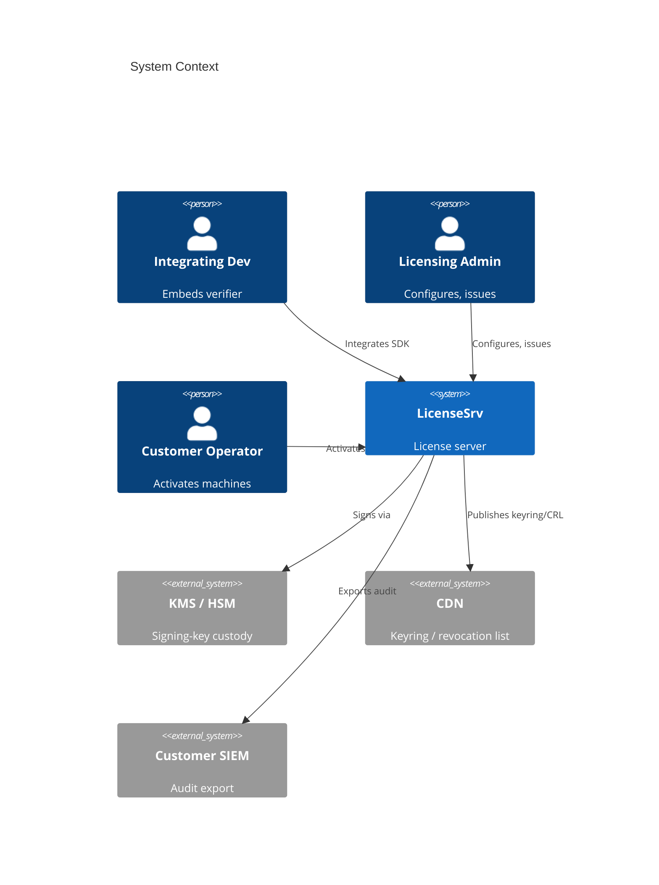
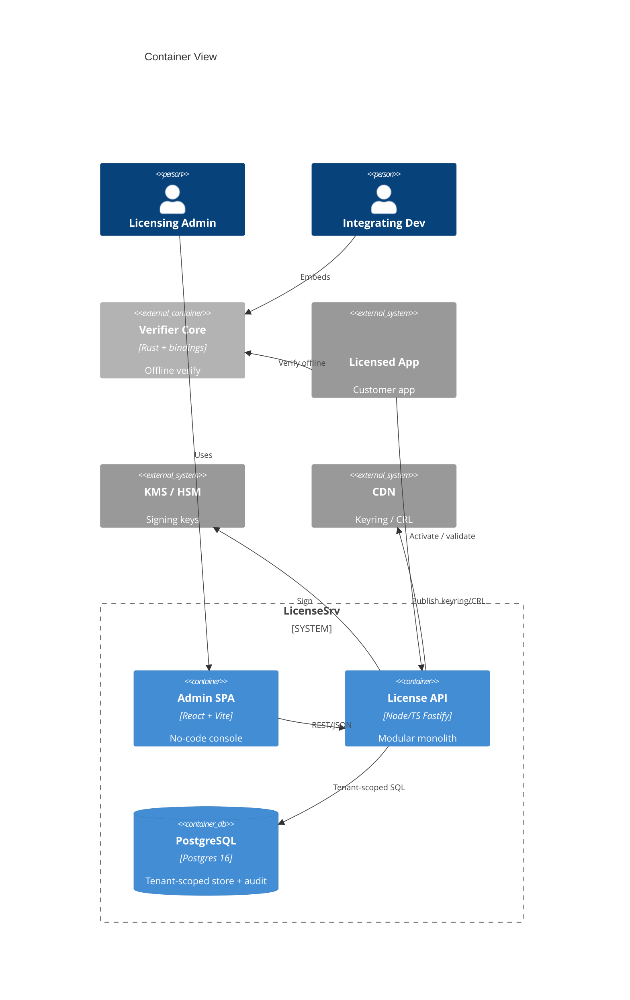
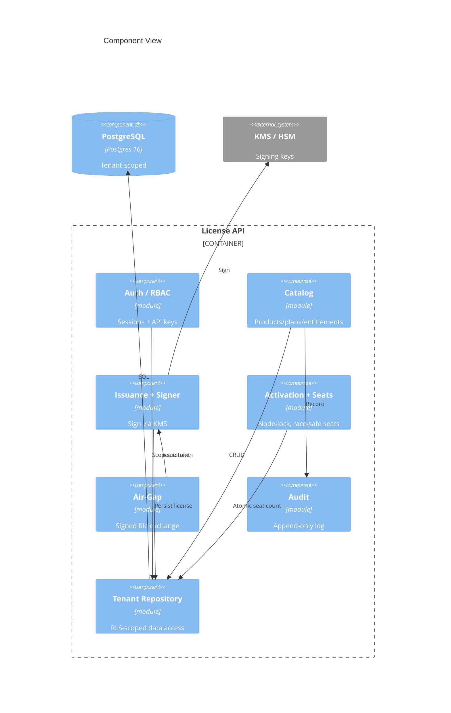
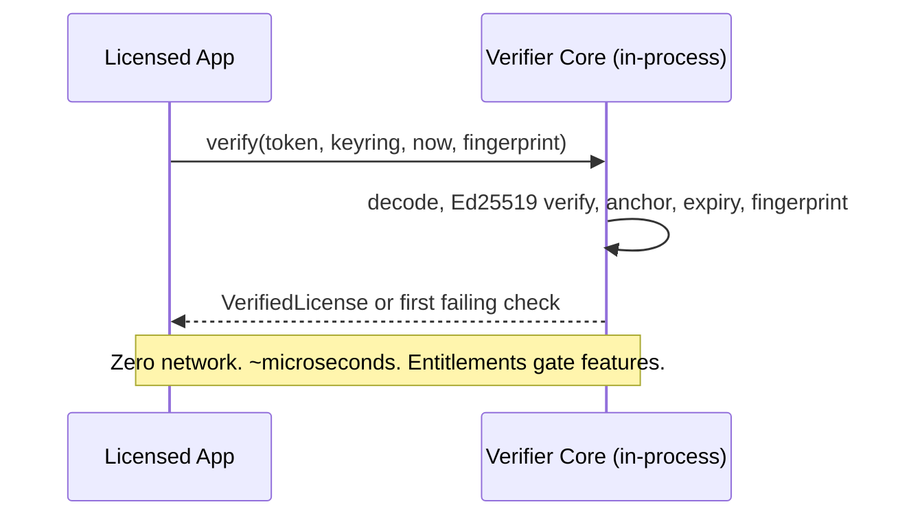
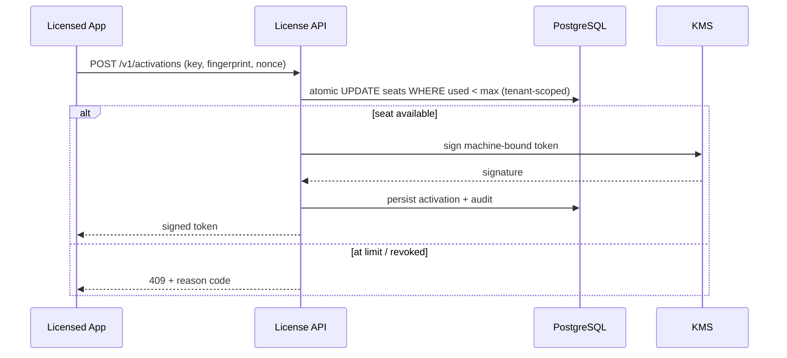
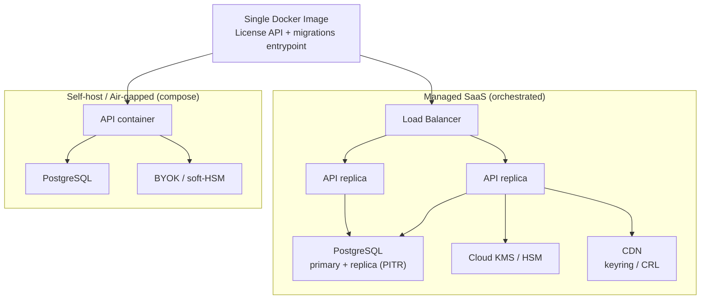

# Software Architecture Document: LicenseSrv

> Date: 2026-06-26 | Status: Draft

## Purpose and Scope

LicenseSrv is a multi-tenant, offline-first software license server. It issues cryptographically signed licenses, verifies them on customer machines with no network call, enforces machine activation and seat limits, supports air-gapped activation, and lets non-developers configure products, plans, and entitlements. It runs as a managed multi-tenant SaaS or fully self-hosted (including air-gapped) from a single container image. This document is the canonical project-level technical context: architecture style, technology baseline, runtime and deployment views, cross-cutting concerns, quality targets, and the ADR index. Feature-level implementation detail lives under `specs/00001-*/`.

## Technical Context

**Language/Version**: TypeScript 5.x / Node 22 (server, admin UI); Rust (stable) for the embeddable verifier core. Server migrates to Rust in a later phase; verifier core is Rust from day one.  
**Primary Dependencies**: Fastify, Drizzle ORM, Zod (server); React + Vite (admin SPA); ed25519-dalek, ciborium (verifier core); cbindgen / wasm-pack / UniFFI (bindings); cloud KMS SDK. 
**Storage**: PostgreSQL 16 — shared schema, `tenant_id` on every tenant-owned row, Row-Level Security. Redis reserved for later phases (rate-limit counters, floating-seat leases).  
**Testing**: Vitest + Testcontainers (server), Playwright (admin E2E), cargo test + criterion + cargo-fuzz (verifier core). 
**Target Platform**: Linux containers (one Docker image) for the control plane; WASM, native (C ABI), and managed runtimes for verifier embedding.  
**Project Type**: platform (multi-tenant SaaS API + embeddable verification library + admin web). 
**Performance Goals**: offline verify p99 < 5 ms (in-process); online validate p95 < 120 ms; issuance p95 < 300 ms (KMS-bound).  
**Constraints**: zero-network verify path; air-gapped activation; strict tenant isolation; signing keys never exposed by any interface; one image serves SaaS and self-host.  
**Scale/Scope**: multi-tenant; stateless API horizontally scalable behind a load balancer; the only stateful hot spot is per-license seat counting.

## System Scope and Context

LicenseSrv serves three human actors — an Integrating Developer who embeds the verifier, a Licensing Admin who configures the catalog and issues licenses, and an End-Customer Operator who activates machines (including air-gapped). It depends on a KMS/HSM for signing-key custody, a CDN for distributing signed keyrings/revocation lists, an optional billing provider (P2), and can export audit events to a customer SIEM.

### C4 System Context

### C4 Container View

### C4 Component View

The License API is one deployable with enforced internal module seams (ADR-0005) so a high-throughput path can be extracted later without a rewrite.

## Solution Strategy and Architecture Style

- **Architecture Style**: Modular monolith (ADR-0005) — one deployable License API with strong internal module boundaries, alongside a separately-distributed embeddable verifier core and a decoupled admin SPA.
- **Source Code Location**: All project source code must reside in the `/src` directory.
- **Why this style fits**: Time-to-market and a small team favor one deploy unit; a single transactional datastore makes race-safe seat counting straightforward; the offline verifier is the moat and is isolated as a reusable library (ADR-0002). Module seams permit later extraction of a high-throughput validate/metering service.
- **Alternatives considered**: Microservices from day one (rejected — ops overhead, slower MVP) and serverless functions (rejected — cold-start latency, awkward stateful seat flows, weaker self-host/air-gap story). REST/JSON is the public API style (ADR-0007); the system ships as a single container image for both SaaS and self-host (ADR-0006).

## Key Runtime Flows and Failure Paths

### Offline Verification (default path, no network)

### Online Activation (seat enforcement + signing)

### Failure Paths

- **KMS unavailable/throttled** → retry with backoff + circuit breaker; queue/defer issuance so availability is preserved (latency degrades, not correctness). Verify path is unaffected (never calls KMS).
- **Concurrent activation on last seat** → atomic conditional `UPDATE` (READ COMMITTED) prevents over-allocation; zero rows updated → seat denied.
- **DB primary failure** → streaming-replica failover (near-zero RPO); readiness probe fails so degraded instances stop taking traffic.
- **Clock rollback on client** → monotonic anchor rejects validation beyond the 48 h skew.
- **Revocation staleness** → revoked license may be honored until the signed CRL/keyring CDN TTL (`next_update`) expires; bounded and disclosed.
- **Tenant-scope assertion failure** → request aborted, paged as a security incident (must never occur).

## Deployment and Infrastructure View

One image (ADR-0006), driven by 12-factor env config; migrations run as a gated, advisory-locked admin job; startup/liveness/readiness probes (readiness fails — not liveness — when DB/KMS degraded).

## Cross-Cutting Concerns

### Security

Tenant isolation is enforced at two layers: the Tenant Repository injects tenant scope on every query, and PostgreSQL RLS (`FORCE ROW LEVEL SECURITY`, non-owner app role, `tenant_id`-leading composite indexes) is the safety net (ADR-0004). Pooled connections use `SET LOCAL`/`DISCARD ALL` to prevent tenant-context bleed. Humans authenticate to the console via interactive sessions; machine/runtime APIs use tenant-scoped API keys with RBAC. Private signing keys live in KMS/HSM, per product (ADR-0003), never returned by an API or logged. Activation/validation endpoints are rate-limited per tenant; activations carry nonces (anti-replay). Machine/customer identifiers are salted-hashed and erasable (GDPR). Postgres patch currency is mandated (RLS CVE exposure).

### Reliability

Managed control-plane availability target 99.9% (99.95% enterprise tier); offline verify is network-independent (effectively 100%, a stated selling point). Issuance tolerates temporary KMS unavailability via queue + backoff + circuit breaker. Control-plane RPO ≤ 5 min (near-zero with streaming standby), RTO ≤ 1 h validated by monthly restore drills. Error budget = 100% − SLO on a rolling 28–30 day window, gating releases.

### Observability

Structured JSON logging tagged with `tenant_id`/`request_id`/`product_id`, queryable per tenant; distributed tracing on the online path (app vs DB vs KMS attribution). First-class SLIs: activation success rate (≥99.9%), validate latency (p95<120ms), issuance latency (p95<300ms), failed-validation/tamper rate (anomaly alerts), and a continuous tenant-isolation assertion (any cross-tenant access = page). Append-only audit events are exportable to a customer SIEM.

### Data Management

PostgreSQL owns all control-plane state; the client holds only a signed token plus a small local state file (monotonic anchor, cached CRL). Continuous archiving + PITR (`archive_timeout=60`) plus a streaming standby. Machine/customer PII is minimized, retention-bounded, and erasable. Token format is versioned (`token_version`, `key_id`) for forward compatibility; the parser is fuzzed.

### Integration Strategy

Public REST/JSON over HTTPS described by OpenAPI (ADR-0007); the embeddable verifier covers stacks that want offline/fast verification, while the REST API gives any language zero-SDK reach. KMS integration is pluggable (cloud KMS, PKCS#11, or soft-HSM for self-host/BYOK). Signed keyring/CRL artifacts are published to a CDN. Billing-provider webhooks and outbound event webhooks are P2.

### Operations

One image across all environments; config and secrets via env/secret store, never baked in. Migrations are a discrete gated step. Self-host operators get a documented backup and secret-provisioning runbook and the air-gapped file-exchange flow. Stateless app tier enables rolling/blue-green deploys gated on readiness.

## Quality Attributes

| Attribute | Target | Measurement | Notes |
|-----------|--------|-------------|-------|
| Performance | offline verify p99 < 5 ms; online validate p95 < 120 ms; issuance p95 < 300 ms | criterion bench; server latency histograms | verify is in-process; issuance KMS-bound |
| Reliability | 99.9% SaaS control plane; offline verify network-independent; RPO ≤ 5 min, RTO ≤ 1 h | synthetic + real SLIs; monthly restore drills | error-budget gated releases |
| Security | 100% cross-tenant access blocked; keys never exposed; append-only audit | isolation assertions; key-access audits; pen test | tenant leak = pageable incident |
| Maintainability | ≥ 80% coverage; one crypto core; enforced module seams | coverage reports; lint `-D warnings`; arch tests | single verifier core across stacks |
| Scalability | stateless horizontal scale; seat-count sharded per license | load tests; contention metrics | only stateful hot spot is per-license seats |

## Architecture Decision Records

Project-level architectural decisions are maintained as standalone MADR files under `specs/adrs/`. This table is a navigational index — full decision records live in the linked files.

| ADR ID | Title | Status | Date | Supersedes | File |
|--------|-------|--------|------|------------|------|
| ADR-0001 | License Token Format & Encoding | accepted | 2026-06-26 | — | [0001-license-token-format.md](adrs/0001-license-token-format.md) |
| ADR-0002 | Embeddable Verifier Architecture (Single Rust Core + Bindings) | accepted | 2026-06-26 | — | [0002-embeddable-verifier-architecture.md](adrs/0002-embeddable-verifier-architecture.md) |
| ADR-0003 | Signing-Key Custody & Scope (Per-Product Keys in KMS/HSM) | accepted | 2026-06-26 | — | [0003-signing-key-custody-and-scope.md](adrs/0003-signing-key-custody-and-scope.md) |
| ADR-0004 | Multi-Tenancy Isolation Model | accepted | 2026-06-26 | — | [0004-multi-tenancy-isolation-model.md](adrs/0004-multi-tenancy-isolation-model.md) |
| ADR-0005 | Architecture Style — Modular Monolith | accepted | 2026-06-26 | — | [0005-architecture-style-modular-monolith.md](adrs/0005-architecture-style-modular-monolith.md) |
| ADR-0006 | Deployment & Packaging — Single Container Image for SaaS and Self-Host | accepted | 2026-06-26 | — | [0006-deployment-packaging-single-container-image.md](adrs/0006-deployment-packaging-single-container-image.md) |
| ADR-0007 | Public API Style — REST/JSON First | accepted | 2026-06-26 | — | [0007-public-api-style-rest-json-first.md](adrs/0007-public-api-style-rest-json-first.md) |
| ADR-0008 | Admin Console Human Authentication — Server-Side Cookie Sessions | accepted | 2026-07-02 | — | [0008-admin-console-session-authentication.md](adrs/0008-admin-console-session-authentication.md) |
| ADR-0009 | In-Process Observability Instrumentation for the Node Runtime — Logging, Metrics, Tracing, and Label-Cardinality Policy | accepted | 2026-07-17 | — | [0009-node-observability-instrumentation-stack.md](adrs/0009-node-observability-instrumentation-stack.md) |
| ADR-0010 | Online-Enforcement Token and Revocation Model — Short-TTL LIC1 Renewal (Primary) + Signed CRL (Fallback) | accepted | 2026-07-18 | — | [0010-online-enforcement-token-and-revocation-model.md](adrs/0010-online-enforcement-token-and-revocation-model.md) |
| ADR-0011 | Billing-Webhook Integration and the External-Event → License-Lifecycle Model | accepted | 2026-07-19 | — | [0011-billing-webhook-external-event-license-lifecycle.md](adrs/0011-billing-webhook-external-event-license-lifecycle.md) |
| ADR-0012 | Floating and Concurrent-Seat Leasing Model — Online TTL-Bounded Seat Leases with Race-Safe Accounting and Dead-Machine Reclamation | accepted | 2026-07-22 | — | [0012-floating-concurrent-seat-leasing-model.md](adrs/0012-floating-concurrent-seat-leasing-model.md) |
| ADR-0013 | Usage-Metering Ingestion and Aggregation Model — Idempotent Append-Only Ingest with Watermark-Driven Hourly Rollup and Signed Reversals | accepted | 2026-07-24 | — | [0013-usage-metering-ingestion-and-aggregation-model.md](adrs/0013-usage-metering-ingestion-and-aggregation-model.md) |
| ADR-0014 | Low-Code Policy-Rule Engine — Sandboxed Deterministic JSONLogic-Subset Evaluation with Bounded Issuance-Time Effects | accepted | 2026-08-11 | — | [0014-low-code-policy-rule-engine.md](adrs/0014-low-code-policy-rule-engine.md) |
| ADR-0015 | Reseller Hierarchy and Delegated Cross-Tenant Administration Model | accepted | 2026-08-14 | — | [0015-reseller-hierarchy-cross-tenant-administration.md](adrs/0015-reseller-hierarchy-cross-tenant-administration.md) |

## Risks, Assumptions, Constraints, and Open Questions

### Risks

- Client-side checks on attacker-controlled machines are bypassable — position as casual-piracy deterrence + overuse recovery, never piracy elimination.
- Signing-key compromise forges a product's licenses — mitigated by per-product KMS custody, rotation, and revocation; remains top risk.
- Multi-tenant isolation defect (connection-context bleed, RLS bypass via privileged role/CVE) — both a security and compliance failure; defense-in-depth + Postgres patch currency.
- KMS as a tier-0 issuance dependency — quota saturation or outage degrades issuance; mitigated by queue/backoff/circuit-breaker and multi-region keys.
- Revocation staleness for offline/never-connected clients — an accepted, disclosed MVP limitation (online propagation is P2).

### Assumptions

- Licensed apps can embed a small native/WASM library or call an HTTPS endpoint.
- The environment provides a KMS/HSM or secure keystore for signing keys.
- Most clients can reach the service periodically; air-gapped clients use file exchange.
- PostgreSQL is the primary datastore in all deployment shapes.

### Constraints

- Verification must require no network on the default path and add no perceptible delay.
- One container image must serve managed SaaS and self-hosted/air-gapped installs.
- Strict tenant isolation; signing keys never exposed; machine/customer data minimized and erasable.

### Open Questions

- First-priority SDK stacks for a first-class verifier path at launch.
- Whether an on-prem LAN relay is needed beyond file-exchange air-gap.
- Required compliance attestations (SOC 2, data-residency commitments) for earliest buyers.
- Whether Redis is needed in P1 for per-tenant rate limiting, or in-process limiting suffices until P2.

## Project Context Baseline Updates

- The offline verifier core exposes the single canonical verification API and license token format (`LIC1.` envelope); its byte layout is a project-wide freeze point consumed by the bindings, signing, issuance, and activation work. Token-format changes are breaking and must be versioned (`token_version`, `key_id`).
- The verifier core targets `no_std` + `alloc` (`wasm32` + 64-bit desktop/server) so one crate serves all bindings; its public API follows SemVer, its failure reasons are a closed append-only `VerifyError` enum (a stable cross-binding contract), and the keyring carries per-key validity (`valid_from`/`valid_until`, revoked) enforced offline.
- The tenancy & data foundation provides the shared server substrate every feature epic builds on: a tenant-scoped repository (injects `tenant_id` on every query) hardened by forced Postgres RLS under a non-owner role, an advisory-locked expand/contract migration harness, and an append-only `audit_log` (no UPDATE/DELETE to the app role) written on every mutation. Every tenant-owned query is tenant-scoped; cross-tenant access only via an explicit, audited platform-admin path.
- The observability instrumentation baseline (see [ADR-0009](adrs/0009-node-observability-instrumentation-stack.md)) is the uniform way every Node service is instrumented: pino structured per-tenant logs (`tenant_id`/`request_id`/`product_id`/outcome, redacted), prom-client RED + infra metrics on a dedicated internal port under a binding label-cardinality policy (`tenant_id`/`request_id`/`license_key` are never metric labels — high-cardinality identity lives in logs/traces, bridged by exemplars), and OpenTelemetry OTLP→Collector tracing that is sampled and fail-open (telemetry never blocks or crashes request handling). SLOs and alerting derive from the DOD SLI/SLO table; tenant isolation is a zero-budget paged invariant asserted at the `withTenant()` choke point. A self-hostable Prometheus/Grafana/Alertmanager/OTel-Collector overlay ships with the release for self-host operators.
- The online-enforcement + revocation model (see [ADR-0010](adrs/0010-online-enforcement-token-and-revocation-model.md)) is additive to offline-first: connected clients validate/heartbeat to renew a SHORT-TTL re-signed LIC1 credential (minted by the existing E004 signer, verified unchanged by the E001 offline verifier — no second token type), so revocation/suspension propagates by "ceasing to re-issue" within one renewal window; a signed, versioned per-(tenant,product) CRL (`next_update`) distributed via CDN + downloadable air-gap file is the fail-open fallback (no OCSP per-request lookup). Never-connected/air-gapped clients are unaffected and never revoked-by-default; the bounded revocation-staleness window is disclosed. Clock-tamper is bounded (not eliminated) by signed server time + a client monotonic anchor + a per-plan offline-tolerance window. PASETO v4.public stays reserved for human/admin sessions, not licensing renewal.
- Low-code policy rules (E017, see [ADR-0014](adrs/0014-low-code-policy-rule-engine.md)) add a dynamic decision layer over the static E007 entitlements: a Licensing Admin authors guarded `when → then` rules — sandboxed STRUCTURED-JSON conditions (a JSONLogic subset) evaluated by an in-house ALLOW-LISTED evaluator (NEVER `eval`/`Function`/`vm` — the operator allow-list is the security boundary), deterministic (injected decision clock, no wall-clock/random/network, size/depth/timeout bounds, fail-closed to the base decision). A rule returns a CLOSED typed effect descriptor (adjust_limit / toggle_boolean / select_tier) applied by a trusted server-side applier and always CLAMPED to a separately-authored per-entitlement MAXIMUM (≥ the base plan value — a new expand-only E007 `entitlement` attribute), so a contract-override "lift" is expressible yet provably bounded. Governance-critical boundary: the engine runs ONLY on the server issuance/signing path (it post-processes the effective definition BEFORE the E004 signer snapshots it), NEVER in the offline verifier core, performs NO cryptography, and changes NO token bytes — Principle I is preserved and an already-issued offline token verifies unchanged (online E013 per-request evaluation is deferred; usage-driven decisions refresh at re-issuance). Rules are immutably versioned (edit = new version; status active|preview|disabled) with a unified mode-marked (enforced|preview|dry-run) append-only `policy_evaluation` audit and a non-enforcing dry-run/simulate. The reusable pattern — a sandboxed allow-listed structured-condition evaluator with a bounded, typed, clamped effect surface kept entirely off the crypto/verifier path — is the safe way to add admin-configurable dynamic logic to a licensing server.
- Usage metering (E016, see [ADR-0013](adrs/0013-usage-metering-ingestion-and-aggregation-model.md)) adds consumption-based entitlements: a new `metered` value on the E007 `entitlement` type enum (counter aggregations SUM/COUNT/UNIQUE_COUNT, unit, optional allowance; aggregation immutable once usage exists), fed by a dedicated fast-ack batch ingest endpoint under a new least-privilege `usage.ingest` API-key scope. The reusable high-write ingest pattern is at-least-once + idempotent: an append-only raw `usage_event` deduped by `UNIQUE (tenant, source, event_id)` + ON CONFLICT DO NOTHING (the same idempotency shape as E014 `billing_event`), with a bounded ~35-day dedupe/retention window and a fail-open owner-role prune worker. Aggregation avoids per-event hot-row contention via an asynchronous, watermark-driven incremental rollup into FIXED hourly `usage_rollup` buckets (on-read fallback for the open bucket; "per period" = summing buckets over a query window; billing-period alignment is E014's at read). Corrections are reference-free signed reversals; the rollup stores the TRUE signed net (reproducible, consumed read-only by E014 true-up) while the operator query floors the displayed value at zero. Metering computes NO money and stores no card/PAN — the metering↔billing boundary is strict. UNIQUE_COUNT is backed by an exact, prune-safe `usage_unique_value` side table.
- Floating/concurrent seats (E015, see [ADR-0012](adrs/0012-floating-concurrent-seat-leasing-model.md)) add an OPTIONAL online concurrency dimension distinct from offline node-lock: a floating seat is a TTL-bounded **lease** (acquire → heartbeat-renew → release → sweeper-reclaim), server-authoritative for the live count, with `max_concurrent` a NEW cap independent of `max_activations` (absent ⇒ floating disabled, fail-closed). The reusable "live rows ≤ cap under concurrency" pattern is a per-license `pg_advisory_xact_lock` count+insert (tiny critical section, no over-allocation); a monotonic per-lease `generation` fence + status/expiry predicate makes reclaim and renew mutually exclusive (no double-count). A per-plan concurrency scope (session|machine|user) enforces "one live lease per (license, holder-key)", where the holder-key is a salted hash of a client-supplied reference (never a raw hardware id). The optional lease handle reuses the E004 signer with domain separation `LICSRV-LEASE-v1` (no new crypto, a third domain beside the LIC1 token and CRL). A fail-open, time-driven reclaim worker (same pattern as the E013 CRL / E014 grace workers) also serves revoke-triggered reclamation — revoke ⇒ proactive reclaim, suspend/expire ⇒ lapse-on-timer. Floating is ONLINE-only; offline node-lock (E009) is unchanged.
- Billing-driven entitlement automation (E014) is an OPTIONAL P2 add-on that reacts to an external billing provider's signed webhooks — it never charges and stores no card/PAN data (payment processing permanently out of scope, PCI-out-of-scope). The ingestion pattern is verify-then-dedupe-then-apply: HMAC signature + timestamp verified over the raw body before processing; deduped by provider event id recorded transactionally (idempotent, exactly-once); normalized through per-provider adapters into one internal event model. Subscription events drive the E008 license lifecycle (provision/extend/suspend/revoke) via a subscription↔license link + a grace overlay (canceled/payment-failed → bounded grace → auto-suspend via a scheduled job; refund/chargeback → revoke; recovery-on-payment); suspension/revocation propagate to clients via E013. A stale-event recency guard + a periodic provider reconciliation self-heal out-of-order/missed deliveries; unmapped/failed events dead-letter. The provider is a provider-agnostic EXTERNAL-SERVICE, not a hard core dependency.
- Reseller & white-label tenancy (E018, see [ADR-0015](adrs/0015-reseller-hierarchy-cross-tenant-administration.md)) overlays a shallow ONE-LEVEL reseller→sub-tenant hierarchy on the E002 forced-RLS substrate WITHOUT a new isolation mechanism — an expand-only self-ref `tenant.parent_reseller_id` + a 1:1 `reseller` table (status, hard `sub_tenant_quota`), a per-tenant `branding_profile`, and a `domain_binding` (migration `0014`, module `src/server/modules/reseller/`). The authorization model is a GATED SCOPED-DESCENT (chosen over a new global role + a broadened RLS predicate): the per-tenant `tenant_isolation` predicate is UNCHANGED; a reseller-admin (an admin/owner of a reseller tenant) acting on a sub-tenant passes a subtree-membership gate (assert the target's `parent_reseller_id` = the caller's reseller) and the op then runs under the sub-tenant's OWN `app.current_tenant` scope, while "list my customers" runs on the existing audited `privileged` platform-admin seam filtered by `parent_reseller_id` — cross-tenant reach is confined to two audited choke points, never a bypass. Visibility is DOWNWARD-ONLY, enforced at the data layer: upward/lateral escalation and IDOR are structurally blocked and an out-of-subtree reference resolves to 404 with no existence disclosure + a security-event audit. Every delegated action writes a DUAL-IDENTITY append-only `audit_log` row (`tenant_id` = target sub-tenant, `actor` = reseller-admin user, expand-only `actor_reseller_id` = the acting reseller's home tenant — attribution survives a later sub-tenant transfer); only the vendor/platform operator moves a sub-tenant between resellers (audited both sides); last-owner protection preserved. White-label branding is PRESENTATION-ONLY, resolved PER FIELD by precedence sub-tenant → reseller → platform with reseller-LOCKABLE fields, and never alters license contents or the signed token (Principle I preserved; already-issued tokens verify offline unchanged, incl. under a reseller's reversible read-only suspension). TRUST SIGNALS (revocation/tamper/security notices, signing identity, audit records, legal text) are never sourced from branding; custom domains/email senders require DNS ownership proof (TXT/CNAME; SPF+DKIM/DMARC for senders) before activation and bind to at most one tenant (a global partial-unique index independent of RLS). The reusable pattern is delegated, scoped, audited sub-tenant administration as a subtree filter layered on per-tenant RLS — additive expand-only over existing tenant rows — with governance (hard quota, reversible suspend vs. offboard, mandatory transfer-or-reassign so no sub-tenant is orphaned).
